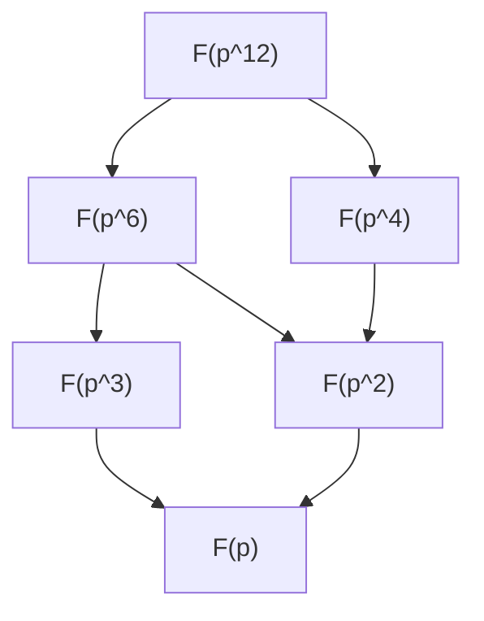

> **Prerequisites**: [[06-field-extensions|06. Field Extensions]], [[07-splitting-fields|07. Splitting Fields and Algebraic Closure]] — characteristic, degree của extension, splitting field, separable polynomial, Frobenius.
> **Objectives**:
> - Chứng minh mọi finite field có $p^n$ phần tử với $p$ nguyên tố
> - Xây dựng và chứng minh tính duy nhất của $\mathbb{F}_{p^n}$
> - Hiểu cấu trúc của nhóm nhân $\mathbb{F}_{p^n}^\times$ (cyclic)
> - Phân tích subfield structure của $\mathbb{F}_{p^n}$
> - Làm việc với Frobenius endomorphism

---

## Motivation / Intuition

Finite fields (trường hữu hạn) — còn gọi là **Galois fields** để tưởng nhớ Évariste Galois, người khám phá ra chúng — là những cấu trúc toán học có ứng dụng rộng rãi nhất trong khoa học máy tính và lý thuyết mật mã: mã sửa lỗi (Reed–Solomon codes), mã hóa đường cong elliptic (ECC), AES (Advanced Encryption Standard) đều được xây dựng trên finite fields.

Điều đẹp đẽ là cấu trúc của finite fields **hoàn toàn xác định**: chỉ có đúng một finite field (sai sai isomorphism) cho mỗi số phần tử $p^n$, và không có finite field nào với số phần tử không phải lũy thừa nguyên tố. Đây là một trong những ví dụ hiếm hoi trong toán học mà phân loại hoàn toàn vừa khả thi vừa đẹp.

---

## Cấu trúc cơ bản: $|\mathbb{F}| = p^n$

> [!theorem] Theorem 8.1 — Số phần tử của Finite Field
> Nếu $F$ là finite field thì $|F| = p^n$ với $p = \operatorname{char}(F)$ là nguyên tố và $n = [F : \mathbb{F}_p] \geq 1$.

**Proof.**
Vì $F$ hữu hạn, $\operatorname{char}(F) = p > 0$ (nếu $\operatorname{char}(F) = 0$ thì $\mathbb{Z} \hookrightarrow F$ cho $F$ vô hạn). Suy ra $\mathbb{F}_p = \mathbb{Z}/p\mathbb{Z} \subseteq F$. Vì $F$ là finite extension của $\mathbb{F}_p$, đặt $n = [F:\mathbb{F}_p]$. Khi đó $F$ là $\mathbb{F}_p$-vector space chiều $n$, nên $|F| = p^n$. $\blacksquare$

> [!theorem] Theorem 8.2 — Mọi phần tử thỏa $x^{p^n} = x$
> Nếu $|F| = p^n$, mọi $\alpha \in F$ đều là nghiệm của $x^{p^n} - x \in \mathbb{F}_p[x]$.

**Proof.**
Nếu $\alpha = 0$: $0^{p^n} = 0$. Nếu $\alpha \neq 0$: nhóm nhân $F^\times$ có bậc $p^n - 1$, suy ra $\alpha^{p^n-1} = 1$ (định lý Lagrange), tức $\alpha^{p^n} = \alpha$. $\blacksquare$

> [!corollary] Corollary 8.3
> Nếu $|F| = p^n$ thì $F$ là splitting field của $f(x) = x^{p^n} - x$ trên $\mathbb{F}_p$.

**Proof.**
$f$ tách hoàn toàn trên $F$ (mọi $\alpha \in F$ là nghiệm) và $F$ được sinh bởi các nghiệm đó. Vì $f' = p^n x^{p^n-1} - 1 = -1 \neq 0$ (trong char $p$), $\gcd(f, f') = 1$, nên $f$ có đúng $p^n$ nghiệm phân biệt. $\blacksquare$

---

## Tồn tại và Duy nhất của $\mathbb{F}_{p^n}$

> [!theorem] Theorem 8.4 — Tồn tại và Duy nhất (Galois)
> Với mọi nguyên tố $p$ và $n \geq 1$:
>
> 1. **(Tồn tại)** Tồn tại field $\mathbb{F}_{p^n}$ với $p^n$ phần tử.
> 2. **(Duy nhất)** Mọi two finite fields với cùng số phần tử đều isomorphic.
> 3. $\mathbb{F}_{p^n}$ là splitting field của $x^{p^n} - x$ trên $\mathbb{F}_p$.

**Proof.**
*Tồn tại:* Xét $f = x^{p^n} - x \in \mathbb{F}_p[x]$. Vì $\gcd(f, f') = \gcd(x^{p^n}-x, -1) = 1$, $f$ có đúng $p^n$ nghiệm phân biệt trong splitting field $K$ của $f$. Đặt $\mathbb{F}_{p^n} = \{\alpha \in K \mid \alpha^{p^n} = \alpha\}$. Tập này đóng với $+$ (vì $(\alpha+\beta)^{p^n} = \alpha^{p^n} + \beta^{p^n} = \alpha + \beta$ trong char $p$), $\times$, và nghịch đảo — nên là subfield, và $|\mathbb{F}_{p^n}| = p^n$.

*Duy nhất:* Nếu $F$ và $F'$ đều có $p^n$ phần tử, theo Corollary 8.3 cả hai đều là splitting field của $x^{p^n}-x$ trên $\mathbb{F}_p$. Theorem 7.4 (tính duy nhất của splitting field) cho $F \cong F'$. $\blacksquare$

> [!note] Remark 8.5 — Ký hiệu
> Finite field với $p^n$ phần tử được ký hiệu $\mathbb{F}_{p^n}$ hoặc $\operatorname{GF}(p^n)$ (Galois Field). Trường hợp $n = 1$: $\mathbb{F}_p = \mathbb{Z}/p\mathbb{Z}$.

---

## Frobenius Endomorphism

> [!definition] Definition 8.6 — Frobenius Endomorphism
> Cho $F$ là field với $\operatorname{char}(F) = p$. **Frobenius endomorphism** là ánh xạ:
>
> $$
> \phi : F \to F, \quad \phi(\alpha) = \alpha^p
> $$

> [!theorem] Theorem 8.7 — Frobenius là Ring Homomorphism
> Frobenius $\phi$ là ring homomorphism (thực ra là field automorphism khi $F = \mathbb{F}_{p^n}$).

**Proof.**
- $\phi(\alpha\beta) = (\alpha\beta)^p = \alpha^p \beta^p = \phi(\alpha)\phi(\beta)$. ✓
- $\phi(\alpha + \beta) = (\alpha+\beta)^p = \sum_{k=0}^p \binom{p}{k} \alpha^k \beta^{p-k}$. Với $0 < k < p$: $p \mid \binom{p}{k}$ (vì $\binom{p}{k} = p!/(k!(p-k)!)$ và $p$ nguyên tố không chia cả $k!$ lẫn $(p-k)!$). Vậy các hạng tử giữa triệt tiêu, còn lại $\phi(\alpha+\beta) = \alpha^p + \beta^p = \phi(\alpha) + \phi(\beta)$. ✓
- Vì $\phi$ là ring homomorphism của field và $\phi(1) = 1$, $\phi$ là đơn ánh. Khi $F = \mathbb{F}_{p^n}$ hữu hạn, $\phi$ là song ánh, tức automorphism. $\blacksquare$

> [!note] Remark 8.8 — Đẳng thức Freshman's Dream
> Đẳng thức $(\alpha + \beta)^p = \alpha^p + \beta^p$ trong char $p$ thường được gọi vui là **Freshman's Dream** — nó đúng trong char $p$ nhưng sai hoàn toàn trong char $0$!

> [!theorem] Theorem 8.9 — Bậc của Frobenius
> Trên $\mathbb{F}_{p^n}$, Frobenius $\phi$ có bậc $n$ trong nhóm automorphism: $\phi^n = \operatorname{id}$ và $n$ là số nhỏ nhất như vậy.

**Proof.**
$\phi^n(\alpha) = \alpha^{p^n} = \alpha$ với mọi $\alpha \in \mathbb{F}_{p^n}$ (Theorem 8.2) — nên $\phi^n = \operatorname{id}$.

Nếu $\phi^k = \operatorname{id}$ với $k < n$, thì mọi $\alpha \in \mathbb{F}_{p^n}$ thỏa $\alpha^{p^k} = \alpha$, tức là nghiệm của $x^{p^k} - x$. Đa thức này có tối đa $p^k < p^n$ nghiệm — mâu thuẫn. $\blacksquare$

> [!corollary] Corollary 8.10 — Galois group của $\mathbb{F}_{p^n}/\mathbb{F}_p$
> $\operatorname{Gal}(\mathbb{F}_{p^n}/\mathbb{F}_p) = \langle \phi \rangle \cong \mathbb{Z}/n\mathbb{Z}$.
>
> Extension $\mathbb{F}_{p^n}/\mathbb{F}_p$ là Galois (normal và separable) với Galois group cyclic bậc $n$ sinh bởi Frobenius.

---

## Nhóm Nhân $\mathbb{F}_{p^n}^\times$ là Cyclic

> [!theorem] Theorem 8.11 — Cyclic Multiplicative Group
> Nhóm nhân $\mathbb{F}_{p^n}^\times = \mathbb{F}_{p^n} \setminus \{0\}$ là nhóm cyclic bậc $p^n - 1$.

**Proof.**
Cho $G = \mathbb{F}_{p^n}^\times$, $|G| = p^n - 1$. Ta dùng đặc trưng sau: nhóm Abel hữu hạn $G$ là cyclic $\iff$ với mọi $d \mid |G|$, số phần tử bậc $d$ trong $G$ là $\varphi(d)$ (hoặc tương đương: có tối đa $d$ nghiệm của $x^d = 1$).

Trong $\mathbb{F}_{p^n}$, phương trình $x^d = 1$ là đa thức bậc $d$, nên có tối đa $d$ nghiệm. Vậy số phần tử bậc $d$ trong $G$ là đúng $\varphi(d)$ (theo phân tích chia $|G| = \sum_{d \mid |G|}$ (số phần tử bậc $d$) $= \sum_{d \mid |G|} \varphi(d) = |G|$). Đặc biệt, số phần tử bậc $|G|$ bằng $\varphi(|G|) > 0$, nên $G$ có phần tử sinh. $\blacksquare$

> [!definition] Definition 8.12 — Primitive Root / Generator
> **Primitive root** (căn nguyên thủy) của $\mathbb{F}_{p^n}^\times$ là phần tử sinh $g$ với $\mathbb{F}_{p^n}^\times = \langle g \rangle = \{1, g, g^2, \ldots, g^{p^n-2}\}$.

> [!example] Example 8.13 — Primitive roots
> - $\mathbb{F}_7^\times$: $g = 3$ là primitive root vì $3^1=3$, $3^2=2$, $3^3=6$, $3^4=4$, $3^5=5$, $3^6=1 \pmod{7}$ — sinh ra tất cả $\{1,2,3,4,5,6\}$.
> - $\mathbb{F}_5^\times$: $g = 2$ là primitive root ($2^1=2, 2^2=4, 2^3=3, 2^4=1$).
> - $\mathbb{F}_4^\times$: bậc $3$, mọi phần tử khác $1$ đều là primitive root (nhóm cyclic bậc $3$).

---

## Subfield Structure

> [!theorem] Theorem 8.14 — Lattice of Subfields
> $\mathbb{F}_{p^m}$ là subfield của $\mathbb{F}_{p^n}$ $\iff$ $m \mid n$.
>
> Hơn nữa, tương ứng với mỗi ước $d$ của $n$, có đúng một subfield $\mathbb{F}_{p^d}$ của $\mathbb{F}_{p^n}$.

**Proof.**
($\Rightarrow$) Nếu $\mathbb{F}_{p^m} \subseteq \mathbb{F}_{p^n}$, Tower Law cho $n = [\mathbb{F}_{p^n}:\mathbb{F}_p] = [\mathbb{F}_{p^n}:\mathbb{F}_{p^m}] \cdot m$, suy ra $m \mid n$.

($\Leftarrow$) Nếu $m \mid n$, đặt $k = n/m$. Với mọi $\alpha \in \mathbb{F}_{p^m}$: $\alpha^{p^m} = \alpha$, suy ra $\alpha^{p^n} = (\alpha^{p^m})^{p^{m(k-1)}} = \alpha^{p^{m(k-1)}} = \cdots = \alpha$. Vậy $\mathbb{F}_{p^m} \subseteq \{\alpha \in \mathbb{F}_{p^n} \mid \alpha^{p^n} = \alpha\} = \mathbb{F}_{p^n}$. $\blacksquare$

> [!example] Example 8.15 — Lattice của $\mathbb{F}_{p^{12}}$
> Các subfields của $\mathbb{F}_{p^{12}}$ tương ứng với ước của $12$: $\{1, 2, 3, 4, 6, 12\}$.



*Diagram: Lattice of subfields của $\mathbb{F}_{p^{12}}$ — tương ứng với lattice của ước của $12$.*

---

## Bậc của phần tử và Minimal Polynomial

> [!theorem] Theorem 8.16 — Degree của phần tử trong $\mathbb{F}_{p^n}$
> Cho $\alpha \in \mathbb{F}_{p^n}$ và $d$ là bậc nhỏ nhất sao cho $\alpha \in \mathbb{F}_{p^d}$. Khi đó:
>
> 1. $d \mid n$.
> 2. Minimal polynomial của $\alpha$ trên $\mathbb{F}_p$ có bậc $d$.
> 3. $[\mathbb{F}_p(\alpha) : \mathbb{F}_p] = d$.
> 4. Các conjugates (liên hợp) của $\alpha$ trên $\mathbb{F}_p$ là $\alpha, \alpha^p, \alpha^{p^2}, \ldots, \alpha^{p^{d-1}}$ — đây là orbit của $\alpha$ dưới Frobenius.

> [!example] Example 8.17 — Conjugates trong $\mathbb{F}_{2^6}$
> Cho $\alpha \in \mathbb{F}_{2^6}$ với $d = [\mathbb{F}_2(\alpha):\mathbb{F}_2] = 3$ (tức $\alpha \in \mathbb{F}_{2^3}$ nhưng $\alpha \notin \mathbb{F}_{2^1}$). Minimal polynomial của $\alpha$ trên $\mathbb{F}_2$ là:
>
> $$
> m_\alpha = (x - \alpha)(x - \alpha^2)(x - \alpha^4) \in \mathbb{F}_2[x]
> $$
>
> Đây là đa thức bậc $3$ hệ số trong $\mathbb{F}_2$ (kiểm tra bằng cách khai triển và dùng $\alpha^8 = \alpha$).

---

## Conway Polynomials và Ứng dụng Thực tế

> [!note] Remark 8.18 — Xây dựng tường minh $\mathbb{F}_{p^n}$
> Để xây dựng $\mathbb{F}_{p^n}$ trên máy tính, ta cần chọn một đa thức bất khả quy $f \in \mathbb{F}_p[x]$ bậc $n$ và đặt $\mathbb{F}_{p^n} = \mathbb{F}_p[x]/(f)$.
>
> **Conway polynomial** $C_{p,n}$ là một lựa chọn chuẩn hóa thỏa thêm điều kiện về tính tương thích giữa các levels (để $\mathbb{F}_{p^m} \hookrightarrow \mathbb{F}_{p^n}$ khi $m \mid n$ theo cách nhất quán). SageMath sử dụng Conway polynomials làm mặc định.

> [!example] Example 8.19 — AES và $\mathbb{F}_{2^8}$
> Chuẩn mã hóa AES hoạt động trên $\mathbb{F}_{2^8} = \mathbb{F}_2[x]/(x^8 + x^4 + x^3 + x + 1)$.
>
> Mỗi byte (8 bit) được coi như một phần tử của $\mathbb{F}_{2^8}$. Phép nhân trong AES là phép nhân trong $\mathbb{F}_{2^8}$. Tính chất cyclic của $\mathbb{F}_{2^8}^\times$ đảm bảo mọi phần tử $\neq 0$ có nghịch đảo, làm cho phép SubBytes trong AES well-defined.

---

## SageMath Cheatsheet

```python
F = GF(16)
print(F)
print(F.cardinality())
print(F.characteristic())
print(F.degree())

F = GF(16, 'a')
a = F.gen()
print(a.minimal_polynomial())
print(list(F))

F = GF(7)
for g in F:
    if g != 0 and g.multiplicative_order() == 6:
        print(g, "is a primitive root")
        break

F = GF(2^6, 'a')
a = F.gen()
print(a.minimal_polynomial())
print(a.multiplicative_order())

F = GF(2^12, 'a')
subfields = F.subfields()
for K, embed, _ in subfields:
    print(K.cardinality())

phi = F.frobenius_endomorphism()
a = F.gen()
print(phi(a) == a^2)

F = GF(2^8, 'a', modulus=x^8 + x^4 + x^3 + x + 1)
a = F.gen()
print((a^255) == F.one())
```

---

## Summary / Key Takeaways

- Mọi finite field có $p^n$ phần tử với $p$ nguyên tố, $n \geq 1$ — không có finite field nào khác.
- **Tồn tại và duy nhất** $\mathbb{F}_{p^n}$: splitting field của $x^{p^n} - x$ trên $\mathbb{F}_p$; duy nhất sai sai isomorphism.
- Mọi $\alpha \in \mathbb{F}_{p^n}$ thỏa $\alpha^{p^n} = \alpha$ — đặc trưng số học của finite field.
- **Frobenius** $\phi : \alpha \mapsto \alpha^p$ là field automorphism, bậc $n$ — sinh $\operatorname{Gal}(\mathbb{F}_{p^n}/\mathbb{F}_p) \cong \mathbb{Z}/n\mathbb{Z}$.
- **Freshman's Dream**: $(\alpha+\beta)^p = \alpha^p + \beta^p$ trong char $p$ — hệ quả của $p \mid \binom{p}{k}$.
- $\mathbb{F}_{p^n}^\times$ là **cyclic** bậc $p^n-1$ — primitive roots tồn tại.
- **Subfield lattice**: $\mathbb{F}_{p^m} \subseteq \mathbb{F}_{p^n}$ $\iff$ $m \mid n$ — lattice subfields tương đẳng với lattice ước của $n$.
- Conjugates của $\alpha$ trên $\mathbb{F}_p$: $\{\alpha^{p^k}\}$ — orbit của Frobenius, kích thước bằng $[\mathbb{F}_p(\alpha):\mathbb{F}_p]$.
- **Ứng dụng**: AES dùng $\mathbb{F}_{2^8}$, mã Reed–Solomon dùng $\mathbb{F}_{2^8}$ hay $\mathbb{F}_{2^{16}}$, ECC dùng $\mathbb{F}_p$ hay $\mathbb{F}_{2^n}$.

---

## References

- Dummit, D. S., & Foote, R. M. *Abstract Algebra* (3rd ed.), Chapter 13 §5.
- Lang, S. *Algebra* (revised 3rd ed.), Chapter V §5.
- Lidl, R., & Niederreiter, H. *Finite Fields* (Encyclopedia of Mathematics), Chapters 1–3.
- Ireland, K., & Rosen, M. *A Classical Introduction to Modern Number Theory*, Chapter 7.
- https://doc.sagemath.org/html/en/reference/finite_rings/sage/rings/finite_rings/finite_field_constructor.html
