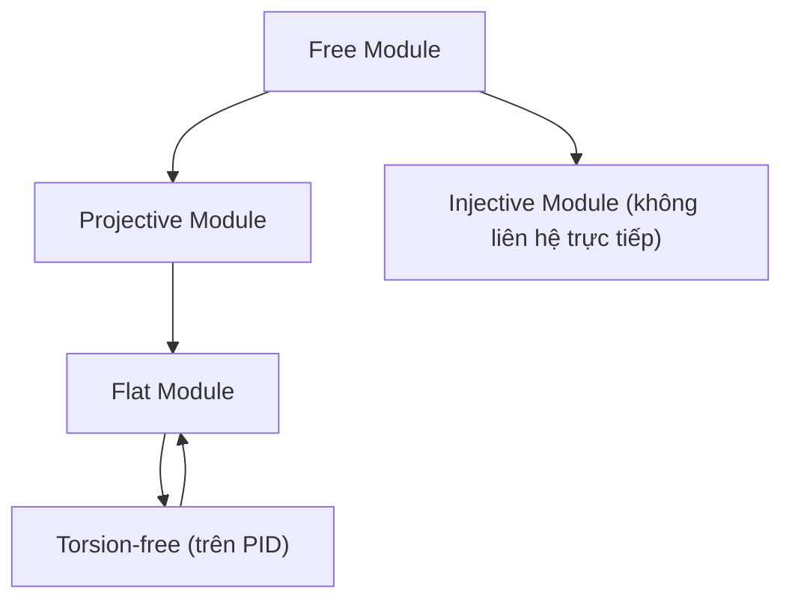

> **Prerequisites**: [[09-modules-definitions|09. Modules: Definitions and Basic Constructions]] — module homomorphism, exact sequence, free module, short exact sequence. [[10-modules-over-pids|10. Finitely Generated Modules over PIDs]] — direct sum, torsion-free.
> **Objectives**:
> - Định nghĩa projective, injective, và flat module qua lifting properties
> - Chứng minh free $\Rightarrow$ projective và các đặc trưng tương đương
> - Phát biểu Baer's Criterion cho injective modules
> - Hiểu flat module và liên hệ với torsion-free
> - Phân biệt split exact sequences

---

## Motivation / Intuition

Trong lý thuyết vector space, mọi short exact sequence $0 \to U \to V \to W \to 0$ đều **split**: $V \cong U \oplus W$. Điều này bởi vì mọi subspace đều có complement, và mọi surjection đều có section.

Với modules tổng quát, điều này thất bại hoàn toàn: $0 \to \mathbb{Z} \xrightarrow{\times 2} \mathbb{Z} \to \mathbb{Z}/2\mathbb{Z} \to 0$ không split (vì $\mathbb{Z} \not\cong \mathbb{Z} \oplus \mathbb{Z}/2\mathbb{Z}$ như $\mathbb{Z}$-module).

**Projective, injective, và flat modules** là ba lớp modules "tốt" — chúng được xác định chính xác bởi việc chúng bảo toàn exactness theo các cách khác nhau. Sự khác biệt giữa ba lớp này là trọng tâm của Homological Algebra (Bài 13) và lý thuyết Tor/Ext.

---

## Split Exact Sequences

> [!definition] Definition 11.1 — Split Exact Sequence
> Short exact sequence $0 \to L \xrightarrow{f} M \xrightarrow{g} N \to 0$ là **split** nếu một trong các điều kiện tương đương sau:
>
> 1. Tồn tại $R$-linear $s : N \to M$ sao cho $g \circ s = \operatorname{id}_N$ (section hay splitting của $g$).
> 2. Tồn tại $R$-linear $r : M \to L$ sao cho $r \circ f = \operatorname{id}_L$ (retraction của $f$).
> 3. $M \cong L \oplus N$ (qua isomorphism tương thích với $f$ và $g$).

**Proof của sự tương đương (sketch).**
$(1) \Rightarrow (3)$: Định nghĩa $\psi : L \oplus N \to M$ bởi $\psi(l, n) = f(l) + s(n)$. Kiểm tra $\psi$ là isomorphism: đơn ánh vì $f(l) + s(n) = 0 \Rightarrow g(s(n)) = -g(f(l)) = 0 \Rightarrow n = 0 \Rightarrow l = 0$; toàn ánh vì với $m \in M$, đặt $n = g(m)$ và $l' = m - s(g(m)) \in \ker g = \operatorname{Im} f$, viết $l' = f(l)$.

$(3) \Rightarrow (1)$: Nếu $M = L \oplus N$ thì projection $\pi_N : L \oplus N \to N$ là section. $\blacksquare$

> [!example] Example 11.2 — Split và non-split
> - $0 \to \mathbb{Z} \to \mathbb{Z} \oplus \mathbb{Z}/2\mathbb{Z} \to \mathbb{Z}/2\mathbb{Z} \to 0$: **split**.
> - $0 \to \mathbb{Z} \xrightarrow{\times 2} \mathbb{Z} \to \mathbb{Z}/2\mathbb{Z} \to 0$: **không split** (nếu split thì $\mathbb{Z} \cong \mathbb{Z} \oplus \mathbb{Z}/2\mathbb{Z}$, nhưng vế phải có torsion còn vế trái thì không).
> - Trên field $k$: mọi short exact sequence split.

---

## Projective Modules

> [!definition] Definition 11.3 — Projective Module
> $R$-module $P$ là **projective** nếu với mọi surjective $R$-linear $g : M \to N$ và mọi $R$-linear $f : P \to N$, tồn tại $R$-linear $h : P \to M$ sao cho $g \circ h = f$:
>
> $$
> \begin{aligned}
> &P \\
> &\downarrow^{f} \quad \searrow^{h} \\
> &N \xleftarrow{g} M
> \end{aligned}
> $$
>
> Nói ngắn gọn: mọi diagram có thể **lifted** qua surjection.

> [!theorem] Theorem 11.4 — Đặc trưng tương đương của Projective Module
> Các điều kiện sau là tương đương:
>
> 1. $P$ là projective.
> 2. Mọi short exact sequence $0 \to L \to M \to P \to 0$ đều split.
> 3. $P$ là direct summand của một free module: tồn tại $Q$ sao cho $P \oplus Q \cong R^{(I)}$.
> 4. Functor $\operatorname{Hom}_R(P, -)$ là exact (bảo toàn short exact sequences).

**Proof của $(1) \Leftrightarrow (2)$.**
$(1) \Rightarrow (2)$: Cho $0 \to L \to M \xrightarrow{g} P \to 0$. Áp dụng lifting property của $P$ với $f = \operatorname{id}_P$ và $g : M \to P$: tồn tại $s : P \to M$ với $g \circ s = \operatorname{id}_P$. Đây chính là splitting.

$(2) \Rightarrow (1)$: Cho surjection $g : M \to N$ và $f : P \to N$. Xét fibered product $F = M \times_N P = \{(m,p) \mid g(m) = f(p)\}$. Có short exact sequence $0 \to \ker g \to F \xrightarrow{\pi_P} P \to 0$. Theo (2), có $s : P \to F$ splitting. Đặt $h = \pi_M \circ s : P \to M$. Thì $g \circ h = f$. $\blacksquare$

**Proof của $(1) \Leftrightarrow (3)$.**
$(3) \Rightarrow (1)$: Free module $R^{(I)}$ là projective (lifting map: gửi generator $e_i$ đến preimage của $f(e_i)$ qua $g$). Direct summand của projective là projective.

$(1) \Rightarrow (3)$: Chọn surjection $\pi : R^{(I)} \to P$ (với $I$ là tập sinh của $P$). Sequence $0 \to \ker\pi \to R^{(I)} \to P \to 0$ split theo (2), nên $R^{(I)} \cong \ker\pi \oplus P$. $\blacksquare$

> [!corollary] Corollary 11.5
> Free $\Rightarrow$ Projective. Đảo lại sai: projective không nhất thiết free.

> [!warning] Counterexample 11.6 — Projective nhưng không Free
> Cho $R = \mathbb{Z}/6\mathbb{Z}$. Đặt $P = \mathbb{Z}/2\mathbb{Z}$ và $Q = \mathbb{Z}/3\mathbb{Z}$. Vì $\mathbb{Z}/6\mathbb{Z} \cong \mathbb{Z}/2\mathbb{Z} \oplus \mathbb{Z}/3\mathbb{Z}$, cả $P$ và $Q$ đều là direct summands của free module $R^1$ — tức projective. Nhưng $P$ không free vì free module trên $\mathbb{Z}/6\mathbb{Z}$ có bậc chia hết $6$, còn $|P| = 2$.
>
> Ví dụ tinh tế hơn trên commutative domain: module stalk của line bundle không tầm thường trên elliptic curve — projective rank 1 nhưng không free.

> [!theorem] Theorem 11.7 — Projective trên Local Ring là Free
> Nếu $(R, \mathfrak{m})$ là local ring và $P$ là projective $R$-module hữu hạn sinh, thì $P$ là **free**.

Proof dùng Nakayama's Lemma — xem Bài 05, Example 5.18.

---

## Injective Modules

> [!definition] Definition 11.8 — Injective Module
> $R$-module $Q$ là **injective** nếu với mọi đơn ánh $R$-linear $f : L \to M$ và mọi $R$-linear $g : L \to Q$, tồn tại $R$-linear $h : M \to Q$ sao cho $h \circ f = g$:
>
> $$
> \begin{aligned}
> &L \xrightarrow{f} M \\
> &\downarrow^{g} \quad \swarrow^{h} \\
> &Q
> \end{aligned}
> $$
>
> Nói ngắn gọn: mọi map có thể **extended** qua monomorphism.

> [!theorem] Theorem 11.9 — Đặc trưng tương đương của Injective Module
> Các điều kiện sau là tương đương:
>
> 1. $Q$ là injective.
> 2. Mọi short exact sequence $0 \to Q \to M \to N \to 0$ đều split.
> 3. Functor $\operatorname{Hom}_R(-, Q)$ là exact (contravariant).

### Baer's Criterion

> [!theorem] Theorem 11.10 — Baer's Criterion
> $R$-module $Q$ là injective $\iff$ với mọi ideal $I \trianglelefteq R$ và mọi $R$-linear $f : I \to Q$, tồn tại $R$-linear $h : R \to Q$ mở rộng $f$:
>
> $$
> h(r) = r \cdot h(1), \quad h|_I = f
> $$

Xem chứng minh đầy đủ tại [[a2-baer-criterion|A2. Baer's Criterion]].

> [!note] Remark 11.11 — Ý nghĩa Baer's Criterion
> Baer's Criterion là công cụ quan trọng nhất để kiểm tra tính injective — thay vì kiểm tra mọi monomorphism $f: L \to M$, ta chỉ cần kiểm tra các inclusion $I \hookrightarrow R$.

> [!example] Example 11.12 — Injective $\mathbb{Z}$-modules
> $\mathbb{Z}$-module $Q$ là injective $\iff$ $Q$ là **divisible**: với mọi $q \in Q$ và $n \neq 0 \in \mathbb{Z}$, tồn tại $q' \in Q$ với $nq' = q$.
>
> - $\mathbb{Q}$: divisible, **injective** $\mathbb{Z}$-module.
> - $\mathbb{Q}/\mathbb{Z}$: divisible, **injective** $\mathbb{Z}$-module.
> - $\mathbb{Z}$: không divisible ($2$ không chia hết trong $\mathbb{Z}$ theo nghĩa $2q' = 1$ vô nghiệm) — **không injective**.
> - $\mathbb{Z}/n\mathbb{Z}$: không divisible (nếu $n > 1$) — **không injective**.

**Proof (divisible $\Rightarrow$ injective cho $\mathbb{Z}$-modules).**
Dùng Baer's Criterion: ideals của $\mathbb{Z}$ là $(n)$ với $n \geq 0$. Cho $f : n\mathbb{Z} \to Q$. Cần mở rộng sang $h : \mathbb{Z} \to Q$ với $h(1) = $ gì đó. Đặt $q = f(n)$; vì $Q$ divisible, tồn tại $q'$ với $nq' = q$. Đặt $h(1) = q'$, thì $h(n) = nq' = q = f(n)$. $\blacksquare$

> [!theorem] Theorem 11.13 — Mọi module nhúng vào injective module
> Với mọi $R$-module $M$, tồn tại monomorphism $M \hookrightarrow Q$ với $Q$ injective.

Đây là tồn tại **injective hull** (hay injective envelope) của $M$ — nền tảng của lý thuyết injective resolutions trong Homological Algebra.

---

## Flat Modules

> [!definition] Definition 11.14 — Flat Module
> $R$-module $F$ là **flat** nếu functor $F \otimes_R -$ là exact: với mọi short exact sequence $0 \to L \to M \to N \to 0$:
>
> $$
> 0 \to F \otimes_R L \to F \otimes_R M \to F \otimes_R N \to 0
> $$
>
> vẫn là exact.

> [!note] Remark 11.15 — Tensor product luôn right exact
> Functor $F \otimes_R -$ luôn **right exact**: $F \otimes L \to F \otimes M \to F \otimes N \to 0$ luôn exact (sẽ chứng minh ở Bài 12). Flat yêu cầu thêm left exactness: $0 \to F \otimes L \to F \otimes M$ cũng exact.

> [!theorem] Theorem 11.16 — Quan hệ giữa Projective, Flat, Torsion-free
> Trên commutative Noetherian ring:
>
> $$
> \text{Free} \Rightarrow \text{Projective} \Rightarrow \text{Flat}
> $$
>
> Trên PID: Flat $\Leftrightarrow$ Torsion-free.

**Proof của Projective $\Rightarrow$ Flat.**
Projective module là direct summand của free module. Free module $R^{(I)}$ flat (vì $R^{(I)} \otimes M \cong M^{(I)}$ và $M^{(I)}$ giữ exactness). Direct summand của flat là flat. $\blacksquare$

> [!example] Example 11.17 — Flat nhưng không Projective
> $\mathbb{Q}$ là flat $\mathbb{Z}$-module: $\mathbb{Q}$ torsion-free trên PID $\mathbb{Z}$.
>
> Nhưng $\mathbb{Q}$ không projective: nếu projective thì là direct summand của $\mathbb{Z}^{(I)}$, nhưng $\mathbb{Z}^{(I)}$ không chứa $\mathbb{Q}$ như direct summand (vì $\mathbb{Z}^{(I)}$ có rank tự do, còn $\mathbb{Q}$ thì không).

> [!warning] Counterexample 11.18 — Torsion-free không nhất thiết Flat trên ring không PID
> Trên $R = \mathbb{Z}[x]$: module $R/(x) \cong \mathbb{Z}$ là torsion-free như $\mathbb{Z}[x]$-module (phần tử $f(x) \cdot n = 0$ trong $\mathbb{Z}$ khi và chỉ khi $f(x) = 0$ hoặc $n = 0$, nhưng $x \cdot 1 = 0$ trong $\mathbb{Z}$... Thực ra $\mathbb{Z}$ không torsion-free như $\mathbb{Z}[x]$-module vì $x \cdot 1 = 0$). Ví dụ tốt hơn: ideal $(2, x)$ của $\mathbb{Z}[x]$ torsion-free nhưng không flat.

---

## Tóm tắt và So sánh



*Diagram: Quan hệ phân cấp giữa Free, Projective, Flat, và Injective modules.*

| Tính chất | Đặc trưng | Lifting | Functor exact |
|-----------|-----------|---------|---------------|
| Projective | Direct summand của free | Lift qua surjection | $\operatorname{Hom}(P, -)$ exact |
| Injective | Mọi SES split từ trái | Extend qua monomorphism | $\operatorname{Hom}(-, Q)$ exact |
| Flat | Tensor giữ exactness | — | $- \otimes F$ exact |

---

## SageMath Cheatsheet

```python
M = ZZ^2
N = M.submodule([[2, 0], [0, 1]])
Q = M / N
print(Q.invariants())

R = ZZ
M = R.free_module(3)
P = M.submodule([[1,0,0],[0,1,0]])
print(M.quotient(P).invariants())

M = ZZ.quotient(6).as_module(ZZ)
print(M)

R = QQ
M = R^2
N = R^2
f = M.hom([N([1,0]), N([0,1])])
print(f.is_injective())
print(f.is_surjective())
```

---

## Summary / Key Takeaways

- **Split exact sequence**: $0 \to L \to M \to N \to 0$ split $\iff$ section tồn tại $\iff$ $M \cong L \oplus N$.
- **Projective**: lift qua surjection $\iff$ mọi SES vào $P$ split $\iff$ direct summand của free; $\operatorname{Hom}(P,-)$ exact.
- Free $\Rightarrow$ Projective (đảo sai); Projective $\Leftrightarrow$ Free trên local ring (Nakayama).
- **Injective**: extend qua monomorphism $\iff$ mọi SES từ $Q$ split; $\operatorname{Hom}(-,Q)$ exact.
- **Baer's Criterion**: $Q$ injective $\iff$ mọi map từ ideal $I \to Q$ extend sang $R \to Q$.
- Injective $\mathbb{Z}$-modules = divisible groups ($\mathbb{Q}$, $\mathbb{Q}/\mathbb{Z}$, $\mathbb{Z}[p^{-1}]/\mathbb{Z}$).
- **Flat**: $- \otimes F$ exact. Free $\Rightarrow$ Projective $\Rightarrow$ Flat.
- Trên PID: Flat $\Leftrightarrow$ Torsion-free. $\mathbb{Q}$ là flat $\mathbb{Z}$-module nhưng không projective.

---

## References

- Dummit, D. S., & Foote, R. M. *Abstract Algebra* (3rd ed.), Chapter 10 §5.
- Rotman, J. J. *Advanced Modern Algebra* (3rd ed.), Chapters 7–8.
- Atiyah, M. F., & MacDonald, I. G. *Introduction to Commutative Algebra*, Chapter 2.
- Matsumura, H. *Commutative Ring Theory*, Chapter 2.
- Weibel, C. A. *An Introduction to Homological Algebra*, Chapter 2.
