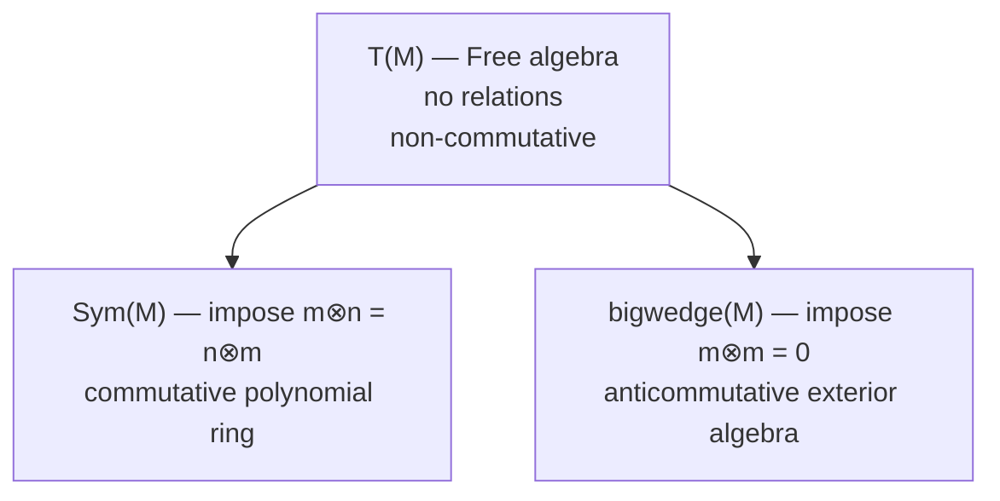

> **Prerequisites**: [[14-tensor-algebra|14. Tensor Algebra]] — tensor algebra $T(M)$, graded quotient. [[15-exterior-algebra|15. Exterior Algebra and Determinants]] — exterior algebra $\bigwedge(M)$, graded-commutativity.
> **Objectives**:
> - Xây dựng symmetric algebra $\operatorname{Sym}(M)$ qua quotient của $T(M)$
> - Chứng minh $\operatorname{Sym}(R^n) \cong R[x_1, \ldots, x_n]$
> - Hiểu universal property của $\operatorname{Sym}(M)$ và mối quan hệ với polynomial ring
> - Nắm vững vai trò của $\operatorname{Sym}$ trong Algebraic Geometry (algebra của functions on vector spaces)
> - So sánh ba algebra: $T(M)$, $\bigwedge(M)$, $\operatorname{Sym}(M)$

---

## Motivation / Intuition

Trong Bài 15, ta xây dựng exterior algebra bằng cách "impose anticommutativity" vào tensor algebra. Bài này làm điều ngược lại: ta **impose commutativity** hoàn toàn, thu được **symmetric algebra** $\operatorname{Sym}(M)$.

Kết quả là một trong những đẳng thức đẹp nhất trong đại số:

$$
\operatorname{Sym}(R^n) \cong R[x_1, \ldots, x_n]
$$

**Polynomial ring chính là symmetric algebra của free module!** Điều này giải thích tại sao đa thức giao hoán — phép nhân giao hoán là quan hệ duy nhất được impose.

Trong Algebraic Geometry, đây là cầu nối cơ bản giữa geometry và algebra: affine space $\mathbb{A}^n = \operatorname{Spec}(R[x_1,\ldots,x_n]) = \operatorname{Spec}(\operatorname{Sym}(R^n))$ là "dual" của vector space $R^n$. Tổng quát hơn, với vector bundle $\mathcal{E}$ trên scheme $X$, $\operatorname{Sym}(\mathcal{E})$ là sheaf of algebras tương ứng với total space của bundle đối ngẫu.

---

## Symmetric Algebra

### Định nghĩa qua Quotient

> [!definition] Definition 16.1 — Symmetric Algebra
> Cho $M$ là $R$-module. **Symmetric algebra** (đại số đối xứng) của $M$ là:
>
> $$
> \operatorname{Sym}(M) = T(M) / J
> $$
>
> trong đó $J$ là two-sided ideal sinh bởi tất cả phần tử dạng $m \otimes n - n \otimes m$ với $m, n \in M$:
>
> $$
> J = \langle m \otimes n - n \otimes m \mid m, n \in M \rangle
> $$
>
> Ảnh của $m_1 \otimes \cdots \otimes m_k$ trong $\operatorname{Sym}(M)$ ký hiệu $m_1 \cdots m_k$ (hay $m_1 \cdot m_2 \cdots m_k$).
>
> Grading kế thừa: $\operatorname{Sym}(M) = \bigoplus_{n \geq 0} \operatorname{Sym}^n(M)$ với $\operatorname{Sym}^0(M) = R$ và $\operatorname{Sym}^1(M) = M$.

> [!note] Remark 16.2 — Commutativity
> Theo định nghĩa, $m \cdot n = n \cdot m$ trong $\operatorname{Sym}(M)$ với mọi $m, n \in M$. Suy ra $\operatorname{Sym}(M)$ là **commutative $R$-algebra**.

### Universal Property

> [!theorem] Theorem 16.3 — Universal Property của $\operatorname{Sym}(M)$
> Có $R$-linear $\iota : M \to \operatorname{Sym}^1(M) \subset \operatorname{Sym}(M)$. Với mọi **commutative** $R$-algebra $A$ và mọi $R$-linear $f : M \to A$, tồn tại duy nhất $R$-algebra homomorphism $\bar{f} : \operatorname{Sym}(M) \to A$ với $\bar{f} \circ \iota = f$:
>
> $$
> \bar{f}(m_1 \cdots m_k) = f(m_1) \cdot f(m_2) \cdots f(m_k)
> $$

**Proof.**
Theo universal property của $T(M)$, $f$ nâng thành $\tilde{f}: T(M) \to A$. Vì $A$ commutative, $\tilde{f}(m \otimes n - n \otimes m) = f(m)f(n) - f(n)f(m) = 0$. Vậy $\tilde{f}$ triệt tiêu trên $J$ và cảm sinh $\bar{f}: \operatorname{Sym}(M) \to A$. $\blacksquare$

> [!note] Remark 16.4 — $\operatorname{Sym}(M)$ là "Commutative Free Algebra"
> Universal property nói rằng $\operatorname{Sym}(M)$ là **free commutative $R$-algebra generated by $M$**: mọi $R$-linear map từ $M$ vào commutative algebra nào đó nâng thành duy nhất algebra homomorphism từ $\operatorname{Sym}(M)$.

---

## $\operatorname{Sym}(M) \cong R[x_1, \ldots, x_n]$

> [!theorem] Theorem 16.5 — Symmetric Algebra của Free Module
> Nếu $M = R^n$ (free module rank $n$ với basis $e_1, \ldots, e_n$), thì:
>
> $$
> \operatorname{Sym}(R^n) \cong R[x_1, \ldots, x_n]
> $$
>
> qua isomorphism $e_i \mapsto x_i$.

**Proof.**
Áp dụng universal property của $\operatorname{Sym}(R^n)$ với $A = R[x_1,\ldots,x_n]$ và $f : R^n \to A$, $f(e_i) = x_i$. Thu được $\bar{f}: \operatorname{Sym}(R^n) \to R[x_1,\ldots,x_n]$ là surjection (vì $x_i \in \operatorname{Im}\bar{f}$).

Ngược lại, universal property của $R[x_1,\ldots,x_n]$ với $g: R^n \to \operatorname{Sym}(R^n)$, $g(e_i) = e_i$, cho $\bar{g}: R[x_1,\ldots,x_n] \to \operatorname{Sym}(R^n)$. Kiểm tra $\bar{f}$ và $\bar{g}$ ngược nhau. $\blacksquare$

> [!corollary] Corollary 16.6 — Basis của $\operatorname{Sym}^k(R^n)$
> $\operatorname{Sym}^k(R^n)$ có basis $\{e_1^{a_1} \cdots e_n^{a_n} \mid a_1 + \cdots + a_n = k, a_i \geq 0\}$.
>
> Số phần tử trong basis = số cách chọn multi-index = $\binom{n+k-1}{k}$.

---

## So sánh Ba Algebra

> [!example] Example 16.7 — Ba algebra từ $R^2$
> Với $M = R^2$, basis $\{e_1, e_2\}$:
>
> | Bậc $n$ | $T^n(R^2)$ | $\operatorname{Sym}^n(R^2)$ | $\bigwedge^n(R^2)$ |
> |---------|-----------|--------------------------|-------------------|
> | $0$ | $R$ | $R$ | $R$ |
> | $1$ | $Re_1 \oplus Re_2$ | $Re_1 \oplus Re_2$ | $Re_1 \oplus Re_2$ |
> | $2$ | $Re_1^2 \oplus Re_1 e_2 \oplus Re_2 e_1 \oplus Re_2^2$ | $Re_1^2 \oplus Re_1 e_2 \oplus Re_2^2$ | $R(e_1 \wedge e_2)$ |
> | $3$ | $8$ phần tử | $Re_1^3 \oplus Re_1^2 e_2 \oplus Re_1 e_2^2 \oplus Re_2^3$ | $0$ |
>
> Chiều $T^n(R^2) = 2^n$, $\operatorname{Sym}^n(R^2) = n+1$, $\bigwedge^n(R^2) = \binom{2}{n}$.



*Diagram: $T(M)$ là nguồn gốc, $\operatorname{Sym}(M)$ và $\bigwedge(M)$ là quotients.*

---

## Ứng dụng trong Commutative Algebra

### Rees Algebra và Blow-up

> [!definition] Definition 16.8 — Rees Algebra
> Cho $R$ là commutative ring và $I \trianglelefteq R$ là ideal. **Rees algebra** của $I$ là:
>
> $$
> \mathcal{R}(I) = \bigoplus_{n=0}^{\infty} I^n = R \oplus I \oplus I^2 \oplus \cdots \subset R[t]
> $$
>
> với $I^n = \{a_1 \cdots a_n \mid a_i \in I\}$ và $I^0 = R$.
>
> $\mathcal{R}(I)$ là quotient của $\operatorname{Sym}(I)$ (bởi vì $I$ commutative): có surjection $\operatorname{Sym}(I) \to \mathcal{R}(I)$.

> [!note] Remark 16.9 — Blow-up trong Algebraic Geometry
> Trong Algebraic Geometry, $\operatorname{Proj}(\mathcal{R}(I))$ là **blow-up** của $\operatorname{Spec}(R)$ dọc theo $V(I)$. Đây là phép biến đổi hình học cơ bản để "giải phóng" các điểm kỳ dị (singularities).

### Graded Ring và Projective Space

> [!example] Example 16.10 — Projective Space từ $\operatorname{Sym}$
> Projective space $\mathbb{P}^n_R = \operatorname{Proj}(R[x_0, \ldots, x_n]) = \operatorname{Proj}(\operatorname{Sym}(R^{n+1}))$.
>
> Tổng quát hơn, với $\mathcal{E}$ là locally free sheaf trên scheme $X$:
>
> $$
> \mathbb{P}(\mathcal{E}) = \operatorname{Proj}_X(\operatorname{Sym}(\mathcal{E}))
> $$
>
> Đây là **projective bundle** trên $X$ — tổng quát hóa $\mathbb{P}^n$ cho mọi base scheme.

### Symmetric Powers và Representation Theory

> [!example] Example 16.11 — Symmetric Powers trong Representation Theory
> Cho $V$ là $k$-vector space (representation của nhóm $G$). Các **symmetric powers** $\operatorname{Sym}^n(V)$ là các representations tự nhiên của $G$.
>
> Ví dụ: cho $V = \mathbb{C}^2$ (standard representation của $\operatorname{SL}_2(\mathbb{C})$):
>
> - $\operatorname{Sym}^0(V) = \mathbb{C}$: trivial representation.
> - $\operatorname{Sym}^1(V) = V$: standard representation bậc $2$.
> - $\operatorname{Sym}^2(V)$: chiều $3$, tương ứng với $\mathfrak{sl}_2$ adjoint representation.
> - $\operatorname{Sym}^n(V)$: irreducible representation bậc $n+1$ của $\operatorname{SL}_2(\mathbb{C})$ — mọi irreducible representation hữu hạn chiều đều là $\operatorname{Sym}^n(V)$ với $n$ nào đó.

---

## Functoriality và Tự nhiên

> [!theorem] Theorem 16.12 — $\operatorname{Sym}$ là Functor
> Cho $f : M \to N$ là $R$-linear. Có $R$-algebra homomorphism $\operatorname{Sym}(f) : \operatorname{Sym}(M) \to \operatorname{Sym}(N)$ định nghĩa bởi:
>
> $$
> \operatorname{Sym}(f)(m_1 \cdots m_k) = f(m_1) \cdots f(m_k)
> $$
>
> Với $\operatorname{Sym}(\operatorname{id}) = \operatorname{id}$ và $\operatorname{Sym}(g \circ f) = \operatorname{Sym}(g) \circ \operatorname{Sym}(f)$.

> [!theorem] Theorem 16.13 — $\operatorname{Sym}$ commutes với Localization
> Cho $S \subseteq R$ multiplicative set. Khi đó:
>
> $$
> S^{-1}\operatorname{Sym}(M) \cong \operatorname{Sym}(S^{-1}M)
> $$
>
> Tức localization và symmetric algebra giao hoán.

---

## Kết: Ba Algebra và Con Đường đến Commutative Algebra

> [!note] Remark 16.14 — Tóm tắt Multilinear Algebra
> Ba algebra từ module $M$:
>
> $$
> T(M) \twoheadrightarrow \operatorname{Sym}(M) \cong R[x_1,\ldots] \quad (\text{polynomial ring, commutative})
> $$
>
> $$
> T(M) \twoheadrightarrow \bigwedge(M) \quad (\text{determinant, differential forms, anticommutative})
> $$
>
> Với $M = R^n$ free:
>
> | Algebra | Relation | Chiều bậc $k$ | Tổng chiều |
> |---------|----------|--------------|------------|
> | $T(R^n)$ | Không có | $n^k$ | $\infty$ |
> | $\operatorname{Sym}(R^n)$ | $xy = yx$ | $\binom{n+k-1}{k}$ | $\infty$ |
> | $\bigwedge(R^n)$ | $x^2 = 0$ | $\binom{n}{k}$ | $2^n$ |

> [!note] Remark 16.15 — Đường đến Commutative Algebra
> Với nền tảng này, bạn đã sẵn sàng cho Commutative Algebra (Atiyah–MacDonald, Matsumura):
>
> - **Rings và Ideals** (Bài 01–05): primary decomposition, dimension theory.
> - **Modules** (Bài 09–13): projective/injective/flat, Tor/Ext, depth, regular sequences.
> - **Multilinear Algebra** (Bài 14–16): Koszul complex $\bigwedge(R^n) \otimes M$, cotangent complex.
>
> Những chủ đề tiếp theo trong Commutative Algebra bao gồm: integral extensions, going-up/going-down theorems, Noether normalization, Krull dimension, Cohen–Macaulay rings, và regular local rings.

---

## SageMath Cheatsheet

```python
R.<x,y,z> = QQ[]
print(R)
print(R.is_commutative())

M = QQ^3
S = SymmetricAlgebra(M)
print(S)

R.<x,y> = QQ[]
print(R.hilbert_series())

M = QQ^2
for k in range(5):
    dim_sym = binomial(2 + k - 1, k)
    dim_ext = binomial(2, k)
    print(f"k={k}: Sym={dim_sym}, Ext={dim_ext}")

R = QQ['x,y']
I = R.ideal(R.gens())
Rees = R.graded_ring(I)
print(Rees)
```

---

## Summary / Key Takeaways

- **Symmetric algebra** $\operatorname{Sym}(M) = T(M)/\langle m \otimes n - n \otimes m \rangle$: commutative graded $R$-algebra.
- **Universal property**: mọi $R$-linear $f: M \to A$ (với $A$ commutative) nâng thành duy nhất algebra hom $\bar{f}: \operatorname{Sym}(M) \to A$.
- **$\operatorname{Sym}(R^n) \cong R[x_1,\ldots,x_n]$**: polynomial ring là symmetric algebra của free module — isomorphism cơ bản.
- Basis $\operatorname{Sym}^k(R^n)$: monomials $e_1^{a_1} \cdots e_n^{a_n}$ với $\sum a_i = k$; chiều $\binom{n+k-1}{k}$.
- Ba algebra từ $M$: $T(M)$ (tự do), $\operatorname{Sym}(M)$ (giao hoán), $\bigwedge(M)$ (phản giao hoán).
- $\operatorname{Sym}$ là functor; commutes với localization.
- **Ứng dụng**: Rees algebra và blow-up; projective space $\mathbb{P}^n = \operatorname{Proj}(\operatorname{Sym}(R^{n+1}))$; symmetric powers trong representation theory.
- Nền tảng cho Commutative Algebra: Koszul complex, cotangent complex, và hơn nữa.

---

## References

- Dummit, D. S., & Foote, R. M. *Abstract Algebra* (3rd ed.), Chapter 11.
- Lang, S. *Algebra* (revised 3rd ed.), Chapter XVI §§1–3.
- Atiyah, M. F., & MacDonald, I. G. *Introduction to Commutative Algebra*, Chapters 1–2.
- Eisenbud, D. *Commutative Algebra with a View toward Algebraic Geometry*, Chapter 17.
- Vakil, R. *The Rising Sea: Foundations of Algebraic Geometry* (online notes), Chapter 13.
