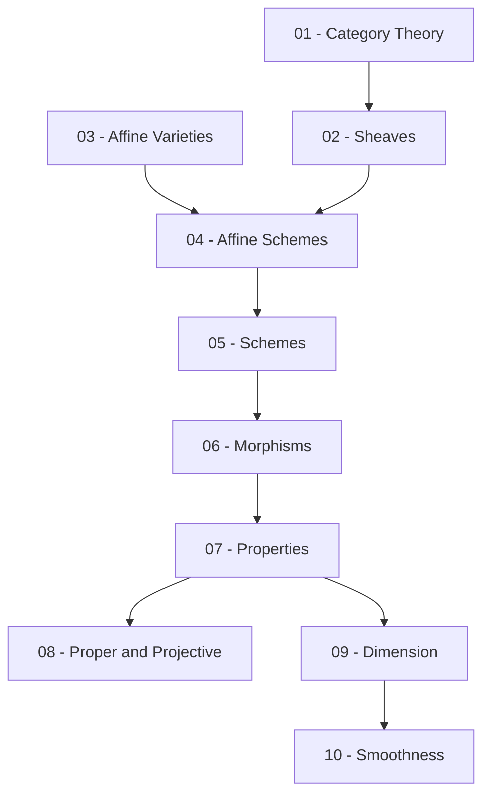

> **Level**: Graduate
> **Background**: Abstract Algebra (rings, fields, modules), Commutative Algebra, Complex Analysis
> **SageMath**: Có
> **Nguồn chính**: Vakil *The Rising Sea* (2024), Hartshorne *Algebraic Geometry* (GTM 52), Liu *Algebraic Geometry and Arithmetic Curves*

---

## Lessons

| # | Title | Key Concepts | Prerequisites | Difficulty |
|---|-------|-------------|---------------|------------|
| 01 | Category Theory & Functors | Category, functor, natural transformation, Yoneda lemma, limits/colimits | — | ★★☆☆☆ |
| 02 | Sheaves and Presheaves | Presheaf, sheaf, stalk, sheafification, morphism of sheaves | 01 | ★★★☆☆ |
| 03 | Affine Varieties & Nullstellensatz | Algebraic set, Zariski topology, Hilbert Nullstellensatz, coordinate ring | — | ★★☆☆☆ |
| 04 | Affine Schemes: Spec & Structure Sheaf | Spec R, prime spectrum, structure sheaf, locally ringed space | 02, 03 | ★★★☆☆ |
| 05 | Schemes & Gluing | Scheme, open affine cover, projective space, gluing construction | 04 | ★★★★☆ |
| 06 | Morphisms of Schemes | Morphism of locally ringed spaces, fiber products, base change | 05 | ★★★★☆ |
| 07 | Properties of Schemes & Morphisms | Reduced, integral, Noetherian, separated, quasi-compact | 06 | ★★★★☆ |
| 08 | Proper & Projective Morphisms | Valuative criterion, finite morphism, projective morphism | 07 | ★★★★★ |
| 09 | Dimension Theory | Krull dimension, transcendence degree, codimension | 07 | ★★★★☆ |
| 10 | Smoothness & Singularities | Regular local ring, Zariski tangent space, smooth/étale, sheaf of differentials | 09 | ★★★★★ |

## Appendix Candidates

| ID | Theorem | Lesson | Notes |
|----|---------|--------|-------|
| A0 | Hilbert Nullstellensatz | 03 | Weak + strong form |
| A1 | Yoneda Lemma | 01 | Chứng minh đầy đủ |
| A2 | $\mathcal{O}(\operatorname{Spec}R) \cong R$ | 04 | Fundamental theorem of affine schemes |

---

## Dependency Graph

---

## Progress Tracker

- [ ] [[00-roadmap\|00. Roadmap]]
- [ ] [[01-category-theory-and-functors\|01. Category Theory & Functors]]
- [ ] [[02-sheaves-and-presheaves\|02. Sheaves and Presheaves]]
- [ ] [[03-affine-varieties-and-nullstellensatz\|03. Affine Varieties & Nullstellensatz]]
- [ ] [[04-affine-schemes\|04. Affine Schemes: Spec & Structure Sheaf]]
- [ ] [[05-schemes-and-gluing\|05. Schemes & Gluing]]
- [ ] [[06-morphisms-of-schemes\|06. Morphisms of Schemes]]
- [ ] [[07-properties-of-schemes\|07. Properties of Schemes & Morphisms]]
- [ ] [[08-proper-and-projective-morphisms\|08. Proper & Projective Morphisms]]
- [ ] [[09-dimension-theory\|09. Dimension Theory]]
- [ ] [[10-smoothness-and-singularities\|10. Smoothness & Singularities]]
