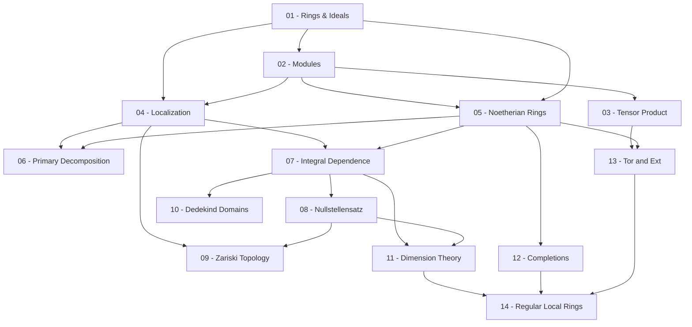

> **Level**: Graduate
> **Background**: Abstract Algebra cơ bản (nhóm, vành, trường), Linear Algebra
> **SageMath**: Có
> **Nguồn chính**: Atiyah–Macdonald *Introduction to Commutative Algebra* · Eisenbud *Commutative Algebra with a View Toward Algebraic Geometry* · Altman–Kleiman *A Term of Commutative Algebra*

---

## Lessons

| # | Tiêu đề | Nội dung chính | Tiên quyết | Độ khó |
|---|---------|----------------|------------|--------|
| 01 | Rings, Ideals, and Homomorphisms | Ring homomorphism, ideal, quotient ring, prime & maximal ideals, nilradical, Jacobson radical, Chinese Remainder Theorem | — | ★★☆☆☆ |
| 02 | Modules | Module, submodule, quotient module, exact sequences, free modules, finitely generated modules | 01 | ★★☆☆☆ |
| 03 | Tensor Product and Hom | Tensor product, adjoint associativity, right/left exactness, flatness (giới thiệu) | 02 | ★★★☆☆ |
| 04 | Localization | Multiplicative subsets, $S^{-1}R$, local rings, $\operatorname{Spec}(R)$, localization of modules | 01, 02 | ★★★☆☆ |
| 05 | Noetherian Rings and Hilbert Basis Theorem | Chain conditions, Noetherian rings & modules, Hilbert basis theorem, primary ideals | 01, 02 | ★★★☆☆ |
| 06 | Primary Decomposition | Associated primes, primary decomposition, uniqueness, Lasker–Noether theorem | 04, 05 | ★★★★☆ |
| 07 | Integral Dependence | Integral elements & extensions, going-up theorem, going-down theorem, integrally closed domains | 04, 05 | ★★★★☆ |
| 08 | Noether Normalization and Nullstellensatz | Noether normalization lemma, Hilbert Nullstellensatz (weak & strong forms), geometric interpretation | 07 | ★★★★☆ |
| 09 | Spectrum and Zariski Topology | $\operatorname{Spec}(R)$ as topological space, Zariski topology, irreducible components, Jacobson rings | 04, 08 | ★★★☆☆ |
| 10 | Discrete Valuation Rings and Dedekind Domains | DVRs, Dedekind domains, fractional ideals, unique factorization of ideals | 07 | ★★★★☆ |
| 11 | Dimension Theory | Krull dimension, chains of primes, Krull's principal ideal theorem, dimension of polynomial rings | 07, 08 | ★★★★★ |
| 12 | Completions and Filtrations | $I$-adic topology, completion, Artin–Rees lemma, graded rings & modules, Hilbert functions | 05 | ★★★★☆ |
| 13 | Homological Methods: Tor and Ext | Projective/injective/flat resolutions, $\operatorname{Tor}$, $\operatorname{Ext}$, long exact sequences | 03, 05 | ★★★★★ |
| 14 | Regular Local Rings and Cohen–Macaulay Rings | Depth, regular local rings, Cohen–Macaulay rings, Serre's normality criterion | 11, 12, 13 | ★★★★★ |

---

## Appendix Candidates

| ID | Định lý | Lesson liên quan | Ghi chú |
|----|---------|-----------------|---------|
| A0 | Hilbert Basis Theorem | 05 | Chứng minh bằng ascending chain condition |
| A1 | Going-Up & Going-Down Theorems | 07 | Hai định lý với giả thiết khác nhau |
| A2 | Noether Normalization Lemma | 08 | Chứng minh constructive |
| A3 | Hilbert Nullstellensatz | 08 | Dẫn xuất từ Noether normalization |
| A4 | Krull's Principal Ideal Theorem | 11 | Định lý trung tâm của dimension theory |

---

## Dependency Graph

---

## Progress Tracker

- [ ] [[00-roadmap|00. Roadmap]]
- [ ] [[01-rings-ideals-homomorphisms|01. Rings, Ideals, and Homomorphisms]]
- [ ] [[02-modules|02. Modules]]
- [ ] [[03-tensor-product-and-hom|03. Tensor Product and Hom]]
- [ ] [[04-localization|04. Localization]]
- [ ] [[05-noetherian-rings|05. Noetherian Rings and Hilbert Basis Theorem]]
- [ ] [[06-primary-decomposition|06. Primary Decomposition]]
- [ ] [[07-integral-dependence|07. Integral Dependence]]
- [ ] [[08-noether-normalization-nullstellensatz|08. Noether Normalization and Nullstellensatz]]
- [ ] [[09-spectrum-zariski-topology|09. Spectrum and Zariski Topology]]
- [ ] [[10-dedekind-domains|10. Discrete Valuation Rings and Dedekind Domains]]
- [ ] [[11-dimension-theory|11. Dimension Theory]]
- [ ] [[12-completions-filtrations|12. Completions and Filtrations]]
- [ ] [[13-tor-and-ext|13. Homological Methods: Tor and Ext]]
- [ ] [[14-regular-local-rings|14. Regular Local Rings and Cohen–Macaulay Rings]]
