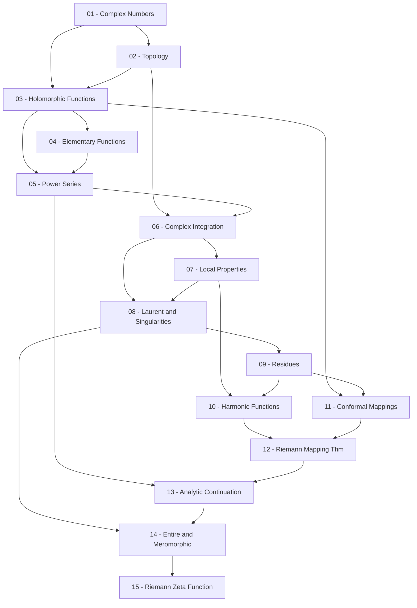

> **Level**: Graduate
> **Background**: Calculus / Giải tích thực, Linear Algebra, Abstract Algebra cơ bản
> **SageMath**: Có
> **Nguồn chính**: Ahlfors *Complex Analysis* (3rd ed.), Conway *Functions of One Complex Variable*, Stein & Shakarchi *Complex Analysis* (Princeton Lectures)

---

## Lessons

| # | Title | Key Concepts | Prerequisites | Difficulty |
|---|-------|-------------|---------------|------------|
| 01 | Complex Numbers and the Complex Plane | Số phức, module, argument, bất đẳng thức tam giác, cầu Riemann | — | ★☆☆☆☆ |
| 02 | Topology of the Complex Plane | Tập mở/đóng, liên thông, đường cong, winding number | 01 | ★★☆☆☆ |
| 03 | Holomorphic Functions & Cauchy–Riemann Equations | Đạo hàm phức, hàm holomorphic, phương trình CR, hàm điều hòa | 01, 02 | ★★★☆☆ |
| 04 | Elementary Complex Functions | $e^z$, $\log z$ (nhánh), $z^\alpha$, hàm lượng giác phức | 03 | ★★☆☆☆ |
| 05 | Power Series | Chuỗi lũy thừa, bán kính hội tụ, công thức Hadamard, vi phân số hạng-theo-số hạng | 03, 04 | ★★★☆☆ |
| 06 | Complex Integration | Tích phân đường, định lý Cauchy, công thức tích phân Cauchy | 02, 05 | ★★★☆☆ |
| 07 | Local Properties of Analytic Functions | Định lý ánh xạ mở, nguyên lý module cực đại, định lý đồng nhất | 06 | ★★★★☆ |
| 08 | Laurent Series & Isolated Singularities | Chuỗi Laurent, điểm kỳ dị cô lập, Casorati–Weierstrass | 06, 07 | ★★★☆☆ |
| 09 | Calculus of Residues | Định lý thặng dư, tính tích phân thực, nguyên lý argument, định lý Rouché | 08 | ★★★★☆ |
| 10 | Harmonic Functions | Hàm điều hòa, mean value property, tích phân Poisson, bài toán Dirichlet | 07, 09 | ★★★★☆ |
| 11 | Conformal Mappings | Ánh xạ bảo giác, biến đổi Möbius, bổ đề Schwarz–Pick | 03, 09 | ★★★★☆ |
| 12 | Riemann Mapping Theorem | Họ chuẩn tắc, định lý Montel, chứng minh Riemann | 10, 11 | ★★★★★ |
| 13 | Analytic Continuation & Monodromy | Tiếp tục giải tích, mầm (germ), định lý đơn cấu | 05, 12 | ★★★★★ |
| 14 | Entire & Meromorphic Functions | Weierstrass factorization, Mittag-Leffler, tích vô hạn, hàm Gamma | 08, 13 | ★★★★★ |
| 15 | The Riemann Zeta Function | $\zeta(s)$, tiếp tục giải tích, phương trình hàm, ứng dụng số học | 14 | ★★★★★ |

---

## Appendix Candidates

| ID | Theorem | Related Lesson | Notes |
|----|---------|----------------|-------|
| A0 | Cauchy's Theorem — homology version | 06 | Dạng tổng quát nhất, chứng minh bằng homotopy |
| A1 | Riemann Mapping Theorem | 12 | Chứng minh đầy đủ qua normal families |
| A2 | Weierstrass Factorization Theorem | 14 | Nhân tử hóa toàn cục hàm entire |

---

## Dependency Graph

---

## Progress Tracker

- [ ] [[00-roadmap|00. Roadmap]]
- [ ] [[01-complex-numbers|01. Complex Numbers and the Complex Plane]]
- [ ] [[02-topology-complex-plane|02. Topology of the Complex Plane]]
- [ ] [[03-holomorphic-functions|03. Holomorphic Functions and Cauchy–Riemann Equations]]
- [ ] [[04-elementary-complex-functions|04. Elementary Complex Functions]]
- [ ] [[05-power-series|05. Power Series]]
- [ ] [[06-complex-integration|06. Complex Integration]]
- [ ] [[07-local-properties|07. Local Properties of Analytic Functions]]
- [ ] [[08-laurent-series-singularities|08. Laurent Series and Isolated Singularities]]
- [ ] [[09-residues|09. Calculus of Residues]]
- [ ] [[10-harmonic-functions|10. Harmonic Functions]]
- [ ] [[11-conformal-mappings|11. Conformal Mappings]]
- [ ] [[12-riemann-mapping-theorem|12. Riemann Mapping Theorem]]
- [ ] [[13-analytic-continuation|13. Analytic Continuation and Monodromy]]
- [ ] [[14-entire-meromorphic-functions|14. Entire and Meromorphic Functions]]
- [ ] [[15-riemann-zeta-function|15. The Riemann Zeta Function]]
