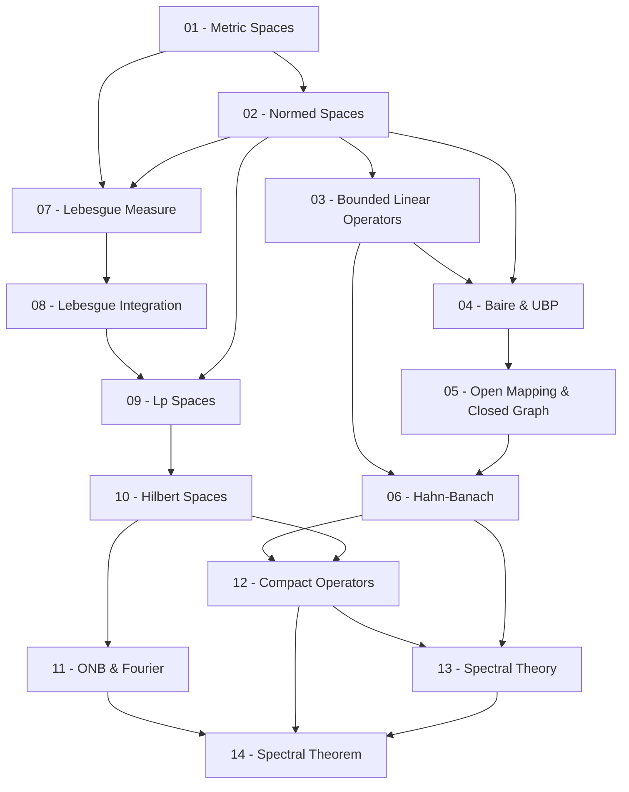

> **Level**: Graduate
> **Background**: Real Analysis, Linear Algebra
> **SageMath**: Có
> **Sources**: Rudin (Functional Analysis), Conway (A Course in Functional Analysis), Kreyszig (Introductory Functional Analysis with Applications), MIT 18.102

---

## Lessons

| # | Title | Key Concepts | Prerequisites | Difficulty |
|---|-------|-------------|---------------|------------|
| 01 | Metric Spaces & Topology Review | Không gian metric, open/closed sets, compactness, completeness | — | ★★☆☆☆ |
| 02 | Normed Spaces & Banach Spaces | Norm, Banach space, $\ell^p$, $C[a,b]$, completeness | 01 | ★★☆☆☆ |
| 03 | Bounded Linear Operators | Toán tử tuyến tính bị chặn, $B(X,Y)$, dual space $X^*$ | 02 | ★★★☆☆ |
| 04 | Fundamental Theorems I — Baire & UBP | Baire Category Theorem, Uniform Boundedness Principle | 02, 03 | ★★★☆☆ |
| 05 | Fundamental Theorems II — Open Mapping & Closed Graph | Open Mapping Theorem, Closed Graph Theorem | 04 | ★★★☆☆ |
| 06 | Hahn-Banach Theorem & Duality | Hahn-Banach, reflexive spaces, double dual $X^{**}$ | 03, 05 | ★★★★☆ |
| 07 | Lebesgue Measure | Outer measure, $\sigma$-algebra, Borel sets, Lebesgue measure | 01 | ★★★☆☆ |
| 08 | Lebesgue Integration | Measurable functions, tích phân Lebesgue, MCT, DCT, Fatou | 07 | ★★★★☆ |
| 09 | $L^p$ Spaces | Định nghĩa $L^p$, Hölder & Minkowski, completeness, duality | 08, 02 | ★★★★☆ |
| 10 | Hilbert Spaces | Inner product, Cauchy-Schwarz, projection, Riesz Representation | 09 | ★★★☆☆ |
| 11 | Orthonormal Bases & Fourier Series | ONB, khai triển Fourier, Parseval, $L^2$ | 10 | ★★★★☆ |
| 12 | Compact Operators | Toán tử compact, Fredholm Alternative | 10, 06 | ★★★★☆ |
| 13 | Spectral Theory — Banach Algebras | Banach algebras, spectrum, resolvent, spectral radius | 06, 12 | ★★★★★ |
| 14 | Spectral Theorem | Toán tử tự liên hợp, Spectral Theorem cho compact self-adjoint | 11, 12, 13 | ★★★★★ |

## Appendix Candidates

| ID | Theorem | Related Lesson | Notes |
|----|---------|----------------|-------|
| A0 | Proof of Baire Category Theorem | 04 | Chứng minh đầy đủ bằng nested closed balls |
| A1 | Proof of Hahn-Banach Theorem | 06 | Dùng Zorn's Lemma |
| A2 | Proof of Open Mapping Theorem | 05 | Dùng Baire Category Theorem |
| A3 | Radon-Nikodym & Duality of $L^p$ | 09 | Chứng minh $(L^p)^* \cong L^q$ |
| A4 | Spectral Theorem (chi tiết) | 14 | Chứng minh đầy đủ |

---

## Dependency Graph

---

## Progress Tracker

- [ ] [[00-roadmap|00. Roadmap]]
- [ ] [[01-metric-spaces-topology|01. Metric Spaces & Topology Review]]
- [ ] [[02-normed-spaces-banach|02. Normed Spaces & Banach Spaces]]
- [ ] [[03-bounded-linear-operators|03. Bounded Linear Operators]]
- [ ] [[04-baire-ubp|04. Fundamental Theorems I — Baire & UBP]]
- [ ] [[05-open-mapping-closed-graph|05. Fundamental Theorems II — Open Mapping & Closed Graph]]
- [ ] [[06-hahn-banach-duality|06. Hahn-Banach Theorem & Duality]]
- [ ] [[07-lebesgue-measure|07. Lebesgue Measure]]
- [ ] [[08-lebesgue-integration|08. Lebesgue Integration]]
- [ ] [[09-lp-spaces|09. Lp Spaces]]
- [ ] [[10-hilbert-spaces|10. Hilbert Spaces]]
- [ ] [[11-onb-fourier|11. Orthonormal Bases & Fourier Series]]
- [ ] [[12-compact-operators|12. Compact Operators]]
- [ ] [[13-spectral-theory|13. Spectral Theory — Banach Algebras]]
- [ ] [[14-spectral-theorem|14. Spectral Theorem]]
