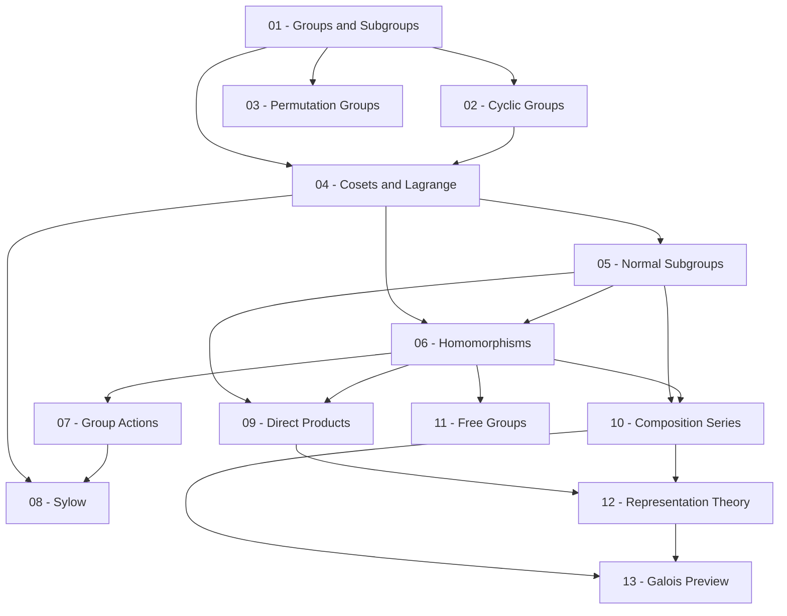

> **Level**: Graduate
> **Background**: Đại số tuyến tính cơ bản, Đại số trừu tượng cơ bản, Lý thuyết số cơ bản
> **SageMath**: Có
> **Sources**: Dummit & Foote, Hungerford, Lang, J.S. Milne (GT notes)

---

## Lessons

| # | Tiêu đề | Khái niệm chính | Prerequisites | Độ khó |
|---|---------|----------------|---------------|--------|
| 01 | Groups and Subgroups | Tiên đề nhóm, nhóm Abel, tiêu chuẩn nhóm con, order | — | ★☆☆☆☆ |
| 02 | Cyclic Groups | Nhóm cyclic, bậc phần tử, phân loại nhóm con cyclic, $\mathbb{Z}_n$ | 01 | ★★☆☆☆ |
| 03 | Permutation Groups | $S_n$, phân tích chu trình, chẵn lẻ, $A_n$, định lý Cayley | 01, 02 | ★★☆☆☆ |
| 04 | Cosets & Lagrange's Theorem | Coset trái/phải, chỉ số $[G:H]$, định lý Lagrange | 01, 02 | ★★★☆☆ |
| 05 | Normal Subgroups & Quotient Groups | Nhóm con chuẩn tắc, nhóm thương $G/N$, center, commutator subgroup | 04 | ★★★☆☆ |
| 06 | Group Homomorphisms | Đồng cấu, kernel, image, 3 định lý đẳng cấu | 04, 05 | ★★★☆☆ |
| 07 | Group Actions | Group action, orbit, stabilizer, Orbit-Stabilizer, Burnside's Lemma | 06 | ★★★★☆ |
| 08 | Sylow Theorems | $p$-nhóm, 3 định lý Sylow, ứng dụng phân loại | 04, 07 | ★★★★☆ |
| 09 | Direct & Semidirect Products | Tích trực tiếp, FTFAG, tích nửa trực tiếp, phân loại nhóm bậc nhỏ | 05, 06 | ★★★★☆ |
| 10 | Composition Series & Solvable Groups | Chuỗi hợp thành, Jordan–Hölder, nhóm giải được, nhóm nilpotent | 05, 06 | ★★★★★ |
| 11 | Free Groups & Presentations | Nhóm tự do, word problem, generators & relations | 06 | ★★★★☆ |
| 12 | Introduction to Representation Theory | $\mathbb{C}[G]$-module, character, định lý Maschke, bảng character | 09, 10 | ★★★★★ |
| 13 | Applications: Galois Theory Preview | Nhóm Galois, tính giải được bằng căn, $S_5$ không giải được | 10, 12 | ★★★★★ |

---

## Appendix Candidates

| ID | Định lý | Bài liên quan | Ghi chú |
|----|---------|--------------|---------|
| A0 | Lagrange's Theorem | 04 | Chứng minh chi tiết bằng coset partition |
| A1 | Sylow Theorems | 08 | Ba định lý, chứng minh bằng group action |
| A2 | Jordan–Hölder Theorem | 10 | Chứng minh tính duy nhất chuỗi hợp thành |
| A3 | Maschke's Theorem | 12 | Chứng minh tính khả quy hoàn toàn |

---

## Dependency Graph

---

## Progress Tracker

- [ ] [[00-roadmap|00. Roadmap]]
- [ ] [[01-groups-and-subgroups|01. Groups and Subgroups]]
- [ ] [[02-cyclic-groups|02. Cyclic Groups]]
- [ ] [[03-permutation-groups|03. Permutation Groups]]
- [ ] [[04-cosets-and-lagrange|04. Cosets and Lagrange's Theorem]]
- [ ] [[05-normal-subgroups|05. Normal Subgroups and Quotient Groups]]
- [ ] [[06-group-homomorphisms|06. Group Homomorphisms]]
- [ ] [[07-group-actions|07. Group Actions]]
- [ ] [[08-sylow-theorems|08. Sylow Theorems]]
- [ ] [[09-direct-and-semidirect-products|09. Direct and Semidirect Products]]
- [ ] [[10-composition-series|10. Composition Series and Solvable Groups]]
- [ ] [[11-free-groups-and-presentations|11. Free Groups and Presentations]]
- [ ] [[12-representation-theory|12. Introduction to Representation Theory]]
- [ ] [[13-galois-theory-preview|13. Applications: Galois Theory Preview]]
