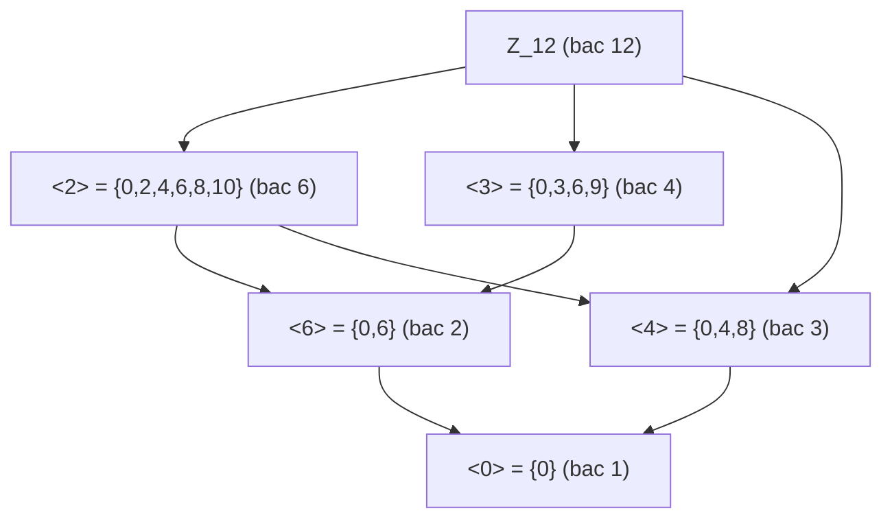

> **Prerequisites**: [[01-groups-and-subgroups|01. Groups and Subgroups]]
> **Objectives**:
> - Định nghĩa và nhận diện nhóm cyclic, phân biệt nhóm cyclic vô hạn và hữu hạn
> - Chứng minh định lý phân loại đầy đủ: mọi nhóm cyclic đẳng cấu với $\mathbb{Z}$ hoặc $\mathbb{Z}_n$
> - Mô tả hoàn toàn mọi nhóm con của nhóm cyclic
> - Tính bậc của phần tử trong $\mathbb{Z}_n$ và ứng dụng vào lý thuyết số

---

## Motivation / Intuition

Nhóm cyclic là lớp nhóm đơn giản nhất và đồng thời là viên gạch xây dựng nền tảng cho toàn bộ lý thuyết nhóm hữu hạn Abel. Mọi nhóm hữu hạn Abel đều là tích trực tiếp của nhóm cyclic — đây chính là nội dung của Fundamental Theorem of Finite Abelian Groups (bài 09).

Hình ảnh trực quan: nhóm cyclic là nhóm "quay vòng" — như đồng hồ $(\mathbb{Z}_{12}, +)$ hay nhóm quay $n$-giác đều. Một phần tử duy nhất $g$ sinh ra toàn bộ nhóm bằng cách lặp đi lặp lại phép toán nhóm.

Tầm quan trọng trong lý thuyết số: nhóm $(\mathbb{Z}_p^*, \cdot)$ là cyclic với mọi số nguyên tố $p$ — đây là nền tảng của mã hóa Diffie–Hellman và ElGamal. Hơn nữa, $(\mathbb{Z}_n^*, \cdot)$ cyclic khi và chỉ khi $n \in \left\{1, 2, 4, p^k, 2p^k\right\}$ với $p$ lẻ nguyên tố.

---

## Nhóm Cyclic (Cyclic Group)

### Definition

> [!definition] Definition 2.1 — Nhóm cyclic (Cyclic Group)
> Nhóm $G$ được gọi là **cyclic** nếu tồn tại $g \in G$ sao cho $G = \langle g \rangle$, tức là mọi phần tử của $G$ đều là lũy thừa của $g$:
>
> $$
> G = \langle g \rangle = \left\{ g^k : k \in \mathbb{Z} \right\}
> $$
>
> Phần tử $g$ như vậy được gọi là **phần tử sinh** (generator) của $G$.
>
> [!note] Remark 2.2 — Kí hiệu lũy thừa
> Quy ước lũy thừa trong nhóm:
>
> $$
> g^0 = e, \quad g^n = \underbrace{g \cdot g \cdots g}_{n}, \quad g^{-n} = \underbrace{g^{-1} \cdot g^{-1} \cdots g^{-1}}_{n} \quad (n > 0)
> $$
>
> Với nhóm cộng, lũy thừa $g^n$ viết thành $ng$.

### Phân loại nhóm cyclic

> [!abstract] Theorem 2.3 — Phân loại nhóm cyclic (Classification of Cyclic Groups)
> Mọi nhóm cyclic đẳng cấu (isomorphic) với đúng một trong hai loại:
>
> 1. $\mathbb{Z}$ (nhóm cyclic vô hạn), nếu $|G| = \infty$.
> 2. $\mathbb{Z}_n$ (nhóm cyclic bậc $n$), nếu $|G| = n < \infty$.
>
> Cụ thể: nếu $G = \langle g \rangle$ thì $\phi : \mathbb{Z} \to G$, $k \mapsto g^k$ là đồng cấu surjective, và:
>
> - Nếu $\operatorname{ord}(g) = \infty$: $\phi$ là đẳng cấu $\mathbb{Z} \cong G$.
> - Nếu $\operatorname{ord}(g) = n$: $\phi$ cảm sinh đẳng cấu $\mathbb{Z}_n \cong G$.

**Proof.**
$\phi$ là đồng cấu: $\phi(j + k) = g^{j+k} = g^j \cdot g^k = \phi(j)\phi(k)$. $\phi$ surjective theo định nghĩa $G = \langle g \rangle$.

**Trường hợp $\operatorname{ord}(g) = \infty$**: Giả sử $\phi(j) = \phi(k)$, tức $g^j = g^k$, suy ra $g^{j-k} = e$. Vì $g$ có bậc vô hạn, điều này buộc $j - k = 0$. Vậy $\phi$ injective, tức $\phi$ là đẳng cấu $\mathbb{Z} \cong G$.

**Trường hợp $\operatorname{ord}(g) = n$**: $\ker \phi = \left\{ k \in \mathbb{Z} : g^k = e \right\} = n\mathbb{Z}$ (theo Theorem 1.19). Theo định lý đẳng cấu thứ nhất (sẽ chứng minh ở bài 06): $\mathbb{Z}/n\mathbb{Z} \cong G$. Vì $\mathbb{Z}/n\mathbb{Z} = \mathbb{Z}_n$, ta được $\mathbb{Z}_n \cong G$. $\blacksquare$

> [!example] Example 2.4 — Nhóm căn bậc $n$ của đơn vị
> Tập $\mu_n = \left\{ e^{2\pi ik/n} : k = 0, \ldots, n-1 \right\} \subseteq \mathbb{C}^*$ với phép nhân là nhóm cyclic bậc $n$, sinh bởi $\zeta = e^{2\pi i/n}$.
>
> Đẳng cấu tường minh: $\mathbb{Z}_n \to \mu_n$, $k \mapsto e^{2\pi ik/n}$.

---

## Phần tử sinh (Generators)

> [!abstract] Theorem 2.5 — Phần tử sinh của $\mathbb{Z}_n$
> Phần tử $a \in \mathbb{Z}_n$ là phần tử sinh của $\mathbb{Z}_n$ khi và chỉ khi $\gcd(a, n) = 1$.
>
> Số lượng phần tử sinh của $\mathbb{Z}_n$ là $\varphi(n)$, trong đó $\varphi$ là hàm Euler totient.

**Proof.**
$\langle a \rangle = \mathbb{Z}_n$ khi và chỉ khi tồn tại $k$ sao cho $ka \equiv 1 \pmod{n}$... tức phương trình $ka \equiv 1 \pmod{n}$ có nghiệm, khi và chỉ khi $\gcd(a, n) = 1$. Số phần tử $a \in \left\{1, \ldots, n-1\right\}$ thỏa $\gcd(a, n) = 1$ đúng bằng $\varphi(n)$ theo định nghĩa hàm Euler. $\blacksquare$

> [!example] Example 2.6 — Phần tử sinh của $\mathbb{Z}_{12}$
> $\varphi(12) = \varphi(4)\varphi(3) = 2 \cdot 2 = 4$. Các phần tử sinh là những $a$ thỏa $\gcd(a, 12) = 1$:
>
> $$
> \left\{1, 5, 7, 11\right\}
> $$
>
> Kiểm tra: $\langle 5 \rangle$: $5, 10, 3, 8, 1, 6, 11, 4, 9, 2, 7, 0$ — sinh ra đủ 12 phần tử. ✓
>
> [!abstract] Theorem 2.7 — Phần tử sinh của nhóm cyclic vô hạn
> Nhóm cyclic vô hạn $G = \langle g \rangle \cong \mathbb{Z}$ có đúng hai phần tử sinh: $g$ và $g^{-1}$.

**Proof.**
Nếu $g^k$ sinh $G$ thì tồn tại $m$ sao cho $(g^k)^m = g$, tức $g^{km-1} = e$. Vì $\operatorname{ord}(g) = \infty$, ta có $km = 1$ trong $\mathbb{Z}$, nên $k = \pm 1$. $\blacksquare$

---

## Nhóm con của nhóm cyclic

Đây là một trong những kết quả cấu trúc quan trọng nhất, mô tả hoàn toàn nhóm con của nhóm cyclic.

> [!abstract] Theorem 2.8 — Phân loại nhóm con của nhóm cyclic vô hạn
> Mọi nhóm con của $\mathbb{Z}$ có dạng $n\mathbb{Z}$ với $n \geq 0$. Hai nhóm con $m\mathbb{Z}$ và $n\mathbb{Z}$ thỏa:
>
> $$
> m\mathbb{Z} \subseteq n\mathbb{Z} \iff n \mid m
> $$
>
> Tương ứng 1-1: nhóm con của $\mathbb{Z}$ $\longleftrightarrow$ $\mathbb{Z}_{\geq 0}$.

Xem chứng minh tại [[01-groups-and-subgroups|01. Groups and Subgroups]], Example 1.12.

> [!abstract] Theorem 2.9 — Phân loại nhóm con của $\mathbb{Z}_n$ (Subgroups of Cyclic Groups)
> Cho $G = \langle g \rangle$ là nhóm cyclic bậc $n$. Khi đó:
>
> 1. Với mỗi $d \mid n$, tồn tại đúng một nhóm con bậc $d$, đó là $\langle g^{n/d} \rangle$.
> 2. Mọi nhóm con của $G$ đều là cyclic.
> 3. Tương ứng 1-1 bảo toàn thứ tự bao hàm:
>
> $$
> \left\{ \text{nhóm con của } G \right\} \longleftrightarrow \left\{ d \in \mathbb{Z}_{> 0} : d \mid n \right\}
> $$
>
> với $H \leq G$ tương ứng $d = |H|$, và $H_1 \subseteq H_2 \iff |H_1| \mid |H_2|$.

**Proof.**
Vì $G \cong \mathbb{Z}_n$, đủ xét trường hợp $G = \mathbb{Z}_n$. Mọi nhóm con $H$ của $\mathbb{Z}_n$ là nhóm con của nhóm cyclic, nên cyclic.

**Tồn tại**: Với $d \mid n$, xét $H_d = \langle n/d \rangle = \left\{ 0, n/d, 2n/d, \ldots, (d-1)n/d \right\}$. Đây là nhóm con bậc $d$.

**Duy nhất**: Giả sử $H \leq \mathbb{Z}_n$ với $|H| = d$. Gọi $a$ là phần tử nhỏ nhất dương trong $H$. Khi đó $H = \langle a \rangle$ và $|H| = n/a$ (do bậc của $a$ trong $\mathbb{Z}_n$ là $n/\gcd(a,n)$; vì $H = \langle a \rangle$ có bậc $d$, ta có $a = n/d$). Vậy $H = H_d$ là duy nhất. $\blacksquare$

> [!example] Example 2.10 — Sơ đồ nhóm con của $\mathbb{Z}_{12}$
> Các ước của $12$: $1, 2, 3, 4, 6, 12$. Các nhóm con tương ứng:



*Sơ đồ Hasse của nhóm con $\mathbb{Z}_{12}$: mũi tên từ $H$ đến $K$ nghĩa là $K \leq H$.*

---

## Bậc phần tử trong $\mathbb{Z}_n$

> [!abstract] Theorem 2.11 — Bậc phần tử trong $\mathbb{Z}_n$
> Bậc của phần tử $a \in \mathbb{Z}_n$ là:
>
> $$
> \operatorname{ord}(a) = \frac{n}{\gcd(a, n)}
> $$

**Proof.**
$\operatorname{ord}(a)$ là số nguyên dương nhỏ nhất $k$ sao cho $ka \equiv 0 \pmod{n}$, tức $n \mid ka$, tức $\frac{n}{\gcd(a,n)} \mid k$. Số nhỏ nhất là $k = \frac{n}{\gcd(a,n)}$. $\blacksquare$

> [!example] Example 2.12 — Bậc phần tử trong $\mathbb{Z}_{24}$
> Tính bậc các phần tử:
>
> - $\operatorname{ord}(6) = 24 / \gcd(6, 24) = 24 / 6 = 4$
> - $\operatorname{ord}(8) = 24 / \gcd(8, 24) = 24 / 8 = 3$
> - $\operatorname{ord}(9) = 24 / \gcd(9, 24) = 24 / 3 = 8$
> - $\operatorname{ord}(1) = 24 / 1 = 24$ (phần tử sinh)
>
> [!abstract] Theorem 2.13 — Số phần tử bậc $d$ trong $\mathbb{Z}_n$
> Với $d \mid n$, số phần tử có bậc đúng bằng $d$ trong $\mathbb{Z}_n$ là $\varphi(d)$.
>
> Hệ quả: $\displaystyle\sum_{d \mid n} \varphi(d) = n$.

**Proof.**
Nhóm con duy nhất bậc $d$ là $\langle n/d \rangle$. Phần tử bậc $d$ trong $\mathbb{Z}_n$ là đúng các phần tử sinh của $\langle n/d \rangle \cong \mathbb{Z}_d$, mà số lượng là $\varphi(d)$. Đẳng thức $\sum_{d \mid n} \varphi(d) = n$ suy ra từ việc mọi phần tử thuộc đúng một nhóm theo bậc của nó. $\blacksquare$

---

## Nhóm con chuẩn tắc và cyclic

> [!note] Remark 2.14 — Nhóm cyclic luôn Abel
> Mọi nhóm cyclic đều Abel: nếu $G = \langle g \rangle$ thì $g^j \cdot g^k = g^{j+k} = g^k \cdot g^j$.
>
> Hệ quả: mọi nhóm con của nhóm cyclic đều là nhóm con chuẩn tắc (normal subgroup). Khái niệm này sẽ được phát triển đầy đủ ở bài 05.
>
> [!abstract] Theorem 2.15 — Nhóm con của nhóm cyclic là cyclic
> Mọi nhóm con của nhóm cyclic đều là cyclic.

**Proof.**
Xét $G = \langle g \rangle$ và $H \leq G$. Mọi phần tử của $H$ có dạng $g^k$. Nếu $H = \{e\}$ thì $H = \langle e \rangle$ cyclic. Nếu $H \neq \{e\}$, đặt $m = \min\left\{k > 0 : g^k \in H\right\}$ (tồn tại vì nếu $g^k \in H$ với $k < 0$ thì $g^{-k} = (g^k)^{-1} \in H$). Ta chứng minh $H = \langle g^m \rangle$:

Với bất kỳ $g^n \in H$, viết $n = qm + r$, $0 \leq r < m$. Vì $g^n \in H$ và $g^{qm} = (g^m)^q \in H$, nên $g^r = g^n \cdot (g^m)^{-q} \in H$. Tính tối tiểu của $m$ buộc $r = 0$, tức $g^n \in \langle g^m \rangle$. $\blacksquare$

---

## SageMath Cheatsheet

Làm việc với nhóm cyclic và bậc phần tử:

```sage
G = CyclicPermutationGroup(12)
G.order()

G = Zmod(12)
[G(a).additive_order() for a in G]

G = Zmod(24)
G(9).additive_order()

euler_phi(12)

divisors(24)

G = Zmod(30)
for d in divisors(30):
    gens = [a for a in G if G(a).additive_order() == d]
    print(f"bac {d}: {len(gens)} phan tu, phi({d}) = {euler_phi(d)}")
```

---

## Summary / Key Takeaways

- Nhóm cyclic $G = \langle g \rangle$: mọi phần tử là lũy thừa của $g$.
- **Phân loại**: mọi nhóm cyclic đẳng cấu với $\mathbb{Z}$ (vô hạn) hoặc $\mathbb{Z}_n$ (hữu hạn bậc $n$).
- $a \in \mathbb{Z}_n$ là phần tử sinh $\iff$ $\gcd(a, n) = 1$; có $\varphi(n)$ phần tử sinh.
- $\mathbb{Z}$ có đúng hai phần tử sinh: $1$ và $-1$.
- **Phân loại nhóm con**: nhóm con của $\mathbb{Z}_n$ tương ứng 1-1 với các ước $d \mid n$; nhóm con bậc $d$ là $\langle n/d \rangle$.
- **Bậc phần tử**: $\operatorname{ord}(a) = n / \gcd(a, n)$ trong $\mathbb{Z}_n$.
- Số phần tử bậc $d$ trong $\mathbb{Z}_n$ (với $d \mid n$) là $\varphi(d)$; tổng $\sum_{d \mid n} \varphi(d) = n$.
- Mọi nhóm cyclic đều Abel; mọi nhóm con của nhóm cyclic đều cyclic.

---

## References

- Dummit, D. S., & Foote, R. M. *Abstract Algebra* (3rd ed.), §2.3, §3.1.
- Hungerford, T. W. *Algebra*, Chapter I §3.
- Lang, S. *Algebra* (Revised 3rd ed.), Chapter I §4.
- Milne, J. S. *Group Theory* (v4.00), Chapter 1. https://www.jmilne.org/math/CourseNotes/GT.pdf
- https://doc.sagemath.org/html/en/reference/groups/
