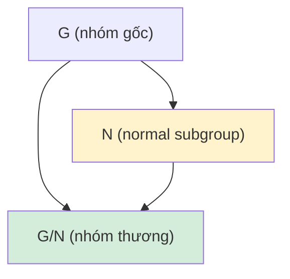

> **Prerequisites**: [[04-cosets-and-lagrange|04. Cosets and Lagrange's Theorem]]
> **Objectives**:
> - Nắm vững định nghĩa nhóm con chuẩn tắc và các tiêu chuẩn tương đương
> - Xây dựng nhóm thương $G/N$ và kiểm tra đây là nhóm well-defined
> - Nhận diện và sử dụng các ví dụ quan trọng: center, commutator subgroup
> - Hiểu ý nghĩa hình học của nhóm thương

---

## Motivation / Intuition

Sau khi xây dựng coset ở bài 04, câu hỏi tự nhiên là: khi nào tập hợp tất cả coset lại tạo thành một **nhóm**? Ta muốn định nghĩa phép toán $(aH)(bH) = (ab)H$, nhưng điều này chỉ well-defined khi kết quả không phụ thuộc vào đại diện được chọn.

Đây chính xác là điều kiện $N$ là **nhóm con chuẩn tắc** (normal subgroup). Nhóm con chuẩn tắc đóng vai trò trung tâm trong toàn bộ lý thuyết nhóm — chúng là "kernel" của mọi đồng cấu, và nhóm thương $G/N$ nắm bắt thông tin của $G$ "sau khi bỏ qua $N$".

Trực giác: nếu $G$ là một đối tượng đối xứng, thì $G/N$ là đối tượng mà ta thu được sau khi "xác định" tất cả các phần tử của mỗi coset thành một điểm.

---

## Nhóm con chuẩn tắc (Normal Subgroup)

### Definition

> [!definition] Definition 5.1 — Nhóm con chuẩn tắc (Normal Subgroup)
> Một nhóm con $N \leq G$ được gọi là **chuẩn tắc** (normal) trong $G$, ký hiệu $N \trianglelefteq G$, nếu:
>
> $$
> \forall\, g \in G: \quad gN = Ng
> $$
>
> tức là mọi coset trái bằng coset phải tương ứng.
>
> [!abstract] Theorem 5.2 — Các tiêu chuẩn tương đương cho nhóm con chuẩn tắc
> Cho $N \leq G$. Các mệnh đề sau tương đương:
>
> 1. $N \trianglelefteq G$ (mọi coset trái bằng coset phải).
> 2. $\forall\, g \in G,\, \forall\, n \in N: \; gng^{-1} \in N$.
> 3. $\forall\, g \in G: \; gNg^{-1} = N$ (với $gNg^{-1} = \left\{gng^{-1} : n \in N\right\}$).
> 4. $\forall\, g \in G: \; gNg^{-1} \subseteq N$.

**Proof.**
$(1) \Leftrightarrow (3)$: $gN = Ng \Leftrightarrow gNg^{-1} = Ngg^{-1} = N$.

$(3) \Rightarrow (2)$: Hiển nhiên từ $gNg^{-1} = N$.

$(2) \Rightarrow (4)$: Hiển nhiên.

$(4) \Rightarrow (3)$: Từ $gNg^{-1} \subseteq N$ với mọi $g$, thay $g$ bởi $g^{-1}$: $g^{-1}Ng \subseteq N$, tức $N \subseteq gNg^{-1}$. Kết hợp với $gNg^{-1} \subseteq N$ ta được $gNg^{-1} = N$. $\blacksquare$

> [!note] Remark 5.3 — Liên hợp và chuẩn tắc
> Phép biến đổi $n \mapsto gng^{-1}$ gọi là **liên hợp** (conjugation) của $n$ bởi $g$. Tiêu chuẩn (2) nói: $N$ chuẩn tắc khi và chỉ khi $N$ đóng với phép liên hợp bởi mọi phần tử của $G$.

### Ví dụ quan trọng

> [!example] Example 5.4 — Nhóm con chuẩn tắc hiển nhiên
> - Mọi nhóm $G$ đều có $\{e\} \trianglelefteq G$ và $G \trianglelefteq G$.
> - Mọi nhóm con của nhóm Abel là chuẩn tắc.
> - **Tâm** $Z(G) \trianglelefteq G$: vì $g \cdot z \cdot g^{-1} = z$ với mọi $z \in Z(G)$, mọi $g \in G$.
> - $A_n \trianglelefteq S_n$: vì $A_n = \ker(\operatorname{sgn})$ là kernel của đồng cấu (xem bài 06).
> - Nếu $[G:H] = 2$ thì $H \trianglelefteq G$ (xem Theorem 5.5 dưới).
>
> [!abstract] Theorem 5.5 — Nhóm con chỉ số $2$ là chuẩn tắc
> Nếu $[G:H] = 2$ thì $H \trianglelefteq G$.

**Proof.**
Có đúng hai coset trái: $H$ và $G \setminus H$. Tương tự, hai coset phải: $H$ và $G \setminus H$. Với $g \in H$: $gH = H = Hg$. Với $g \notin H$: $gH = G \setminus H$ và $Hg = G \setminus H$. Vậy $gH = Hg$ với mọi $g$. $\blacksquare$

> [!example] Example 5.6 — Nhóm con không chuẩn tắc
> Trong $S_3$, xét $H = \langle (12) \rangle = \left\{e, (12)\right\}$. Kiểm tra $[S_3 : H] = 3$, và ta đã thấy ở Example 4.13 rằng $(123)H \neq H(123)$. Vậy $H$ **không** chuẩn tắc trong $S_3$.

---

## Nhóm thương (Quotient Group)

### Construction

> [!abstract] Theorem 5.7 — Nhóm thương (Quotient Group)
> Nếu $N \trianglelefteq G$, thì tập hợp các coset trái
>
> $$
> G/N = \left\{ gN : g \in G \right\}
> $$
>
> tạo thành một nhóm với phép toán:
>
> $$
> (aN)(bN) = (ab)N
> $$
>
> Nhóm này gọi là **nhóm thương** (quotient group) của $G$ theo $N$, với:
>
> - Phần tử đơn vị: $eN = N$
> - Nghịch đảo của $aN$: $(aN)^{-1} = a^{-1}N$
> - Bậc: $|G/N| = [G:N] = |G|/|N|$

**Proof.**
**Well-defined**: Giả sử $aN = a'N$ và $bN = b'N$, tức $a' = an_1$ và $b' = bn_2$ với $n_1, n_2 \in N$. Khi đó:

$$
a'b' = an_1 b n_2 = ab (b^{-1}n_1 b) n_2
$$

Vì $N \trianglelefteq G$, ta có $b^{-1}n_1 b \in N$, nên $(b^{-1}n_1 b) n_2 \in N$. Vậy $a'b'N = abN$.

**Tiên đề nhóm**:

- Kết hợp: $((aN)(bN))(cN) = (ab)N \cdot cN = ((ab)c)N = (a(bc))N = (aN)((bc)N) = (aN)((bN)(cN))$.
- Đơn vị: $(aN)(eN) = (ae)N = aN$. ✓
- Nghịch đảo: $(aN)(a^{-1}N) = (aa^{-1})N = eN = N$. ✓

$\blacksquare$

> [!example] Example 5.8 — Nhóm thương $\mathbb{Z}/n\mathbb{Z}$
> Xét $G = (\mathbb{Z}, +)$ và $N = n\mathbb{Z}$. Vì $\mathbb{Z}$ Abel, $n\mathbb{Z} \trianglelefteq \mathbb{Z}$.
>
> Các coset: $0 + n\mathbb{Z},\; 1 + n\mathbb{Z},\; \ldots,\; (n-1) + n\mathbb{Z}$.
>
> Phép toán: $(k + n\mathbb{Z}) + (l + n\mathbb{Z}) = (k + l) + n\mathbb{Z}$.
>
> Vậy $\mathbb{Z}/n\mathbb{Z} \cong \mathbb{Z}_n$. Đây chính là lý do $\mathbb{Z}_n$ được gọi là "nhóm thặng dư modulo $n$".
>
> [!example] Example 5.9 — Nhóm thương $S_3/A_3$
> $A_3 \trianglelefteq S_3$ (vì $[S_3:A_3] = 2$). Nhóm thương:
>
> $$
> S_3/A_3 = \left\{ A_3,\; (12)A_3 \right\}
> $$
>
> có bậc $2$, nên $S_3/A_3 \cong \mathbb{Z}_2$.
>
> [!example] Example 5.10 — Quotient của nhóm Klein four-group
> $V_4 = \left\{e, a, b, ab\right\}$ với $a^2 = b^2 = e$, $ab = ba$ (Klein four-group). Xét $N = \langle a \rangle = \{e, a\} \trianglelefteq V_4$.
>
> Cosets: $N = \{e, a\}$ và $bN = \{b, ab\}$. Nhóm thương $V_4/N \cong \mathbb{Z}_2$.

---

## Commutator Subgroup

> [!definition] Definition 5.11 — Commutator và commutator subgroup
> Cho $a, b \in G$. **Commutator** của $a$ và $b$ là:
>
> $$
> [a, b] = a^{-1}b^{-1}ab
> $$
>
> **Commutator subgroup** (hay **derived subgroup**) của $G$ là:
>
> $$
> [G, G] = G' = \langle [a, b] : a, b \in G \rangle
> $$
>
> tức là nhóm con sinh bởi tất cả các commutator.
>
> [!note] Remark 5.12 — Ý nghĩa của commutator
> $[a,b] = e \iff ab = ba$. Vậy $[G,G]$ đo "mức độ không giao hoán" của $G$: $[G,G] = \{e\} \iff G$ là Abel.
>
> [!abstract] Theorem 5.13 — Tính chuẩn tắc và abelianization
> 1. $[G,G] \trianglelefteq G$.
> 2. $G/[G,G]$ là nhóm Abel (gọi là **abelianization** của $G$).
> 3. Nếu $N \trianglelefteq G$ thì $G/N$ là Abel $\iff$ $[G,G] \subseteq N$.

**Proof.**
(1) Với mọi $g \in G$: $g[a,b]g^{-1} = g(a^{-1}b^{-1}ab)g^{-1} = (gag^{-1})^{-1}(gbg^{-1})^{-1}(gag^{-1})(gbg^{-1}) = [gag^{-1}, gbg^{-1}] \in [G,G]$. Vậy $g[G,G]g^{-1} \subseteq [G,G]$.

(2) Trong $G/[G,G]$: $[a[G,G], b[G,G]] = [a,b][G,G] = [G,G]$ (phần tử đơn vị). Vậy mọi commutator trong $G/[G,G]$ là đơn vị, tức $G/[G,G]$ là Abel.

(3) $G/N$ Abel $\iff$ mọi commutator trong $G/N$ là $N$ $\iff$ $[a,b] \in N$ với mọi $a,b$ $\iff$ $[G,G] \subseteq N$. $\blacksquare$

> [!example] Example 5.14 — Commutator subgroup của $S_n$
> Với $n \geq 5$: $[S_n, S_n] = A_n$.
>
> Với $n = 3$: $[S_3, S_3] = A_3$ (vì $S_3/A_3 \cong \mathbb{Z}_2$ là Abel và $A_3$ nhỏ nhất thỏa tính chất đó).
>
> Với nhóm Abel $G$: $[G,G] = \{e\}$.

---

## Sơ đồ tóm tắt



*$N \trianglelefteq G$ cho phép xây dựng nhóm thương $G/N$, trong đó mọi phần tử của $N$ được "xác định" thành đơn vị.*

---

## SageMath Cheatsheet

```sage
G = SymmetricGroup(4)
A4 = AlternatingGroup(4)
A4.is_normal(G)

G = SymmetricGroup(3)
H = G.subgroup([G((1,2))])
H.is_normal(G)

G = SymmetricGroup(4)
A4 = AlternatingGroup(4)
Q = G.quotient(A4)
Q.order()

G = SymmetricGroup(4)
G.commutator_subgroup()

G = DihedralGroup(4)
N = G.center()
N.is_normal(G)
G.quotient(N)
```

---

## Summary / Key Takeaways

- $N \trianglelefteq G \iff gNg^{-1} = N$ với mọi $g \in G$ (đóng với liên hợp).
- Tiêu chuẩn thực dụng: kiểm tra $gng^{-1} \in N$ với mọi $g \in G$, $n \in N$.
- Mọi nhóm con chỉ số $2$ là chuẩn tắc; $A_n \trianglelefteq S_n$.
- **Nhóm thương** $G/N$: phép toán $(aN)(bN) = (ab)N$ well-defined $\iff$ $N \trianglelefteq G$.
- $|G/N| = |G|/|N|$.
- **Commutator subgroup** $[G,G]$: nhóm con chuẩn tắc đo mức độ không giao hoán; $G/[G,G]$ là abelianization của $G$.
- $G/N$ Abel $\iff$ $[G,G] \subseteq N$.

---

## References

- Dummit, D. S., & Foote, R. M. *Abstract Algebra* (3rd ed.), §3.1–3.3.
- Hungerford, T. W. *Algebra*, Chapter I §5.
- Lang, S. *Algebra* (Revised 3rd ed.), Chapter I §5.
- Milne, J. S. *Group Theory* (v4.00), Chapter 1. https://www.jmilne.org/math/CourseNotes/GT.pdf
