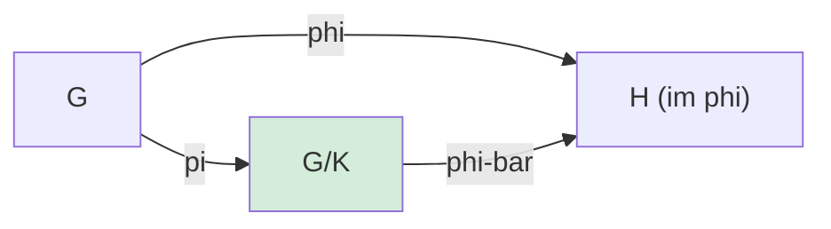
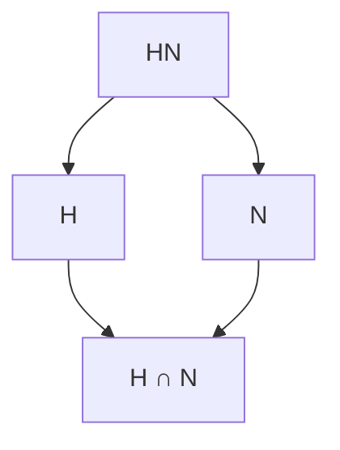

> **Prerequisites**: [[04-cosets-and-lagrange|04. Cosets and Lagrange's Theorem]], [[05-normal-subgroups|05. Normal Subgroups and Quotient Groups]]
> **Objectives**:
> - Định nghĩa đồng cấu nhóm, phân biệt với đẳng cấu, tự đẳng cấu
> - Chứng minh tính chất cơ bản: kernel là nhóm con chuẩn tắc, image là nhóm con
> - Phát biểu và chứng minh ba định lý đẳng cấu (First, Second, Third Isomorphism Theorem)
> - Phát biểu định lý tương ứng (Correspondence/Fourth Isomorphism Theorem)
> - Áp dụng các định lý đẳng cấu để tính nhóm thương cụ thể

---

## Motivation / Intuition

Đồng cấu (homomorphism) là "ánh xạ bảo toàn cấu trúc" giữa hai nhóm. Chúng ta có thể dùng đồng cấu để so sánh, phân loại, và phân tích cấu trúc nhóm mà không cần biết mọi chi tiết nội tại.

Ba định lý đẳng cấu (isomorphism theorems) là bộ công cụ trung tâm: chúng nối liền ba khái niệm cốt lõi — đồng cấu, nhóm con chuẩn tắc, và nhóm thương — thành một bức tranh thống nhất. Về bản chất, tất cả thông tin về một đồng cấu đều được "gói gọn" trong kernel và image của nó.

---

## Đồng cấu nhóm (Group Homomorphism)

### Definition

> [!definition] Definition 6.1 — Đồng cấu nhóm (Group Homomorphism)
> Cho $G$ và $H$ là hai nhóm. Một **đồng cấu nhóm** (group homomorphism) từ $G$ đến $H$ là ánh xạ $\varphi : G \to H$ thỏa:
>
> $$
> \varphi(ab) = \varphi(a)\varphi(b) \quad \forall\, a, b \in G
> $$
>
> Các trường hợp đặc biệt:
>
> - **Đẳng cấu** (isomorphism): $\varphi$ là đồng cấu và là song ánh. Ký hiệu $G \cong H$.
> - **Tự đẳng cấu** (automorphism): đẳng cấu $\varphi : G \to G$.
> - **Nội tự đẳng cấu** (inner automorphism): $\varphi_g : G \to G$, $x \mapsto gxg^{-1}$, với $g \in G$ cố định.
> - **Đơn cấu** (monomorphism): đồng cấu injective.
> - **Toàn cấu** (epimorphism): đồng cấu surjective.
>
> [!abstract] Theorem 6.2 — Tính chất cơ bản của đồng cấu
> Cho $\varphi : G \to H$ là đồng cấu. Khi đó:
>
> 1. $\varphi(e_G) = e_H$.
> 2. $\varphi(a^{-1}) = \varphi(a)^{-1}$ với mọi $a \in G$.
> 3. $\varphi(a^n) = \varphi(a)^n$ với mọi $a \in G$, $n \in \mathbb{Z}$.
> 4. Nếu $\operatorname{ord}(a) = n < \infty$ thì $\operatorname{ord}(\varphi(a)) \mid n$.
> 5. Nếu $K \leq G$ thì $\varphi(K) \leq H$.
> 6. Nếu $L \leq H$ thì $\varphi^{-1}(L) \leq G$.
> 7. Nếu $L \trianglelefteq H$ thì $\varphi^{-1}(L) \trianglelefteq G$.

**Proof.**
(1) $\varphi(e_G) = \varphi(e_G \cdot e_G) = \varphi(e_G)\varphi(e_G)$. Nhân $\varphi(e_G)^{-1}$ vào: $e_H = \varphi(e_G)$.

(2) $\varphi(a)\varphi(a^{-1}) = \varphi(aa^{-1}) = \varphi(e_G) = e_H$, nên $\varphi(a^{-1}) = \varphi(a)^{-1}$.

(4) Từ (3): $\varphi(a)^n = \varphi(a^n) = \varphi(e_G) = e_H$. Theo Theorem 1.19: $\operatorname{ord}(\varphi(a)) \mid n$.

(5)–(7): Kiểm tra tiêu chuẩn nhóm con và chuẩn tắc trực tiếp. $\blacksquare$

### Kernel và Image

> [!definition] Definition 6.3 — Kernel và Image
> Cho $\varphi : G \to H$ là đồng cấu.
>
> - **Kernel**: $\ker \varphi = \left\{ g \in G : \varphi(g) = e_H \right\} = \varphi^{-1}(\{e_H\})$
> - **Image**: $\operatorname{im} \varphi = \varphi(G) = \left\{ \varphi(g) : g \in G \right\}$
>
> [!abstract] Theorem 6.4 — Kernel là nhóm con chuẩn tắc
> Cho $\varphi : G \to H$ là đồng cấu. Khi đó:
>
> 1. $\ker \varphi \trianglelefteq G$.
> 2. $\operatorname{im} \varphi \leq H$.
> 3. $\varphi$ injective $\iff$ $\ker \varphi = \{e_G\}$.

**Proof.**
(1) Theo Theorem 6.2(7) với $L = \{e_H\} \trianglelefteq H$: $\ker \varphi = \varphi^{-1}(\{e_H\}) \trianglelefteq G$.

(2) Theo Theorem 6.2(5): $\operatorname{im} \varphi = \varphi(G) \leq H$.

(3) Nếu $\varphi$ injective và $\varphi(g) = e_H$, thì $\varphi(g) = \varphi(e_G)$, nên $g = e_G$. Ngược lại, nếu $\ker\varphi = \{e_G\}$ và $\varphi(a) = \varphi(b)$: $\varphi(ab^{-1}) = \varphi(a)\varphi(b)^{-1} = e_H$, nên $ab^{-1} \in \ker\varphi = \{e_G\}$, tức $a = b$. $\blacksquare$

> [!example] Example 6.5 — Ví dụ đồng cấu cơ bản
> - **Đồng cấu dấu**: $\operatorname{sgn} : S_n \to \{+1,-1\}$. Kernel = $A_n$, image = $\{+1,-1\}$.
> - **Hình chiếu**: $\pi_1 : G_1 \times G_2 \to G_1$, $(g_1,g_2) \mapsto g_1$. Kernel = $\{e\} \times G_2$.
> - **Mũ hóa**: $\mathbb{Z} \to \mathbb{Z}_n$, $k \mapsto k \bmod n$. Kernel = $n\mathbb{Z}$.
> - **Nội tự đẳng cấu**: $\varphi_g : G \to G$, $x \mapsto gxg^{-1}$. Kernel = $\{e\}$ khi $G$ không Abel.

---

## Ba định lý đẳng cấu

### Định lý đẳng cấu thứ nhất

> [!abstract] Theorem 6.6 — Định lý đẳng cấu thứ nhất (First Isomorphism Theorem)
> Cho $\varphi : G \to H$ là đồng cấu với $K = \ker\varphi$. Khi đó:
>
> $$
> G / K \cong \operatorname{im}\varphi
> $$
>
> Cụ thể, đẳng cấu được cho bởi $\bar{\varphi} : G/K \to \operatorname{im}\varphi$, $gK \mapsto \varphi(g)$.
>
> Hệ quả: $|\operatorname{im}\varphi| = [G : K] = |G|/|K|$ (khi $G$ hữu hạn).

**Proof.**
**Well-defined**: Nếu $gK = g'K$ thì $g'^{-1}g \in K$, nên $\varphi(g'^{-1}g) = e_H$, tức $\varphi(g) = \varphi(g')$.

**Đồng cấu**: $\bar{\varphi}((gK)(g'K)) = \bar{\varphi}(gg'K) = \varphi(gg') = \varphi(g)\varphi(g') = \bar{\varphi}(gK)\bar{\varphi}(g'K)$.

**Injective**: Nếu $\bar{\varphi}(gK) = e_H$ thì $\varphi(g) = e_H$, tức $g \in K$, nên $gK = K$ (phần tử đơn vị của $G/K$).

**Surjective**: Mọi $\varphi(g) \in \operatorname{im}\varphi$ là ảnh của $gK \in G/K$.

Vậy $\bar{\varphi}$ là đẳng cấu. $\blacksquare$



*Sơ đồ giao hoán: $\varphi = \bar{\varphi} \circ \pi$ với $\pi : G \to G/K$ là hình chiếu chính tắc.*

> [!example] Example 6.7 — Ứng dụng định lý thứ nhất
> Xét $\varphi : \mathbb{Z} \to \mathbb{Z}_n$, $k \mapsto k \bmod n$. Khi đó $\ker\varphi = n\mathbb{Z}$ và $\operatorname{im}\varphi = \mathbb{Z}_n$. Định lý thứ nhất cho:
>
> $$
> \mathbb{Z}/n\mathbb{Z} \cong \mathbb{Z}_n
> $$
>
> Đây là lý do hai ký hiệu này được dùng thay thế nhau.

### Định lý đẳng cấu thứ hai

> [!abstract] Theorem 6.8 — Định lý đẳng cấu thứ hai (Second Isomorphism Theorem)
> Cho $H \leq G$ và $N \trianglelefteq G$. Khi đó:
>
> 1. $HN = \left\{ hn : h \in H, n \in N \right\}$ là nhóm con của $G$ và $HN \leq G$.
> 2. $H \cap N \trianglelefteq H$.
> 3. $H/(H \cap N) \cong HN/N$.

**Proof.**
(1) $HN \leq G$: Với $h_1n_1, h_2n_2 \in HN$: $(h_1n_1)(h_2n_2)^{-1} = h_1 n_1 n_2^{-1} h_2^{-1} = h_1 h_2^{-1} (h_2 n_1 n_2^{-1} h_2^{-1})$. Vì $N \trianglelefteq G$: $h_2 n_1 n_2^{-1} h_2^{-1} \in N$. Vậy tích thuộc $HN$.

(2) Với $h \in H$ và $n \in H \cap N$: $hnh^{-1} \in H$ (vì $H \leq G$) và $hnh^{-1} \in N$ (vì $N \trianglelefteq G$). Nên $hnh^{-1} \in H \cap N$.

(3) Xét $\varphi : H \to HN/N$, $h \mapsto hN$. Đây là đồng cấu (hiển nhiên) surjective (mọi $hnN = hN$). Kernel: $h \in \ker\varphi \iff hN = N \iff h \in N \iff h \in H \cap N$. Theo First Isomorphism Theorem: $H/(H \cap N) \cong HN/N$. $\blacksquare$

> [!note] Remark 6.9 — Sơ đồ "kim cương"
> Định lý thứ hai đôi khi gọi là *Diamond Isomorphism Theorem* vì sơ đồ nhóm con tạo hình thoi:



*Hai cạnh song song $HN/N \cong H/(H \cap N)$ — đây là nội dung định lý.*

### Định lý đẳng cấu thứ ba

> [!abstract] Theorem 6.10 — Định lý đẳng cấu thứ ba (Third Isomorphism Theorem)
> Cho $N \trianglelefteq G$ và $M \trianglelefteq G$ với $N \subseteq M$. Khi đó $M/N \trianglelefteq G/N$ và:
>
> $$
> (G/N) \Big/ (M/N) \cong G/M
> $$

**Proof.**
Xét $\varphi : G/N \to G/M$, $gN \mapsto gM$. Well-defined: nếu $gN = g'N$ thì $g'^{-1}g \in N \subseteq M$, nên $gM = g'M$.

$\varphi$ là toàn cấu (surjective hiển nhiên). $\ker\varphi = \{gN : gM = M\} = \{gN : g \in M\} = M/N$.

Theo định lý thứ nhất: $(G/N)/(M/N) \cong G/M$. $\blacksquare$

> [!example] Example 6.11 — Ví dụ định lý thứ ba
> Trong $\mathbb{Z}$: $n\mathbb{Z} \subseteq m\mathbb{Z}$ khi $m \mid n$ (vì $n = mk$). Khi đó:
>
> $$
> (\mathbb{Z}/n\mathbb{Z}) \Big/ (m\mathbb{Z}/n\mathbb{Z}) \cong \mathbb{Z}/m\mathbb{Z}
> $$
>
> Ví dụ: $(\mathbb{Z}/12\mathbb{Z})/(4\mathbb{Z}/12\mathbb{Z}) \cong \mathbb{Z}/4\mathbb{Z}$ (vì $4 \mid 12$).

### Định lý tương ứng (Lattice Theorem)

> [!abstract] Theorem 6.12 — Định lý tương ứng (Correspondence Theorem / Fourth Isomorphism Theorem)
> Cho $N \trianglelefteq G$ và $\pi : G \to G/N$ là hình chiếu chính tắc. Khi đó có song ánh bảo toàn thứ tự bao hàm:
>
> $$
> \left\{ H \leq G : N \subseteq H \right\} \longleftrightarrow \left\{ \bar{H} \leq G/N \right\}
> $$
>
> cho bởi $H \mapsto H/N = \pi(H)$. Hơn nữa:
>
> - $H_1 \subseteq H_2 \iff H_1/N \subseteq H_2/N$
> - $[H_1 : H_2] = [H_1/N : H_2/N]$
> - $H \trianglelefteq G \iff H/N \trianglelefteq G/N$

**Proof.**
Tường minh: $H \mapsto \pi(H) = H/N$ và $\bar{H} \mapsto \pi^{-1}(\bar{H})$ là hai ánh xạ nghịch nhau. Kiểm tra các tính chất còn lại từ định nghĩa. $\blacksquare$

> [!example] Example 6.13 — Nhóm con của $\mathbb{Z}_{12}$ qua Lattice Theorem
> Nhóm con của $\mathbb{Z}_{12}$ tương ứng 1-1 với nhóm con của $\mathbb{Z}_{12}$ chứa $\{0\}$ (tức mọi nhóm con), qua ánh xạ đồng nhất. Nhưng ứng dụng thực sự: nhóm con của $\mathbb{Z}_{12}/\langle 4 \rangle \cong \mathbb{Z}_4$ tương ứng với nhóm con của $\mathbb{Z}_{12}$ chứa $\langle 4 \rangle = \{0,4,8\}$.

---

## Nhóm tự đẳng cấu

> [!definition] Definition 6.14 — Nhóm tự đẳng cấu $\operatorname{Aut}(G)$
> Tập hợp tất cả tự đẳng cấu của $G$, ký hiệu $\operatorname{Aut}(G)$, tạo thành nhóm với phép hợp thành.
>
> **Nội tự đẳng cấu** (inner automorphism): $\operatorname{Inn}(G) = \left\{ \varphi_g : x \mapsto gxg^{-1} \;\middle|\; g \in G \right\}$.
>
> Ta có $\operatorname{Inn}(G) \trianglelefteq \operatorname{Aut}(G)$ và $\operatorname{Inn}(G) \cong G/Z(G)$.

---

## SageMath Cheatsheet

```sage
G = SymmetricGroup(4)
A4 = AlternatingGroup(4)
phi = G.hom([A4.an_element()] * G.ngens())

G = CyclicPermutationGroup(12)
H = G.subgroup([G.gen(0)**4])
G.quotient(H)

G = SymmetricGroup(4)
G.automorphism_group()

G = CyclicPermutationGroup(6)
H = CyclicPermutationGroup(2)
H_embed = G.subgroup([G.gen(0)**3])
G.quotient(H_embed).order()
```

---

## Summary / Key Takeaways

- Đồng cấu $\varphi : G \to H$: bảo toàn phép toán; gửi $e_G \to e_H$, $a^{-1} \to \varphi(a)^{-1}$.
- $\ker\varphi \trianglelefteq G$; $\operatorname{im}\varphi \leq H$; $\varphi$ injective $\iff$ $\ker\varphi = \{e\}$.
- **Định lý I**: $G/\ker\varphi \cong \operatorname{im}\varphi$ — mọi đồng cấu "phân tích" qua nhóm thương.
- **Định lý II** (Diamond): $H/(H \cap N) \cong HN/N$ với $H \leq G$, $N \trianglelefteq G$.
- **Định lý III**: $(G/N)/(M/N) \cong G/M$ với $N \subseteq M \trianglelefteq G$.
- **Định lý IV** (Lattice): nhóm con của $G/N$ tương ứng 1-1 với nhóm con của $G$ chứa $N$.
- $\operatorname{Aut}(G)$ là nhóm; $\operatorname{Inn}(G) \trianglelefteq \operatorname{Aut}(G)$ và $G/Z(G) \cong \operatorname{Inn}(G)$.

---

## References

- Dummit, D. S., & Foote, R. M. *Abstract Algebra* (3rd ed.), §3.1–3.3.
- Hungerford, T. W. *Algebra*, Chapter I §§5–6.
- Lang, S. *Algebra* (Revised 3rd ed.), Chapter I §§5–6.
- Milne, J. S. *Group Theory* (v4.00), Chapter 1. https://www.jmilne.org/math/CourseNotes/GT.pdf
