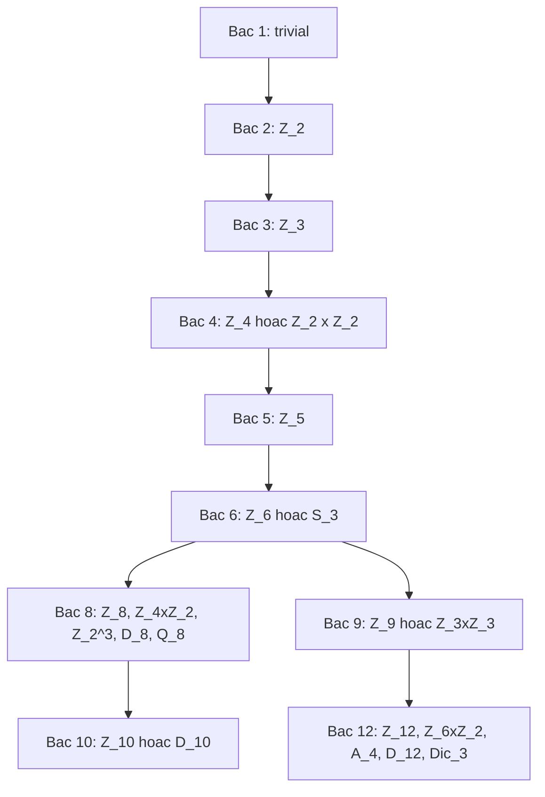

> **Prerequisites**: [[05-normal-subgroups|05. Normal Subgroups and Quotient Groups]], [[06-group-homomorphisms|06. Group Homomorphisms]]
> **Objectives**:
> - Xây dựng tích trực tiếp ngoài và nhận diện tích trực tiếp trong
> - Phát biểu và chứng minh Định lý cơ bản về nhóm Abel hữu hạn (FTFAG)
> - Định nghĩa tích nửa trực tiếp (semidirect product) và phân biệt với tích trực tiếp
> - Phân loại nhóm bậc nhỏ bằng công cụ Sylow và tích nửa trực tiếp

---

## Motivation / Intuition

Sau khi hiểu nhóm con và nhóm thương, câu hỏi ngược lại là: **biết các "mảnh" $N$ và $Q = G/N$, ta có thể phục hồi $G$ không?** Câu trả lời phụ thuộc vào cách $Q$ "tác động" lên $N$.

Nếu $Q$ tác động trivially ($Q$ không làm gì với $N$), ta nhận được **tích trực tiếp** — cấu trúc đơn giản nhất. Nếu $Q$ tác động không trivially bằng cách tự đẳng cấu, ta nhận được **tích nửa trực tiếp** — bao quát nhiều nhóm không Abel.

Ví dụ: $D_{2n} = \mathbb{Z}_n \rtimes \mathbb{Z}_2$ (phép phản xạ đảo ngược phép quay), $S_3 = \mathbb{Z}_3 \rtimes \mathbb{Z}_2$. Bộ công cụ này, kết hợp với Sylow, cho phép phân loại hoàn toàn nhóm bậc nhỏ.

---

## Tích trực tiếp ngoài (External Direct Product)

> [!definition] Definition 9.1 — Tích trực tiếp ngoài
> Cho $G_1, G_2, \ldots, G_n$ là các nhóm. **Tích trực tiếp ngoài** là:
>
> $$
> G_1 \times G_2 \times \cdots \times G_n = \left\{ (g_1, g_2, \ldots, g_n) : g_i \in G_i \right\}
> $$
>
> với phép toán theo thành phần: $(a_1, \ldots, a_n)(b_1, \ldots, b_n) = (a_1 b_1, \ldots, a_n b_n)$.
>
> Phần tử đơn vị: $(e_1, \ldots, e_n)$. Nghịch đảo: $(g_1, \ldots, g_n)^{-1} = (g_1^{-1}, \ldots, g_n^{-1})$.
>
> [!abstract] Theorem 9.2 — Bậc phần tử trong tích trực tiếp
> Bậc của $(g_1, \ldots, g_n) \in G_1 \times \cdots \times G_n$ là:
>
> $$
> \operatorname{ord}(g_1, \ldots, g_n) = \operatorname{lcm}(\operatorname{ord}(g_1), \ldots, \operatorname{ord}(g_n))
> $$
>
> [!example] Example 9.3 — Phân biệt $\mathbb{Z}_4$ và $\mathbb{Z}_2 \times \mathbb{Z}_2$
> Cả hai đều có bậc $4$, nhưng không đẳng cấu:
>
> - $\mathbb{Z}_4$ có phần tử bậc $4$ (phần tử sinh $1$).
> - $\mathbb{Z}_2 \times \mathbb{Z}_2$: mọi phần tử có bậc $\leq 2$ (vì $\operatorname{lcm}(2,2) = 2$). Không có phần tử sinh, nhóm này không cyclic.

---

## Tích trực tiếp trong (Internal Direct Product)

> [!definition] Definition 9.4 — Tích trực tiếp trong (Internal Direct Product)
> Nhóm $G$ gọi là **tích trực tiếp trong** của các nhóm con $H_1, \ldots, H_n$ nếu:
>
> 1. $H_i \trianglelefteq G$ với mọi $i$.
> 2. $G = H_1 H_2 \cdots H_n$ (mọi phần tử $g = h_1 h_2 \cdots h_n$).
> 3. $H_i \cap (H_1 \cdots \hat{H}_i \cdots H_n) = \{e\}$ với mọi $i$ (các $H_i$ cắt nhau tầm thường).
>
> Ký hiệu: $G = H_1 \times H_2 \times \cdots \times H_n$ (nội).
>
> [!abstract] Theorem 9.5 — Tiêu chuẩn tích trực tiếp trong (hai thành phần)
> $G = H \times K$ (trong) khi và chỉ khi:
>
> 1. $H, K \trianglelefteq G$.
> 2. $G = HK$.
> 3. $H \cap K = \{e\}$.
>
> Trong trường hợp này, $G \cong H \times K$ (ngoài).

**Proof.**
Chứng minh phần tử của $HK$ viết được duy nhất: nếu $h_1 k_1 = h_2 k_2$ thì $h_2^{-1}h_1 = k_2 k_1^{-1} \in H \cap K = \{e\}$. Vì $H, K$ chuẩn tắc: $hk = kh$ với mọi $h \in H$, $k \in K$ (từ $hkh^{-1}k^{-1} \in H \cap K = \{e\}$). Đẳng cấu: $H \times K \to G$, $(h,k) \mapsto hk$ là đồng cấu song ánh. $\blacksquare$

> [!example] Example 9.6 — Nhóm Klein là tích trực tiếp
> $V_4 = \{e, a, b, ab\}$ với $a^2 = b^2 = e$, $ab = ba$.
>
> $H = \{e, a\} \cong \mathbb{Z}_2$ và $K = \{e, b\} \cong \mathbb{Z}_2$. Kiểm tra ba điều kiện:
> $H, K \trianglelefteq V_4$ ✓, $V_4 = HK$ ✓, $H \cap K = \{e\}$ ✓.
>
> Vậy $V_4 \cong \mathbb{Z}_2 \times \mathbb{Z}_2$.

---

## Định lý cơ bản về nhóm Abel hữu hạn (FTFAG)

> [!abstract] Theorem 9.7 — Định lý cơ bản về nhóm Abel hữu hạn (FTFAG)
> Mọi nhóm Abel hữu hạn $G$ đẳng cấu với tích trực tiếp các nhóm cyclic có bậc là lũy thừa nguyên tố:
>
> $$
> G \cong \mathbb{Z}_{p_1^{a_1}} \times \mathbb{Z}_{p_2^{a_2}} \times \cdots \times \mathbb{Z}_{p_k^{a_k}}
> $$
>
> trong đó $p_i$ là nguyên tố (không nhất thiết phân biệt) và phân tích này là duy nhất (đến hoán vị thứ tự).
>
> Tương đương (**dạng bất biến**): $G \cong \mathbb{Z}_{d_1} \times \mathbb{Z}_{d_2} \times \cdots \times \mathbb{Z}_{d_t}$ trong đó $d_1 \mid d_2 \mid \cdots \mid d_t$.
>
> [!example] Example 9.8 — Phân loại nhóm Abel bậc $360$
> $360 = 2^3 \cdot 3^2 \cdot 5$. Các nhóm Abel phân biệt theo FTFAG:
>
> - $\mathbb{Z}_8 \times \mathbb{Z}_9 \times \mathbb{Z}_5$
> - $\mathbb{Z}_4 \times \mathbb{Z}_2 \times \mathbb{Z}_9 \times \mathbb{Z}_5$
> - $\mathbb{Z}_2^3 \times \mathbb{Z}_9 \times \mathbb{Z}_5$
> - $\mathbb{Z}_8 \times \mathbb{Z}_3^2 \times \mathbb{Z}_5$
> - $\mathbb{Z}_4 \times \mathbb{Z}_2 \times \mathbb{Z}_3^2 \times \mathbb{Z}_5$
> - $\mathbb{Z}_2^3 \times \mathbb{Z}_3^2 \times \mathbb{Z}_5$
>
> Tổng: $3$ phân hoạch của $3$ (từ $2^3$) $\times$ $2$ phân hoạch của $2$ (từ $3^2$) $\times$ $1$ = $6$ nhóm Abel bậc $360$.
>
> [!abstract] Theorem 9.9 — Điều kiện cyclic cho tích trực tiếp
> $\mathbb{Z}_m \times \mathbb{Z}_n \cong \mathbb{Z}_{mn} \iff \gcd(m, n) = 1$.

**Proof.**
Phần tử $(1, 1)$ có bậc $\operatorname{lcm}(m, n)$. Nếu $\gcd(m,n) = 1$ thì $\operatorname{lcm}(m,n) = mn$, nên $(1,1)$ là phần tử sinh. Chiều đảo: nếu $\gcd(m,n) = d > 1$ thì mọi phần tử $(a,b)$ thỏa $(mn/d)(a,b) = e$, nên bậc tối đa $< mn$. $\blacksquare$

---

## Tích nửa trực tiếp (Semidirect Product)

### Định nghĩa

> [!definition] Definition 9.10 — Tích nửa trực tiếp ngoài
> Cho $N$ và $H$ là hai nhóm và $\varphi : H \to \operatorname{Aut}(N)$ là đồng cấu. **Tích nửa trực tiếp ngoài** $N \rtimes_\varphi H$ là tập $N \times H$ với phép toán:
>
> $$
> (n_1, h_1)(n_2, h_2) = (n_1 \cdot \varphi(h_1)(n_2),\; h_1 h_2)
> $$
>
> Phần tử đơn vị: $(e_N, e_H)$. Nghịch đảo: $(n, h)^{-1} = (\varphi(h^{-1})(n^{-1}),\; h^{-1})$.
>
> Khi $\varphi$ trivial ($\varphi(h) = \operatorname{id}_N$ với mọi $h$): $N \rtimes H = N \times H$ (tích trực tiếp).
>
> [!note] Remark 9.11 — Nhúng tự nhiên
> Trong $G = N \rtimes_\varphi H$:
>
> - $\bar{N} = \{(n, e_H) : n \in N\} \cong N$ và $\bar{N} \trianglelefteq G$.
> - $\bar{H} = \{(e_N, h) : h \in H\} \cong H$ và $\bar{H} \leq G$ (không nhất thiết chuẩn tắc).
> - $G = \bar{N}\bar{H}$, $\bar{N} \cap \bar{H} = \{e\}$.
> - Liên hợp: $(e_N, h)(n, e_H)(e_N, h)^{-1} = (\varphi(h)(n), e_H)$.
>
> [!definition] Definition 9.12 — Tích nửa trực tiếp trong
> $G$ là **tích nửa trực tiếp trong** của $N$ và $H$ nếu:
>
> 1. $N \trianglelefteq G$.
> 2. $G = NH$.
> 3. $N \cap H = \{e\}$.
>
> Trong trường hợp này, $G \cong N \rtimes_\varphi H$ với $\varphi(h)(n) = hnh^{-1}$.
>
> [!warning] Counterexample 9.13 — Tích nửa trực tiếp phụ thuộc $\varphi$
> Với $N = \mathbb{Z}_3$ và $H = \mathbb{Z}_2$, $\operatorname{Aut}(\mathbb{Z}_3) \cong \mathbb{Z}_2 = \{1, \sigma\}$ với $\sigma(k) = -k$.
>
> - $\varphi$ trivial: $\mathbb{Z}_3 \times \mathbb{Z}_2 \cong \mathbb{Z}_6$.
> - $\varphi$ không trivial ($\varphi(1) = \sigma$): $\mathbb{Z}_3 \rtimes \mathbb{Z}_2 \cong S_3$.
>
> Cùng $N$ và $H$ nhưng cho hai nhóm không đẳng cấu!

### Ví dụ tích nửa trực tiếp quan trọng

> [!example] Example 9.14 — Nhóm dihedral $D_{2n}$
> $D_{2n} = \mathbb{Z}_n \rtimes_\varphi \mathbb{Z}_2$ với $\varphi(1)(k) = -k$ (phản xạ đảo ngược phép quay).
>
> Biểu diễn: $D_{2n} = \langle r, s \mid r^n = s^2 = e,\; srs^{-1} = r^{-1} \rangle$.
>
> Cấu trúc: $N = \langle r \rangle \cong \mathbb{Z}_n$ (nhóm quay), $H = \langle s \rangle \cong \mathbb{Z}_2$ (phản xạ), $|D_{2n}| = 2n$.
>
> [!example] Example 9.15 — Phân loại nhóm bậc $pq$ ($p < q$, $p \mid q-1$)
> Trường hợp này cho phép $\varphi$ không trivial. $\operatorname{Aut}(\mathbb{Z}_q) \cong \mathbb{Z}_{q-1}$ có phần tử bậc $p$ (vì $p \mid q-1$). Gọi $\theta$ là tự đẳng cấu bậc $p$ của $\mathbb{Z}_q$.
>
> Khi đó $\mathbb{Z}_q \rtimes_\varphi \mathbb{Z}_p$ (với $\varphi(1) = \theta$) là nhóm không Abel bậc $pq$.
>
> **Kết quả phân loại**: Có đúng hai nhóm bậc $pq$ (đến đẳng cấu): $\mathbb{Z}_{pq}$ (Abel) và $\mathbb{Z}_q \rtimes \mathbb{Z}_p$ (không Abel).

---

## Phân loại nhóm bậc nhỏ (tổng hợp)



*Tổng quan phân loại nhóm bậc $\leq 12$. Các bậc nguyên tố chỉ có một nhóm cyclic.*

| $|G|$ | Số nhóm | Danh sách |
|-------|---------|-----------|
| $1$ | $1$ | $\{e\}$ |
| $2$ | $1$ | $\mathbb{Z}_2$ |
| $3$ | $1$ | $\mathbb{Z}_3$ |
| $4$ | $2$ | $\mathbb{Z}_4$, $V_4$ |
| $5$ | $1$ | $\mathbb{Z}_5$ |
| $6$ | $2$ | $\mathbb{Z}_6$, $S_3$ |
| $7$ | $1$ | $\mathbb{Z}_7$ |
| $8$ | $5$ | $\mathbb{Z}_8$, $\mathbb{Z}_4 \times \mathbb{Z}_2$, $\mathbb{Z}_2^3$, $D_8$, $Q_8$ |
| $9$ | $2$ | $\mathbb{Z}_9$, $\mathbb{Z}_3^2$ |
| $10$ | $2$ | $\mathbb{Z}_{10}$, $D_{10}$ |
| $12$ | $5$ | $\mathbb{Z}_{12}$, $\mathbb{Z}_6 \times \mathbb{Z}_2$, $A_4$, $D_{12}$, $\operatorname{Dic}_3$ |

> [!note] Remark 9.16 — Nhóm Quaternion $Q_8$
> $Q_8 = \{\pm 1, \pm i, \pm j, \pm k\}$ với $i^2 = j^2 = k^2 = -1$, $ij = k$. Đây là nhóm bậc $8$ không đẳng cấu với $D_8$ dù cả hai đều không Abel và có center bậc $2$. Phân biệt: $D_8$ có $5$ phần tử bậc $2$; $Q_8$ chỉ có $1$ phần tử bậc $2$ (là $-1$).

---

## SageMath Cheatsheet

```sage
G1 = CyclicPermutationGroup(4)
G2 = CyclicPermutationGroup(2)
G = direct_product_permgroups([G1, G2])
G.order()

G = AbelianGroup([4, 3, 5])
G.invariants()

G = AbelianGroup([12])
G.is_isomorphic(AbelianGroup([4, 3]))

N = CyclicPermutationGroup(3)
H = CyclicPermutationGroup(2)
G = direct_product_permgroups([N, H])
G.order()

G = DihedralGroup(4)
G.semidirect_product

groups.presentation.DiCyclic(3).order()
```

---

## Summary / Key Takeaways

- **Tích trực tiếp ngoài** $G_1 \times G_2$: phép toán theo thành phần; bậc phần tử là lcm.
- **Tiêu chuẩn tích trực tiếp trong**: $N,K \trianglelefteq G$, $G=NK$, $N \cap K = \{e\}$.
- $\mathbb{Z}_m \times \mathbb{Z}_n \cong \mathbb{Z}_{mn} \iff \gcd(m,n) = 1$.
- **FTFAG**: mọi nhóm Abel hữu hạn là tích trực tiếp nhóm cyclic lũy thừa nguyên tố; phân tích duy nhất.
- **Tích nửa trực tiếp** $N \rtimes_\varphi H$: tổng quát hóa tích trực tiếp với action $\varphi : H \to \operatorname{Aut}(N)$.
- $\varphi$ trivial $\Rightarrow$ tích trực tiếp; $\varphi$ không trivial $\Rightarrow$ nhóm không Abel mới.
- $D_{2n} = \mathbb{Z}_n \rtimes \mathbb{Z}_2$; $S_3 = \mathbb{Z}_3 \rtimes \mathbb{Z}_2$.
- Phân loại nhóm bậc $pq$: $\mathbb{Z}_{pq}$ (Abel) và $\mathbb{Z}_q \rtimes \mathbb{Z}_p$ (không Abel, khi $p \mid q-1$).

---

## References

- Dummit, D. S., & Foote, R. M. *Abstract Algebra* (3rd ed.), Chapter 5.
- Hungerford, T. W. *Algebra*, Chapter II §8.
- Lang, S. *Algebra* (Revised 3rd ed.), Chapter I §§10–11.
- Milne, J. S. *Group Theory* (v4.00), Chapter 6. https://www.jmilne.org/math/CourseNotes/GT.pdf
