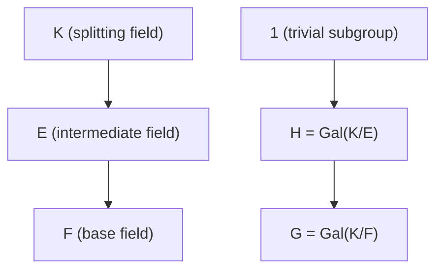
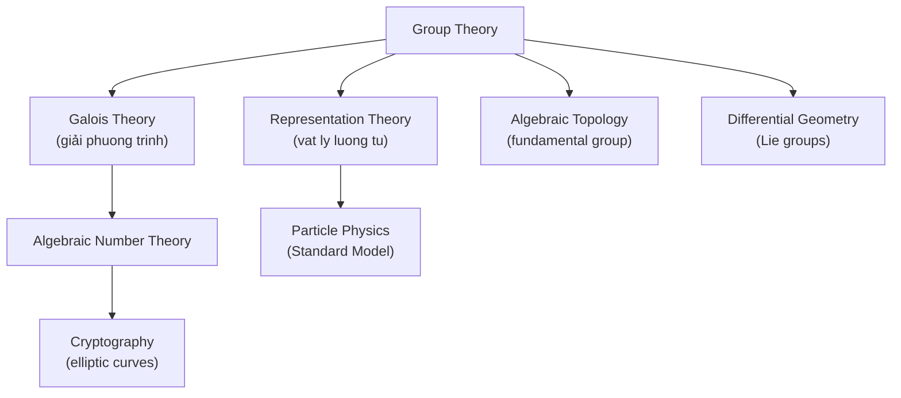

> **Prerequisites**: [[10-composition-series|10. Composition Series and Solvable Groups]], [[12-representation-theory|12. Introduction to Representation Theory]]
> **Objectives**:
> - Hiểu bài toán giải phương trình bằng căn thức và tại sao lý thuyết nhóm là câu trả lời
> - Định nghĩa extension trường và nhóm Galois
> - Phát biểu định lý cơ bản của lý thuyết Galois (Fundamental Theorem of Galois Theory)
> - Chứng minh $S_5$ không giải được, suy ra phương trình bậc 5 không giải bằng căn
> - Nhận diện đây là "đích đến" của toàn bộ roadmap Group Theory

---

## Motivation / Intuition

Toàn bộ roadmap Group Theory này có một đích đến lịch sử: **tại sao không có công thức nghiệm cho phương trình bậc $\geq 5$?**

Galois (1832, ở tuổi 20, đêm trước khi bị bắn chết trong cuộc đấu súng) đã viết ra câu trả lời: khả năng giải phương trình $f(x) = 0$ bằng căn thức tương đương với nhóm $\operatorname{Gal}(f)$ (nhóm các tự đẳng cấu trường của nghiệm) là **giải được**. Và vì $S_5$ không giải được, phương trình bậc 5 tổng quát không có nghiệm bằng căn.

Bài này là bản đồ toàn cảnh — ta sẽ không chứng minh tất cả, nhưng sẽ thấy **lý thuyết nhóm chạm đến lý thuyết trường ở đâu và như thế nào**.

---

## Bài toán giải phương trình bằng căn thức

> [!definition] Definition 13.1 — Giải được bằng căn thức (Solvable by Radicals)
> Phương trình $f(x) = 0$ (với $f \in \mathbb{Q}[x]$) gọi là **giải được bằng căn thức** nếu mọi nghiệm đều thuộc một trường $K$ xây dựng từ $\mathbb{Q}$ bằng cách lần lượt adjoin các căn:
>
> $$
> \mathbb{Q} = F_0 \subseteq F_1 \subseteq \cdots \subseteq F_m = K
> $$
>
> trong đó $F_{i+1} = F_i(\alpha_i)$ với $\alpha_i^{n_i} \in F_i$ cho một $n_i$ nào đó.
>
> **Ví dụ**: Công thức nghiệm bậc hai $x = \frac{-b \pm \sqrt{b^2 - 4ac}}{2a}$ — đây là adjoin $\sqrt{b^2 - 4ac}$ vào $\mathbb{Q}(a,b,c)$.

---

## Lý thuyết trường và Extension

> [!definition] Definition 13.2 — Extension trường và độ (Degree)
> Cho $K \supseteq F$ là extension trường. **Độ** $[K : F] = \dim_F K$ (chiều $K$ như $F$-không gian vector).
>
> Extension gọi là:
>
> - **Algebraic**: mọi $\alpha \in K$ thỏa đa thức $f \in F[x]$ nào đó.
> - **Normal**: là splitting field của một đa thức trong $F[x]$.
> - **Separable**: mọi phần tử algebraic có minimal polynomial không có nghiệm bội.
> - **Galois extension**: vừa normal vừa separable.
>
> [!definition] Definition 13.3 — Nhóm Galois (Galois Group)
> Cho $K/F$ là extension trường. **Nhóm Galois** của $K$ trên $F$:
>
> $$
> \operatorname{Gal}(K/F) = \operatorname{Aut}_F(K) = \left\{ \sigma : K \to K \text{ tự đẳng cấu trường} : \sigma|_F = \operatorname{id}_F \right\}
> $$
>
> với phép hợp thành.
>
> Nếu $K/F$ là Galois extension, thì $|\operatorname{Gal}(K/F)| = [K : F]$.
>
> [!example] Example 13.4 — Galois group của $x^2 - 2$
> $f(x) = x^2 - 2 \in \mathbb{Q}[x]$. Splitting field: $K = \mathbb{Q}(\sqrt{2})$. $[K:\mathbb{Q}] = 2$.
>
> $\operatorname{Gal}(K/\mathbb{Q}) = \{e, \sigma\}$ với $\sigma(\sqrt{2}) = -\sqrt{2}$. Vậy $\operatorname{Gal}(\mathbb{Q}(\sqrt{2})/\mathbb{Q}) \cong \mathbb{Z}_2$.
>
> [!example] Example 13.5 — Galois group của $x^n - 1$
> $f(x) = x^n - 1$. Splitting field: $\mathbb{Q}(\zeta_n)$ với $\zeta_n = e^{2\pi i/n}$.
>
> $\operatorname{Gal}(\mathbb{Q}(\zeta_n)/\mathbb{Q}) \cong (\mathbb{Z}/n\mathbb{Z})^* = \mathbb{Z}_n^*$, bậc $\varphi(n)$.
>
> Tự đẳng cấu: $\sigma_k(\zeta_n) = \zeta_n^k$ với $\gcd(k,n) = 1$.

---

## Định lý cơ bản của lý thuyết Galois

> [!abstract] Theorem 13.6 — Định lý cơ bản (Fundamental Theorem of Galois Theory)
> Cho $K/F$ là Galois extension hữu hạn với $G = \operatorname{Gal}(K/F)$. Khi đó có **song ánh đảo ngược thứ tự**:
>
> $$
> \left\{ \text{trường trung gian } F \subseteq E \subseteq K \right\} \longleftrightarrow \left\{ \text{nhóm con } H \leq G \right\}
> $$
>
> cho bởi $E \mapsto \operatorname{Gal}(K/E)$ và $H \mapsto K^H = \left\{ x \in K : \sigma(x) = x\;\forall \sigma \in H \right\}$.
>
> Hơn nữa:
>
> - $[E : F] = [G : H]$ và $[K : E] = |H|$.
> - $E/F$ là Galois $\iff$ $H \trianglelefteq G$, và khi đó $\operatorname{Gal}(E/F) \cong G/H$.



*Tương ứng Galois: đảo ngược thứ tự bao hàm giữa trường trung gian và nhóm con.*

---

## Định lý Galois về giải phương trình

> [!abstract] Theorem 13.7 — Định lý Galois (Galois's Theorem)
> Cho $f(x) \in \mathbb{Q}[x]$ là đa thức không khả quy. Gọi $K$ là splitting field của $f$ trên $\mathbb{Q}$ và $G = \operatorname{Gal}(K/\mathbb{Q})$.
>
> Khi đó:
>
> $$
> f \text{ giải được bằng căn thức} \iff G \text{ là nhóm giải được}
> $$

**Proof sketch.**
($\Rightarrow$) Nếu $f$ giải được bằng căn thức qua tower $\mathbb{Q} = F_0 \subseteq F_1 \subseteq \cdots \subseteq F_m$, thì mỗi bước $F_{i+1} = F_i(\alpha_i)$ với $\alpha_i^{n_i} \in F_i$ tương ứng với adjoin root of unity rồi $n_i$-th root. Nhóm Galois của mỗi bước là cyclic (vì $\mathbb{Z}_{n_i}$), và tổ hợp cho chuỗi giải được của $G$.

($\Leftarrow$) Nếu $G$ giải được, từ chuỗi $G = G_0 \supset G_1 \supset \cdots \supset \{e\}$ với nhân tử cyclic, ta xây dựng tower trường tương ứng — mỗi bước là adjoin căn $n$-th. $\blacksquare$

---

## $S_5$ không giải được — Phương trình bậc 5

> [!abstract] Theorem 13.8 — $S_5$ không giải được
> $S_5$ không phải nhóm giải được.

**Proof.**
Chuỗi hợp thành của $S_5$: $S_5 \supset A_5 \supset \{e\}$. Nhân tử $S_5/A_5 \cong \mathbb{Z}_2$ (Abel), nhưng $A_5/\{e\} \cong A_5$ là nhóm đơn không Abel ($|A_5| = 60$). Vậy chuỗi này không phải chuỗi giải được.

Vì Jordan–Hölder đảm bảo mọi chuỗi hợp thành đều cho nhân tử $A_5$, không có chuỗi nào cho mọi nhân tử Abel. Vậy $S_5$ không giải được. $\blacksquare$

> [!abstract] Theorem 13.9 — Phương trình bậc 5 không giải được bằng căn thức (Abel–Ruffini)
> Tồn tại đa thức bậc $5$ với hệ số hữu tỉ mà nghiệm không thể biểu diễn bằng căn thức.

**Proof.**
Lấy $f(x) = x^5 - 5x + 12$ (hay nhiều đa thức khác có Galois group $= S_5$). Vì $S_5$ không giải được, theo Định lý 13.7, $f$ không giải được bằng căn thức. $\blacksquare$

> [!example] Example 13.10 — Các bậc thấp hơn đều giải được
>
> | Bậc | Galois group (tổng quát) | Giải được? | Công thức |
> |-----|--------------------------|------------|-----------|
> | $1$ | $\{e\}$ | ✓ | $x = -b/a$ |
> | $2$ | $\mathbb{Z}_2$ | ✓ | Công thức bậc hai |
> | $3$ | $S_3$ (giải được) | ✓ | Công thức Cardano |
> | $4$ | $S_4$ (giải được) | ✓ | Công thức Ferrari |
> | $\geq 5$ | $S_n$ (không giải được) | ✗ | Không tồn tại |

---

## Ứng dụng: nhóm Galois của các đa thức cụ thể

> [!example] Example 13.11 — Galois group của $x^3 - 2$
> Splitting field: $\mathbb{Q}(\sqrt[3]{2}, \omega)$ với $\omega = e^{2\pi i/3}$.
>
> $[K:\mathbb{Q}] = 6$, nên $|\operatorname{Gal}(K/\mathbb{Q})| = 6$.
>
> $\operatorname{Gal}(K/\mathbb{Q}) \cong S_3$ (nhóm phép đối xứng ba nghiệm $\sqrt[3]{2}, \omega\sqrt[3]{2}, \omega^2\sqrt[3]{2}$).
>
> $S_3$ giải được, nên $x^3 - 2$ giải được bằng căn (và công thức Cardano cho nghiệm).
>
> [!example] Example 13.12 — Đa thức cyclotomic
> $\Phi_p(x) = x^{p-1} + x^{p-2} + \cdots + 1$ (đa thức cyclotomic cho số nguyên tố $p$).
>
> $\operatorname{Gal}(\mathbb{Q}(\zeta_p)/\mathbb{Q}) \cong \mathbb{Z}_{p-1}$ (cyclic, giải được).
>
> Hệ quả: có thể xây dựng hình $p$-giác đều bằng thước và compa $\iff$ $p$ là số nguyên tố Fermat ($p = 2^{2^k} + 1$). Gauss đã xây dựng hình 17-giác đều bằng thước và compa dựa trên việc $17 - 1 = 16 = 2^4$ là lũy thừa của $2$.

---

## Bức tranh toàn cảnh: lý thuyết nhóm trong toán học



*Group Theory là trung tâm kết nối nhiều nhánh toán học và vật lý hiện đại.*

---

## SageMath Cheatsheet

```sage
R.<x> = QQ[]
f = x^3 - 2
K = f.splitting_field('a')
G = K.galois_group()
G.order()
G.is_solvable()

f = x^5 - 5*x + 12
K = f.splitting_field('a')
G = K.galois_group()
G.order()
G.is_solvable()

R.<x> = QQ[]
f = cyclotomic_polynomial(7)
K = f.splitting_field('z')
G = K.galois_group()
G.is_abelian()
```

---

## Summary / Key Takeaways

- **Nhóm Galois** $\operatorname{Gal}(K/F)$: nhóm tự đẳng cấu của $K$ cố định $F$; $|\operatorname{Gal}| = [K:F]$ với Galois extension.
- **Định lý cơ bản Galois**: tương ứng đảo ngược giữa trường trung gian và nhóm con; subfield bình thường $\leftrightarrow$ normal subgroup.
- **Định lý Galois**: $f$ giải được bằng căn $\iff$ $\operatorname{Gal}(f)$ là nhóm giải được.
- $S_n$ không giải được với $n \geq 5$ (vì $A_n$ đơn không Abel).
- Phương trình bậc $1$–$4$: giải được (Galois group là nhóm giải được).
- Phương trình bậc $\geq 5$: **không có công thức nghiệm tổng quát**.
- Đây là điểm hội tụ của: nhóm giải được (Bài 10) + nhóm đơn $A_n$ (Bài 03) + đồng cấu (Bài 06) + nhóm cyclic (Bài 02).

---

## References

- Dummit, D. S., & Foote, R. M. *Abstract Algebra* (3rd ed.), Chapters 13–14.
- Lang, S. *Algebra* (Revised 3rd ed.), Chapters V–VI.
- Milne, J. S. *Fields and Galois Theory* (v5.10). https://www.jmilne.org/math/CourseNotes/FT.pdf
- Stewart, I. *Galois Theory* (4th ed.). CRC Press.
