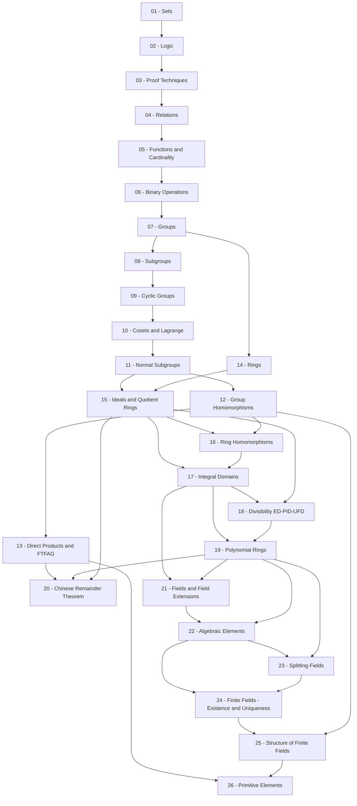

**Groups, Rings, and Fields** là khóa học đại số trừu tượng (abstract algebra) bậc đại học, bắt đầu từ nền tảng toán học phổ thông. Khóa học xây dựng tuần tự ba cấu trúc đại số nền tảng — Nhóm (Groups), Vành (Rings), Trường (Fields) — cùng các định lý cốt lõi chi phối chúng.

**Kiến thức nền tảng yêu cầu**: Số học phổ thông (số nguyên, ước chung, modulo), tư duy logic cơ bản.

**Tài liệu tham khảo chính**: Dummit & Foote *Abstract Algebra*, Hungerford *Algebra*, Lang *Algebra*, Judson *Abstract Algebra: Theory and Applications*, Velleman *How to Prove It*.

---

## Lesson Overview

### Part 0 — Mathematical Foundations · 5 bài

| # | Title | Type | File | Dependencies |
|---|-------|------|------|-------------|
| 01 | Sets and Set Operations | Math Component | [[01-sets\|01. Sets and Set Operations]] | — |
| 02 | Propositional and Predicate Logic | Math Component | [[02-logic\|02. Propositional and Predicate Logic]] | 01 |
| 03 | Proof Techniques | Math Component | [[03-proof-techniques\|03. Proof Techniques]] | 01, 02 |
| 04 | Relations — Equivalence and Order | Math Component | [[04-relations\|04. Relations — Equivalence and Order]] | 01, 02, 03 |
| 05 | Functions, Cardinality, and Counting | Math Component | [[05-functions-cardinality\|05. Functions, Cardinality, and Counting]] | 01, 02, 03, 04 |

### Transition — Algebraic Preliminaries · 1 bài

| # | Title | Type | File | Dependencies |
|---|-------|------|------|-------------|
| 06 | Binary Operations, Magmas, Semigroups, and Monoids | Math Component | [[06-binary-operations\|06. Binary Operations, Magmas, Semigroups, and Monoids]] | 01–05 |

### Part I — Group Theory · 7 bài

| # | Title | Type | File | Dependencies |
|---|-------|------|------|-------------|
| 07 | Groups and Basic Properties | Math Component | [[07-groups-and-basic-properties\|07. Groups and Basic Properties]] | 06 |
| 08 | Subgroups and Generators | Math Component | [[08-subgroups-and-generators\|08. Subgroups and Generators]] | 07 |
| 09 | Cyclic Groups and Order of Elements | Math Component | [[09-cyclic-groups-and-order-of-elements\|09. Cyclic Groups and Order of Elements]] | 08 |
| 10 | Cosets and Lagrange's Theorem | Math Component | [[10-cosets-and-lagranges-theorem\|10. Cosets and Lagrange's Theorem]] | 09 |
| 11 | Normal Subgroups and Quotient Groups | Math Component | [[11-normal-subgroups-and-quotient-groups\|11. Normal Subgroups and Quotient Groups]] | 10 |
| 12 | Group Homomorphisms and Isomorphism Theorems | Math Component | [[12-group-homomorphisms-and-isomorphism-theorems\|12. Group Homomorphisms and Isomorphism Theorems]] | 11 |
| 13 | Direct Products and the Fundamental Theorem of Finite Abelian Groups | Math Component | [[13-direct-products-and-ftfag\|13. Direct Products and the Fundamental Theorem of Finite Abelian Groups]] | 12 |

### Part II — Ring Theory · 7 bài

| # | Title | Type | File | Dependencies |
|---|-------|------|------|-------------|
| 14 | Rings and Basic Properties | Math Component | [[14-rings-and-basic-properties\|14. Rings and Basic Properties]] | 07 |
| 15 | Ideals and Quotient Rings | Math Component | [[15-ideals-and-quotient-rings\|15. Ideals and Quotient Rings]] | 14, 11 |
| 16 | Ring Homomorphisms and Isomorphism Theorems | Math Component | [[16-ring-homomorphisms-and-isomorphism-theorems\|16. Ring Homomorphisms and Isomorphism Theorems]] | 15, 12 |
| 17 | Integral Domains and Fields of Fractions | Math Component | [[17-integral-domains-and-fields-of-fractions\|17. Integral Domains and Fields of Fractions]] | 16, 15 |
| 18 | Divisibility — Euclidean Domains, PIDs, and UFDs | Math Component | [[18-divisibility-euclidean-domains-pids-ufds\|18. Divisibility — Euclidean Domains, PIDs, and UFDs]] | 17, 15 |
| 19 | Polynomial Rings | Math Component | [[19-polynomial-rings\|19. Polynomial Rings]] | 18, 17 |
| 20 | Chinese Remainder Theorem | Math Component | [[20-chinese-remainder-theorem\|20. Chinese Remainder Theorem]] | 13, 19, 15 |

### Part III — Field Theory · 6 bài

| # | Title | Type | File | Dependencies |
|---|-------|------|------|-------------|
| 21 | Fields and Field Extensions | Math Component | [[21-fields-and-field-extensions\|21. Fields and Field Extensions]] | 17, 19 |
| 22 | Algebraic Elements and Minimal Polynomials | Math Component | [[22-algebraic-elements-and-minimal-polynomials\|22. Algebraic Elements and Minimal Polynomials]] | 21, 19 |
| 23 | Splitting Fields | Math Component | [[23-splitting-fields\|23. Splitting Fields]] | 22, 19 |
| 24 | Finite Fields — Existence and Uniqueness | Math Component | [[24-finite-fields-existence-and-uniqueness\|24. Finite Fields — Existence and Uniqueness]] | 23, 22 |
| 25 | Structure of Finite Fields | Math Component | [[25-structure-of-finite-fields\|25. Structure of Finite Fields]] | 24, 12 |
| 26 | Primitive Elements | Math Component | [[26-primitive-elements\|26. Primitive Elements]] | 25, 13 |

### Appendices · 6 bài

| # | Title | Type | File | Dependencies |
|---|-------|------|------|-------------|
| A0 | Proof of Lagrange's Theorem | Math Component | [[a0-lagrange-theorem\|A0. Proof of Lagrange's Theorem]] | 10 |
| A1 | Proof of First Isomorphism Theorem (Groups) | Math Component | [[a1-first-isomorphism-theorem\|A1. Proof of First Isomorphism Theorem (Groups)]] | 12 |
| A2 | Fundamental Theorem of Finite Abelian Groups | Math Component | [[a2-ftfag\|A2. Fundamental Theorem of Finite Abelian Groups]] | 13 |
| A3 | Chinese Remainder Theorem (Ring Version) | Math Component | [[a3-crt-ring-version\|A3. Chinese Remainder Theorem (Ring Version)]] | 20 |
| A4 | Existence and Uniqueness of Finite Fields | Math Component | [[a4-finite-fields-existence\|A4. Existence and Uniqueness of Finite Fields]] | 24 |
| A5 | Proof of Primitive Root Theorem | Math Component | [[a5-primitive-root-theorem\|A5. Proof of Primitive Root Theorem]] | 26 |

**Lesson types**: Math Component (all lessons are mathematical foundations for abstract algebra).

---

## Dependency Graph

---

## Progress

### Part 0 — Mathematical Foundations
- [ ] [[01-sets\|01. Sets and Set Operations]]
- [ ] [[02-logic\|02. Propositional and Predicate Logic]]
- [ ] [[03-proof-techniques\|03. Proof Techniques]]
- [ ] [[04-relations\|04. Relations — Equivalence and Order]]
- [ ] [[05-functions-cardinality\|05. Functions, Cardinality, and Counting]]

### Transition
- [ ] [[06-binary-operations\|06. Binary Operations, Magmas, Semigroups, and Monoids]]

### Part I — Group Theory
- [ ] [[07-groups-and-basic-properties\|07. Groups and Basic Properties]]
- [ ] [[08-subgroups-and-generators\|08. Subgroups and Generators]]
- [ ] [[09-cyclic-groups-and-order-of-elements\|09. Cyclic Groups and Order of Elements]]
- [ ] [[10-cosets-and-lagranges-theorem\|10. Cosets and Lagrange's Theorem]]
- [ ] [[11-normal-subgroups-and-quotient-groups\|11. Normal Subgroups and Quotient Groups]]
- [ ] [[12-group-homomorphisms-and-isomorphism-theorems\|12. Group Homomorphisms and Isomorphism Theorems]]
- [ ] [[13-direct-products-and-ftfag\|13. Direct Products and the Fundamental Theorem of Finite Abelian Groups]]

### Part II — Ring Theory
- [ ] [[14-rings-and-basic-properties\|14. Rings and Basic Properties]]
- [ ] [[15-ideals-and-quotient-rings\|15. Ideals and Quotient Rings]]
- [ ] [[16-ring-homomorphisms-and-isomorphism-theorems\|16. Ring Homomorphisms and Isomorphism Theorems]]
- [ ] [[17-integral-domains-and-fields-of-fractions\|17. Integral Domains and Fields of Fractions]]
- [ ] [[18-divisibility-euclidean-domains-pids-ufds\|18. Divisibility — Euclidean Domains, PIDs, and UFDs]]
- [ ] [[19-polynomial-rings\|19. Polynomial Rings]]
- [ ] [[20-chinese-remainder-theorem\|20. Chinese Remainder Theorem]]

### Part III — Field Theory
- [ ] [[21-fields-and-field-extensions\|21. Fields and Field Extensions]]
- [ ] [[22-algebraic-elements-and-minimal-polynomials\|22. Algebraic Elements and Minimal Polynomials]]
- [ ] [[23-splitting-fields\|23. Splitting Fields]]
- [ ] [[24-finite-fields-existence-and-uniqueness\|24. Finite Fields — Existence and Uniqueness]]
- [ ] [[25-structure-of-finite-fields\|25. Structure of Finite Fields]]
- [ ] [[26-primitive-elements\|26. Primitive Elements]]

### Appendices
- [ ] [[a0-lagrange-theorem\|A0. Proof of Lagrange's Theorem]]
- [ ] [[a1-first-isomorphism-theorem\|A1. Proof of First Isomorphism Theorem (Groups)]]
- [ ] [[a2-ftfag\|A2. Fundamental Theorem of Finite Abelian Groups]]
- [ ] [[a3-crt-ring-version\|A3. Chinese Remainder Theorem (Ring Version)]]
- [ ] [[a4-finite-fields-existence\|A4. Existence and Uniqueness of Finite Fields]]
- [ ] [[a5-primitive-root-theorem\|A5. Proof of Primitive Root Theorem]]

---

## Notes

- **Thứ tự học**: Đi từ trái sang phải, từ trên xuống dưới theo dependency graph. Các bài trong Part 0 là nền tảng bắt buộc. Có thể học Part I (Group Theory) độc lập, nhưng Part II và III phụ thuộc mạnh vào Part I.
- **Phụ thuộc chéo**: Bài 14 (Rings) chỉ yêu cầu bài 07 (Groups), không yêu cầu hoàn thành toàn bộ Part I — nhưng bài 15 (Ideals) yêu cầu bài 11 (Normal Subgroups) để hiểu cấu trúc thương. Tương tự, Part III (Field Theory) phụ thuộc vào Part II (Ring Theory).
- **SageMath**: Các bài học không yêu cầu SageMath — đây là khóa lý thuyết thuần túy.
- **Độ khó**: ★☆☆☆☆ (Part 0) → ★★★★★ (Bài 26).

---

## Diagram Assets Plan

Không có HTML/CSS diagram nào được lên kế hoạch cho topic này — tất cả diagram đều sử dụng Mermaid (flowchart, sequenceDiagram) trong nội dung bài học và không cần render ra PNG.

> Mermaid diagram không cần liệt kê ở đây — chỉ liệt kê các HTML/CSS diagram phức tạp.
