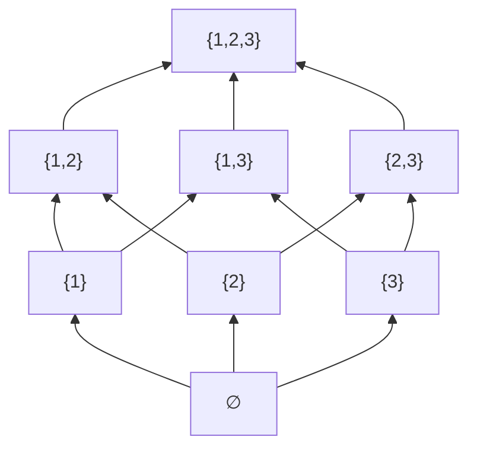

> **Prerequisites**: [[01-sets\|01. Sets and Set Operations]], [[02-logic\|02. Propositional and Predicate Logic]], [[03-proof-techniques\|03. Proof Techniques]]
> **Lesson type**: Math Component
>
> **Notation** (ký hiệu dùng mà không định nghĩa trong bài này):
> | Ký hiệu | Ý nghĩa |
> |---------|---------|
> | $\mathbb{N}$ | Tập số tự nhiên $\{0, 1, 2, \ldots\}$ |
> | $\mathbb{Z}$ | Tập số nguyên |
> | $\mathbb{R}$ | Tập số thực |
> | $\mathcal{P}(A)$ | Tập lũy thừa của $A$ |
> | $A \times B$ | Tích Descartes của $A$ và $B$ |
> | $\forall$ | Lượng từ toàn thể |
> | $\exists$ | Lượng từ tồn tại |
> | $\emptyset$ | Tập rỗng |
> | $\gcd(a,b)$ | Ước chung lớn nhất của $a$ và $b$ |

---

> **Objectives**:
> - Hiểu định nghĩa hình thức của quan hệ nhị phân như là tập con của tích Descartes
> - Phân loại các tính chất của quan hệ: phản xạ, đối xứng, phản đối xứng, bắc cầu
> - Nắm vững quan hệ tương đương, lớp tương đương, thương tập — công cụ cốt lõi của đại số
> - Hiểu và phân biệt quan hệ thứ tự bộ phận và thứ tự toàn phần
> - Kết nối quan hệ tương đương với phân hoạch

---

## Motivation

Nhiều cấu trúc trong đại số xuất phát từ việc "đồng nhất hóa" các phần tử với nhau theo một quy tắc nào đó. Ví dụ: trong $\mathbb{Z}/n\mathbb{Z}$, ta coi hai số nguyên là "như nhau" nếu chúng có cùng dư khi chia cho $n$. Đây là một **quan hệ tương đương** (equivalence relation). Hiểu rõ quan hệ tương đương và thương tập là chìa khóa để hiểu nhóm thương, vành thương, và trường mở rộng — những khái niệm xuất hiện liên tục trong Phần I, II, III của khóa học.

---

## 1. Quan hệ nhị phân (Binary Relations)

> [!definition] Definition 4.1 — Quan hệ nhị phân
> Cho $A$ và $B$ là hai tập hợp. Một **quan hệ nhị phân** từ $A$ đến $B$ là một tập con $R \subseteq A \times B$. Khi $a \in A$ và $b \in B$ thỏa $(a, b) \in R$, ta viết $a \mathrel{R} b$.
>
> Một **quan hệ nhị phân trên $A$** là quan hệ $R \subseteq A \times A$.

> [!example] Example 4.2
> - Quan hệ $\leq$ trên $\mathbb{Z}$: $(m, n) \in R \iff m \leq n$. Đây là quan hệ trên $\mathbb{Z}$.
> - Quan hệ "là cha của" giữa tập người: $(a, b) \in R \iff a$ là cha của $b$. Quan hệ từ người đến người.
> - Quan hệ "là ước của" trên $\mathbb{N}^+$: $(m, n) \in R \iff m \mid n$.

---

## 2. Tính chất của quan hệ (Properties of Relations)

> [!definition] Definition 4.3 — Các tính chất cơ bản
> Cho $R$ là quan hệ trên tập $A$. Ta nói $R$ là:
>
> - **Phản xạ** (Reflexive): $\forall a \in A: a \mathrel{R} a$.
> - **Phản phản xạ** (Irreflexive): $\forall a \in A: \lnot(a \mathrel{R} a)$.
> - **Đối xứng** (Symmetric): $\forall a, b \in A: a \mathrel{R} b \to b \mathrel{R} a$.
> - **Phản đối xứng** (Antisymmetric): $\forall a, b \in A: (a \mathrel{R} b \land b \mathrel{R} a) \to a = b$.
> - **Bắc cầu** (Transitive): $\forall a, b, c \in A: (a \mathrel{R} b \land b \mathrel{R} c) \to a \mathrel{R} c$.

> [!example] Example 4.4 — Phân loại các quan hệ quen thuộc
>
> | Quan hệ | Tập | Phản xạ | Đối xứng | Phản ĐX | Bắc cầu |
> |---------|-----|---------|---------|---------|---------|
> | $=$ (bằng) | $\mathbb{R}$ | ✓ | ✓ | ✓ | ✓ |
> | $\leq$ (bé hơn hoặc bằng) | $\mathbb{R}$ | ✓ | ✗ | ✓ | ✓ |
> | $<$ (bé hơn nghiêm ngặt) | $\mathbb{R}$ | ✗ | ✗ | ✓ | ✓ |
> | $\mid$ (chia hết) | $\mathbb{N}^+$ | ✓ | ✗ | ✓ | ✓ |
> | $\perp$ (vuông góc) | Đường thẳng | ✗ | ✓ | ✗ | ✗ |
> | $\sim$ (cùng lớp modulo $n$) | $\mathbb{Z}$ | ✓ | ✓ | ✗ | ✓ |

> [!warning] Counterexample 4.5 — Đối xứng ≠ Phản đối xứng và chúng không loại trừ nhau
> - Quan hệ $=$ vừa đối xứng vừa phản đối xứng.
> - Quan hệ $\leq$ trên $\mathbb{R}$: phản đối xứng nhưng không đối xứng ($1 \leq 2$ nhưng $2 \not\leq 1$).
> - Quan hệ "là anh chị em của" trên tập người: đối xứng nhưng không phản đối xứng.
> - Quan hệ "yêu" không nhất thiết phải có tính chất nào trong bốn tính chất trên.

### 2.1 Bao đóng của quan hệ (Closures of Relations)

> [!definition] Definition 4.5b — Bao đóng (Closure)
> Cho $R$ là quan hệ trên $A$ và $\mathcal{P}$ là một tính chất (phản xạ, đối xứng, bắc cầu). **Bao đóng $\mathcal{P}$** của $R$ (ký hiệu $R^{\mathcal{P}}$) là quan hệ nhỏ nhất (theo quan hệ bao hàm) chứa $R$ và có tính chất $\mathcal{P}$.
>
> Cụ thể:
> - **Bao đóng phản xạ**: $R^{\mathrm{ref}} = R \cup \{(a, a) \mid a \in A\}$.
> - **Bao đóng đối xứng**: $R^{\mathrm{sym}} = R \cup \{(b, a) \mid (a, b) \in R\}$.
> - **Bao đóng bắc cầu**: $R^{\mathrm{trans}} = \bigcup_{n=1}^{\infty} R^n$, trong đó $R^1 = R$, $R^{n+1} = R^n \circ R$ (hợp quan hệ).
>
> **Bao đóng phản xạ-bắc cầu** (reflexive-transitive closure) $R^*$ đặc biệt quan trọng trong khoa học máy tính (đường đi trong đồ thị).

> [!example] Example 4.5c — Bao đóng bắc cầu
> Cho $A = \{1, 2, 3\}$ và $R = \{(1, 2), (2, 3)\}$. Khi đó:
> - $R^{\mathrm{ref}} = \{(1, 2), (2, 3), (1, 1), (2, 2), (3, 3)\}$
> - $R^{\mathrm{sym}} = \{(1, 2), (2, 3), (2, 1), (3, 2)\}$
> - $R^{\mathrm{trans}} = \{(1, 2), (2, 3), (1, 3)\}$

---

## 3. Quan hệ tương đương (Equivalence Relations)

> [!definition] Definition 4.6 — Quan hệ tương đương
> Một **quan hệ tương đương** trên $A$ là quan hệ $\sim$ vừa phản xạ, vừa đối xứng, vừa bắc cầu. Ký hiệu $a \sim b$ để nói "$a$ tương đương với $b$".

> [!example] Example 4.7 — Tương đương modulo $n$
> Cho $n \in \mathbb{N}^+$ cố định. Trên $\mathbb{Z}$, định nghĩa:
>
> $$
> a \equiv b \pmod{n} \iff n \mid (a - b)
> $$
>
> Ta kiểm tra đây là quan hệ tương đương:
>
> - *Phản xạ*: $a - a = 0 = n \cdot 0$, nên $n \mid 0$. ✓
> - *Đối xứng*: Nếu $n \mid (a - b)$ thì $n \mid (-(a-b)) = b - a$. ✓
> - *Bắc cầu*: Nếu $n \mid (a-b)$ và $n \mid (b-c)$ thì $n \mid ((a-b)+(b-c)) = a-c$. ✓

> [!example] Example 4.8 — Đồng dạng tam giác
> Trong tập hợp tất cả các tam giác, quan hệ "đồng dạng" (similar) là quan hệ tương đương: mọi tam giác đồng dạng với chính nó, đồng dạng có tính đối xứng, và bắc cầu.

### 3.1 Lớp tương đương (Equivalence Classes)

> [!definition] Definition 4.9 — Lớp tương đương
> Cho $\sim$ là quan hệ tương đương trên $A$ và $a \in A$. **Lớp tương đương** của $a$, ký hiệu $[a]$ hay $[a]_\sim$, là:
>
> $$
> [a] = \{b \in A \mid b \sim a\}
> $$
>
> Tập hợp tất cả các lớp tương đương được gọi là **thương tập** (quotient set):
>
> $$
> A/{\sim} = \{[a] \mid a \in A\}
> $$

> [!example] Example 4.10 — Lớp tương đương modulo 3
> Với $n = 3$ trên $\mathbb{Z}$:
>
> $$
> [0] = \{\ldots, -6, -3, 0, 3, 6, \ldots\} = \{3k \mid k \in \mathbb{Z}\}
> $$
>
> $$
> [1] = \{\ldots, -5, -2, 1, 4, 7, \ldots\} = \{3k+1 \mid k \in \mathbb{Z}\}
> $$
>
> $$
> [2] = \{\ldots, -4, -1, 2, 5, 8, \ldots\} = \{3k+2 \mid k \in \mathbb{Z}\}
> $$
>
> Thương tập: $\mathbb{Z}/{\equiv_3} = \{[0], [1], [2]\}$. Lưu ý: $[0] = [3] = [-3]$, v.v. — cùng lớp có nhiều đại diện khác nhau.

> [!theorem] Theorem 4.11 — Tính chất của lớp tương đương
> Cho $\sim$ là quan hệ tương đương trên $A$. Khi đó:
>
> **(i)** $a \sim b \iff [a] = [b]$.
>
> **(ii)** Hai lớp tương đương hoặc **bằng nhau** hoặc **rời nhau** hoàn toàn: $[a] \cap [b] \neq \emptyset \implies [a] = [b]$.
>
> **(iii)** $a \in [a]$ với mọi $a \in A$ (mỗi phần tử thuộc đúng một lớp).

**Proof của (ii).** Giả sử $[a] \cap [b] \neq \emptyset$. Tồn tại $c \in [a] \cap [b]$, tức $c \sim a$ và $c \sim b$. Ta chứng minh $[a] \subseteq [b]$: với $x \in [a]$, ta có $x \sim a$. Do $a \sim c$ (đối xứng từ $c \sim a$) và $c \sim b$ (bắc cầu), suy ra $x \sim b$, tức $x \in [b]$. Bằng đối xứng, $[b] \subseteq [a]$. Vậy $[a] = [b]$. $\blacksquare$

### 3.2 Quan hệ tương đương và Phân hoạch

> [!theorem] Theorem 4.12 — Tương đương ↔ Phân hoạch (Fundamental Theorem)
> Cho $A$ là một tập hợp.
>
> **(i)** Mỗi quan hệ tương đương $\sim$ trên $A$ xác định một phân hoạch của $A$: các phần là các lớp tương đương.
>
> **(ii)** Ngược lại, mỗi phân hoạch $\mathcal{P} = \{A_i\}_{i \in I}$ của $A$ xác định một quan hệ tương đương: $a \sim b \iff a$ và $b$ thuộc cùng một phần $A_i$.
>
> Hai ánh xạ trên là nghịch đảo của nhau — có song ánh tự nhiên giữa tập các quan hệ tương đương trên $A$ và tập các phân hoạch của $A$.

**Proof.**
*(i)* Theo Theorem 4.11(ii), các lớp tương đương rời nhau. Theo Theorem 4.11(iii), mỗi phần tử thuộc ít nhất một lớp. Vậy các lớp tạo thành phân hoạch của $A$.

*(ii)* Ta kiểm tra $\sim$ là quan hệ tương đương: phản xạ (mọi $a$ cùng phần với $a$), đối xứng (rõ ràng), bắc cầu (nếu $a, b$ cùng phần và $b, c$ cùng phần thì $a, c$ cùng phần — vì các phần rời nhau nên $b$ chỉ có thể ở một phần, do đó phần của $a$, $b$, $c$ đều như nhau). $\blacksquare$

### 3.3 Quan hệ tương đương sinh bởi một quan hệ (Generated Equivalence Relation)

> [!note] Remark 4.12b
> Cho $R$ là một quan hệ bất kỳ trên $A$. **Quan hệ tương đương sinh bởi $R$** là bao đóng phản xạ-đối xứng-bắc cầu của $R$. Đây là quan hệ tương đương nhỏ nhất chứa $R$. Trong đại số, điều này xuất hiện khi ta muốn "ép" một số phần tử bằng nhau — ví dụ: nhóm cho bởi quan hệ (group presentation).

---

## 4. Quan hệ thứ tự (Order Relations)

> [!definition] Definition 4.13 — Thứ tự bộ phận (Partial Order)
> Một **thứ tự bộ phận** (partial order) trên $A$ là quan hệ $\leq$ (hay $\preceq$) vừa phản xạ, vừa phản đối xứng, vừa bắc cầu. Cặp $(A, \leq)$ gọi là **tập được sắp thứ tự bộ phận** (partially ordered set, viết tắt **poset**).

> [!example] Example 4.14 — Các poset quen thuộc
> - $(\mathbb{Z}, \leq)$: thứ tự bình thường. Thực ra đây là thứ tự toàn phần.
> - $(\mathcal{P}(A), \subseteq)$: tập lũy thừa với quan hệ tập con. Không phải toàn phần: $\{1\}$ và $\{2\}$ không so sánh được với nhau.
> - $(\mathbb{N}^+, \mid)$: chia hết. Không toàn phần: $2$ và $3$ không chia hết cho nhau.

> [!definition] Definition 4.15 — Thứ tự toàn phần (Total Order)
> Một **thứ tự toàn phần** (total order / linear order) là thứ tự bộ phận $\leq$ trên $A$ thỏa thêm:
>
> $$
> \forall a, b \in A: a \leq b \lor b \leq a \quad \text{(tính so sánh được — comparability)}
> $$
>
> Tức là mọi cặp phần tử đều so sánh được với nhau.

> [!definition] Definition 4.16 — Phần tử tối tiểu và tối đại
> Trong một poset $(A, \leq)$:
>
> - **Phần tử nhỏ nhất** (minimum element, least element) $m$: $m \leq a$ với mọi $a \in A$. Duy nhất nếu tồn tại.
> - **Phần tử lớn nhất** (maximum element, greatest element) $M$: $a \leq M$ với mọi $a \in A$.
> - **Phần tử tối tiểu** (minimal element) $m$: không có $a \in A$ với $a \leq m$ và $a \neq m$.
> - **Phần tử tối đại** (maximal element) $M$: không có $a \in A$ với $M \leq a$ và $a \neq M$.

> [!note] Remark 4.17
> Phần tử nhỏ nhất luôn là tối tiểu. Ngược lại không đúng: trong $(\mathcal{P}(\{1,2\}), \subseteq)$, tập $\{1\}$ và $\{2\}$ đều là phần tử tối tiểu của $\mathcal{P}(\{1,2\}) \setminus \{\emptyset\}$, nhưng không có phần tử nhỏ nhất trong tập này.

### 4.1 Sơ đồ Hasse (Hasse Diagram)

Sơ đồ Hasse là công cụ trực quan để biểu diễn poset hữu hạn. Ta vẽ $a$ bên dưới $b$ và nối bằng một đoạn thẳng nếu $a \leq b$ và không có $c$ nào với $a \leq c \leq b$ ($a < c < b$) — tức $b$ bao phủ trực tiếp $a$ (direct cover).

> [!example] Example 4.18 — Sơ đồ Hasse của $(\mathcal{P}(\{1,2,3\}), \subseteq)$



> [!definition] Definition 4.19 — Sắp xếp tốt (Well-Order)
> Một thứ tự toàn phần $(A, \leq)$ được gọi là **sắp xếp tốt** (well-order) nếu mọi tập con khác rỗng của $A$ đều có phần tử nhỏ nhất. Ví dụ: $(\mathbb{N}, \leq)$ là sắp xếp tốt, nhưng $(\mathbb{Z}, \leq)$ và $(\mathbb{R}, \leq)$ không phải.

### 4.2 Bổ đề Zorn (Zorn's Lemma)

> [!note] Remark 4.19b — Zorn's Lemma (tùy chọn nâng cao)
> Một **xích** (chain) trong poset $(A, \leq)$ là tập con trong đó mọi cặp phần tử đều so sánh được (tức là một tập con được sắp toàn phần bởi $\leq$). **Cận trên** (upper bound) của xích $C$ là phần tử $u \in A$ sao cho $c \leq u$ với mọi $c \in C$.
>
> **Bổ đề Zorn**: Nếu $(A, \leq)$ là poset khác rỗng và **mọi xích đều có cận trên**, thì $A$ có ít nhất một phần tử tối đại.
>
> Zorn's Lemma tương đương với Axiom of Choice và Well-Ordering Principle. Nó là công cụ chứng minh tồn tại cốt lõi trong đại số cao cấp (chứng minh mọi không gian vector có cơ sở, mọi ideal được chứa trong ideal tối đại, v.v.). Ở trình độ này, ta chỉ cần biết sự tồn tại của nó; sẽ dùng trong các khóa học nâng cao.

---

## SageMath Cheatsheet — Bài 04

```sage
# Quan hệ modulo n
n = 5
pairs = [(a, b) for a in range(10) for b in range(10) if (a - b) % n == 0]
print("Các cặp tương đương mod 5:", pairs[:10])

# Lớp tương đương của 3 modulo 5
equiv_class = [b for b in range(-15, 16) if (3 - b) % 5 == 0]
print("Lớp [3] modulo 5:", equiv_class)

# Poset: chia hết trên {1..12}
P = Poset((range(1, 13), lambda a, b: b % a == 0))
P.hasse_diagram().show()
print("Phần tử tối tiểu:", P.minimal_elements())
print("Phần tử tối đại:", P.maximal_elements())
print("Có phải thứ tự toàn phần không?", P.is_chain())

# Quan hệ tương đương từ phân hoạch
partitions = SetPartitions([1, 2, 3, 4]).list()
print(f"Số phân hoạch của tập 4 phần tử: {len(partitions)}")
for p in partitions[:3]:
    print(" ", p)
```

---

## Summary — Lesson 04

- **Quan hệ nhị phân** trên $A$: tập con của $A \times A$.
- **Tính chất**: phản xạ, phản phản xạ, đối xứng, phản đối xứng, bắc cầu.
- **Bao đóng** (phản xạ, đối xứng, bắc cầu): quan hệ nhỏ nhất chứa $R$ và có tính chất mong muốn.
- **Quan hệ tương đương** = phản xạ + đối xứng + bắc cầu. Sinh ra **lớp tương đương** $[a]$ và **thương tập** $A/{\sim}$.
- **Định lý cơ bản**: quan hệ tương đương $\leftrightarrow$ phân hoạch (song ánh tự nhiên).
- Các lớp tương đương: hoặc bằng nhau, hoặc rời nhau hoàn toàn.
- **Thứ tự bộ phận** (poset) = phản xạ + phản đối xứng + bắc cầu. **Thứ tự toàn phần** = thêm tính so sánh được.
- **Sơ đồ Hasse**: biểu diễn trực quan poset hữu hạn.
- **Sắp xếp tốt**: thứ tự toàn phần + mọi tập con khác rỗng có phần tử nhỏ nhất.
- **Zorn's Lemma**: công cụ tồn tại nâng cao, tương đương Axiom of Choice (tham khảo).
