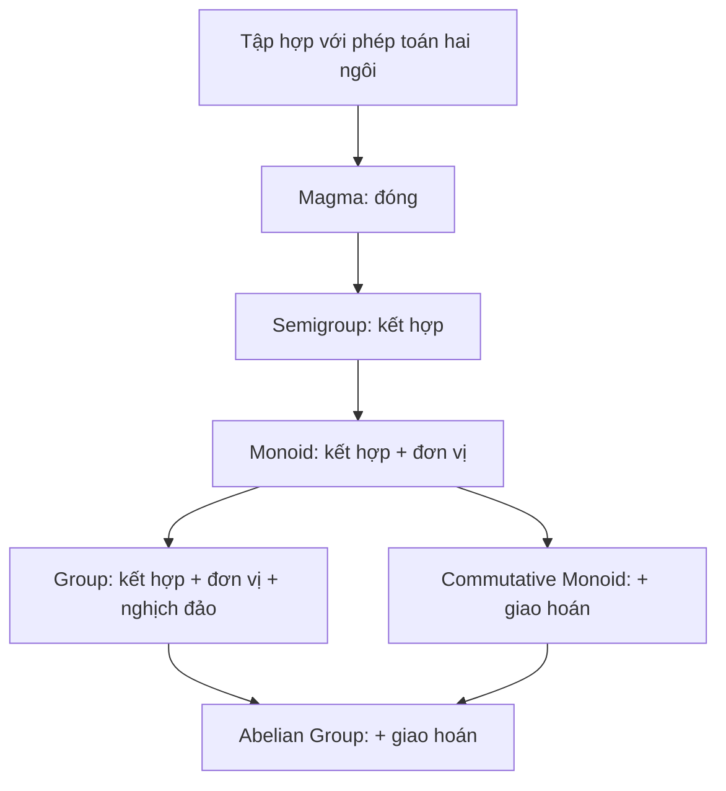

> **Prerequisites**: [[01-sets\|01. Sets and Set Operations]] đến [[05-functions-cardinality\|05. Functions, Cardinality, and Counting]]
> **Lesson type**: Math Component
>
> **Notation** (ký hiệu dùng mà không định nghĩa trong bài này):
> | Ký hiệu | Ý nghĩa |
> |---------|---------|
> | $\mathbb{N}$ | Tập số tự nhiên $\{0, 1, 2, \ldots\}$ |
> | $\mathbb{Z}$ | Tập số nguyên |
> | $\mathbb{R}$ | Tập số thực |
> | $\mathbb{Q}$ | Tập số hữu tỷ |
> | $\mathcal{P}(U)$ | Tập lũy thừa của $U$ |
> | $M_n(\mathbb{R})$ | Tập ma trận vuông $n \times n$ trên $\mathbb{R}$ |
> | $GL_n(\mathbb{R})$ | Nhóm tuyến tính tổng quát — ma trận $n \times n$ khả nghịch |
> | $\gcd(a,b)$ | Ước chung lớn nhất |
> | $\phi(n)$ | Hàm phi Euler: số số nguyên dương $\leq n$ và nguyên tố cùng nhau với $n$ |

---

> **Objectives**:
> - Hiểu định nghĩa hình thức của phép toán hai ngôi và các tính chất của nó
> - Phân biệt các cấu trúc đại số sơ cấp: Magma, Semigroup, Monoid
> - Xây dựng bảng Cayley và đọc thông tin từ đó
> - Hiểu khái niệm đồng cấu giữa các cấu trúc này
> - Nắm vị trí của nhóm (group) trong thứ bậc cấu trúc đại số

---

## Motivation

Tập hợp một mình không mang nhiều cấu trúc. Để toán học thú vị hơn, ta **trang bị** tập hợp với một hay nhiều **phép toán** (operations). Điều này sinh ra các **cấu trúc đại số** (algebraic structures). Bài học này đặt nền móng cho toàn bộ Phần I, II, III bằng cách trả lời câu hỏi: "Khi ta thêm các tiên đề dần dần vào phép toán, ta được các cấu trúc nào?"

---

## 1. Phép toán hai ngôi (Binary Operations)

> [!definition] Definition 6.1 — Phép toán hai ngôi
> Cho $S$ là một tập hợp. Một **phép toán hai ngôi** (binary operation) trên $S$ là một hàm:
>
> $$
> \star: S \times S \to S
> $$
>
> Ta viết $a \star b$ thay vì $\star(a, b)$. Tính chất **đóng** (closure) là tự động: $a \star b \in S$ với mọi $a, b \in S$.

> [!example] Example 6.2 — Các phép toán hai ngôi
>
> | Tập $S$ | Phép toán $\star$ | Có đóng không? |
> |---------|-----------------|----------------|
> | $\mathbb{Z}$ | $+$ (cộng) | ✓ |
> | $\mathbb{Z}$ | $\cdot$ (nhân) | ✓ |
> | $\mathbb{N}$ | $-$ (trừ) | ✗ ($3 - 5 = -2 \notin \mathbb{N}$) |
> | $\mathbb{R} \setminus \{0\}$ | $\div$ (chia) | ✓ |
> | $\mathbb{Z}$ | $\div$ | ✗ ($1 \div 2 \notin \mathbb{Z}$) |
> | $\mathcal{P}(U)$ | $\cup$, $\cap$, $\triangle$ | ✓ |
> | $M_n(\mathbb{R})$ (ma trận $n \times n$) | nhân ma trận | ✓ |

> [!warning] Counterexample 6.3 — Phân biệt phép toán và quan hệ
> Phép toán nhận **hai đầu vào** và trả về **một kết quả**. Đây là hàm $S \times S \to S$, không phải quan hệ. Phép chia trên $\mathbb{Z}$ không phải phép toán vì $1 \div 2 \notin \mathbb{Z}$ — điều kiện đóng bị vi phạm.

---

## 2. Các tính chất của phép toán hai ngôi

> [!definition] Definition 6.4 — Tính chất của phép toán
> Cho $\star$ là phép toán hai ngôi trên $S$. Ta nói $\star$ là:
>
> - **Kết hợp** (Associative): $\forall a, b, c \in S: (a \star b) \star c = a \star (b \star c)$.
> - **Giao hoán** (Commutative): $\forall a, b \in S: a \star b = b \star a$.
>
> Ta nói $e \in S$ là:
>
> - **Phần tử đơn vị trái** (Left identity): $\forall a \in S: e \star a = a$.
> - **Phần tử đơn vị phải** (Right identity): $\forall a \in S: a \star e = a$.
> - **Phần tử đơn vị** (Two-sided identity / neutral element): cả hai.
>
> Và $b \in S$ là:
>
> - **Phần tử nghịch đảo trái** của $a$ (Left inverse): $b \star a = e$.
> - **Phần tử nghịch đảo phải** của $a$ (Right inverse): $a \star b = e$.
> - **Phần tử nghịch đảo** của $a$ (Two-sided inverse): cả hai.

> [!theorem] Theorem 6.5 — Duy nhất của phần tử đơn vị
> Nếu phép toán $\star$ có cả đơn vị trái $e_L$ và đơn vị phải $e_R$, thì $e_L = e_R$ và phần tử đơn vị là duy nhất.

**Proof.** $e_L = e_L \star e_R = e_R$. Dòng đầu: $e_R$ là đơn vị phải. Dòng sau: $e_L$ là đơn vị trái. $\blacksquare$

> [!theorem] Theorem 6.6 — Duy nhất của nghịch đảo (khi có tính kết hợp)
> Nếu $\star$ có tính kết hợp và phần tử đơn vị $e$, và $a \in S$ có cả nghịch đảo trái $b$ và nghịch đảo phải $c$ (tức $b \star a = e$ và $a \star c = e$), thì $b = c$.

**Proof.** $b = b \star e = b \star (a \star c) = (b \star a) \star c = e \star c = c$. $\blacksquare$

> [!example] Example 6.7 — Không kết hợp có thể có nhiều nghịch đảo
> Trên $S = \{a, b, c\}$, định nghĩa phép toán không kết hợp: có thể xây dựng ví dụ mà $a$ có nhiều nghịch đảo trái. Theorem 6.6 khẳng định điều này không xảy ra khi có tính kết hợp.

---

## 3. Bảng Cayley (Cayley Table / Operation Table)

Với tập hữu hạn $S = \{s_1, s_2, \ldots, s_n\}$, ta biểu diễn phép toán $\star$ bằng **bảng Cayley** (hay bảng phép toán): hàng $i$, cột $j$ chứa $s_i \star s_j$.

> [!example] Example 6.8 — Bảng Cayley của $(\mathbb{Z}/4\mathbb{Z}, +)$
>
> | $+$ | $0$ | $1$ | $2$ | $3$ |
> |-----|-----|-----|-----|-----|
> | **0** | 0 | 1 | 2 | 3 |
> | **1** | 1 | 2 | 3 | 0 |
> | **2** | 2 | 3 | 0 | 1 |
> | **3** | 3 | 0 | 1 | 2 |
>
> Quan sát: bảng đối xứng qua đường chéo chính $\iff$ phép toán giao hoán. Mỗi phần tử xuất hiện đúng một lần trong mỗi hàng và mỗi cột (tính chất "Latin square") — đây là đặc trưng của **nhóm** hữu hạn (sẽ học trong Lesson 07).

> [!example] Example 6.9 — Bảng Cayley của một cấu trúc không nhóm
>
> Tập $S = \{0, 1, 2\}$ với phép toán $a \star b = \max(a, b)$:
>
> | $\max$ | $0$ | $1$ | $2$ |
> |--------|-----|-----|-----|
> | **0** | 0 | 1 | 2 |
> | **1** | 1 | 1 | 2 |
> | **2** | 2 | 2 | 2 |
>
> Phần tử đơn vị: $0$ (vì $\max(0, a) = a$). Giao hoán: ✓. Kết hợp: ✓. Nhưng $2$ không có nghịch đảo: không có $b$ sao cho $\max(2, b) = 0$.

---

## 4. Thứ bậc cấu trúc đại số (Hierarchy of Algebraic Structures)

### 4.1 Magma

> [!definition] Definition 6.10 — Magma
> Một **magma** (đôi khi còn gọi là groupoid trong nghĩa cũ, hay binary algebraic structure) là một bộ $(S, \star)$ trong đó $S$ là tập hợp và $\star$ là phép toán hai ngôi trên $S$. Không có tiên đề nào khác được yêu cầu.

Đây là cấu trúc yếu nhất có thể — chỉ cần tính đóng.

> [!example] Example 6.11 — Magma
> - $(\mathbb{R}, \star)$ với $a \star b = a - b$: đóng, nhưng không kết hợp ($(3-2)-1 = 0 \neq 3-(2-1) = 2$), không giao hoán.
> - $(\mathbb{N}, \star)$ với $a \star b = 2^a + b$: đóng (vì $2^a + b \in \mathbb{N}$), không kết hợp.
> - Tập các chuỗi nhị phân với phép nối: magma (không giao hoán).

### 4.2 Semigroup

> [!definition] Definition 6.12 — Nửa nhóm (Semigroup)
> Một **nửa nhóm** (semigroup) là một magma $(S, \star)$ trong đó $\star$ có tính kết hợp:
>
> $$
> \forall a, b, c \in S: (a \star b) \star c = a \star (b \star c)
> $$

Tính kết hợp cho phép ta bỏ ngoặc: $a \star b \star c$ có nghĩa xác định.

> [!example] Example 6.13 — Semigroup
> - $(\mathbb{N}^+, +)$: cộng trên số tự nhiên dương — kết hợp, không có phần tử đơn vị (vì $0 \notin \mathbb{N}^+$).
> - $(\mathbb{Z}, \cdot)$: nhân số nguyên — kết hợp, có đơn vị $1$ (vậy là monoid, xem bên dưới).
> - $(M_n(\mathbb{R}), \cdot)$: nhân ma trận $n \times n$ — kết hợp, không giao hoán (với $n \geq 2$).
> - $(\Sigma^+, \cdot)$: tập chuỗi không rỗng trên bảng chữ $\Sigma$ với phép nối chuỗi — kết hợp, không giao hoán (nếu $|\Sigma| \geq 2$).
> - Tập các hàm $S \to S$ với hợp hàm: kết hợp (theo Theorem 5.9(i)), không giao hoán.

> [!theorem] Theorem 6.14 — Tổng quát hóa tính kết hợp
> Trong một semigroup, mọi tích dài $a_1 \star a_2 \star \cdots \star a_n$ đều có giá trị xác định bất kể cách đặt ngoặc — tức là:
>
> $$
> (\cdots((a_1 \star a_2) \star a_3) \cdots \star a_n) = a_1 \star (a_2 \star (\cdots (a_{n-1} \star a_n) \cdots))
> $$
>
> và tất cả các cách đặt ngoặc khác đều cho cùng kết quả.

**Proof.** Bằng quy nạp theo $n$. Trường hợp $n = 3$ là định nghĩa. Giả sử đúng với mọi tích của ít hơn $n$ phần tử, và mọi cách đặt ngoặc $(a_1 \star \cdots \star a_k) \star (a_{k+1} \star \cdots \star a_n)$ đều bằng $(a_1 \star \cdots \star a_{n-1}) \star a_n$ — áp dụng tính kết hợp nhiều lần. Xem Dummit & Foote §1.1 để chi tiết. $\blacksquare$

### 4.3 Monoid

> [!definition] Definition 6.15 — Monoid
> Một **monoid** là một semigroup $(M, \star)$ có **phần tử đơn vị** (identity element): tồn tại $e \in M$ sao cho:
>
> $$
> \forall a \in M: e \star a = a \star e = a
> $$

> [!example] Example 6.16 — Monoid
> - $(\mathbb{N}, +)$ với $e = 0$: nửa nhóm cộng $(\mathbb{N}^+, +)$ + phần tử đơn vị $0$.
> - $(\mathbb{N}, \cdot)$ với $e = 1$.
> - $(\mathbb{Z}, +)$ với $e = 0$.
> - $(\mathbb{Z}, \cdot)$ với $e = 1$.
> - $(\Sigma^*, \cdot)$ với $e = \varepsilon$ (chuỗi rỗng): monoid tự do trên $\Sigma$ (free monoid). **Rất quan trọng** trong lý thuyết automata và đại số ngôn ngữ.
> - $(M_n(\mathbb{R}), \cdot)$ với $e = I_n$ (ma trận đơn vị).
> - $(\mathcal{F}(S, S), \circ)$ — tập tất cả hàm $S \to S$ với phép hợp, $e = \operatorname{id}_S$.

> [!definition] Definition 6.17 — Đơn vị (Units) trong Monoid
> Trong monoid $(M, \star, e)$, phần tử $a \in M$ được gọi là **đơn vị** (unit hay invertible element) nếu tồn tại $a^{-1} \in M$ sao cho $a \star a^{-1} = a^{-1} \star a = e$.
>
> Tập tất cả các đơn vị của $M$, ký hiệu $U(M)$, tạo thành một **nhóm** (group) với phép toán kế thừa từ $M$ — gọi là **nhóm các đơn vị** của $M$.

> [!example] Example 6.18 — Nhóm các đơn vị
> - $U(\mathbb{Z}, \cdot) = \{-1, 1\}$ (chỉ $\pm 1$ có nghịch đảo trong $\mathbb{Z}$).
> - $U(\mathbb{Z}/n\mathbb{Z}, \cdot) = (\mathbb{Z}/n\mathbb{Z})^\times = \{[a] \mid \gcd(a, n) = 1\}$ — lực lượng $\phi(n)$.
> - $U(M_n(\mathbb{R}), \cdot) = GL_n(\mathbb{R})$ (nhóm tuyến tính tổng quát — ma trận khả nghịch).
> - $U(\mathbb{N}, \cdot) = \{1\}$ — trivial.

---

## 5. Thứ bậc đầy đủ



> [!note] Remark 6.19 — Tại sao thứ bậc này quan trọng?
> Khi bổ sung tiên đề dần dần, ta thu được các cấu trúc mạnh hơn:
>
> - **Magma → Semigroup**: bổ sung tính kết hợp — cho phép định nghĩa lũy thừa $a^n$ không mơ hồ.
> - **Semigroup → Monoid**: bổ sung phần tử đơn vị $e$ — cho phép định nghĩa $a^0 = e$ và tập các đơn vị.
> - **Monoid → Group**: bổ sung nghịch đảo — cho phép định nghĩa $a^{-1}$ và $a^{-n}$, và phép chia (trong nghĩa nhất định).
> - **Group → Abelian Group**: bổ sung giao hoán — cấu trúc phẳng và dễ phân tích hơn.

---

## 6. Cấu trúc con (Substructures)

> [!definition] Definition 6.20
> Cho $(S, \star)$ là một cấu trúc đại số. Tập con $T \subseteq S$ được gọi là:
>
> - **Sub-magma**: $T$ đóng với $\star$: $a, b \in T \implies a \star b \in T$.
> - **Subsemigroup**: $T$ là sub-magma và $(T, \star)$ là semigroup (tự động vì kế thừa tính kết hợp).
> - **Submonoid**: $T$ là subsemigroup và $e \in T$ (chứa phần tử đơn vị của $S$).

> [!example] Example 6.21
> - $(\mathbb{N}, +) \subseteq (\mathbb{Z}, +)$: submonoid (chứa $0$).
> - $(\mathbb{N}^+, +) \subseteq (\mathbb{Z}, +)$: subsemigroup nhưng **không** submonoid (vì $0 \notin \mathbb{N}^+$).
> - $(2\mathbb{Z}, +) = \{0, \pm 2, \pm 4, \ldots\}$: submonoid của $(\mathbb{Z}, +)$.
> - $\{2^n \mid n \in \mathbb{N}\} \subseteq (\mathbb{N}, \cdot)$: submonoid (chứa $2^0 = 1$).

---

## 7. Đồng cấu (Homomorphisms)

> [!definition] Definition 6.22 — Đồng cấu magma / semigroup / monoid
> Cho $(S, \star)$ và $(T, \diamond)$ là hai cấu trúc đại số.
>
> - **Đồng cấu magma** (magma homomorphism): hàm $\phi: S \to T$ sao cho:
>
> $$
> \phi(a \star b) = \phi(a) \diamond \phi(b) \quad \forall a, b \in S
> $$
>
> - **Đồng cấu semigroup**: đồng cấu magma giữa hai semigroup.
> - **Đồng cấu monoid**: đồng cấu semigroup bảo toàn phần tử đơn vị: $\phi(e_S) = e_T$.

> [!example] Example 6.23 — Các đồng cấu quan trọng
> - $\phi: (\mathbb{Z}, +) \to (\mathbb{Z}/n\mathbb{Z}, +)$, $\phi(k) = [k]$: đồng cấu monoid (toàn ánh).
> - $\exp: (\mathbb{R}, +) \to (\mathbb{R}^+, \cdot)$, $\exp(x) = e^x$: đồng cấu monoid (song ánh — đây là **đẳng cấu**).
> - $\log: (\mathbb{R}^+, \cdot) \to (\mathbb{R}, +)$: nghịch đảo của $\exp$, cũng là đẳng cấu.

> [!theorem] Theorem 6.24 — Bảo toàn cấu trúc
> Nếu $\phi: S \to T$ là đồng cấu semigroup:
>
> **(i)** $\phi(a^n) = \phi(a)^n$ với mọi $a \in S$, $n \in \mathbb{N}^+$.
>
> **(ii)** $\phi(S)$ (ảnh của $S$) là subsemigroup của $T$.
>
> Nếu hơn nữa $\phi$ là đồng cấu monoid:
>
> **(iii)** $\phi(e_S) = e_T$.
>
> **(iv)** $\phi(S)$ là submonoid của $T$.

**Proof của (i).** Bằng quy nạp: $\phi(a^1) = \phi(a) = \phi(a)^1$ (cơ sở). Nếu $\phi(a^n) = \phi(a)^n$ thì $\phi(a^{n+1}) = \phi(a^n \star a) = \phi(a^n) \diamond \phi(a) = \phi(a)^n \diamond \phi(a) = \phi(a)^{n+1}$. $\blacksquare$

### 7.1 Monoid tự do và biểu diễn (Free Monoids and Presentations)

> [!note] Remark 6.24b — Free Monoid
> Monoid tự do $\Sigma^*$ trên bảng chữ $\Sigma$ có tính chất **universal**: với mọi monoid $M$ và hàm $f: \Sigma \to M$, tồn tại **duy nhất** đồng cấu monoid $\hat{f}: \Sigma^* \to M$ mở rộng $f$. Điều này có nghĩa: khi ta định nghĩa một đồng cấu từ $\Sigma^*$, chỉ cần xác định ảnh của các ký tự cơ bản — phần còn lại được xác định duy nhất.
>
> Trong đại số, ta thường mô tả monoid qua **generators và relations** (biểu diễn — presentation). Ví dụ: monoid giao hoán tự do trên $n$ phần tử đẳng cấu với $\mathbb{N}^n$.

---

## 8. Preview: Nhóm (Group) là gì?

Trong Lesson 07, ta sẽ định nghĩa nhóm chính xác. Nhưng sau khi nắm rõ thứ bậc, ta đã thấy rõ:

> [!note] Remark 6.25 — Nhóm = Monoid có nghịch đảo
> Một **nhóm** $(G, \star)$ là một monoid trong đó **mọi phần tử đều có nghịch đảo** hai chiều. Tức là:
>
> $$
> \forall a \in G, \exists a^{-1} \in G: a \star a^{-1} = a^{-1} \star a = e
> $$
>
> So sánh với monoid: trong monoid $(\mathbb{N}, +)$, phần tử $5$ không có nghịch đảo (không có số tự nhiên $b$ sao cho $5 + b = 0$). Khi chuyển sang $(\mathbb{Z}, +)$, mọi phần tử đều có nghịch đảo: $(-5) + 5 = 0$. Do đó $(\mathbb{Z}, +)$ là **nhóm**, còn $(\mathbb{N}, +)$ chỉ là monoid.

> [!example] Example 6.26 — So sánh Monoid và Group
>
> | Cấu trúc | Loại |
> |---------|------|
> | $(\mathbb{N}, +)$ | Monoid (không phải Group) |
> | $(\mathbb{Z}, +)$ | Group (Abel) |
> | $(\mathbb{N}, \cdot)$ | Monoid |
> | $(\mathbb{Z}, \cdot)$ | Monoid (không phải Group: $2$ không có nghịch đảo trong $\mathbb{Z}$) |
> | $(\mathbb{Q} \setminus \{0\}, \cdot)$ | Group (Abel) |
> | $(\mathbb{R}, \cdot)$ | Monoid (không Group: $0$ không có nghịch đảo) |
> | $(M_n(\mathbb{R}), \cdot)$ | Monoid |
> | $(GL_n(\mathbb{R}), \cdot)$ | Group (không Abel với $n \geq 2$) |

---

## SageMath Cheatsheet — Bài 06

```sage
# Kiểm tra tính kết hợp trên tập hữu hạn
def is_associative(op, S):
    for a in S:
        for b in S:
            for c in S:
                if op(op(a, b), c) != op(a, op(b, c)):
                    return False, (a, b, c)
    return True, None

S = [0, 1, 2, 3]
add_mod4 = lambda a, b: (a + b) % 4
print("Z/4Z cộng kết hợp:", is_associative(add_mod4, S)[0])

# Xây dựng bảng Cayley
print("Bảng Cayley của Z/4Z:")
print("  |", *S)
print("--+" + "-"*8)
for a in S:
    row = [add_mod4(a, b) for b in S]
    print(f"{a} | {' '.join(map(str, row))}")

# Kiểm tra đơn vị
def find_identity(op, S):
    for e in S:
        if all(op(e, a) == a and op(a, e) == a for a in S):
            return e
    return None

print("Đơn vị của (Z/4Z, +):", find_identity(add_mod4, S))

# Nhóm các đơn vị của Z/nZ
n = 12
units = [a for a in range(n) if gcd(a, n) == 1]
print(f"U(Z/{n}Z) = {units}, bậc = {len(units)} = phi({n}) = {euler_phi(n)}")

# Minh họa đồng cấu exp: (R,+) -> (R+, *)
x, y = 2.0, 3.0
lhs = exp(x + y)
rhs = exp(x) * exp(y)
print(f"exp({x}+{y}) = {lhs:.6f}, exp({x})*exp({y}) = {rhs:.6f}, Bằng nhau: {abs(lhs-rhs)<1e-9}")

# Kiểm tra các monoid con của (Z, +)
Z = Integers()
print("Kiểm tra (2Z, +) là submonoid của (Z, +):", all((2*a)+(2*b) in set(2*k for k in range(-10, 11)) for a in range(-5, 6) for b in range(-5, 6)))
```

---

## Summary — Lesson 06

- **Phép toán hai ngôi** $\star: S \times S \to S$ — tính đóng là tự động theo định nghĩa.
- **Tính kết hợp** cho phép viết $a \star b \star c$ không mơ hồ. **Tính giao hoán** không được đảm bảo nói chung.
- **Phần tử đơn vị**: nếu tồn tại, duy nhất (Theorem 6.5). **Nghịch đảo**: duy nhất khi có kết hợp (Theorem 6.6).
- **Bảng Cayley**: biểu diễn phép toán trên tập hữu hạn. Đối xứng $\iff$ giao hoán. Latin square $\implies$ nhóm.
- **Thứ bậc**: Magma (đóng) → Semigroup (+kết hợp) → Monoid (+đơn vị) → Group (+nghịch đảo) → Abelian Group (+giao hoán).
- **Monoid tự do** $\Sigma^*$: có tính universal — đồng cấu xác định duy nhất bởi ảnh của generators.
- **Nhóm các đơn vị** $U(M)$: tập các phần tử khả nghịch của monoid $M$ tạo thành nhóm.
- **Sub-magma / subsemigroup / submonoid**: tập con đóng với phép toán (và chứa đơn vị nếu là submonoid).
- **Đồng cấu**: bảo toàn phép toán (và đơn vị nếu là đồng cấu monoid). $\exp$ và $\log$ là các ví dụ đẳng cấu kinh điển.
