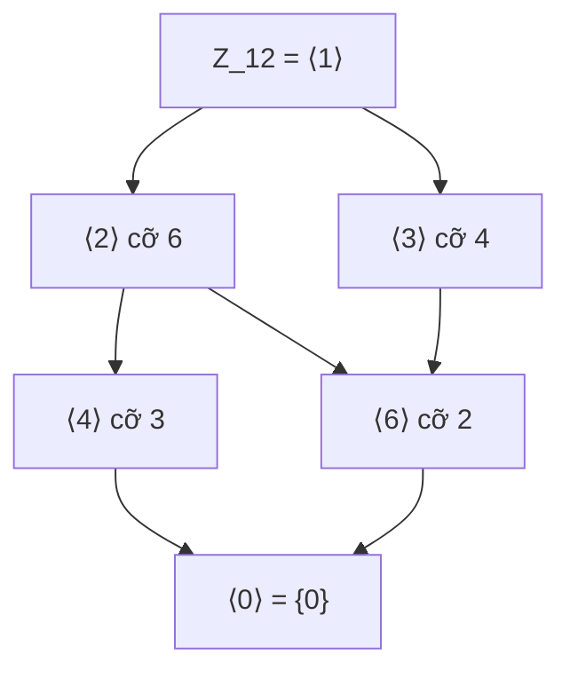
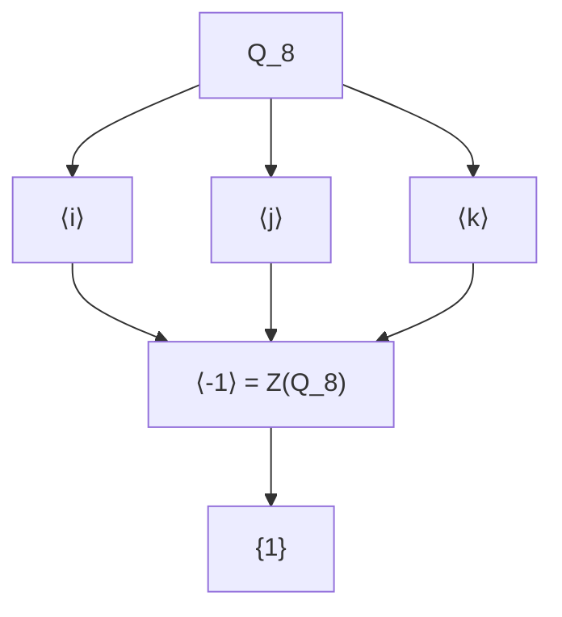

> **Prerequisites**: [[07-groups-and-basic-properties|07. Groups and Basic Properties]]
> **Lesson type**: Math Component
>
> **Notation** (ký hiệu dùng mà không định nghĩa trong bài này):
> | Ký hiệu | Ý nghĩa |
> |---------|---------|
> | $\mathbb{Z}$ | Tập số nguyên |
> | $\mathbb{Z}/n\mathbb{Z}$ | Nhóm cyclic cấp $n$ |
> | $S_n$ | Nhóm đối xứng bậc $n$ |
> | $|G|$ | Cấp của nhóm $G$ |
> | $\gcd(a,b)$ | Ước chung lớn nhất của $a$ và $b$ |

> **Objectives**:
> - Định nghĩa và nhận diện nhóm con (subgroup); áp dụng tiêu chuẩn nhóm con.
> - Hiểu khái niệm tập sinh (generating set) và nhóm con sinh bởi tập $S$.
> - Xây dựng và phân tích sơ đồ dàn nhóm con (subgroup lattice).
> - Nắm vững centralizer, normalizer, và tâm $Z(G)$ cùng ý nghĩa hình học/đại số của chúng.

---

## Motivation

Một nhóm lớn thường chứa trong nó nhiều cấu trúc nhỏ hơn — các "nhóm con". Ví dụ: trong nhóm các phép quay của không gian $SO(3)$, tập các phép quay quanh một trục cố định tạo thành một nhóm con. Trong $\mathbb{Z}$, tập các bội của $3$ là $\{0, \pm 3, \pm 6, \ldots\}$ tạo thành nhóm con.

Nghiên cứu các nhóm con giúp ta hiểu cấu trúc nội tại của nhóm: các nhóm con cho biết "hình dạng" của nhóm, và nhiều kết quả sâu sắc (định lý Lagrange, đồng cấu, nhóm thương) đều được xây dựng trên nền tảng nhóm con.

---

## 1. Nhóm con (Subgroup)

> [!definition] Definition 8.1 — Nhóm con (Subgroup)
> Cho nhóm $(G, \cdot)$. Tập con $H \subseteq G$ gọi là **nhóm con** của $G$, ký hiệu $H \leq G$, nếu $(H, \cdot)$ là nhóm với cùng phép toán. Cụ thể, $H$ phải thỏa:
>
> 1. $e \in H$ (phần tử đơn vị của $G$ thuộc $H$).
> 2. $\forall\, a, b \in H: a \cdot b \in H$ (đóng với phép toán).
> 3. $\forall\, a \in H: a^{-1} \in H$ (đóng với nghịch đảo).
>
> Tính kết hợp tự động kế thừa từ $G$.

> [!note] Remark 8.2 — Nhóm con tầm thường và nhóm con thực sự
> Mọi nhóm $G$ đều có hai **nhóm con tầm thường** (trivial subgroups): $\{e\}$ và $G$ chính nó. Một nhóm con $H$ với $\{e\} \subsetneq H \subsetneq G$ được gọi là **nhóm con thực sự** (proper nontrivial subgroup).
>
> Một nhóm con $M$ của $G$ được gọi là **nhóm con tối đại** (maximal subgroup) nếu $M \subsetneq G$ và không tồn tại nhóm con $H$ sao cho $M \subsetneq H \subsetneq G$.

> [!note] Remark 8.3 — Nhóm đơn (Simple Group)
> Nếu $G$ không có nhóm con chuẩn tắc thực sự nào ngoài $\{e\}$ và $G$, ta gọi $G$ là **nhóm đơn** (simple group). Khái niệm này sẽ gặp lại trong [[11-normal-subgroups-and-quotient-groups|11. Normal Subgroups and Quotient Groups]].

---

## 2. Tiêu Chuẩn Nhóm Con (Subgroup Criteria)

> [!abstract] Theorem 8.4 — Tiêu chuẩn một bước (One-Step Subgroup Criterion)
> Cho $G$ là nhóm và $\emptyset \neq H \subseteq G$. Khi đó:
>
> $$
> H \leq G \iff \forall\, a, b \in H: \quad a b^{-1} \in H
> $$

**Proof.**
$(\Rightarrow)$ Nếu $H \leq G$ thì $b \in H \Rightarrow b^{-1} \in H$, và $a, b^{-1} \in H \Rightarrow ab^{-1} \in H$.

$(\Leftarrow)$ Giả sử điều kiện thỏa. Vì $H \neq \emptyset$, lấy $a \in H$.

- **Đơn vị**: $a \cdot a^{-1} = e \in H$ (áp dụng điều kiện với $b = a$).
- **Nghịch đảo**: Lấy $a \in H$. Ta có $e \in H$ và $e \cdot a^{-1} = a^{-1} \in H$ (áp dụng với $b = a$, $a = e$).
- **Đóng**: Lấy $a, b \in H$. Ta có $b^{-1} \in H$ (bước trên). Áp dụng điều kiện với $a$ và $b^{-1}$: $a \cdot (b^{-1})^{-1} = ab \in H$.

Vậy $H \leq G$. $\blacksquare$

> [!abstract] Theorem 8.5 — Tiêu chuẩn hai bước (Two-Step Subgroup Criterion)
> Cho $G$ là nhóm và $\emptyset \neq H \subseteq G$. Khi đó $H \leq G$ khi và chỉ khi:
>
> 1. $\forall\, a, b \in H: ab \in H$ (đóng với phép toán), và
> 2. $\forall\, a \in H: a^{-1} \in H$ (đóng với nghịch đảo).

**Proof.**
$(\Rightarrow)$ Hiển nhiên từ Definition 8.1.

$(\Leftarrow)$ Điều kiện 1 cho tính đóng. Điều kiện 2 cho nghịch đảo. Còn đơn vị: lấy $a \in H$ (được vì $H \neq \emptyset$); từ điều kiện 2, $a^{-1} \in H$; từ điều kiện 1, $a \cdot a^{-1} = e \in H$. Tính kết hợp kế thừa từ $G$. $\blacksquare$

> [!abstract] Theorem 8.6 — Tiêu chuẩn cho nhóm con hữu hạn
> Nếu $G$ là nhóm **hữu hạn** và $\emptyset \neq H \subseteq G$, thì:
>
> $$
> H \leq G \iff H \text{ đóng với phép toán của } G
> $$

**Proof.**
$(\Rightarrow)$ Hiển nhiên.

$(\Leftarrow)$ Chỉ cần kiểm tra $a^{-1} \in H$ với $a \in H$. Xét dãy $a, a^2, a^3, \ldots$ Vì $H$ hữu hạn và đóng, dãy này thuộc $H$. Theo nguyên lý hộp (pigeonhole), tồn tại $i < j$ sao cho $a^i = a^j$, tức $a^{j-i} = e$. Vậy $e \in H$ và $a^{j-i-1} \in H$ (vì $j-i-1 \geq 0$). Cuối cùng $a \cdot a^{j-i-1} = a^{j-i} = e$, nên $a^{-1} = a^{j-i-1} \in H$. $\blacksquare$

---

## 3. Ví Dụ Về Nhóm Con

> [!example] Example 8.7 — Các nhóm con của $\mathbb{Z}$
> Mọi nhóm con của $(\mathbb{Z}, +)$ đều có dạng $n\mathbb{Z} = \{nk \mid k \in \mathbb{Z}\}$ với $n \geq 0$. (Bao gồm $0\mathbb{Z} = \{0\}$ và $1\mathbb{Z} = \mathbb{Z}$.)
>
> **Proof.** Cho $H \leq \mathbb{Z}$. Nếu $H = \{0\}$ thì $H = 0\mathbb{Z}$. Nếu $H \neq \{0\}$, gọi $n = \min\{k \in H \mid k > 0\}$ (tồn tại vì $H \neq \{0\}$ và $H$ đóng với phủ định). Ta có $n\mathbb{Z} \leq H$ (vì $H$ đóng). Với $m \in H$ bất kỳ, chia Euclidean: $m = qn + r$, $0 \leq r < n$. Khi đó $r = m - qn \in H$. Vì $n = \min$ và $0 \leq r < n$, buộc $r = 0$, nên $m = qn \in n\mathbb{Z}$. $\blacksquare$

> [!example] Example 8.8 — Nhóm con của $S_3$
> $|S_3| = 6$. Các nhóm con:
>
> - Cấp 1: $\{e\}$.
> - Cấp 2: $\{e, (12)\}$, $\{e, (13)\}$, $\{e, (23)\}$ — ba nhóm con.
> - Cấp 3: $\{e, (123), (132)\} = A_3$ — đẳng cấu với $\mathbb{Z}_3$.
> - Cấp 6: $S_3$ chính nó.
>
> Tổng cộng 6 nhóm con.

> [!example] Example 8.9 — Nhóm con của $\mathbb{Z}_{12}$
> Các nhóm con của $\mathbb{Z}_{12}$ là $\langle d \rangle = \{0, d, 2d, \ldots\}$ với $d \mid 12$:
> $\langle 1 \rangle = \mathbb{Z}_{12}$, $\langle 2 \rangle = \{0,2,4,6,8,10\}$, $\langle 3 \rangle = \{0,3,6,9\}$, $\langle 4 \rangle = \{0,4,8\}$, $\langle 6 \rangle = \{0,6\}$, $\langle 12 \rangle = \langle 0 \rangle = \{0\}$.

> [!example] Example 8.10 — Nhóm con của $Q_8$ (Nhóm quaternion)
> $Q_8 = \{\pm 1, \pm i, \pm j, \pm k\}$. Các nhóm con:
>
> - Cấp 1: $\{1\}$.
> - Cấp 2: $\{\pm 1\}$ (duy nhất, chính là $Z(Q_8)$).
> - Cấp 4: $\langle i \rangle = \{\pm 1, \pm i\}$, $\langle j \rangle = \{\pm 1, \pm j\}$, $\langle k \rangle = \{\pm 1, \pm k\}$ — ba nhóm con.
> - Cấp 8: $Q_8$ chính nó.
>
> Điểm đặc biệt của $Q_8$: **mọi** nhóm con đều chuẩn tắc (đây là nhóm Hamilton — xem [[11-normal-subgroups-and-quotient-groups|11. Normal Subgroups]]).

---

## 4. Nhóm Con Sinh Bởi Tập $S$

> [!definition] Definition 8.11 — Tập sinh và nhóm con sinh (Generated Subgroup)
> Cho $G$ là nhóm và $S \subseteq G$ (không nhất thiết rỗng). **Nhóm con sinh bởi $S$**, ký hiệu $\langle S \rangle$, được định nghĩa là nhóm con **nhỏ nhất** của $G$ chứa $S$:
>
> $$
> \langle S \rangle = \bigcap_{\substack{H \leq G \\ S \subseteq H}} H
> $$
>
> Giao của bất kỳ họ nhóm con nào cũng là nhóm con, nên $\langle S \rangle$ hợp lệ.

> [!abstract] Theorem 8.12 — Đặc trưng bằng từ (Word Characterization)
> Với $S \neq \emptyset$:
>
> $$
> \langle S \rangle = \{s_1^{\varepsilon_1} s_2^{\varepsilon_2} \cdots s_k^{\varepsilon_k} \mid k \geq 1,\, s_i \in S,\, \varepsilon_i = \pm 1\} \cup \{e\}
> $$
>
> Tức là $\langle S \rangle$ gồm tất cả các **từ hữu hạn** (finite words) trong các phần tử của $S$ và nghịch đảo của chúng.
>
> Đặc biệt, $\langle \emptyset \rangle = \{e\}$.

**Proof Sketch.** Gọi $W$ là tập tất cả các từ như trên, thêm $e$ vào $W$. Ta kiểm tra $W$ là nhóm con: $e \in W$, tích hai từ là từ (nối), và nghịch đảo của từ $s_1^{\varepsilon_1} \cdots s_k^{\varepsilon_k}$ là $s_k^{-\varepsilon_k} \cdots s_1^{-\varepsilon_1}$. Vậy $W \leq G$ và $W \supseteq S$. Bất kỳ nhóm con nào chứa $S$ phải chứa mọi từ trong $S$, nên $W \subseteq \langle S \rangle$. Kết hợp: $W = \langle S \rangle$. $\blacksquare$

> [!example] Example 8.13 — Các trường hợp đặc biệt
> - $\langle G \rangle = G$ (mọi nhóm đều sinh bởi chính nó).
> - $\langle e \rangle = \{e\}$ (nhóm con tầm thường).
> - Trong $S_3$: $\langle (12), (123) \rangle = S_3$ — hai phần tử này sinh toàn bộ $S_3$. Nhưng $\langle (12) \rangle$ chỉ có cấp 2, và $\langle (123) \rangle$ chỉ có cấp 3.
> - Trong $\mathbb{Z}$: $\langle 6, 10 \rangle = \langle \gcd(6,10) \rangle = \langle 2 \rangle = 2\mathbb{Z}$.
> - Trong $Q_8$: $\langle i, j \rangle = Q_8$ — hai phần tử sinh toàn bộ $Q_8$.
> - Trong $S_4$: $\langle (12), (13), (14) \rangle = S_4$ — các chuyển vị liền kề sinh $S_n$.

> [!note] Remark 8.14 — Nhóm sinh hữu hạn (Finitely Generated)
> Nhóm $G$ gọi là **sinh hữu hạn** (finitely generated) nếu tồn tại tập hữu hạn $S \subseteq G$ sao cho $\langle S \rangle = G$. Mọi nhóm hữu hạn đều sinh hữu hạn, nhưng chiều ngược lại không đúng: $\mathbb{Z}$ là sinh hữu hạn (bởi $\{1\}$) nhưng vô hạn.

---

## 5. Dàn Nhóm Con (Subgroup Lattice)

> [!definition] Definition 8.15 — Dàn nhóm con (Subgroup Lattice)
> **Dàn nhóm con** của $G$ là sơ đồ Hasse của tập $\{H \mid H \leq G\}$ sắp xếp theo quan hệ bao gồm $\subseteq$. Trong sơ đồ này, $H_1$ ở dưới $H_2$ và được nối bởi một cạnh nếu $H_1 \leq H_2$ và không có nhóm con trung gian nào.

> [!example] Example 8.16 — Dàn nhóm con của $\mathbb{Z}_{12}$



Lưu ý: dàn nhóm con của $\mathbb{Z}_{12}$ tương đồng với dàn ước của $12$, vì các nhóm con của $\mathbb{Z}_n$ tương ứng $1$-$1$ với các ước của $n$ (sẽ chứng minh trong [[09-cyclic-groups-and-order-of-elements|09. Cyclic Groups]]).

> [!example] Example 8.17 — Dàn nhóm con của $Q_8$



---

## 6. Centralizer, Normalizer và Tâm $Z(G)$

> [!definition] Definition 8.18 — Centralizer của phần tử và tập
> Cho $G$ là nhóm:
>
> - **Centralizer của phần tử** $a \in G$:
>
> $$
> C_G(a) = \{g \in G \mid ga = ag\}
> $$
>
> - **Centralizer của tập** $A \subseteq G$:
>
> $$
> C_G(A) = \{g \in G \mid ga = ag,\, \forall\, a \in A\} = \bigcap_{a \in A} C_G(a)
> $$

> [!definition] Definition 8.19 — Normalizer
> Cho $H \leq G$. **Normalizer** của $H$ trong $G$:
>
> $$
> N_G(H) = \{g \in G \mid gHg^{-1} = H\}
> $$
>
> trong đó $gHg^{-1} = \{ghg^{-1} \mid h \in H\}$ là **conjugate** (liên hợp) của $H$ bởi $g$.

> [!definition] Definition 8.20 — Tâm của nhóm (Center)
> **Tâm** của $G$:
>
> $$
> Z(G) = \{g \in G \mid gx = xg,\, \forall\, x \in G\} = C_G(G)
> $$
>
> Tức là $Z(G)$ gồm các phần tử giao hoán với mọi phần tử của $G$.

> [!abstract] Theorem 8.21 — $C_G(A)$, $N_G(H)$, $Z(G)$ đều là nhóm con
> Với $A \subseteq G$ bất kỳ và $H \leq G$ bất kỳ:
>
> 1. $C_G(A) \leq G$.
> 2. $N_G(H) \leq G$, và $H \leq N_G(H)$.
> 3. $Z(G) \leq G$, và $Z(G) \trianglelefteq G$ (nhóm con chuẩn tắc — sẽ học trong [[11-normal-subgroups-and-quotient-groups|11. Normal Subgroups]]).

**Proof (cho $C_G(A)$).**
- $e \in C_G(A)$: vì $ea = ae = a$ với mọi $a \in A$.
- Đóng: nếu $g, h \in C_G(A)$, thì $\forall a \in A$: $(gh)a = g(ha) = g(ah) = (ga)h = (ag)h = a(gh)$.
- Nghịch đảo: nếu $g \in C_G(A)$, thì $ga = ag \Rightarrow a = g^{-1}ag \Rightarrow g^{-1}a = ag^{-1}$, tức $g^{-1} \in C_G(A)$.

Chứng minh tương tự cho $N_G(H)$ và $Z(G)$. $\blacksquare$

> [!example] Example 8.22 — Tâm của $S_3$
> $S_3 = \{e, (12), (13), (23), (123), (132)\}$.
>
> Kiểm tra từng phần tử: $(12)(123) = (23) \neq (13) = (123)(12)$. Vậy $(123) \notin Z(S_3)$. Tương tự mọi phần tử khác $e$ đều không giao hoán với tất cả. Suy ra $Z(S_3) = \{e\}$.

> [!example] Example 8.23 — Tâm của nhóm Abel và $Q_8$
> - Nếu $G$ là nhóm Abel, thì $Z(G) = G$ (mọi phần tử giao hoán với mọi phần tử khác).
> - Với $Q_8$: $Z(Q_8) = \{\pm 1\}$. Kiểm tra: $i$, $j$, $k$ không giao hoán với nhau, nhưng $-1$ giao hoán với mọi phần tử (vì $(-1)$ nằm trong mọi nhóm con cyclic của $Q_8$).

> [!example] Example 8.24 — Centralizer trong $S_4$
> Tính $C_{S_4}((12))$: gồm các $\sigma \in S_4$ thỏa $\sigma(12)\sigma^{-1} = (12)$, tức conjugate của $(12)$ bởi $\sigma$ bằng chính $(12)$.
>
> Biết rằng $\sigma(ij)\sigma^{-1} = (\sigma(i), \sigma(j))$. Vậy $\sigma(12)\sigma^{-1} = (12)$ khi $\sigma$ hoán đổi $\{1,2\}$ với nhau (tức giữ nguyên hoặc đổi chỗ $1$ và $2$) và cố định tập $\{3,4\}$ (nhưng có thể hoán đổi bên trong). Được: $C_{S_4}((12)) = \{e, (12), (34), (12)(34)\} \cong \mathbb{Z}_2 \times \mathbb{Z}_2 = V_4$.

---

## 7. SageMath Cheatsheet

```python
# ---- Kiểm tra nhóm con ----
G = SymmetricGroup(4)
H = G.subgroup([G((1,2)), G((3,4))])
print(H.is_subgroup(G))   # True
print(H.order())          # 4

# ---- Tất cả nhóm con ----
G = SymmetricGroup(3)
for H in G.subgroups():
    print(H.order(), H)

# ---- Tâm Z(G) ----
G = SymmetricGroup(3)
print(G.center())         # Subgroup generated by ()

G2 = CyclicPermutationGroup(6)
print(G2.center())        # Whole group (Abel)

# ---- Centralizer ----
G = SymmetricGroup(4)
sigma = G([(1,2)])
print(G.centralizer(sigma))

# ---- Normalizer ----
G = SymmetricGroup(4)
H = G.subgroup([G([(1,2,3,4)]), G([(1,3)])])
print(G.normalizer(H))

# ---- Generated subgroup ----
G = SymmetricGroup(5)
H = G.subgroup([G([(1,2,3)]), G([(4,5)])])
print(H.order())          # lcm(3,2) * ? = sẽ tính ra

# ---- Dàn nhóm con (subgroup lattice) ----
G = SymmetricGroup(3)
for H in G.subgroups():
    print(f"|H| = {H.order()}: {H}")
```

---

## 8. Summary

- $H \leq G$: nhóm con — đóng, chứa đơn vị, chứa nghịch đảo.
- **Tiêu chuẩn 1 bước**: $H \neq \emptyset$, $\forall\, a,b \in H: ab^{-1} \in H$.
- **Tiêu chuẩn 2 bước**: đóng + nghịch đảo.
- **Tiêu chuẩn nhóm hữu hạn**: chỉ cần đóng (nghịch đảo tự suy ra).
- $\langle S \rangle$: nhóm con nhỏ nhất chứa $S$, bằng tất cả các từ hữu hạn.
- $C_G(A)$, $N_G(H)$, $Z(G)$ đều là nhóm con.
- $Z(G) = G$ iff $G$ Abel. $Z(S_n) = \{e\}$ với $n \geq 3$.
- Dàn nhóm con phản ánh cấu trúc phân cấp của nhóm.

---

## 9. References

- Dummit & Foote, *Abstract Algebra* (3rd ed.), §2.1–§2.3.
- Judson, *Abstract Algebra: Theory and Applications*, Chapter 3 §3.2–3.3.
- Hungerford, *Algebra*, Chapter I §2.
