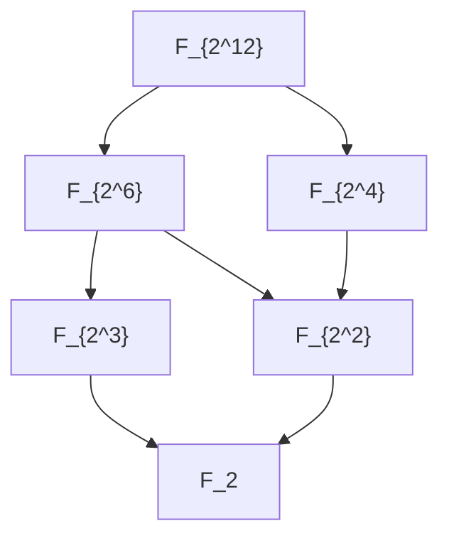

> **Prerequisites**: [[24-finite-fields-existence-and-uniqueness|24. Finite Fields — Existence and Uniqueness]], [[12-group-homomorphisms-and-isomorphism-theorems|12. Group Homomorphisms]]
> **Lesson type**: Math Component
>
> **Notation** (ký hiệu dùng mà không định nghĩa trong bài này):
> | Ký hiệu | Ý nghĩa |
> |---------|---------|
> | $\mathbb{F}_{p^n}$ | Trường hữu hạn $p^n$ phần tử |
> | $\operatorname{Gal}(K/F)$ | Nhóm Galois của mở rộng $K/F$ |
> | $\phi_p$ | Đồng cấu Frobenius $\alpha \mapsto \alpha^p$ |
> | $\mathbb{Z}/n\mathbb{Z}$ | Nhóm cyclic cấp $n$ |
> | $\gcd(a, b)$ | Ước chung lớn nhất của $a$ và $b$ |
> | $\operatorname{lcm}(a, b)$ | Bội chung nhỏ nhất của $a$ và $b$ |
> | $[K:F]$ | Bậc của mở rộng trường $K/F$ |

> **Objectives**:
> - Xác định hoàn toàn mạng trường con (subfield lattice) của $\mathbb{F}_{p^n}$
> - Định nghĩa và nghiên cứu đồng cấu Frobenius như một tự đẳng cấu trường
> - Tính nhóm Galois $\operatorname{Gal}(\mathbb{F}_{p^n}/\mathbb{F}_p)$ và chứng minh đẳng cấu với $\mathbb{Z}/n\mathbb{Z}$
> - Định nghĩa trace và norm từ $\mathbb{F}_{p^n}$ về $\mathbb{F}_p$

---

## Motivation

Ta đã biết trường $\mathbb{F}_{p^n}$ tồn tại và duy nhất. Giờ câu hỏi là: **cấu trúc bên trong** của $\mathbb{F}_{p^n}$ như thế nào? Nó có những trường con nào? Có bao nhiêu đối xứng (tự đẳng cấu)?

Câu trả lời cực kỳ gọn gàng: mạng các trường con của $\mathbb{F}_{p^n}$ phản chiếu chính xác mạng các ước của $n$; và mọi tự đẳng cấu của $\mathbb{F}_{p^n}$ cố định $\mathbb{F}_p$ đều là lũy thừa của một phép biến đổi duy nhất — **đồng cấu Frobenius** $x \mapsto x^p$.

---

## 1. Mạng trường con của $\mathbb{F}_{p^n}$

> [!abstract] Theorem 25.1 — Mạng trường con (Subfield Lattice)
> Cho $q = p^n$. Khi đó:
>
> 1. $\mathbb{F}_{p^m} \subseteq \mathbb{F}_{p^n}$ khi và chỉ khi $m \mid n$.
> 2. Với mỗi $m \mid n$, tồn tại **đúng một** trường con của $\mathbb{F}_{p^n}$ có cấp $p^m$, chính là $\mathbb{F}_{p^m}$.
> 3. Tổng quát hơn, $\mathbb{F}_{p^a} \cap \mathbb{F}_{p^b} = \mathbb{F}_{p^{\gcd(a,b)}}$ và $\mathbb{F}_{p^a} \mathbb{F}_{p^b} = \mathbb{F}_{p^{\operatorname{lcm}(a,b)}}$ (tích tạo bởi hợp nhất trong bao đóng).

**Proof.**

**$(\Rightarrow)$** Giả sử $\mathbb{F}_{p^m} \subseteq \mathbb{F}_{p^n}$. Tower Law:

$$
n = [\mathbb{F}_{p^n} : \mathbb{F}_p] = [\mathbb{F}_{p^n} : \mathbb{F}_{p^m}] \cdot [\mathbb{F}_{p^m} : \mathbb{F}_p] = [\mathbb{F}_{p^n} : \mathbb{F}_{p^m}] \cdot m
$$

Vậy $m \mid n$.

**$(\Leftarrow)$** Giả sử $m \mid n$. Ta cần $\mathbb{F}_{p^m} \subseteq \mathbb{F}_{p^n}$. Mọi $\alpha \in \mathbb{F}_{p^m}$ thỏa $\alpha^{p^m} = \alpha$. Vì $m \mid n$: viết $n = mk$, thì $\alpha^{p^n} = \alpha^{p^{mk}} = (\alpha^{p^m})^{p^{m(k-1)}} = \alpha^{p^{m(k-1)}}$. Lặp lại: $\alpha^{p^n} = \alpha$. Vậy $\alpha$ là nghiệm của $x^{p^n} - x$, tức $\alpha \in \mathbb{F}_{p^n}$. Suy ra $\mathbb{F}_{p^m} \subseteq \mathbb{F}_{p^n}$.

**Duy nhất:** Bất kỳ trường con $F \subseteq \mathbb{F}_{p^n}$ có cấp $p^m$ đều là trường phân rã của $x^{p^m} - x$ trên $\mathbb{F}_p$, và do tính duy nhất của trường hữu hạn: $F \cong \mathbb{F}_{p^m}$. $\blacksquare$

> [!example] Example 25.2 — Mạng trường con của $\mathbb{F}_{2^{12}}$
> Các ước của $12$: $\{1, 2, 3, 4, 6, 12\}$. Trường con tương ứng:
>
> $$
> \mathbb{F}_2 \subset \mathbb{F}_4 \subset \mathbb{F}_{16} \subset \mathbb{F}_{4096} = \mathbb{F}_{2^{12}}
> $$
>
> $$
> \mathbb{F}_2 \subset \mathbb{F}_8 \subset \mathbb{F}_{64} \subset \mathbb{F}_{2^{12}}
> $$
>
> Mạng đầy đủ (theo quan hệ bao hàm) tương ứng với mạng các ước của $12$:



---

## 2. Đồng cấu Frobenius

> [!definition] Definition 25.3 — Đồng cấu Frobenius (Frobenius Endomorphism)
> Cho $F$ là trường đặc số $p > 0$. **Đồng cấu Frobenius** là ánh xạ:
>
> $$
> \phi_p : F \to F, \quad \phi_p(\alpha) = \alpha^p
> $$
>
> Theo Corollary 24.4, $\phi_p$ là đồng cấu vành (ring homomorphism). Nếu $F$ hữu hạn, $\phi_p$ là tự đẳng cấu.

> [!note] Remark 25.4 — Lũy thừa của Frobenius
> Lũy thừa thứ $k$ của Frobenius là:
>
> $$
> \phi_p^k : F \to F, \quad \alpha \mapsto \alpha^{p^k}
> $$
>
> Với $F = \mathbb{F}_{p^n}$, ta có $\phi_p^n = \operatorname{id}_F$ (vì $\alpha^{p^n} = \alpha$ với mọi $\alpha$), và $n$ là số nguyên dương nhỏ nhất với tính chất đó (với phần tử sinh $\alpha$ tổng quát).

---

## 3. Nhóm Galois của $\mathbb{F}_{p^n}/\mathbb{F}_p$

> [!definition] Definition 25.5 — Nhóm Galois (Galois Group)
> **Nhóm Galois** của mở rộng $K/F$, ký hiệu $\operatorname{Gal}(K/F)$, là nhóm tất cả **tự đẳng cấu** (field automorphism) của $K$ cố định $F$:
>
> $$
> \operatorname{Gal}(K/F) = \{\sigma : K \xrightarrow{\sim} K \mid \sigma(a) = a\; \forall a \in F\}
> $$
>
> với phép toán nhóm là hợp thành ánh xạ.

> [!abstract] Theorem 25.6 — Galois group của $\mathbb{F}_{p^n}/\mathbb{F}_p$ là cyclic
> Nhóm Galois của mở rộng $\mathbb{F}_{p^n}/\mathbb{F}_p$ là nhóm cyclic cấp $n$, sinh bởi Frobenius:
>
> $$
> \operatorname{Gal}(\mathbb{F}_{p^n}/\mathbb{F}_p) \cong \mathbb{Z}/n\mathbb{Z}, \quad \text{sinh bởi } \phi_p
> $$

**Proof.**

**$\phi_p \in \operatorname{Gal}(\mathbb{F}_{p^n}/\mathbb{F}_p)$:** Frobenius là tự đẳng cấu của $\mathbb{F}_{p^n}$ (đã chứng minh trong Corollary 24.4). Với $a \in \mathbb{F}_p$: $a^p = a$ (Fermat nhỏ), nên $\phi_p(a) = a$. Vậy Frobenius cố định $\mathbb{F}_p$. ✓

**Bậc của $\phi_p$ bằng $n$:** $\phi_p^n = \operatorname{id}$ (vì $\alpha^{p^n} = \alpha$). Với $1 \leq k < n$: trường cố định (fixed field) của $\phi_p^k$ là $\{\alpha \in \mathbb{F}_{p^n} \mid \alpha^{p^k} = \alpha\} = \mathbb{F}_{p^{\gcd(k,n)}}$. Vì $\gcd(k,n) \leq k < n$, trường cố định là trường con thực sự của $\mathbb{F}_{p^n}$, nên $\phi_p^k \neq \operatorname{id}$.

**$|\operatorname{Gal}(\mathbb{F}_{p^n}/\mathbb{F}_p)| = n$:** Tổng quát, $|\operatorname{Gal}(K/F)| = [K:F]$ với mở rộng Galois. Với trường hữu hạn: $[\mathbb{F}_{p^n}:\mathbb{F}_p] = n$.

**Kết luận:** $\phi_p$ có bậc $n$ trong nhóm cấp $n$, nên $\phi_p$ là phần tử sinh, và $\operatorname{Gal}(\mathbb{F}_{p^n}/\mathbb{F}_p) = \langle \phi_p \rangle \cong \mathbb{Z}/n\mathbb{Z}$. $\blacksquare$

> [!example] Example 25.7 — Galois group của $\mathbb{F}_{2^4}/\mathbb{F}_2$
> $\operatorname{Gal}(\mathbb{F}_{16}/\mathbb{F}_2) \cong \mathbb{Z}/4\mathbb{Z} = \langle \phi_2 \rangle$, gồm 4 tự đẳng cấu:
>
> - $\phi_2^0 = \operatorname{id}$: $\alpha \mapsto \alpha$.
> - $\phi_2^1$: $\alpha \mapsto \alpha^2$.
> - $\phi_2^2$: $\alpha \mapsto \alpha^4$.
> - $\phi_2^3$: $\alpha \mapsto \alpha^8$.
>
> Với $\alpha$ sinh $\mathbb{F}_{16}^*$ (tức $\operatorname{ord}(\alpha) = 15$): bốn giá trị $\alpha, \alpha^2, \alpha^4, \alpha^8$ là bốn nghiệm liên hợp Galois của min poly của $\alpha$ trên $\mathbb{F}_2$.

> [!abstract] Theorem 25.8 — Tương ứng Galois — Subfield Lattice
> Qua lý thuyết Galois cho trường hữu hạn: các trường con $\mathbb{F}_{p^m}$ (với $m \mid n$) ứng với các nhóm con của $\mathbb{Z}/n\mathbb{Z}$ — cụ thể $\mathbb{F}_{p^m}$ ứng với nhóm con $\langle n/m \rangle \cong \mathbb{Z}/(n/m)\mathbb{Z}$ sinh bởi $\phi_p^{m}$:
>
> $$
> \mathbb{F}_{p^m} = \{\alpha \in \mathbb{F}_{p^n} \mid \phi_p^m(\alpha) = \alpha\} = \{\alpha \mid \alpha^{p^m} = \alpha\}
> $$

---

## 4. Trace và Norm

> [!definition] Definition 25.9 — Trace và Norm
> Cho $\mathbb{F}_{p^n}/\mathbb{F}_p$ là mở rộng bậc $n$. Định nghĩa:
>
> **Trace** (vết) $\operatorname{Tr} = \operatorname{Tr}_{\mathbb{F}_{p^n}/\mathbb{F}_p} : \mathbb{F}_{p^n} \to \mathbb{F}_p$:
>
> $$
> \operatorname{Tr}(\alpha) = \sum_{\sigma \in \operatorname{Gal}(\mathbb{F}_{p^n}/\mathbb{F}_p)} \sigma(\alpha) = \alpha + \alpha^p + \alpha^{p^2} + \cdots + \alpha^{p^{n-1}}
> $$
>
> **Norm** (chuẩn) $\operatorname{N} = \operatorname{N}_{\mathbb{F}_{p^n}/\mathbb{F}_p} : \mathbb{F}_{p^n} \to \mathbb{F}_p$:
>
> $$
> \operatorname{N}(\alpha) = \prod_{\sigma \in \operatorname{Gal}(\mathbb{F}_{p^n}/\mathbb{F}_p)} \sigma(\alpha) = \alpha \cdot \alpha^p \cdot \alpha^{p^2} \cdots \alpha^{p^{n-1}} = \alpha^{\frac{p^n - 1}{p - 1}}
> $$

> [!abstract] Theorem 25.10 — Tính chất Trace và Norm
> **(a)** $\operatorname{Tr}(\alpha) \in \mathbb{F}_p$ với mọi $\alpha \in \mathbb{F}_{p^n}$.
>
> **(b)** $\operatorname{Tr}$ là ánh xạ $\mathbb{F}_p$-tuyến tính và toàn ánh từ $\mathbb{F}_{p^n}$ lên $\mathbb{F}_p$.
>
> **(c)** $\operatorname{N}(\alpha) \in \mathbb{F}_p$ với mọi $\alpha$, và $\operatorname{N}(\alpha) = 0 \Leftrightarrow \alpha = 0$.
>
> **(d)** $\operatorname{N}(\alpha\beta) = \operatorname{N}(\alpha)\operatorname{N}(\beta)$ — Norm là đồng cấu nhóm $(\mathbb{F}_{p^n}^*, \cdot) \to (\mathbb{F}_p^*, \cdot)$.

**Proof (a) cho Trace.**

$$
\operatorname{Tr}(\alpha)^p = (\alpha + \alpha^p + \cdots + \alpha^{p^{n-1}})^p = \alpha^p + \alpha^{p^2} + \cdots + \alpha^{p^n} = \alpha^p + \cdots + \alpha^{p^{n-1}} + \alpha
$$

(dùng $\alpha^{p^n} = \alpha$ ở bước cuối). Vậy $\operatorname{Tr}(\alpha)^p = \operatorname{Tr}(\alpha)$, tức $\operatorname{Tr}(\alpha) \in \mathbb{F}_p$. $\blacksquare$

> [!example] Example 25.11 — Tính Trace trong $\mathbb{F}_4/\mathbb{F}_2$
> $\mathbb{F}_4 = \mathbb{F}_2(\alpha)$ với $\alpha^2 + \alpha + 1 = 0$, $n = 2$.
>
> $\operatorname{Tr}(\alpha) = \alpha + \alpha^2 = \alpha + (\alpha + 1) = 2\alpha + 1 = 1$ (trong $\mathbb{F}_2$: $2\alpha = 0$).
>
> $\operatorname{Tr}(\alpha + 1) = (\alpha+1) + (\alpha+1)^2 = (\alpha+1) + (\alpha^2+1) = \alpha + 1 + (\alpha+1) + 1 = 1$.
>
> $\operatorname{Tr}(1) = 1 + 1^2 = 1 + 1 = 0$ (trong $\mathbb{F}_2$).
>
> $\operatorname{Tr}(0) = 0$.
>
> Kiểm tra: Trace là toàn ánh lên $\mathbb{F}_2 = \{0, 1\}$: giá trị $0$ đạt được tại $0$ và $1$; giá trị $1$ đạt được tại $\alpha$ và $\alpha+1$. ✓

---

## SageMath Cheatsheet — Bài 25

```sage
# Cấu trúc của trường hữu hạn

# Mạng trường con của F_{2^12}
K = GF(2^12, 'a')
# Các trường con tương ứng với ước của 12
for d in [1, 2, 3, 4, 6, 12]:
    sub_exists = 12 % d == 0
    print(f"F_{{2^{d}}} ⊆ F_{{2^12}}: {sub_exists}")

# Frobenius automorphism
K = GF(2^4, 'a')
a = K.gen()
frob = K.frobenius_endomorphism()  # phi_2: x -> x^2
frob(a) == a^2                     # True
# frob^n = identity (với n = degree)
frob^4                              # Identity endomorphism of Finite Field

# Galois group
K = GF(2^4, 'a')
G = K.galois_group()
G.order()                          # 4 = n
list(G)                            # [(), (1,2,3,4)]

# Trace và Norm
K = GF(2^4, 'a')
a = K.gen()
a.trace()                          # Tr(a) ∈ F_2
a.norm()                           # N(a) ∈ F_2
```

---

## Summary — Bài 25

- **Mạng trường con**: $\mathbb{F}_{p^m} \subseteq \mathbb{F}_{p^n} \Leftrightarrow m \mid n$. Duy nhất với mỗi $m \mid n$.
- Giao: $\mathbb{F}_{p^a} \cap \mathbb{F}_{p^b} = \mathbb{F}_{p^{\gcd(a,b)}}$; Hội: $\mathbb{F}_{p^a}\mathbb{F}_{p^b} = \mathbb{F}_{p^{\operatorname{lcm}(a,b)}}$.
- **Frobenius** $\phi_p : \alpha \mapsto \alpha^p$ là tự đẳng cấu bậc $n$ của $\mathbb{F}_{p^n}$.
- $\operatorname{Gal}(\mathbb{F}_{p^n}/\mathbb{F}_p) \cong \mathbb{Z}/n\mathbb{Z}$, sinh bởi Frobenius — tất cả đối xứng đều là lũy thừa của Frobenius.
- **Trace** $\operatorname{Tr} = \sum_{k=0}^{n-1} \alpha^{p^k}$: ánh xạ tuyến tính toàn ánh lên $\mathbb{F}_p$.
- **Norm** $\operatorname{N} = \prod_{k=0}^{n-1} \alpha^{p^k} = \alpha^{(p^n-1)/(p-1)}$: đồng cấu nhóm nhân.

---

## References — Bài 25

- Dummit, D. S., & Foote, R. M. *Abstract Algebra* (3rd ed.), §13.5–14.3.
- Lidl, R., & Niederreiter, H. *Finite Fields* (2nd ed.), Chapter 2.
- Lang, S. *Algebra* (3rd ed.), Chapter V §5.
- Ireland, K., & Rosen, M. *A Classical Introduction to Modern Number Theory*, Chapter 7.
