> **Prerequisites**: [[12-group-homomorphisms-and-isomorphism-theorems|12. Group Homomorphisms and Isomorphism Theorems]]
> **Lesson type**: Math Component — Appendix
>
> **Notation** (ký hiệu dùng mà không định nghĩa trong bài này):
> | Ký hiệu | Ý nghĩa |
> |---------|---------|
> | $G, H$ | Nhóm |
> | $\varphi: G \to H$ | Đồng cấu nhóm |
> | $\ker\varphi$ | Hạt nhân của $\varphi$ |
> | $\operatorname{Im}(\varphi)$ | Ảnh của $\varphi$ |
> | $N \trianglelefteq G$ | $N$ là nhóm con chuẩn tắc của $G$ |
> | $G/N$ | Nhóm thương |
> | $e_G, e_H$ | Phần tử đơn vị |
> | $\cong$ | Đẳng cấu nhóm |

---

## Motivation

Các định lý đẳng cấu (Isomorphism Theorems) là bộ công cụ trung tâm của đại số trừu tượng. Chúng cho phép ta "nhận dạng" các nhóm thương — thay vì làm việc trực tiếp với các lớp coset phức tạp, ta có thể đồng nhất $G/\ker\varphi$ với một nhóm con quen thuộc của $H$. Định lý đẳng cấu thứ nhất là nền tảng; các định lý thứ hai, thứ ba, và thứ tư (tương ứng) đều suy ra từ nó. Phụ lục này trình bày chứng minh hoàn chỉnh của cả bốn định lý, kèm ví dụ minh họa và sơ đồ giao hoán.

---

## 1. Định lý Đẳng cấu Thứ nhất

> [!abstract] Theorem A1.1 — First Isomorphism Theorem for Groups
> Cho $\varphi: G \to H$ là một đồng cấu nhóm (group homomorphism). Khi đó:
>
> $$
> G/\ker\varphi \cong \operatorname{Im}(\varphi).
> $$
>
> Cụ thể, ánh xạ $\bar{\varphi}: G/\ker\varphi \to \operatorname{Im}(\varphi)$ định bởi $\bar{\varphi}(g\ker\varphi) = \varphi(g)$ là một đẳng cấu nhóm.

### Chứng minh

Đặt $K = \ker\varphi = \{g \in G : \varphi(g) = e_H\}$.

**Bước 1: $K \trianglelefteq G$ (nhóm con chuẩn tắc).**

Với $g \in G$, $k \in K$:

$$
\varphi(gkg^{-1}) = \varphi(g)\varphi(k)\varphi(g^{-1}) = \varphi(g) \cdot e_H \cdot \varphi(g)^{-1} = e_H.
$$

Vậy $gkg^{-1} \in K$, suy ra $K \trianglelefteq G$. Điều này cho phép ta định nghĩa nhóm thương $G/K$.

**Bước 2: $\bar{\varphi}$ xác định tốt (well-defined).**

Cần kiểm tra: nếu $g_1 K = g_2 K$ thì $\varphi(g_1) = \varphi(g_2)$.

$$
g_1 K = g_2 K \iff g_2^{-1}g_1 \in K \iff \varphi(g_2^{-1}g_1) = e_H \iff \varphi(g_2)^{-1}\varphi(g_1) = e_H \iff \varphi(g_1) = \varphi(g_2).
$$

Vậy $\bar{\varphi}$ được định nghĩa tốt. $\checkmark$

**Bước 3: $\bar{\varphi}$ là đồng cấu nhóm.**

$$
\bar{\varphi}((g_1 K)(g_2 K)) = \bar{\varphi}((g_1 g_2)K) = \varphi(g_1 g_2) = \varphi(g_1)\varphi(g_2) = \bar{\varphi}(g_1 K)\bar{\varphi}(g_2 K). \checkmark
$$

**Bước 4: $\bar{\varphi}$ là đơn ánh.**

$$
\ker\bar{\varphi} = \{gK : \bar{\varphi}(gK) = e_H\} = \{gK : \varphi(g) = e_H\} = \{gK : g \in K\} = \{K\} = e_{G/K}.
$$

Hạt nhân tầm thường $\implies$ đơn ánh. $\checkmark$

**Bước 5: $\bar{\varphi}$ là toàn ánh lên $\operatorname{Im}(\varphi)$.**

Với $h \in \operatorname{Im}(\varphi)$, tồn tại $g \in G$ với $\varphi(g) = h$. Khi đó $\bar{\varphi}(gK) = \varphi(g) = h$. $\checkmark$

**Kết luận:** $\bar{\varphi}: G/K \to \operatorname{Im}(\varphi)$ là đẳng cấu nhóm. $\blacksquare$

---

## 2. Sơ đồ Giao hoán

Định lý được tóm tắt bởi sơ đồ giao hoán sau, trong đó $\pi: g \mapsto gK$ là phép chiếu chính tắc:

```mermaid
graph LR
    G["G"] -->|"&phi;"| H["H"]
    G -->|"&pi;"| GK["G/K"]
    GK -->|"&phi;&#773; (isomorphism)"| Im["Im(&phi;)"]
```



*Sơ đồ giao hoán: $\varphi = \bar{\varphi} \circ \pi$. Mũi tên $G/K \to \operatorname{Im}(\varphi)$ là đẳng cấu.*

---

## 3. Ví dụ Kinh điển

> [!example] Example A1.2 — Định thức (Determinant)
> Xét đồng cấu $\det: GL_n(\mathbb{R}) \to \mathbb{R}^\times$. Ta có:
> - $\ker(\det) = SL_n(\mathbb{R})$ (ma trận có định thức $1$).
> - $\operatorname{Im}(\det) = \mathbb{R}^\times$ (toàn ánh: với $r \neq 0$, ma trận $\operatorname{diag}(r, 1, \ldots, 1)$ có định thức $r$).
>
> Theo First Isomorphism Theorem:
>
> $$
> GL_n(\mathbb{R}) / SL_n(\mathbb{R}) \cong \mathbb{R}^\times.
> $$

> [!example] Example A1.3 — Dấu của hoán vị (Sign)
> Xét đồng cấu dấu $\operatorname{sgn}: S_n \to \{\pm 1\}$. Ta có:
> - $\ker(\operatorname{sgn}) = A_n$ (nhóm thay phiên — các hoán vị chẵn).
> - $\operatorname{Im}(\operatorname{sgn}) = \{\pm 1\}$ (toàn ánh với $n \geq 2$).
>
> Theo First Isomorphism Theorem:
>
> $$
> S_n / A_n \cong \{\pm 1\} \cong \mathbb{Z}/2\mathbb{Z}.
> $$

> [!example] Example A1.4 — Ánh xạ mũ phức
> Xét $\varphi: \mathbb{R} \to \mathbb{C}^\times$ định bởi $\varphi(t) = e^{2\pi i t}$.
> - $\ker\varphi = \mathbb{Z}$.
> - $\operatorname{Im}(\varphi) = S^1 = \{z \in \mathbb{C} : |z| = 1\}$.
>
> Vậy $\mathbb{R}/\mathbb{Z} \cong S^1$.

---

## 4. Định lý Đẳng cấu Thứ hai

> [!abstract] Theorem A1.5 — Second Isomorphism Theorem (Diamond Theorem)
> Cho $H \leq G$ và $N \trianglelefteq G$. Khi đó $HN = \{hn : h \in H, n \in N\} \leq G$, $H \cap N \trianglelefteq H$, và:
>
> $$
> H/(H \cap N) \cong HN/N.
> $$

**Proof.**
Xét đồng cấu $\varphi: H \to HN/N$ định bởi $\varphi(h) = hN$.

- $\varphi$ là đồng cấu: $\varphi(h_1 h_2) = (h_1 h_2)N = (h_1 N)(h_2 N) = \varphi(h_1)\varphi(h_2)$.
- $\ker\varphi = \{h \in H : hN = N\} = \{h \in H : h \in N\} = H \cap N$.
- $\operatorname{Im}(\varphi) = \{hN : h \in H\} = HN/N$ (định nghĩa của $HN/N$).

Áp dụng First Isomorphism Theorem: $H/(H \cap N) \cong HN/N$. $\blacksquare$

> [!info] Tên gọi "Diamond Theorem"
> Sơ đồ mạng (lattice) của các nhóm con tạo thành hình thoi (diamond):
>
> ```
>        HN
>       /  \
>      H    N
>       \  /
>      H∩N
> ```
>
> Định lý nói rằng hai "mặt" của hình thoi là đẳng cấu: $H/(H\cap N) \cong HN/N$.

---

## 5. Định lý Đẳng cấu Thứ ba

> [!abstract] Theorem A1.6 — Third Isomorphism Theorem
> Cho $H, N \trianglelefteq G$ với $N \subseteq H$. Khi đó $H/N \trianglelefteq G/N$ và:
>
> $$
> (G/N)/(H/N) \cong G/H.
> $$

**Proof.**
Xét đồng cấu $\varphi: G/N \to G/H$ định bởi $\varphi(gN) = gH$.

- **Well-defined**: Nếu $g_1 N = g_2 N$ thì $g_2^{-1}g_1 \in N \subseteq H$, nên $g_2^{-1}g_1 \in H$, tức $g_1 H = g_2 H$.
- $\ker\varphi = \{gN : gH = H\} = \{gN : g \in H\} = H/N$.
- $\operatorname{Im}(\varphi) = G/H$ (toàn ánh: với $gH \in G/H$, $\varphi(gN) = gH$).

Áp dụng First Isomorphism Theorem: $(G/N)/(H/N) \cong G/H$. $\blacksquare$

> [!tip] Trực giác
> Định lý thứ ba nói rằng "giản ước" $N$ ở tử và mẫu là hợp lệ: $(G/N)/(H/N) \cong G/H$, giống như $(a/c)/(b/c) = a/b$ trong số học.

---

## 6. Định lý Tương ứng (Fourth Isomorphism Theorem)

> [!abstract] Theorem A1.7 — Correspondence Theorem (Fourth Isomorphism Theorem)
> Cho $N \trianglelefteq G$. Ánh xạ:
>
> $$
> \Phi: \{\text{nhóm con của } G \text{ chứa } N\} \longrightarrow \{\text{nhóm con của } G/N\}
> $$
>
> định bởi $\Phi(H) = H/N$ là một **song ánh** bảo toàn thứ tự (lattice isomorphism). Hơn nữa:
>
> - $H_1 \leq H_2 \iff H_1/N \leq H_2/N$.
> - $H_1 \trianglelefteq H_2 \iff H_1/N \trianglelefteq H_2/N$.
> - $[H_2 : H_1] = [H_2/N : H_1/N]$.

> [!example] Example A1.8 — Nhóm con của $\mathbb{Z}/12\mathbb{Z}$
> $G = \mathbb{Z}$, $N = 12\mathbb{Z}$. Các nhóm con của $\mathbb{Z}$ chứa $12\mathbb{Z}$ là:
>
> $$
> \mathbb{Z} \supseteq 2\mathbb{Z} \supseteq 4\mathbb{Z} \supseteq 6\mathbb{Z} \supseteq 12\mathbb{Z}
> $$
>
> (và $3\mathbb{Z}$, nhưng $3\mathbb{Z} \not\supseteq 4\mathbb{Z}$). Dưới Correspondence Theorem, chúng tương ứng với:
>
> $$
> \mathbb{Z}/12\mathbb{Z} \supseteq \langle 2 \rangle \supseteq \langle 4 \rangle \supseteq \langle 6 \rangle \supseteq \{0\}
> $$
>
> với cấp tương ứng $12, 6, 3, 2, 1$ — đúng bằng các ước của $12$.

---

## 7. SageMath — Kiểm tra Định lý Đẳng cấu

```sage
# First Isomorphism Theorem: S_n / A_n ≅ Z/2Z
n = 5
Sn = SymmetricGroup(n)
An = AlternatingGroup(n)

# Đồng cấu dấu: sgn
def sign_hom(g):
    return 1 if g.is_even() else -1

# Tính nhóm thương (qua SageMath)
quotient = Sn.quotient(An)
print(f"S_{n} / A_{n} có cấp: {quotient.order()}")  # 2

# Kiểm tra đẳng cấu với Z/2Z
Z2 = CyclicPermutationGroup(2)
print(f"Đẳng cấu với Z/2Z? {quotient.is_isomorphic(Z2)}")  # True

# Second Isomorphism Theorem: H/(H∩N) ≅ HN/N
G = SymmetricGroup(4)
N = G.subgroup([G("(1,2)(3,4)"), G("(1,3)(2,4)")])  # V4
H = G.subgroup([G("(1,2,3)")])  # cyclic cấp 3

HN = G.subgroup(list(H) + list(N))
print(f"\n|HN| = {HN.order()}")  # 12

lhs = H.quotient(H.intersection(N))
rhs = HN.quotient(N)
print(f"H/(H∩N) ≅ HN/N? {lhs.is_isomorphic(rhs)}")  # True
```

---

## References

- Dummit & Foote, *Abstract Algebra* (3rd ed.), Section 3.3, Theorems 14, 17, 18.
- Lang, *Algebra* (3rd ed.), Chapter I §4.
- Hungerford, *Algebra*, Theorem 4.1–4.4 (Chapter I).
- Judson, *Abstract Algebra: Theory and Applications*, Chapter 9.
- Conrad, K., *The First Isomorphism Theorem* (UConn lecture notes).
