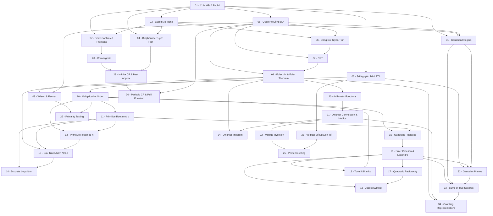

> **Level**: Undergraduate (bắt đầu từ phổ thông)  
> **Background**: Toán phổ thông — chưa học đại số trừu tượng  
> **SageMath**: Có  
> **Sources**: Niven–Zuckerman–Montgomery, Koblitz, Ireland–Rosen, Hardy–Wright

---

## Lessons

### Module 0 — Nền Tảng Chia Hết (Divisibility) ★

| # | Title | Key Concepts | Prerequisites | Difficulty |
|---|-------|-------------|---------------|------------|
| 01 | Tính Chia Hết và Thuật Toán Euclid | Quan hệ chia hết, định lý chia có dư, GCD, LCM, thuật toán Euclid | — | ★☆☆☆☆ |
| 02 | Thuật Toán Euclid Mở Rộng | Extended Euclidean Algorithm, Bézout identity, nghịch đảo modulo | 01 | ★★☆☆☆ |
| 03 | Số Nguyên Tố và Định Lý Cơ Bản | Số nguyên tố, hợp số, Định Lý Cơ Bản Số Học (FTA), tính duy nhất phân tích | 01 | ★★☆☆☆ |
| 04 | Phương Trình Diophantine Tuyến Tính | Nghiệm nguyên $ax+by=c$, điều kiện tồn tại, mô tả toàn bộ nghiệm | 01, 02 | ★★☆☆☆ |

### Module 1 — Đồng Dư và Các Định Lý Cổ Điển (Congruences) ★★

| # | Title | Key Concepts | Prerequisites | Difficulty |
|---|-------|-------------|---------------|------------|
| 05 | Quan Hệ Đồng Dư | Định nghĩa $a \equiv b \pmod{n}$, tính chất, lớp đồng dư, vành $\mathbb{Z}/n\mathbb{Z}$ | 01 | ★★☆☆☆ |
| 06 | Đồng Dư Tuyến Tính | Phương trình $ax \equiv b \pmod{n}$, điều kiện nghiệm, thuật toán giải | 02, 05 | ★★☆☆☆ |
| 07 | Định Lý Thặng Dư Trung Hoa | CRT dạng hệ phương trình, đẳng cấu vành $\mathbb{Z}/mn\mathbb{Z} \cong \mathbb{Z}/m\mathbb{Z} \times \mathbb{Z}/n\mathbb{Z}$ | 05, 06 | ★★★☆☆ |
| 08 | Định Lý Wilson và Fermat Nhỏ | Wilson's Theorem, Fermat's Little Theorem, chứng minh và ý nghĩa | 05, 03 | ★★★☆☆ |
| 09 | Hàm Euler $\varphi$ và Định Lý Euler | Định nghĩa $\varphi(n)$, tính nhân tính, Euler's Theorem $a^{\varphi(n)} \equiv 1$ | 05, 07 | ★★★☆☆ |

### Module 2 — Cấu Trúc Nhóm Nhân (Multiplicative Group Structure) ★★★

| # | Title | Key Concepts | Prerequisites | Difficulty |
|---|-------|-------------|---------------|------------|
| 10 | Bậc Nhân Tử (Multiplicative Order) | $\text{ord}_n(a)$, tính chất chia, liên hệ $\varphi(n)$, phần tử bậc hữu hạn | 09 | ★★★☆☆ |
| 11 | Primitive Root modulo Số Nguyên Tố | Định nghĩa generator, tồn tại primitive root mod $p$, đếm primitive roots | 10 | ★★★☆☆ |
| 12 | Primitive Root modulo $n$ Tổng Quát | Khi nào $(\mathbb{Z}/n\mathbb{Z})^*$ cyclic? Phân loại $n$ có primitive root | 10, 11 | ★★★★☆ |
| 13 | Cấu Trúc của $(\mathbb{Z}/n\mathbb{Z})^*$ | Phân tích nhóm nhân qua CRT, cấu trúc nhóm Abel hữu hạn (tự phát sinh) | 09, 11, 12 | ★★★★☆ |
| 14 | Logarithm Rời Rạc | Bài toán $g^x \equiv a \pmod{p}$, tính chất nghiệm, thuật toán Baby-step Giant-step | 11, 13 | ★★★★☆ |

### Module 3 — Thặng Dư Bậc Hai (Quadratic Residues) ★★★

| # | Title | Key Concepts | Prerequisites | Difficulty |
|---|-------|-------------|---------------|------------|
| 15 | Thặng Dư Bậc Hai | Định nghĩa QR/QNR, đếm QR modulo $p$, ví dụ cụ thể | 10, 11 | ★★★☆☆ |
| 16 | Tiêu Chuẩn Euler và Ký Hiệu Legendre | Euler's Criterion, Legendre symbol $\left(\frac{a}{p}\right)$, tính nhân tính | 15 | ★★★☆☆ |
| 17 | Luật Tương Hỗ Bậc Hai | Phát biểu, Gauss's Lemma, chứng minh hình học (đếm điểm nguyên), ứng dụng | 16 | ★★★★☆ |
| 18 | Ký Hiệu Jacobi | Mở rộng Legendre symbol sang $n$ hợp số, tính chất, phân biệt với Legendre | 16, 17 | ★★★☆☆ |
| 19 | Căn Bậc Hai Modulo $p$ — Tonelli-Shanks | Tính $\sqrt{a} \pmod{p}$, phân tích $p-1 = 2^s \cdot q$, thuật toán đầy đủ | 16, 10 | ★★★★☆ |

### Module 4 — Hàm Số Học (Arithmetic Functions) ★★★

| # | Title | Key Concepts | Prerequisites | Difficulty |
|---|-------|-------------|---------------|------------|
| 20 | Hàm Số Học và Tính Nhân Tính | Định nghĩa hàm số học, hàm nhân tính (multiplicative), ví dụ $\varphi$, $\tau$, $\sigma$, $\text{id}$ | 09 | ★★★☆☆ |
| 21 | Tích Chập Dirichlet và Hàm Möbius | Dirichlet convolution, hàm đơn vị, hàm $\mu(n)$, nghịch đảo Dirichlet | 20 | ★★★★☆ |
| 22 | Công Thức Đảo Möbius | $f = g * \mathbf{1} \iff g = f * \mu$, ứng dụng tính $\varphi$, von Mangoldt $\Lambda$ | 21 | ★★★★☆ |

### Module 5 — Phân Phối Số Nguyên Tố (Prime Distribution) ★★★–★★★★

| # | Title | Key Concepts | Prerequisites | Difficulty |
|---|-------|-------------|---------------|------------|
| 23 | Vô Hạn Số Nguyên Tố — Các Cách Chứng Minh | Chứng minh Euclid, Euler ($\zeta$), Erdős, tô-pô (Furstenberg) | 03 | ★★★☆☆ |
| 24 | Số Nguyên Tố Trong Cấp Số Cộng | Định lý Dirichlet (phát biểu), ý tưởng $L$-function, ví dụ $4k+1$, $4k+3$ | 09, 21 | ★★★★☆ |
| 25 | Hàm Đếm Số Nguyên Tố | $\pi(x)$, $\theta(x)$, $\psi(x)$, Prime Number Theorem (phát biểu), Bertrand's Postulate + chứng minh | 22, 23 | ★★★★☆ |
| 26 | Kiểm Tra Tính Nguyên Tố | Fermat test, giả nguyên tố (pseudoprime), Carmichael numbers, Miller-Rabin | 08, 10 | ★★★★☆ |

### Module 6 — Phân Số Liên Tục (Continued Fractions) ★★★

| # | Title | Key Concepts | Prerequisites | Difficulty |
|---|-------|-------------|---------------|------------|
| 27 | Phân Số Liên Tục Hữu Hạn | Định nghĩa $[a_0; a_1, \ldots, a_n]$, liên hệ với Euclid, phân tích phân số hữu tỉ, tính không duy nhất, biểu diễn chuẩn | 01, 02 | ★★★☆☆ |
| 28 | Phân Số Hội Tụ (Convergents) | Công thức truy hồi $p_n = a_n p_{n-1} + p_{n-2}$, $q_n = a_n q_{n-1} + q_{n-2}$, đẳng thức $p_n q_{n-1} - p_{n-1} q_n = (-1)^n$, tính xen kẽ, gcd$(p_n, q_n)=1$ | 27 | ★★★☆☆ |
| 29 | Phân Số Liên Tục Vô Hạn và Xấp Xỉ Tốt Nhất | Số vô tỉ = CF vô hạn duy nhất, convergents là xấp xỉ tốt nhất, định lý Dirichlet, định lý Hurwitz $\lvert\alpha - p/q\rvert < 1/(\sqrt{5}\,q^2)$, số vô tỉ Liouville | 28, 04 | ★★★★☆ |
| 30 | CF Tuần Hoàn và Phương Trình Pell | CF thuần tuần hoàn ↔ số vô tỉ bậc hai thu gọn, định lý Lagrange (→ A4), CF của $\sqrt{d}$, nghiệm cơ bản phương trình Pell $x^2 - dy^2 = 1$, vô hạn nghiệm qua luỹ thừa | 29, 05 | ★★★★☆ |

### Module 7 — Số Nguyên Gauss và Tổng Hai Bình Phương (Gaussian Integers & Sums of Two Squares) ★★★–★★★★

| # | Title | Key Concepts | Prerequisites | Difficulty |
|---|-------|-------------|---------------|------------|
| 31 | Số Nguyên Gauss $\mathbb{Z}[i]$ | Định nghĩa $\mathbb{Z}[i]$, norm $N(a+bi)=a^2+b^2$, tính nhân tính, units $\{\pm 1, \pm i\}$, associates, thuật toán chia, $\mathbb{Z}[i]$ là Euclidean Domain | 01, 02, 05 | ★★★☆☆ |
| 32 | Số Nguyên Tố Gauss — Phân Loại | Gaussian prime, liên hệ $N(\pi)$ với rational prime, phân loại $p=2$ ramified, $p\equiv 1(4)$ split, $p\equiv 3(4)$ inert; unique factorization, GCD | 03, 16, 31 | ★★★★☆ |
| 33 | Tổng Hai Bình Phương — Định Lý Fermat | $p\equiv 1(4) \iff p=a^2+b^2$ duy nhất, chứng minh qua Gaussian integers, đặc trưng tổng quát: $n=a^2+b^2 \iff \forall q\equiv 3(4), v_q(n)$ chẵn, Brahmagupta–Fibonacci identity | 16, 31, 32 | ★★★★☆ |
| 34 | Đếm Số Biểu Diễn và Ứng Dụng | $r_2(n)=4(d_1(n)-d_3(n))$, chứng minh qua đếm factorization, primitive Pythagorean triples $(u^2-v^2,2uv,u^2+v^2)$ qua $\mathbb{Z}[i]$, liên hệ các vành quadratic khác | 09, 21, 33 | ★★★★☆ |

---

## Appendix Candidates

| ID | Theorem | Related Lesson | Ghi chú |
|----|---------|----------------|---------|
| A0 | Định Lý Cơ Bản Số Học — Chứng minh đầy đủ | [[03-primes-and-fta\|03]] | Chứng minh tính duy nhất qua Well-ordering + Euclid's Lemma |
| A1 | Chinese Remainder Theorem — Chứng minh constructive | [[07-chinese-remainder-theorem\|07]] | Xây dựng nghiệm tường minh, chứng minh đẳng cấu vành |
| A2 | Luật Tương Hỗ Bậc Hai — Chứng minh hình học đầy đủ | [[17-law-of-quadratic-reciprocity\|17]] | Gauss's Lemma + đếm điểm nguyên trong hình chữ nhật |
| A3 | Bertrand's Postulate — Chứng minh Chebyshev | [[25-prime-counting-functions\|25]] | Chứng minh sơ cấp, phân tích $\binom{2n}{n}$ |
| A4 | Định Lý Lagrange về CF Tuần Hoàn — Chứng minh đầy đủ | [[30-periodic-continued-fractions-and-pell-equation\|30]] | Số vô tỉ bậc hai ↔ CF eventually periodic; hai chiều hoàn chỉnh |
| A5 | Định Lý Fermat về $p=a^2+b^2$ — Chứng minh descent đầy đủ | [[33-sums-of-two-squares\|33]] | Phương pháp descent vô hạn của Fermat, chứng minh hình học |
| A6 | Công thức $r_2(n)=4(d_1(n)-d_3(n))$ — Chứng minh đầy đủ | [[34-counting-representations\|34]] | Chứng minh qua unique factorization trong $\mathbb{Z}[i]$ và đếm ước |

---

## Dependency Graph

---

## Progress Tracker

**Module 0 — Divisibility**
- [ ] [[01-divisibility-and-euclidean-algorithm|01. Tính Chia Hết và Thuật Toán Euclid]]
- [ ] [[02-extended-euclidean-algorithm|02. Thuật Toán Euclid Mở Rộng]]
- [ ] [[03-primes-and-fta|03. Số Nguyên Tố và Định Lý Cơ Bản]]
- [ ] [[04-linear-diophantine-equations|04. Phương Trình Diophantine Tuyến Tính]]

**Module 1 — Congruences**
- [ ] [[05-congruences|05. Quan Hệ Đồng Dư]]
- [ ] [[06-linear-congruences|06. Đồng Dư Tuyến Tính]]
- [ ] [[07-chinese-remainder-theorem|07. Định Lý Thặng Dư Trung Hoa]]
- [ ] [[08-wilson-and-fermat|08. Định Lý Wilson và Fermat Nhỏ]]
- [ ] [[09-euler-phi-and-euler-theorem|09. Hàm Euler phi và Định Lý Euler]]

**Module 2 — Multiplicative Group Structure**
- [ ] [[10-multiplicative-order|10. Bậc Nhân Tử]]
- [ ] [[11-primitive-roots-mod-prime|11. Primitive Root modulo Số Nguyên Tố]]
- [ ] [[12-primitive-roots-general|12. Primitive Root modulo n Tổng Quát]]
- [ ] [[13-structure-of-multiplicative-group|13. Cấu Trúc của (Z/nZ)*]]
- [ ] [[14-discrete-logarithm|14. Logarithm Rời Rạc]]

**Module 3 — Quadratic Residues**
- [ ] [[15-quadratic-residues|15. Thặng Dư Bậc Hai]]
- [ ] [[16-euler-criterion-and-legendre-symbol|16. Tiêu Chuẩn Euler và Ký Hiệu Legendre]]
- [ ] [[17-law-of-quadratic-reciprocity|17. Luật Tương Hỗ Bậc Hai]]
- [ ] [[18-jacobi-symbol|18. Ký Hiệu Jacobi]]
- [ ] [[19-tonelli-shanks|19. Căn Bậc Hai Modulo p — Tonelli-Shanks]]

**Module 4 — Arithmetic Functions**
- [ ] [[20-arithmetic-functions|20. Hàm Số Học và Tính Nhân Tính]]
- [ ] [[21-dirichlet-convolution-and-mobius|21. Tích Chập Dirichlet và Hàm Möbius]]
- [ ] [[22-mobius-inversion|22. Công Thức Đảo Möbius]]

**Module 5 — Prime Distribution**
- [ ] [[23-infinitude-of-primes|23. Vô Hạn Số Nguyên Tố]]
- [ ] [[24-dirichlet-theorem|24. Số Nguyên Tố Trong Cấp Số Cộng]]
- [ ] [[25-prime-counting-functions|25. Hàm Đếm Số Nguyên Tố]]
- [ ] [[26-primality-testing|26. Kiểm Tra Tính Nguyên Tố]]

**Module 6 — Continued Fractions**
- [ ] [[27-finite-continued-fractions|27. Phân Số Liên Tục Hữu Hạn]]
- [ ] [[28-convergents|28. Phân Số Hội Tụ (Convergents)]]
- [ ] [[29-infinite-continued-fractions-and-best-approximation|29. Phân Số Liên Tục Vô Hạn và Xấp Xỉ Tốt Nhất]]
- [ ] [[30-periodic-continued-fractions-and-pell-equation|30. CF Tuần Hoàn và Phương Trình Pell]]

**Module 7 — Gaussian Integers & Sums of Two Squares**
- [ ] [[31-gaussian-integers|31. Số Nguyên Gauss Z[i]]]
- [ ] [[32-gaussian-primes|32. Số Nguyên Tố Gauss — Phân Loại]]
- [ ] [[33-sums-of-two-squares|33. Tổng Hai Bình Phương — Định Lý Fermat]]
- [ ] [[34-counting-representations|34. Đếm Số Biểu Diễn và Ứng Dụng]]

**Appendices**
- [ ] [[a0-proof-of-fta|A0. Định Lý Cơ Bản Số Học — Chứng Minh Đầy Đủ]]
- [ ] [[a1-proof-of-crt|A1. Chinese Remainder Theorem — Chứng Minh Constructive]]
- [ ] [[a2-proof-of-quadratic-reciprocity|A2. Luật Tương Hỗ Bậc Hai — Chứng Minh Hình Học]]
- [ ] [[a3-proof-of-bertrand-postulate|A3. Bertrand's Postulate — Chứng Minh Chebyshev]]
- [ ] [[a4-proof-of-lagrange-periodic-cf-theorem|A4. Định Lý Lagrange về CF Tuần Hoàn — Chứng Minh Đầy Đủ]]
- [ ] [[a5-proof-of-fermat-two-squares|A5. Định Lý Fermat về p = a^2 + b^2]]
- [ ] [[a6-proof-of-r2-formula|A6. Công thức r_2(n) = 4(d1 - d3)]]
