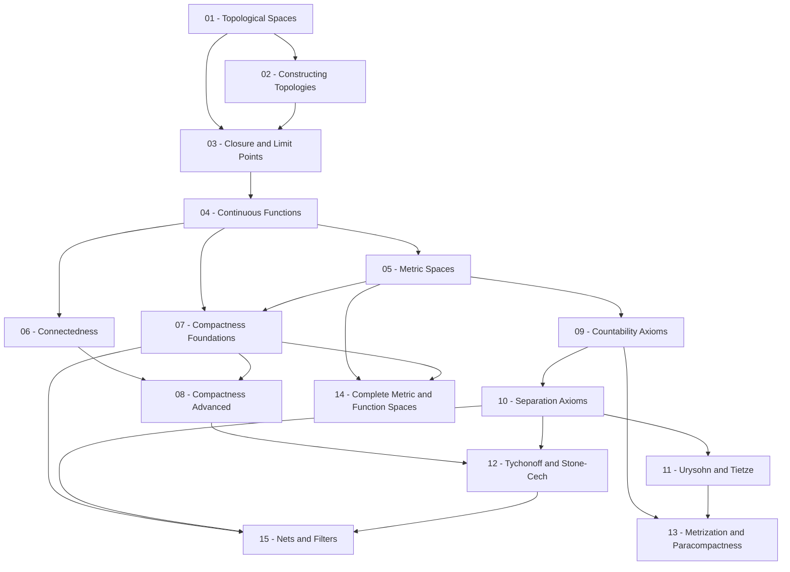

> **Level**: Graduate
> **Background**: Calculus/Analysis cơ bản, Đại số tuyến tính, Lý thuyết tập hợp & Logic
> **SageMath**: Có
> **Plugin Theorem**: Không
> **Sources**: Munkres – *Topology* (2nd ed.), Willard – *General Topology*, MIT OCW 18.901, UCLA Sharifi Notes, Hatcher – *Algebraic Topology* (Ch.1)

---

## Lessons

| # | Title | Key Concepts | Prerequisites | Difficulty |
|---|-------|-------------|---------------|------------|
| 01 | Topological Spaces | Tiên đề topology, open/closed sets, discrete/trivial topology, neighborhoods, basis, subbasis | — | ★☆☆☆☆ |
| 02 | Constructing Topologies | Subspace topology, order topology, product topology (hữu hạn & vô hạn), box topology | 01 | ★★☆☆☆ |
| 03 | Closure, Interior, and Limit Points | Closure, interior, boundary, limit points, dense sets, convergence của dãy | 01, 02 | ★★☆☆☆ |
| 04 | Continuous Functions & Homeomorphisms | Định nghĩa liên tục qua open sets, homeomorphism, pasting lemma, tính chất topo | 01–03 | ★★☆☆☆ |
| 05 | Metric Spaces | Metric, metric topology, equivalent metrics, metrizability, uniform continuity | 01–04 | ★★★☆☆ |
| 06 | Connectedness | Connected space, path-connectedness, components, local connectedness, ví dụ ngược | 01–04 | ★★★☆☆ |
| 07 | Compactness — Foundations | Open cover, Heine-Borel, compactness trong metric spaces, limit point compactness | 01–05 | ★★★☆☆ |
| 08 | Compactness — Advanced | Local compactness, one-point compactification, compactness & continuous maps | 06, 07 | ★★★★☆ |
| 09 | Countability Axioms | First/second countability, separability, Lindelöf spaces, quan hệ giữa các axiom | 01–05 | ★★★☆☆ |
| 10 | Separation Axioms | T0–T4, Hausdorff, regular, completely regular, normal, ví dụ phân biệt các lớp | 01–05, 09 | ★★★★☆ |
| 11 | Urysohn's Lemma & Tietze Extension | Urysohn's Lemma, Tietze Extension Theorem, đặc trưng normality | 09, 10 | ★★★★☆ |
| 12 | Tychonoff's Theorem & Stone-Čech Compactification | Zorn's Lemma, Alexander sub-base theorem, Tychonoff, Stone-Čech $\beta X$ | 07, 08, 10 | ★★★★★ |
| 13 | Metrization Theorems & Paracompactness | Urysohn Metrization, Nagata-Smirnov, paracompactness, partition of unity | 09–11 | ★★★★★ |
| 14 | Complete Metric Spaces & Function Spaces | Completeness, Baire Category Theorem, Arzelà-Ascoli, Stone-Weierstrass | 05, 07 | ★★★★★ |
| 15 | Nets, Filters & Convergence | Nets, filters, ultrafilters, compactness via nets/filters | 07, 10, 12 | ★★★★★ |

---

## Appendix Candidates

| ID | Theorem | Bài liên quan | Ghi chú |
|----|---------|--------------|---------|
| A0 | Urysohn's Lemma | 11 | Chứng minh bằng dyadic rationals — kỹ thuật trung tâm |
| A1 | Tychonoff's Theorem | 12 | Hai cách: Alexander sub-base & ultrafilter |
| A2 | Urysohn Metrization Theorem | 13 | Embedding vào $[0,1]^\omega$ |
| A3 | Baire Category Theorem | 14 | Phiên bản complete metric space và locally compact Hausdorff |

---

## Dependency Graph

---

## Progress Tracker

- [ ] [[00-roadmap|00. Roadmap]]
- [ ] [[01-topological-spaces|01. Topological Spaces]]
- [ ] [[02-constructing-topologies|02. Constructing Topologies]]
- [ ] [[03-closure-interior-limit-points|03. Closure, Interior, and Limit Points]]
- [ ] [[04-continuous-functions-homeomorphisms|04. Continuous Functions & Homeomorphisms]]
- [ ] [[05-metric-spaces|05. Metric Spaces]]
- [ ] [[06-connectedness|06. Connectedness]]
- [ ] [[07-compactness-foundations|07. Compactness — Foundations]]
- [ ] [[08-compactness-advanced|08. Compactness — Advanced]]
- [ ] [[09-countability-axioms|09. Countability Axioms]]
- [ ] [[10-separation-axioms|10. Separation Axioms]]
- [ ] [[11-urysohn-tietze|11. Urysohn's Lemma & Tietze Extension]]
- [ ] [[12-tychonoff-stone-cech|12. Tychonoff's Theorem & Stone-Čech Compactification]]
- [ ] [[13-metrization-paracompactness|13. Metrization Theorems & Paracompactness]]
- [ ] [[14-complete-metric-function-spaces|14. Complete Metric Spaces & Function Spaces]]
- [ ] [[15-nets-filters-convergence|15. Nets, Filters & Convergence]]
