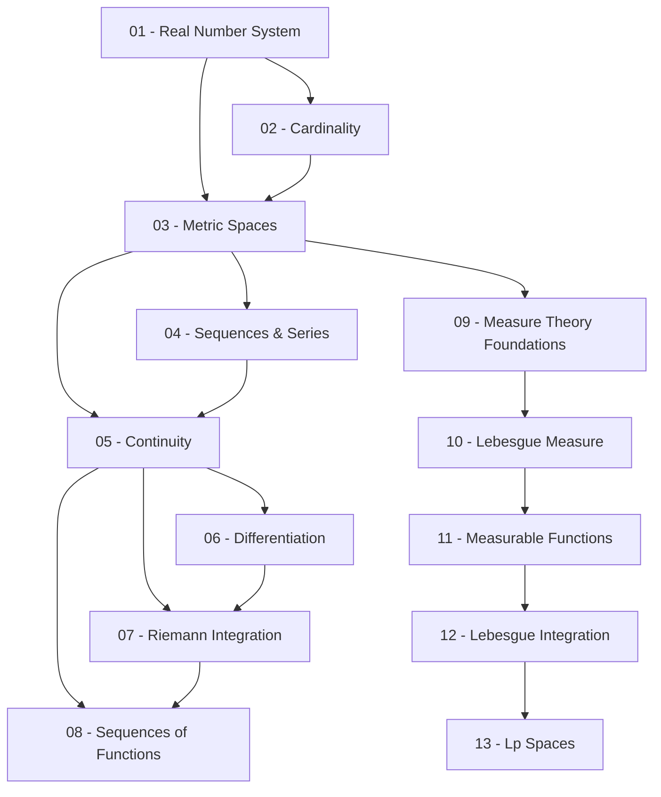

> **Level**: Graduate
> **Background**: Calculus, Linear Algebra, Abstract Algebra cơ bản
> **SageMath**: Có
> **Nguồn chính**: Rudin *Principles of Mathematical Analysis*, Folland *Real Analysis*, Royden & Fitzpatrick

---

## Lessons

| # | Tiêu đề | Nội dung chính | Yêu cầu | Độ khó |
|---|---------|---------------|---------|--------|
| 01 | The Real Number System | Ordered field, completeness axiom, sup/inf, Archimedean property, $\mathbb{Q}$ vs $\mathbb{R}$, Dedekind cuts | — | ★☆☆☆☆ |
| 02 | Cardinality & Countability | Lực lượng tập hợp, tập đếm được, định lý Cantor, $\mathbb{R}$ không đếm được | 01 | ★★☆☆☆ |
| 03 | Metric Spaces | Không gian metric, open/closed sets, compact sets, Heine-Borel, connectedness | 01, 02 | ★★★☆☆ |
| 04 | Sequences & Series | Cauchy sequences, limsup/liminf, convergence tests, rearrangement | 03 | ★★★☆☆ |
| 05 | Continuity | Continuous maps trên metric spaces, uniform continuity, compact/connected images | 03, 04 | ★★★☆☆ |
| 06 | Differentiation | MVT, Taylor's theorem, L'Hôpital, convex functions | 05 | ★★★☆☆ |
| 07 | Riemann Integration | Riemann-Stieltjes integral, điều kiện khả tích, FTC | 05, 06 | ★★★★☆ |
| 08 | Sequences of Functions | Pointwise/uniform convergence, Arzelà-Ascoli, Stone-Weierstrass | 05, 07 | ★★★★☆ |
| 09 | Measure Theory Foundations | $\sigma$-algebras, measures, outer measure, Carathéodory extension | 03 | ★★★★☆ |
| 10 | Lebesgue Measure | Lebesgue measure trên $\mathbb{R}^n$, Cantor set, non-measurable sets | 09 | ★★★★☆ |
| 11 | Measurable Functions | Modes of convergence, Egorov's theorem, Lusin's theorem | 10 | ★★★★☆ |
| 12 | Lebesgue Integration | Monotone convergence, Fatou's lemma, dominated convergence | 11 | ★★★★★ |
| 13 | Lᵖ Spaces | Hölder & Minkowski, Riesz-Fischer, duality | 12 | ★★★★★ |

---

## Appendix Candidates

| ID | Định lý | Bài liên quan | Ghi chú |
|----|---------|--------------|---------|
| A0 | Heine-Borel Theorem | 03 | Chứng minh đầy đủ compactness $\Leftrightarrow$ closed + bounded trong $\mathbb{R}^n$ |
| A1 | Arzelà-Ascoli Theorem | 08 | Chứng minh đầy đủ qua equicontinuity |
| A2 | Carathéodory Extension Theorem | 09 | Chứng minh đầy đủ mở rộng pre-measure lên measure |

---

## Dependency Graph

---

## Progress Tracker

- [ ] [[00-roadmap|00. Roadmap]]
- [ ] [[01-the-real-number-system|01. The Real Number System]]
- [ ] [[02-cardinality-and-countability|02. Cardinality & Countability]]
- [ ] [[03-metric-spaces|03. Metric Spaces]]
- [ ] [[04-sequences-and-series|04. Sequences & Series]]
- [ ] [[05-continuity|05. Continuity]]
- [ ] [[06-differentiation|06. Differentiation]]
- [ ] [[07-riemann-integration|07. Riemann Integration]]
- [ ] [[08-sequences-of-functions|08. Sequences of Functions]]
- [ ] [[09-measure-theory-foundations|09. Measure Theory Foundations]]
- [ ] [[10-lebesgue-measure|10. Lebesgue Measure]]
- [ ] [[11-measurable-functions|11. Measurable Functions]]
- [ ] [[12-lebesgue-integration|12. Lebesgue Integration]]
- [ ] [[13-lp-spaces|13. Lᵖ Spaces]]
