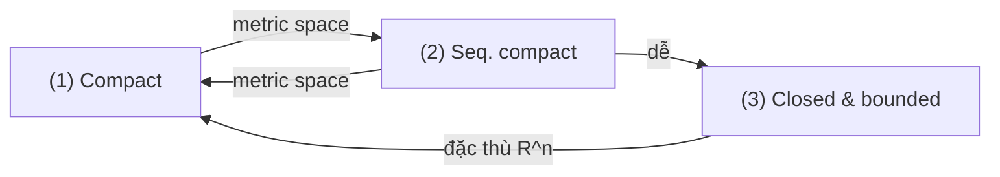

> **Liên quan**: [[03-metric-spaces|03. Metric Spaces]] — Theorem 3.15
> **Mục tiêu**: Chứng minh đầy đủ định lý Heine-Borel trong $\mathbb{R}^n$: compact $\Leftrightarrow$ closed và bounded

---

## Phát biểu đầy đủ

> [!theorem] Theorem A0.1 — Heine-Borel Theorem
> Cho $K \subseteq \mathbb{R}^n$ với metric Euclid. Khi đó các mệnh đề sau tương đương:
>
> **(1)** $K$ là **compact** (mọi open cover có finite subcover)
>
> **(2)** $K$ là **sequentially compact** (mọi dãy trong $K$ có dãy con hội tụ về điểm trong $K$)
>
> **(3)** $K$ là **closed và bounded** (đóng và bị chặn)

---

## Bố cục chứng minh

Chiến lược: chứng minh theo vòng tròn $(1) \Rightarrow (2) \Rightarrow (3) \Rightarrow (1)$.

Hai chiều $(1) \Leftrightarrow (2)$ đúng trong mọi metric space (đã phác thảo trong Bài 03). Chiều đặc biệt của $\mathbb{R}^n$ là $(3) \Rightarrow (1)$: **closed + bounded $\Rightarrow$ compact**, điều này thất bại trong metric space tổng quát.

Lược đồ:

---

## Bước 1: $(1) \Rightarrow (2)$ — Compact thì Sequentially Compact

> [!theorem] Theorem A0.2
> Trong mọi metric space, compact $\Rightarrow$ sequentially compact.

**Proof.**
Cho $(x_n)$ là dãy trong compact $K$. Gọi $E = \{x_n \mid n \geq 1\}$ là tập giá trị của dãy.

**Trường hợp 1**: $E$ hữu hạn. Thì ít nhất một giá trị $x^*$ xuất hiện vô hạn lần, cho dãy con hằng hội tụ về $x^* \in K$.

**Trường hợp 2**: $E$ vô hạn. Ta chứng minh $E$ có điểm giới hạn trong $K$.

Giả sử phản chứng: $E$ không có điểm giới hạn trong $K$. Khi đó với mọi $y \in K$, tồn tại $r_y > 0$: $B(y, r_y) \cap E$ hữu hạn (vì $y$ không phải điểm giới hạn của $E$). Họ $\{B(y, r_y)\}_{y \in K}$ là open cover của $K$.

Vì $K$ compact: có subcover hữu hạn $B(y_1, r_{y_1}), \ldots, B(y_m, r_{y_m})$. Nhưng $E \subseteq K \subseteq \bigcup_{i=1}^m B(y_i, r_{y_i})$ và mỗi $B(y_i, r_{y_i}) \cap E$ hữu hạn, nên $E$ hữu hạn — mâu thuẫn.

Vậy $E$ có điểm giới hạn $x^* \in K$. Từ đây, xây dãy con của $(x_n)$ hội tụ về $x^*$ bằng cách lấy lần lượt: $x_{n_1} \in B(x^*, 1) \cap E$, $x_{n_2} \in B(x^*, 1/2) \cap E$ với $n_2 > n_1$, v.v. $\blacksquare$

---

## Bước 2: $(2) \Rightarrow (3)$ — Sequentially Compact thì Closed và Bounded

> [!theorem] Theorem A0.3
> Trong mọi metric space, sequentially compact $\Rightarrow$ closed và bounded.

**Proof.**

**Closed**: Cho $(x_n) \subset K$ với $x_n \to x$. Vì $K$ seq. compact, có dãy con $x_{n_k} \to y \in K$. Nhưng dãy con của dãy hội tụ cũng hội tụ về cùng giới hạn, nên $y = x$. Vậy $x \in K$, tức $K$ đóng.

**Bounded**: Giả sử $K$ không bị chặn. Cố định $x_0 \in K$. Với mỗi $n$, tồn tại $x_n \in K$ với $d(x_n, x_0) > n$. Dãy $(x_n)$ không có dãy con bị chặn, nên không có dãy con Cauchy, nên không có dãy con hội tụ — mâu thuẫn với seq. compactness. $\blacksquare$

---

## Bước 3: $(3) \Rightarrow (1)$ — Closed và Bounded thì Compact trong $\mathbb{R}^n$

Đây là chiều cốt lõi, đặc thù của $\mathbb{R}^n$. Ta chứng minh theo hai bước phụ:

**Bước 3a**: Mọi hình hộp đóng $[a_1, b_1] \times \cdots \times [a_n, b_n]$ trong $\mathbb{R}^n$ là compact.

**Bước 3b**: Tập con đóng của compact là compact.

$(3b)$ đã chứng minh ở Bài 03 (Theorem 3.18). Ta tập trung vào $(3a)$.

### Bước 3a: Hình hộp đóng là compact — Phương pháp Bisection

> [!theorem] Theorem A0.4 — Hình hộp đóng trong $\mathbb{R}^n$ là compact
> Mọi $I = [a_1, b_1] \times \cdots \times [a_n, b_n]$ là compact.

**Proof** (quy nạp trên $n$, phương pháp bisection).

**Trường hợp cơ sở $n = 1$**: $I = [a, b] \subset \mathbb{R}$.

Giả sử $\mathcal{U}$ là open cover của $[a,b]$ không có finite subcover. Đặt $c = (a+b)/2$. Ít nhất một trong $[a, c]$ hoặc $[c, b]$ không có finite subcover trong $\mathcal{U}$ — gọi nó là $I_1$.

Lặp lại với $I_1$: thu được $I_2$ là nửa của $I_1$ không có finite subcover. Tiếp tục, thu được dãy:

$$
I = I_0 \supseteq I_1 \supseteq I_2 \supseteq \cdots
$$

với $|I_k| = (b-a)/2^k \to 0$ và mỗi $I_k$ không có finite subcover.

Vì $\mathbb{R}$ complete và $\{I_k\}$ là dãy closed intervals lồng nhau với $|I_k| \to 0$, theo **Nested Interval Theorem**: $\exists\, x^* \in \bigcap_k I_k$.

Vì $\mathcal{U}$ là cover, tồn tại $U \in \mathcal{U}$: $x^* \in U$. Vì $U$ mở, $\exists\, \varepsilon > 0$: $(x^* - \varepsilon, x^* + \varepsilon) \subseteq U$.

Với $k$ đủ lớn: $|I_k| < \varepsilon$, nên $I_k \subseteq (x^* - \varepsilon, x^* + \varepsilon) \subseteq U$. Vậy $\{U\}$ là finite subcover của $I_k$ — mâu thuẫn. $\blacksquare$

**Bước quy nạp $\mathbb{R}^{n-1} \to \mathbb{R}^n$**: Cho $I = I' \times [a_n, b_n]$ với $I' = [a_1, b_1] \times \cdots \times [a_{n-1}, b_{n-1}]$ compact theo giả thuyết quy nạp.

Cho $\mathcal{U}$ là open cover của $I$. Với mỗi $z \in [a_n, b_n]$, lát cắt $I_z = I' \times \{z\}$ homeomorphic với $I'$, nên compact. Do đó $I_z$ có finite subcover $\mathcal{U}_z = \{U_1^z, \ldots, U_{k_z}^z\} \subset \mathcal{U}$.

Đặt $V_z = \bigcap_{j=1}^{k_z} \pi_n(U_j^z \cap (I' \times \mathbb{R}))$ (chiếu xuống tọa độ $n$): đây là tập mở trong $\mathbb{R}$ chứa $z$, và $I' \times V_z \subseteq \bigcup \mathcal{U}_z$.

Họ $\{V_z\}_{z \in [a_n, b_n]}$ là open cover của $[a_n, b_n]$. Vì $[a_n, b_n]$ compact (bước cơ sở), có finite subcover $V_{z_1}, \ldots, V_{z_m}$.

Khi đó $\mathcal{U}_{z_1} \cup \cdots \cup \mathcal{U}_{z_m}$ là finite subcover của $I$. $\blacksquare$

### Hoàn tất: $(3) \Rightarrow (1)$

Cho $K \subseteq \mathbb{R}^n$ đóng và bị chặn. Vì bị chặn, $K \subseteq [-M, M]^n$ với $M$ đủ lớn. Hình hộp $[-M, M]^n$ compact (Theorem A0.4). $K$ là tập con đóng của compact, nên $K$ compact (Bài 03, Theorem 3.18). $\blacksquare$

---

## Tại sao Heine-Borel thất bại ngoài $\mathbb{R}^n$

> [!warning] Counterexample A0.5 — $C([0,1])$ không thỏa Heine-Borel
>
> Trên không gian Banach vô hạn chiều $C([0,1])$ với chuẩn $\|\cdot\|_\infty$:
>
> Tập $\overline{B}(0,1) = \{f \in C([0,1]) : \|f\|_\infty \leq 1\}$ đóng và bị chặn nhưng **không compact**.
>
> *Chứng minh*: Dãy $f_n(x) = x^n$ thỏa $\|f_n\|_\infty = 1$ nhưng không có dãy con hội tụ trong $C([0,1])$ (giới hạn điểm-điểm là $\mathbf{1}_{\{1\}}$ — không thuộc $C([0,1])$).
>
> **Nguyên nhân sâu xa**: Heine-Borel phụ thuộc vào tính **hữu hạn chiều** của $\mathbb{R}^n$. Trong không gian Banach vô hạn chiều, closed ball không compact.

> [!note] Remark A0.6 — Điều kiện thay thế cho compact trong không gian tổng quát
> Trong metric space tổng quát, compact tương đương với: **complete** và **totally bounded** (với mọi $\varepsilon > 0$, có phủ hữu hạn bởi các $\varepsilon$-balls). Đây là điều kiện đúng trong mọi metric space.
>
> $\mathbb{R}^n$: complete (Bài 03) và totally bounded $\Leftrightarrow$ bounded. Vậy compact $\Leftrightarrow$ complete + bounded $\Leftrightarrow$ closed + bounded.

---

## Ứng dụng ngay của Heine-Borel

> [!corollary] Corollary A0.7
>
> **(a) EVT**: Mọi $f: K \to \mathbb{R}$ liên tục trên $K \subset \mathbb{R}^n$ compact đều đạt max và min.
>
> **(b) Uniform continuity**: Mọi $f: K \to \mathbb{R}^m$ liên tục trên $K \subset \mathbb{R}^n$ compact đều uniformly continuous.
>
> **(c) Bolzano-Weierstrass**: Mọi dãy bị chặn trong $\mathbb{R}^n$ có dãy con hội tụ.

**Proof của (c)**: Dãy $(x_n)$ bị chặn nằm trong hình hộp $[-M, M]^n$. Hình hộp compact (A0.4) nên sequentially compact. $\blacksquare$

---

## References

- Rudin, W. *Principles of Mathematical Analysis* (3rd ed.), Theorem 2.41.
- Folland, G. B. *Real Analysis* (2nd ed.), Proposition 1.23.
- Wikipedia: [Heine–Borel theorem](https://en.wikipedia.org/wiki/Heine%E2%80%93Borel_theorem).
- University of Alberta MATH 217, Lecture Notes (2013).
