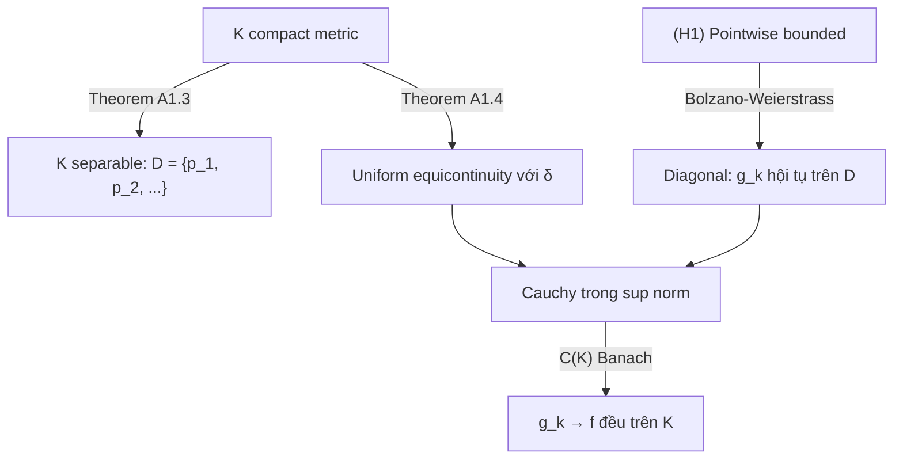

> **Liên quan**: [[08-sequences-of-functions|08. Sequences of Functions]] — Theorem 8.15
> **Mục tiêu**: Chứng minh đầy đủ định lý Arzelà-Ascoli — điều kiện cần và đủ để họ hàm có dãy con hội tụ đều

---

## Phát biểu đầy đủ

> [!theorem] Theorem A1.1 — Arzelà-Ascoli Theorem (Classical Form)
> Cho $K$ là compact metric space và $(f_n) \subset C(K, \mathbb{R})$ là dãy hàm thỏa:
>
> **(H1) Pointwise bounded**: $\sup_n |f_n(x)| < \infty$ với mọi $x \in K$
>
> **(H2) Equicontinuous**: Với mọi $\varepsilon > 0$, $\exists\, \delta > 0$: $d(x, y) < \delta \Rightarrow |f_n(x) - f_n(y)| < \varepsilon$ với **mọi** $n$ và mọi $x, y \in K$
>
> Thì $(f_n)$ có **dãy con hội tụ đều** trên $K$.

> [!theorem] Theorem A1.2 — Arzelà-Ascoli (Compact Characterization)
> Tập $\mathcal{F} \subset C(K)$ là **relatively compact** trong $(C(K), \|\cdot\|_\infty)$ (tức $\overline{\mathcal{F}}$ compact) khi và chỉ khi $\mathcal{F}$ **bị chặn đều** và **equicontinuous**.

---

## Các Bổ đề chuẩn bị

> [!theorem] Theorem A1.3 — $K$ compact metric thì separable
> Mọi compact metric space $K$ là **separable**: có tập con đếm được dày đặc.

**Proof.** Với mỗi $n \geq 1$, họ $\{B(x, 1/n)\}_{x \in K}$ là open cover của $K$. Vì $K$ compact, có finite subcover với tâm $x_1^n, \ldots, x_{k_n}^n$. Tập $D = \bigcup_n \{x_1^n, \ldots, x_{k_n}^n\}$ là đếm được. Với mọi $y \in K$ và $\varepsilon > 0$, chọn $n > 1/\varepsilon$: có $x_i^n$ với $d(y, x_i^n) < 1/n < \varepsilon$. Vậy $D$ dày đặc trong $K$. $\blacksquare$

> [!theorem] Theorem A1.4 — Equicontinuity trên compact thì uniform equicontinuity
> Nếu $\mathcal{F}$ equicontinuous trên $K$ compact thì $\mathcal{F}$ **uniformly equicontinuous**: $\delta$ không phụ thuộc điểm.

**Proof.** Tương tự chứng minh "liên tục trên compact $\Rightarrow$ uniform continuous" (Bài 05, Theorem 5.12), dùng finite subcover và lấy $\delta$ nhỏ nhất trong finite cover. $\blacksquare$

---

## Chứng minh Theorem A1.1

Chứng minh chia làm ba bước:

**Bước 1**: Dùng Diagonal Argument để lấy dãy con hội tụ điểm-điểm trên tập đếm được dày đặc.

**Bước 2**: Dùng equicontinuity để kéo hội tụ điểm-điểm lên hội tụ đều trên toàn bộ $K$.

### Bước 1 — Diagonal Argument

Theo Theorem A1.3, $K$ có tập đếm được dày đặc $D = \{p_1, p_2, p_3, \ldots\}$.

Vì $(f_n(p_1))$ bị chặn (H1), theo Bolzano-Weierstrass, có dãy con:

$$
f_{n_1^{(1)}}, f_{n_2^{(1)}}, f_{n_3^{(1)}}, \ldots \quad \text{sao cho } f_{n_k^{(1)}}(p_1) \text{ hội tụ}
$$

Đặt $S^{(1)} = (f_{n_k^{(1)}})$. Từ $S^{(1)}$, vì $(f_{n_k^{(1)}}(p_2))$ bị chặn, lấy tiếp dãy con $S^{(2)} = (f_{n_k^{(2)}})$ hội tụ tại $p_2$.

Tiếp tục quy nạp: $S^{(j)}$ là dãy con của $S^{(j-1)}$ hội tụ tại $p_1, p_2, \ldots, p_j$.

**Dãy chéo**: Đặt $g_k = f_{n_k^{(k)}}$ (phần tử thứ $k$ của dãy $S^{(k)}$). Khi đó:

- $g_k$ là dãy con của $S^{(j)}$ với mọi $k \geq j$ (vì $g_k$ là phần tử thứ $k$ của $S^{(k)}$, là dãy con của $S^{(j)}$ khi $k \geq j$)
- Do đó $(g_k(p_j))$ hội tụ với **mọi** $j$

Đặt $f(p_j) = \lim_k g_k(p_j)$: ta có dãy con $(g_k)$ hội tụ điểm-điểm trên $D$.

### Bước 2 — Từ Hội tụ trên $D$ đến Hội tụ Đều trên $K$

Ta chứng minh $(g_k)$ là dãy Cauchy theo chuẩn $\sup$ trên $K$, từ đó suy ra hội tụ đều.

Với $\varepsilon > 0$, áp dụng Theorem A1.4 (uniform equicontinuity): $\exists\, \delta > 0$ sao cho với mọi $n$ và mọi $x, y \in K$:

$$
d(x, y) < \delta \Rightarrow |g_n(x) - g_n(y)| < \frac{\varepsilon}{3}
$$

Họ $\{B(p, \delta)\}_{p \in D}$ phủ $K$. Vì $K$ compact, có subcover hữu hạn $B(p_{j_1}, \delta), \ldots, B(p_{j_m}, \delta)$.

Vì $(g_k(p_{j_i}))$ hội tụ với mỗi $i = 1, \ldots, m$, dãy hội tụ trên tập hữu hạn $\{p_{j_1}, \ldots, p_{j_m}\}$, nên $\exists\, N$ sao cho với $k, l \geq N$ và mọi $i$:

$$
|g_k(p_{j_i}) - g_l(p_{j_i})| < \frac{\varepsilon}{3}
$$

Với $x \in K$ bất kỳ: tồn tại $i$ sao cho $d(x, p_{j_i}) < \delta$. Khi đó với $k, l \geq N$:

$$
\begin{aligned}
|g_k(x) - g_l(x)| &\leq |g_k(x) - g_k(p_{j_i})| + |g_k(p_{j_i}) - g_l(p_{j_i})| + |g_l(p_{j_i}) - g_l(x)| \\
&< \frac{\varepsilon}{3} + \frac{\varepsilon}{3} + \frac{\varepsilon}{3} = \varepsilon
\end{aligned}
$$

Vậy $\sup_x |g_k(x) - g_l(x)| \leq \varepsilon$ với $k, l \geq N$: $(g_k)$ là dãy Cauchy trong $(C(K), \|\cdot\|_\infty)$.

Vì $(C(K), \|\cdot\|_\infty)$ là Banach space (complete), $(g_k)$ hội tụ đều đến một hàm $f \in C(K)$. $\blacksquare$

---

## Chứng minh Theorem A1.2 (Compact Characterization)

> **$(\Rightarrow)$ Compact $\Rightarrow$ bounded đều + equicontinuous.**

Nếu $\overline{\mathcal{F}}$ compact trong $C(K)$, thì $\overline{\mathcal{F}}$ bị chặn (theo $\|\cdot\|_\infty$) — tức $\mathcal{F}$ bị chặn đều.

Với equicontinuity: với $\varepsilon > 0$, họ $\{B(f, \varepsilon/3) \mid f \in C(K)\}$ là open cover của $\overline{\mathcal{F}}$. Lấy finite subcover bởi $f_1, \ldots, f_m \in \overline{\mathcal{F}}$. Mỗi $f_i$ uniformly continuous (K compact), nên tồn tại $\delta_i$: $d(x,y) < \delta_i \Rightarrow |f_i(x) - f_i(y)| < \varepsilon/3$.

Đặt $\delta = \min \delta_i > 0$. Với $g \in \mathcal{F}$, chọn $f_i$ với $\|g - f_i\|_\infty < \varepsilon/3$. Khi đó:

$$
|g(x) - g(y)| \leq |g(x) - f_i(x)| + |f_i(x) - f_i(y)| + |f_i(y) - g(y)| < \varepsilon
$$

Vậy $\mathcal{F}$ equicontinuous với $\delta$ không phụ thuộc $g$.

> **$(\Leftarrow)$ Bounded đều + equicontinuous $\Rightarrow$ compact.**

Cần chứng minh $\overline{\mathcal{F}}$ compact (sequential compactness). Mọi dãy $(f_n) \subset \mathcal{F}$ thỏa (H1) và (H2). Theo Theorem A1.1, có dãy con hội tụ đều — giới hạn thuộc $C(K)$ và thuộc $\overline{\mathcal{F}}$. $\blacksquare$

---

## Ví dụ và Ứng dụng

### Worked Example

> [!example] Example A1.5 — Họ equicontinuous qua đạo hàm bị chặn
>
> Cho $\mathcal{F} = \{f: [0,1] \to \mathbb{R} \mid f \text{ khả vi}, |f(0)| \leq 1, |f'(x)| \leq M \text{ với mọi } x\}$.
>
> - **Bounded**: $|f(x)| \leq |f(0)| + \int_0^x |f'| \leq 1 + M$ với mọi $f \in \mathcal{F}$, $x \in [0,1]$.
> - **Equicontinuous**: Với $x, y \in [0,1]$, $|f(x) - f(y)| \leq M|x-y|$ (MVT). Chọn $\delta = \varepsilon/M$.
>
> Theo Arzelà-Ascoli: mọi dãy trong $\mathcal{F}$ có dãy con hội tụ đều. $\mathcal{F}$ relatively compact.

> [!example] Example A1.6 — Ứng dụng vào Peano Existence Theorem
>
> Cho phương trình vi phân $y' = F(x, y)$, $y(x_0) = y_0$ với $F$ liên tục và bị chặn $|F| \leq M$ trên miền $[x_0-a, x_0+a] \times [y_0-b, y_0+b]$.
>
> **Xây dựng dãy xấp xỉ Euler**: Chia $[x_0, x_0+h]$ thành $n$ đoạn đều, định nghĩa $y_n$ tuyến tính từng khúc theo công thức Euler.
>
> - $\{y_n\}$ bị chặn: $|y_n(x)| \leq |y_0| + Mh$
> - $\{y_n\}$ equicontinuous: $|y_n(x) - y_n(x')| \leq M|x-x'|$ (vì độ dốc bị chặn bởi $M$)
>
> Theo Arzelà-Ascoli: có dãy con $y_{n_k} \to y$ đều. Dãy con này hội tụ về nghiệm của phương trình tích phân $y(x) = y_0 + \int_{x_0}^x F(t, y(t))\, dt$.

---

## Tổng kết cấu trúc chứng minh

---

## References

- Rudin, W. *Principles of Mathematical Analysis* (3rd ed.), Theorem 7.25.
- Folland, G. B. *Real Analysis* (2nd ed.), Section 4.6, Theorem 4.43.
- Royden, H. L. & Fitzpatrick, P. M. *Real Analysis* (4th ed.), Chapter 7.
- Wikipedia: [Arzelà–Ascoli theorem](https://en.wikipedia.org/wiki/Arzel%C3%A0%E2%80%93Ascoli_theorem).
