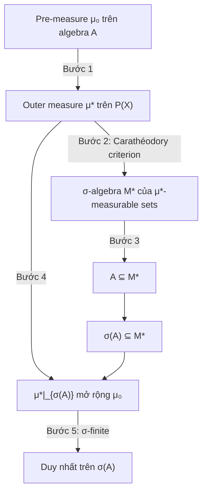

> **Liên quan**: [[09-measure-theory-foundations|09. Measure Theory Foundations]] — Theorem 9.16, 9.17, 9.18
> **Mục tiêu**: Chứng minh đầy đủ định lý Carathéodory — mở rộng pre-measure trên algebra thành measure trên $\sigma$-algebra

---

## Phát biểu đầy đủ

> [!theorem] Theorem A2.1 — Carathéodory Extension Theorem
> Cho $\mathcal{A}$ là **algebra** trên $X$ và $\mu_0: \mathcal{A} \to [0, +\infty]$ là **pre-measure**, tức:
>
> - $\mu_0(\emptyset) = 0$
> - **$\sigma$-additivity trên $\mathcal{A}$**: nếu $\{A_n\}_{n=1}^\infty \subset \mathcal{A}$ rời nhau và $\bigsqcup_n A_n \in \mathcal{A}$, thì $\mu_0\!\left(\bigsqcup_n A_n\right) = \sum_n \mu_0(A_n)$
>
> Khi đó:
>
> **(I) Tồn tại**: Có measure $\mu$ trên $\sigma(\mathcal{A})$ mở rộng $\mu_0$: $\mu(A) = \mu_0(A)$ với mọi $A \in \mathcal{A}$.
>
> **(II) Duy nhất**: Nếu $\mu_0$ là **$\sigma$-finite** (tức $X = \bigcup_n A_n$ với $A_n \in \mathcal{A}$, $\mu_0(A_n) < \infty$), thì sự mở rộng là duy nhất.

---

## Bố cục chứng minh

---

## Bước 1: Xây dựng Outer Measure $\mu^*$

> [!definition] Definition A2.2
> Với mọi $E \subseteq X$, định nghĩa:
>
> $$
> \mu^*(E) = \inf\left\{\sum_{n=1}^\infty \mu_0(A_n) \;\middle|\; A_n \in \mathcal{A},\; E \subseteq \bigcup_{n=1}^\infty A_n\right\}
> $$
>
> Quy ước $\inf \emptyset = +\infty$.

> [!theorem] Theorem A2.3 — $\mu^*$ là outer measure
> $\mu^*$ thỏa ba tiên đề outer measure: $\mu^*(\emptyset) = 0$, đơn điệu, và countable subadditivity.

**Proof.**

**$\mu^*(\emptyset) = 0$**: Phủ $\emptyset$ bằng $A_n = \emptyset$ với mọi $n$: $\sum \mu_0(\emptyset) = 0$.

**Đơn điệu**: Nếu $E \subseteq F$, mọi phủ của $F$ cũng là phủ của $E$, nên $\mu^*(E) \leq \mu^*(F)$.

**Countable subadditivity**: Cho $\{E_n\}$ và $\varepsilon > 0$. Với mỗi $n$, chọn phủ $\{A_{n,k}\}_k \subset \mathcal{A}$ của $E_n$ sao cho:

$$
\sum_k \mu_0(A_{n,k}) < \mu^*(E_n) + \frac{\varepsilon}{2^n}
$$

Khi đó $\{A_{n,k}\}_{n,k}$ là phủ đếm được của $\bigcup_n E_n$ bởi các phần tử của $\mathcal{A}$. Vậy:

$$
\mu^*\!\left(\bigcup_n E_n\right) \leq \sum_{n,k} \mu_0(A_{n,k}) = \sum_n \sum_k \mu_0(A_{n,k}) < \sum_n \mu^*(E_n) + \varepsilon
$$

Vì $\varepsilon$ tùy ý: $\mu^*\!\left(\bigcup_n E_n\right) \leq \sum_n \mu^*(E_n)$. $\blacksquare$

---

## Bước 2: Carathéodory Measurability

> [!definition] Definition A2.4 — $\mu^*$-measurable
> Tập $E \subseteq X$ là **$\mu^*$-measurable** nếu với mọi $T \subseteq X$:
>
> $$
> \mu^*(T) = \mu^*(T \cap E) + \mu^*(T \cap E^c)
> $$
>
> Ký hiệu $\mathcal{M}^* = \{E \subseteq X \mid E \text{ là } \mu^*\text{-measurable}\}$.

> [!note] Remark A2.5
> Do subadditivity, luôn có $\mu^*(T) \leq \mu^*(T \cap E) + \mu^*(T \cap E^c)$. Điều kiện trên đòi hỏi bất đẳng thức ngược, tức $E$ "cắt sạch" mọi $T$.

> [!theorem] Theorem A2.6 — Carathéodory's Theorem
> $\mathcal{M}^*$ là $\sigma$-algebra và $\mu^*|_{\mathcal{M}^*}$ là complete measure trên $(X, \mathcal{M}^*)$.

**Proof.**

**$X \in \mathcal{M}^*$**: $\mu^*(T) = \mu^*(T \cap X) + \mu^*(T \cap \emptyset) = \mu^*(T) + 0$. ✓

**Đóng với phần bù**: $E \in \mathcal{M}^* \Rightarrow E^c \in \mathcal{M}^*$ (điều kiện đối xứng trong $E$ và $E^c$). ✓

**Đóng với hợp hữu hạn**: Cho $E, F \in \mathcal{M}^*$. Với $T \subseteq X$:

$$
\begin{aligned}
\mu^*(T) &= \mu^*(T \cap E) + \mu^*(T \cap E^c) \\
&= \mu^*(T \cap E \cap F) + \mu^*(T \cap E \cap F^c) + \mu^*(T \cap E^c \cap F) + \mu^*(T \cap E^c \cap F^c)
\end{aligned}
$$

(áp dụng $F \in \mathcal{M}^*$ cho $T \cap E$ và $T \cap E^c$). Nhận thấy:

$$
T \cap (E \cup F)^c = T \cap E^c \cap F^c
$$

và ba số hạng đầu tổng lại $\geq \mu^*(T \cap (E \cup F))$ (subadditivity). Vậy $\mu^*(T) \geq \mu^*(T \cap (E \cup F)) + \mu^*(T \cap (E \cup F)^c)$. $E \cup F \in \mathcal{M}^*$. ✓

**$\sigma$-additivity**: Cho $\{E_n\}$ rời nhau trong $\mathcal{M}^*$, đặt $F_N = \bigsqcup_{n=1}^N E_n$. Bằng quy nạp:

$$
\mu^*\!\left(T \cap F_N\right) = \sum_{n=1}^N \mu^*(T \cap E_n)
$$

Đặt $F = \bigcup_n E_n$. Vì $F_N \in \mathcal{M}^*$ với mọi $N$ (hợp hữu hạn), áp dụng Carathéodory cho $F_N$ và $T$:

$$
\mu^*(T) = \mu^*(T \cap F_N) + \mu^*(T \cap F_N^c) \geq \sum_{n=1}^N \mu^*(T \cap E_n) + \mu^*(T \cap F^c)
$$

Lấy $N \to \infty$:

$$
\mu^*(T) \geq \sum_{n=1}^\infty \mu^*(T \cap E_n) + \mu^*(T \cap F^c) \geq \mu^*(T \cap F) + \mu^*(T \cap F^c)
$$

Chiều ngược lại theo subadditivity. Vậy $F \in \mathcal{M}^*$ và $\mu^*(F) = \sum_n \mu^*(E_n)$. $\blacksquare$

---

## Bước 3: $\mathcal{A} \subseteq \mathcal{M}^*$

> [!theorem] Theorem A2.7 — Pre-measure sets thỏa Carathéodory criterion
> Với mọi $A \in \mathcal{A}$: $A \in \mathcal{M}^*$, tức $\mu^*(T) \geq \mu^*(T \cap A) + \mu^*(T \cap A^c)$ với mọi $T$.

**Proof.**
Với $\varepsilon > 0$, chọn phủ $\{B_n\} \subset \mathcal{A}$ của $T$: $\sum_n \mu_0(B_n) < \mu^*(T) + \varepsilon$.

Vì $\mathcal{A}$ là algebra: $B_n \cap A \in \mathcal{A}$ và $B_n \cap A^c = B_n \setminus A \in \mathcal{A}$, và $B_n = (B_n \cap A) \sqcup (B_n \cap A^c)$.

Vì $\mu_0$ là pre-measure (finitely additive):

$$
\mu_0(B_n) = \mu_0(B_n \cap A) + \mu_0(B_n \cap A^c)
$$

Tổng lại:

$$
\mu^*(T) + \varepsilon > \sum_n \mu_0(B_n) = \sum_n \mu_0(B_n \cap A) + \sum_n \mu_0(B_n \cap A^c) \geq \mu^*(T \cap A) + \mu^*(T \cap A^c)
$$

(vì $\{B_n \cap A\}$ phủ $T \cap A$ và $\{B_n \cap A^c\}$ phủ $T \cap A^c$).

Vì $\varepsilon$ tùy ý: $\mu^*(T) \geq \mu^*(T \cap A) + \mu^*(T \cap A^c)$. $\blacksquare$

> [!corollary] Corollary A2.8
> $\sigma(\mathcal{A}) \subseteq \mathcal{M}^*$ (vì $\mathcal{M}^*$ là $\sigma$-algebra chứa $\mathcal{A}$).

---

## Bước 4: $\mu^*$ mở rộng $\mu_0$

> [!theorem] Theorem A2.9 — Nhất quán trên $\mathcal{A}$
> Với mọi $A \in \mathcal{A}$: $\mu^*(A) = \mu_0(A)$.

**Proof.**

**$\mu^*(A) \leq \mu_0(A)$**: Phủ $A$ bằng $A_1 = A$, $A_n = \emptyset$ với $n \geq 2$: $\mu^*(A) \leq \mu_0(A) + \sum_{n \geq 2} \mu_0(\emptyset) = \mu_0(A)$.

**$\mu^*(A) \geq \mu_0(A)$**: Cho $\{B_n\} \subset \mathcal{A}$ với $A \subseteq \bigcup_n B_n$. Đặt $C_n = B_n \setminus \bigcup_{k < n} B_k \in \mathcal{A}$ (phần rời nhau hóa). Khi đó $\{C_n\}$ rời nhau, $A = \bigsqcup_n (A \cap C_n)$, và $A \cap C_n \in \mathcal{A}$.

Vì $\mu_0$ là pre-measure ($\sigma$-additive trên $\mathcal{A}$ khi hợp thuộc $\mathcal{A}$):

$$
\mu_0(A) = \sum_n \mu_0(A \cap C_n) \leq \sum_n \mu_0(C_n) \leq \sum_n \mu_0(B_n)
$$

Lấy inf theo $\{B_n\}$: $\mu_0(A) \leq \mu^*(A)$. $\blacksquare$

---

## Bước 5: Uniqueness khi $\sigma$-Finite

> [!theorem] Theorem A2.10 — Duy nhất khi $\sigma$-finite
> Nếu $\mu_0$ là $\sigma$-finite thì sự mở rộng từ Theorem A2.1 là **duy nhất** trên $\sigma(\mathcal{A})$.

**Proof.**
Giả sử $\nu$ là measure khác trên $\sigma(\mathcal{A})$ cũng mở rộng $\mu_0$.

**Trường hợp $\mu_0(X) < \infty$** (hữu hạn):

Ta dùng chiến lược "monotone class". Đặt:

$$
\mathcal{G} = \{E \in \sigma(\mathcal{A}) \mid \mu(E) = \nu(E)\}
$$

Cần chứng minh $\mathcal{G} = \sigma(\mathcal{A})$.

- $\mathcal{A} \subseteq \mathcal{G}$ (cả hai mở rộng $\mu_0$).
- Nếu $E_n \in \mathcal{G}$, $E_n \nearrow E$: $\mu(E) = \lim \mu(E_n) = \lim \nu(E_n) = \nu(E)$, nên $E \in \mathcal{G}$.
- Nếu $E_n \in \mathcal{G}$, $E_n \searrow E$: Vì $\mu(E_1) = \nu(E_1) \leq \mu_0(X) < \infty$, dùng continuity from above: $\mu(E) = \lim \mu(E_n) = \lim \nu(E_n) = \nu(E)$, nên $E \in \mathcal{G}$.

Vậy $\mathcal{G}$ là **monotone class** chứa algebra $\mathcal{A}$. Theo **Monotone Class Theorem**: mọi monotone class chứa một algebra thì chứa $\sigma$-algebra do algebra đó sinh ra. Suy ra $\sigma(\mathcal{A}) \subseteq \mathcal{G}$.

**Trường hợp $\sigma$-finite**: Viết $X = \bigcup_n X_n$ với $X_n \in \mathcal{A}$, $\mu_0(X_n) < \infty$. WLOG $X_n \nearrow X$. Với mọi $E \in \sigma(\mathcal{A})$:

$$
\mu(E) = \lim_n \mu(E \cap X_n), \quad \nu(E) = \lim_n \nu(E \cap X_n)
$$

Áp dụng trường hợp hữu hạn cho measure restricted trên $X_n$ (cả hai agree trên $\mathcal{A} \cap X_n$): $\mu(E \cap X_n) = \nu(E \cap X_n)$ với mọi $n$. Vậy $\mu(E) = \nu(E)$. $\blacksquare$

---

## Áp dụng: Xây dựng Lebesgue Measure

> [!example] Example A2.11 — Từ độ dài khoảng đến Lebesgue Measure
>
> **Algebra**: $\mathcal{A}$ = tập các hợp hữu hạn rời nhau của khoảng $(a, b]$ trong $\mathbb{R}$ (kể cả $\emptyset$ và $\mathbb{R}$).
>
> **Pre-measure**: $\mu_0((a, b]) = b - a$, mở rộng tuyến tính:
>
> $$
> \mu_0\!\left(\bigsqcup_{i=1}^n (a_i, b_i]\right) = \sum_{i=1}^n (b_i - a_i)
> $$
>
> Kiểm tra $\mu_0$ là pre-measure: $\sigma$-additivity trên $\mathcal{A}$ theo sự liên tục của độ dài từ trái.
>
> $\mu_0$ là $\sigma$-finite: $\mathbb{R} = \bigcup_n (-n, n]$ với $\mu_0((-n,n]) = 2n < \infty$.
>
> Theo Carathéodory Extension Theorem: $\mu_0$ mở rộng **duy nhất** thành Lebesgue measure $\mu$ trên $\sigma(\mathcal{A}) = \mathcal{B}(\mathbb{R})$.

> [!note] Remark A2.12 — Lebesgue $\sigma$-algebra vs Borel
> Carathéodory's Theorem cho $\mu^*$ defined trên toàn bộ $\mathcal{P}(\mathbb{R})$, và $\mathcal{M}^*$ (tập $\mu^*$-measurable) là **lớn hơn** $\mathcal{B}(\mathbb{R})$. Đây chính là Lebesgue $\sigma$-algebra $\mathcal{L}(\mathbb{R}) \supsetneq \mathcal{B}(\mathbb{R})$.

---

## Tóm tắt

| Bước | Nội dung | Kết quả |
|------|---------|---------|
| 1 | Định nghĩa $\mu^*$ qua infimum phủ | $\mu^*$ là outer measure trên $\mathcal{P}(X)$ |
| 2 | Carathéodory criterion: $\mathcal{M}^*$ | $\mathcal{M}^*$ là $\sigma$-algebra, $\mu^*|_{\mathcal{M}^*}$ là complete measure |
| 3 | Mọi $A \in \mathcal{A}$ thỏa criterion | $\mathcal{A} \subseteq \mathcal{M}^*$, suy ra $\sigma(\mathcal{A}) \subseteq \mathcal{M}^*$ |
| 4 | $\mu^*(A) = \mu_0(A)$ với $A \in \mathcal{A}$ | $\mu = \mu^*|_{\sigma(\mathcal{A})}$ mở rộng $\mu_0$ |
| 5 | Monotone Class Theorem | Unique khi $\sigma$-finite |

---

## References

- Folland, G. B. *Real Analysis* (2nd ed.), Theorem 1.14.
- Royden, H. L. & Fitzpatrick, P. M. *Real Analysis* (4th ed.), Section 17.5.
- Taylor, M. *Measure Theory and Integration*, Chapter 5.
- Tao, T. *An Introduction to Measure Theory*, Section 1.7.
- Wikipedia: [Carathéodory's extension theorem](https://en.wikipedia.org/wiki/Carath%C3%A9odory%27s_extension_theorem).
