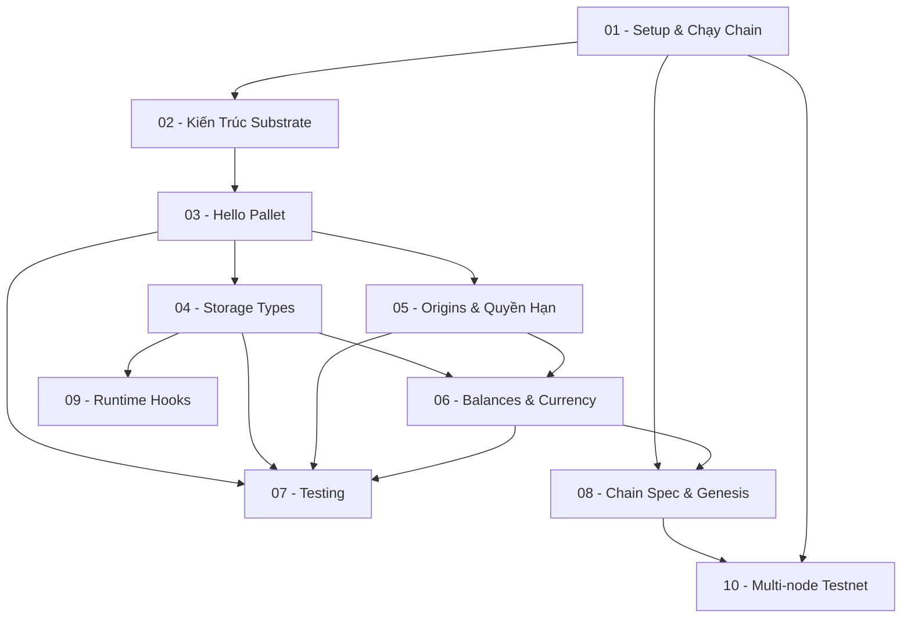

> **Topic**: Substrate Blockchain Development — Build & Deploy SimpleChain
> **Domain**: IT / Coding (Rust + Blockchain)
> **Level**: Intermediate
> **Background**: Rust cơ bản (ownership, lifetimes), đã dùng EVM/Solidity
> **Tools**: Rust, Cargo, polkadot-sdk, Polkadot.js Apps, solochain-template
> **Goal**: Deploy local testnet + viết custom pallets bằng FRAME

---

## 🎯 Project: SimpleChain

Xuyên suốt 10 lesson, bạn sẽ xây dựng **SimpleChain** — một solochain thực tế với:

- ✅ Custom runtime với nhiều pallets tự viết
- ✅ Token balances & transfer
- ✅ Notepad pallet (lưu trữ on-chain data)
- ✅ Multi-node local testnet (2 validators)

Mỗi lesson = thêm **một tính năng mới** vào project, tích luỹ từ đầu đến cuối.

---

## Lessons

| # | Title | Tính năng thêm vào SimpleChain | Prerequisites | Độ khó |
|---|-------|-------------------------------|---------------|--------|
| 01 | Setup & Chạy Chain Đầu Tiên | Cài môi trường, clone template, build & run `--dev` | — | ★☆☆☆☆ |
| 02 | Kiến Trúc Substrate | Hiểu Node / Runtime / FRAME / Wasm | 01 | ★★☆☆☆ |
| 03 | Pallet Đầu Tiên: Hello Pallet | Storage, dispatchable, events, errors | 01, 02 | ★★☆☆☆ |
| 04 | Storage Types Nâng Cao | StorageMap, bounded types, thêm Notepad pallet | 03 | ★★★☆☆ |
| 05 | Origins & Quyền Hạn | EnsureSigned, EnsureRoot, sudo, admin-only calls | 03, 04 | ★★★☆☆ |
| 06 | Balances & Currency Trait | Tích hợp pallet_balances, transfer, lock tokens | 03, 05 | ★★★☆☆ |
| 07 | Testing Pallets | Mock runtime, unit tests, integration tests | 03–06 | ★★★☆☆ |
| 08 | Chain Spec & Genesis Config | Tuỳ chỉnh genesis state, chainspec.json | 01–06 | ★★★☆☆ |
| 09 | Runtime Hooks | on_initialize, on_finalize, offchain workers cơ bản | 03–06 | ★★★★☆ |
| 10 | Multi-node Local Testnet | 2 validator nodes, Aura + GRANDPA, kết nối p2p | 01–08 | ★★★★☆ |

---

## Appendix Candidates

| ID | Content | Related Lesson |
|----|---------|----------------|
| A0 | FRAME Macro Cheatsheet | 03, 04 |
| A1 | Polkadot.js Apps — Hướng Dẫn Tương Tác | 01, 06 |

---

## Diagram Assets Plan

| Lesson | Diagram | Type | Mô tả |
|--------|---------|------|-------|
| 02 | `img-02-substrate-architecture` | Mermaid `graph TD` | Node vs Runtime, FRAME stack |
| 02 | `img-02-runtime-wasm` | Mermaid `flowchart LR` | Wasm compilation & execution flow |
| 03 | `img-03-pallet-anatomy` | Mermaid `graph TD` | Các thành phần của một pallet |
| 04 | `img-04-storage-types` | Mermaid `graph LR` | StorageValue / StorageMap / StorageDoubleMap |
| 10 | `img-10-multinode` | Mermaid `graph TD` | 2-node network, Aura + GRANDPA |

---

## Dependency Graph

---

## Progress Tracker

- [ ] [[00-roadmap|00. Roadmap]]
- [ ] [[01-setup-va-chay-chain-dau-tien|01. Setup & Chạy Chain Đầu Tiên]]
- [ ] [[02-kien-truc-substrate|02. Kiến Trúc Substrate]]
- [ ] [[03-pallet-dau-tien-hello-pallet|03. Pallet Đầu Tiên: Hello Pallet]]
- [ ] [[04-storage-types-nang-cao|04. Storage Types Nâng Cao]]
- [ ] [[05-origins-va-quyen-han|05. Origins & Quyền Hạn]]
- [ ] [[06-balances-va-currency-trait|06. Balances & Currency Trait]]
- [ ] [[07-testing-pallets|07. Testing Pallets]]
- [ ] [[08-chain-spec-va-genesis-config|08. Chain Spec & Genesis Config]]
- [ ] [[09-runtime-hooks|09. Runtime Hooks]]
- [ ] [[10-multi-node-local-testnet|10. Multi-node Local Testnet]]
- [ ] [[a0-frame-macro-cheatsheet|A0. FRAME Macro Cheatsheet]]
- [ ] [[a1-polkadotjs-guide|A1. Polkadot.js Apps — Hướng Dẫn Tương Tác]]
