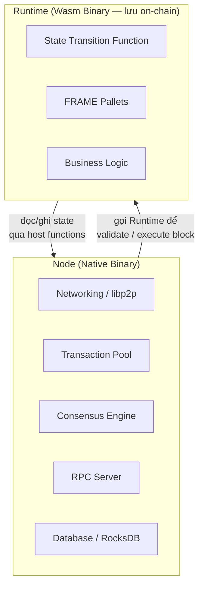
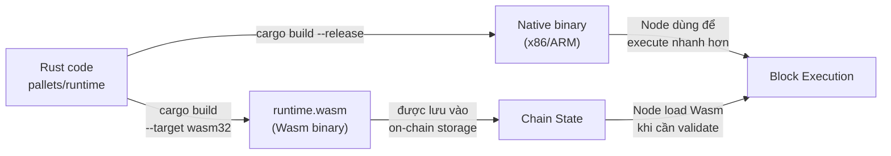
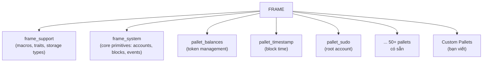

> **Prerequisites**: [[01-setup-va-chay-chain-dau-tien|Lesson 01 — Setup & Chạy Chain Đầu Tiên]]
> **Objectives**:
> - Phân biệt Node (host) và Runtime (guest)
> - Hiểu tại sao Runtime được compile sang Wasm
> - Nắm được FRAME là gì và vai trò của pallet
> - Đọc được file `runtime/src/lib.rs` mà không bị choáng ngợp

---

## Tại Sao Cần Hiểu Kiến Trúc?

Khi bạn viết smart contract Solidity, bạn không cần quan tâm EVM hoạt động ra sao. Nhưng với Substrate, bạn **đang xây chính cái chain đó** — nên cần hiểu phân tách trách nhiệm để biết mình đang làm việc ở tầng nào.

Câu hỏi cốt lõi: **Tại sao Substrate tách chain thành "Node" và "Runtime"?**

---

## 1. Node vs Runtime



> [!definition] Node (Host)
> Binary native chạy trực tiếp trên OS. Xử lý networking, database, consensus, RPC. Node **không chứa business logic** của chain.

> [!definition] Runtime (Guest)
> Binary Wasm được lưu **on-chain** như một key-value trong state. Chứa toàn bộ **state transition function** — quy tắc blockchain của bạn. Node gọi Runtime để validate block và thực thi transactions.

### Lợi ích của sự tách biệt này

Hãy tưởng tượng chain như một **máy chơi game**: Node là cái máy (phần cứng), Runtime là cartridge game (phần mềm logic). Bạn có thể thay game mà không cần mua máy mới.

Cụ thể: khi bạn muốn **upgrade logic** (sửa lỗi, thêm tính năng), bạn chỉ cần upload Wasm binary mới lên chain. Tất cả nodes tự động dùng logic mới mà **không cần restart, không cần hard fork**. Đây gọi là **forkless upgrade**.

---

## 2. Tại Sao Runtime Dùng Wasm?



Wasm được chọn vì 3 lý do:

**Determinism** — Cùng input, mọi node trên toàn cầu phải ra cùng output. Wasm đảm bảo điều này, native binary thì không (khác CPU arch, floating point behavior...).

**Sandbox** — Wasm chạy trong môi trường cô lập, không thể trực tiếp access filesystem hay network — đúng những gì blockchain cần.

**Portability** — Wasm chạy được trên mọi OS, mọi CPU. Node không cần biết mình đang trên x86 hay ARM.

> [!info] Native Runtime
> Substrate thực ra maintain cả native runtime (compile trực tiếp sang binary) để chạy nhanh hơn khi version khớp. Nhưng khi upgrade, Wasm runtime luôn là authoritative.

---

## 3. FRAME — Framework for Runtime Aggregation of Modularized Entities

Bạn có thể viết Runtime từ đầu bằng Rust thuần — nhưng FRAME là framework giúp việc này dễ hơn rất nhiều.



> [!definition] Pallet
> Module FRAME encapsulate một tính năng cụ thể của blockchain. Mỗi pallet có thể có: storage, callable functions (dispatchables), events, errors, và hooks.
>
> Pallet ≈ "smart contract" nhưng chạy ở tầng runtime, có quyền access trực tiếp vào chain state.

### Các Pallet Có Sẵn Quan Trọng

| Pallet | Chức năng |
|--------|-----------|
| `frame_system` | Core primitives — block numbers, accounts, events. Mọi pallet đều depend vào đây |
| `pallet_balances` | Quản lý token: transfer, reserve, lock |
| `pallet_timestamp` | Cung cấp block timestamp |
| `pallet_sudo` | Một root account có thể gọi bất kỳ privileged function nào |
| `pallet_aura` | Block production: slot-based, deterministic |
| `pallet_grandpa` | Block finality: đảm bảo block không bị rollback |
| `pallet_transaction_payment` | Tính và thu phí giao dịch |

---

## 4. Đọc runtime/src/lib.rs

Mở file `runtime/src/lib.rs` — đây là file quan trọng nhất của project. Hãy nhìn theo từng phần:

### 4.1 Cấu hình mỗi pallet

```rust
// Mỗi pallet cần một impl block — đây là nơi bạn "configure" pallet đó
impl pallet_balances::Config for Runtime {
    type MaxLocks = ConstU32<50>;
    type MaxReserves = ();
    type ReserveIdentifier = [u8; 8];
    type Balance = Balance;        // kiểu dữ liệu cho số dư
    type RuntimeEvent = RuntimeEvent;
    type DustRemoval = ();
    type ExistentialDeposit = ConstU128<EXISTENTIAL_DEPOSIT>;
    type AccountStore = System;
    type WeightInfo = pallet_balances::weights::SubstrateWeight<Runtime>;
    // ...
}
```

Mỗi pallet có một trait `Config` với các associated types. Khi bạn `impl pallet_xyz::Config for Runtime`, bạn đang "cắm" pallet đó vào runtime với cấu hình cụ thể.

### 4.2 Macro construct_runtime!

```rust
#[frame_support::runtime]
mod runtime {
    #[runtime::runtime]
    #[runtime::derive(
        RuntimeCall, RuntimeEvent, RuntimeError, RuntimeOrigin, RuntimeTask,
    )]
    pub struct Runtime;

    #[runtime::pallet_index(0)]
    pub type System = frame_system;

    #[runtime::pallet_index(1)]
    pub type Timestamp = pallet_timestamp;

    #[runtime::pallet_index(10)]
    pub type Balances = pallet_balances;

    // ... thêm pallet của bạn vào đây
    #[runtime::pallet_index(20)]
    pub type TemplatePallet = pallet_template;
}
```

Macro này "lắp ráp" tất cả pallets lại, generate code cho: dispatch calls đến đúng pallet, aggregate events, định nghĩa RuntimeCall enum,...

> [!info] `pallet_index`
> Mỗi pallet được gán một index số (u8). Index này được dùng để encode/decode calls trong extrinsics. **Không được thay đổi index đã dùng** sau khi chain đi vào production — sẽ gây lỗi decode.

---

## 5. Flow: Transaction → Pallet

Hiểu cách một transaction được xử lý giúp bạn debug tốt hơn:

```
User gửi Extrinsic (signed transaction)
    ↓
Node nhận, đưa vào Transaction Pool
    ↓
Block Author (validator) tạo block, include extrinsics
    ↓
Runtime.execute_block() được gọi
    ↓
frame_executive decode extrinsic → xác định pallet + call
    ↓
Kiểm tra signature, nonce, fee
    ↓
Gọi dispatchable function trong pallet tương ứng
    ↓
Pallet đọc/ghi Storage, emit Events, hoặc trả về Error
    ↓
State changes được commit vào RocksDB
```

---

## 6. Thực Hành: Đọc Và Hiểu Runtime

Hãy làm theo các bước sau để quen với codebase:

```bash
# Xem danh sách pallets được đăng ký trong runtime
grep "pallet_index" runtime/src/lib.rs

# Đếm số pallets
grep -c "pallet_index" runtime/src/lib.rs

# Xem Config của pallet_timestamp
grep -A 10 "impl pallet_timestamp::Config" runtime/src/lib.rs
```

> [!example] Bài tập 2.1 — Tìm `BlockHashCount`
> Trong `runtime/src/lib.rs`, tìm dòng khai báo `BlockHashCount`. Giá trị là bao nhiêu? Đây là gì?

> [!example] Bài tập 2.2 — Đọc Config của Aura
> Tìm `impl pallet_aura::Config for Runtime`. Nó configure những gì? `MaxAuthorities` là gì?

> [!example] Bài tập 2.3 — Tìm Wasm binary
> Sau khi build xong, chạy:
> ```bash
> ls -lh target/release/wbuild/solochain-template-runtime/
> ```
> Thấy file `.wasm` nặng bao nhiêu?

---

## Tóm Tắt

| Khái niệm | Ý nghĩa |
|-----------|---------|
| **Node** | Binary native: networking, DB, consensus, RPC |
| **Runtime** | Wasm binary on-chain: toàn bộ business logic |
| **Forkless upgrade** | Thay Wasm runtime mà không restart node |
| **FRAME** | Framework macro-based để viết runtime từ pallets |
| **Pallet** | Module FRAME: storage + calls + events + errors |
| **construct_runtime!** | Macro lắp ráp tất cả pallets thành runtime |

Sau lesson này bạn đã hiểu **tại sao** Substrate thiết kế như vậy. Từ Lesson 03, ta bắt đầu **tay chỉ việc** — viết pallet đầu tiên từ đầu.

---

*[[01-setup-va-chay-chain-dau-tien|← Lesson 01]] | [[03-pallet-dau-tien-hello-pallet|Lesson 03 →]]*
