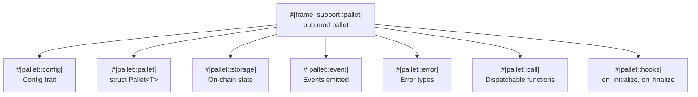

> **Prerequisites**: [[02-kien-truc-substrate|Lesson 02 — Kiến Trúc Substrate]]
> **Objectives**:
> - Tạo pallet mới từ đầu trong project SimpleChain
> - Khai báo StorageValue và đọc/ghi on-chain storage
> - Viết dispatchable call (transaction handler)
> - Emit events và định nghĩa errors
> - Đăng ký pallet vào runtime và test trên Polkadot.js

---

## Pallet Là Gì Về Mặt Code?

Một pallet FRAME chỉ là một **Rust module** với các macro đặc biệt. Cấu trúc xương sống:



Lesson này sẽ xây từng phần theo thứ tự này.

---

## 1. Tạo Pallet Mới

Ta sẽ tạo **`pallet-counter`** — một pallet đơn giản cho phép lưu và cập nhật một counter on-chain.

```bash
cd simplechain

# Tạo thư mục pallet mới
mkdir -p pallets/counter/src
```

Tạo `pallets/counter/Cargo.toml`:

```toml
[package]
name = "pallet-counter"
version = "0.1.0"
description = "A simple counter pallet for SimpleChain"
authors = ["Your Name"]
edition = "2021"
license = "MIT-0"
repository = "https://github.com/paritytech/polkadot-sdk-solochain-template"
publish = false

[package.metadata.docs.rs]
targets = ["x86_64-unknown-linux-gnu"]

[dependencies]
codec = { features = ["derive"], workspace = true }
scale-info = { features = ["derive"], workspace = true }
frame-benchmarking = { optional = true, workspace = true }
frame-support = { workspace = true }
frame-system = { workspace = true }

[dev-dependencies]
sp-core = { workspace = true }
sp-io = { workspace = true }
sp-runtime = { workspace = true }

[features]
default = ["std"]
std = [
    "codec/std",
    "frame-benchmarking?/std",
    "frame-support/std",
    "frame-system/std",
    "scale-info/std",
]
runtime-benchmarks = ["frame-benchmarking/runtime-benchmarks"]
try-runtime = ["frame-support/try-runtime"]
```

---

## 2. Viết lib.rs — Từng Bước

Tạo `pallets/counter/src/lib.rs` và điền từng phần:

### 2.1 Header và imports

```rust
// Không dùng std library — runtime là no_std environment
#![cfg_attr(not(feature = "std"), no_std)]

pub use pallet::*;

#[cfg(test)]
mod mock;
#[cfg(test)]
mod tests;

#[cfg(feature = "runtime-benchmarks")]
mod benchmarking;
pub mod weights;
pub use weights::*;

#[frame_support::pallet]
pub mod pallet {
    use frame_support::pallet_prelude::*;
    use frame_system::pallet_prelude::*;
```

> [!info] `no_std`
> Runtime Wasm không có standard library (`std`). Ta dùng `core` thay thế. Macro `cfg_attr` tự động switch giữa `std` (khi test) và `no_std` (khi compile Wasm).

### 2.2 Config Trait

```rust
    /// Config trait — interface để runtime cấu hình pallet này
    #[pallet::config]
    pub trait Config: frame_system::Config {
        /// Event type — runtime sẽ aggregate events từ tất cả pallets
        type RuntimeEvent: From<Event<Self>> + IsType<<Self as frame_system::Config>::RuntimeEvent>;

        /// WeightInfo — để tính phí giao dịch
        type WeightInfo: WeightInfo;
    }
```

> [!definition] `frame_system::Config`
> Mọi pallet đều `extend` (dùng dấu `:`) từ `frame_system::Config`. Điều này cho phép pallet truy cập các type cơ bản như `AccountId`, `BlockNumber`, `Hash`.

### 2.3 Struct Pallet

```rust
    #[pallet::pallet]
    pub struct Pallet<T>(_);
```

Đây là struct đại diện cho pallet. `T` là generic type parameter (chứa Config). Dấu `_` là phantom data.

### 2.4 Storage

Đây là phần quan trọng nhất — định nghĩa dữ liệu lưu on-chain:

```rust
    /// Lưu giá trị counter hiện tại
    #[pallet::storage]
    pub type Counter<T> = StorageValue<_, u32, ValueQuery>;

    /// Lưu counter riêng của từng account
    #[pallet::storage]
    pub type AccountCounter<T: Config> = StorageMap<
        _,
        Blake2_128Concat,  // hash algorithm cho key
        T::AccountId,      // key type
        u32,               // value type
        ValueQuery,        // trả về 0 thay vì Option khi key không tồn tại
    >;
```

> [!definition] `StorageValue<_, T, QueryKind>`
> Lưu một giá trị đơn lẻ on-chain. `ValueQuery` nghĩa là `.get()` trả về `T::default()` thay vì `None` khi chưa có giá trị.

> [!definition] `StorageMap<_, Hasher, Key, Value, QueryKind>`
> Lưu mapping key → value on-chain. `Blake2_128Concat` là hasher an toàn và cho phép iteration theo prefix — khuyến nghị dùng mặc định.

### 2.5 Events

Events là cách pallet "thông báo" kết quả ra bên ngoài (client, UI):

```rust
    #[pallet::event]
    #[pallet::generate_deposit(pub(super) fn deposit_event)]
    pub enum Event<T: Config> {
        /// Counter toàn cục đã được tăng lên
        /// [new_value]
        CounterIncremented { new_value: u32 },

        /// Counter của một account đã được reset
        /// [who]
        AccountCounterReset { who: T::AccountId },
    }
```

### 2.6 Errors

```rust
    #[pallet::error]
    pub enum Error<T> {
        /// Counter đã đạt giá trị tối đa (u32::MAX), không thể tăng thêm
        CounterOverflow,
    }
```

### 2.7 Dispatchable Calls

Đây là các function người dùng có thể gọi qua extrinsic:

```rust
    #[pallet::call]
    impl<T: Config> Pallet<T> {
        /// Tăng counter toàn cục lên 1
        #[pallet::call_index(0)]
        #[pallet::weight(T::WeightInfo::increment())]
        pub fn increment(origin: OriginFor<T>) -> DispatchResult {
            // Xác minh người gửi là một signed account (không phải root hay unsigned)
            let _who = ensure_signed(origin)?;

            // Đọc giá trị hiện tại, tăng lên 1
            Counter::<T>::try_mutate(|val| -> Result<(), DispatchError> {
                *val = val.checked_add(1).ok_or(Error::<T>::CounterOverflow)?;
                Ok(())
            })?;

            let new_value = Counter::<T>::get();

            // Emit event
            Self::deposit_event(Event::CounterIncremented { new_value });

            Ok(())
        }

        /// Đặt counter toàn cục về một giá trị bất kỳ (chỉ root mới được dùng)
        #[pallet::call_index(1)]
        #[pallet::weight(T::WeightInfo::set_counter())]
        pub fn set_counter(origin: OriginFor<T>, new_value: u32) -> DispatchResult {
            // Chỉ root (sudo) mới được gọi hàm này
            ensure_root(origin)?;

            Counter::<T>::put(new_value);
            Self::deposit_event(Event::CounterIncremented { new_value });

            Ok(())
        }

        /// Tăng counter riêng của account gọi lên 1
        #[pallet::call_index(2)]
        #[pallet::weight(T::WeightInfo::increment_account())]
        pub fn increment_account(origin: OriginFor<T>) -> DispatchResult {
            let who = ensure_signed(origin)?;

            AccountCounter::<T>::try_mutate(&who, |val| -> Result<(), DispatchError> {
                *val = val.checked_add(1).ok_or(Error::<T>::CounterOverflow)?;
                Ok(())
            })?;

            Ok(())
        }

        /// Reset counter của một account về 0 (chỉ chính account đó)
        #[pallet::call_index(3)]
        #[pallet::weight(T::WeightInfo::reset_account())]
        pub fn reset_account(origin: OriginFor<T>) -> DispatchResult {
            let who = ensure_signed(origin)?;

            AccountCounter::<T>::remove(&who);
            Self::deposit_event(Event::AccountCounterReset { who });

            Ok(())
        }
    }
} // end pub mod pallet
```

> [!definition] `DispatchResult`
> Return type của mọi dispatchable call. Tương đương `Result<(), DispatchError>`. Khi OK, state changes được commit. Khi Err, mọi thay đổi bị rollback.

> [!definition] `ensure_signed(origin)`
> Kiểm tra extrinsic được ký bởi một account hợp lệ. Trả về `AccountId` của người gửi. Tương tự `msg.sender` trong Solidity nhưng explicit hơn.

---

## 3. Thêm Weights Stub

Tạo file `pallets/counter/src/weights.rs` (stub đơn giản, benchmark lesson sau):

```rust
#![cfg_attr(rustfmt, rustfmt_skip)]
#![allow(unused_parens)]
#![allow(unused_imports)]

use frame_support::{traits::Get, weights::{Weight, constants::RocksDbWeight}};
use core::marker::PhantomData;

pub trait WeightInfo {
    fn increment() -> Weight;
    fn set_counter() -> Weight;
    fn increment_account() -> Weight;
    fn reset_account() -> Weight;
}

/// Weights cho pallet-counter (chưa benchmark, dùng giá trị estimate)
pub struct SubstrateWeight<T>(PhantomData<T>);
impl<T: frame_system::Config> WeightInfo for SubstrateWeight<T> {
    fn increment() -> Weight {
        Weight::from_parts(10_000_000, 0)
            .saturating_add(T::DbWeight::get().reads(1_u64))
            .saturating_add(T::DbWeight::get().writes(1_u64))
    }
    fn set_counter() -> Weight {
        Weight::from_parts(10_000_000, 0)
            .saturating_add(T::DbWeight::get().writes(1_u64))
    }
    fn increment_account() -> Weight {
        Weight::from_parts(10_000_000, 0)
            .saturating_add(T::DbWeight::get().reads(1_u64))
            .saturating_add(T::DbWeight::get().writes(1_u64))
    }
    fn reset_account() -> Weight {
        Weight::from_parts(10_000_000, 0)
            .saturating_add(T::DbWeight::get().writes(1_u64))
    }
}
```

---

## 4. Đăng Ký Pallet Vào Runtime

### 4.1 Thêm vào Cargo.toml workspace

Mở `Cargo.toml` ở root, trong phần `[workspace.members]` thêm:

```toml
[workspace]
members = [
    "node",
    "pallets/template",
    "pallets/counter",    # <-- thêm dòng này
    "runtime",
]
```

### 4.2 Thêm dependency vào runtime/Cargo.toml

```toml
[dependencies]
# ... các deps có sẵn ...
pallet-counter = { path = "../pallets/counter", default-features = false }
```

Trong phần `[features]`, thêm vào `std`:

```toml
[features]
std = [
    # ... các entries có sẵn ...
    "pallet-counter/std",
]
```

### 4.3 Cấu hình pallet trong runtime/src/lib.rs

Thêm vào đầu file:

```rust
pub use pallet_counter;
```

Thêm impl block:

```rust
impl pallet_counter::Config for Runtime {
    type RuntimeEvent = RuntimeEvent;
    type WeightInfo = pallet_counter::weights::SubstrateWeight<Runtime>;
}
```

Thêm vào `#[frame_support::runtime]` macro:

```rust
    #[runtime::pallet_index(20)]
    pub type Counter = pallet_counter;
```

> [!warning] Chọn pallet_index
> Dùng một index chưa có, không trùng với pallets khác. Template thường dùng index 0-15 cho pallets có sẵn. Ta dùng 20 cho pallet tự viết.

---

## 5. Build và Test

```bash
# Build lại — lần này nhanh hơn vì dependencies đã cache
cargo build --release 2>&1 | tail -5
```

Nếu không có lỗi compile:

```bash
# Chạy chain
./target/release/solochain-template-node --dev
```

### Test Trên Polkadot.js Apps

1. Vào **Developer** → **Extrinsics**
2. Chọn account `alice`
3. Chọn pallet **counter** → call **increment**
4. Submit và sign

Kiểm tra kết quả:
1. **Developer** → **Chain State** → **counter** → **counter()** → Execute
2. Giá trị phải là `1`

Thử **accountCounter**:
1. Developer → Extrinsics → counter → **incrementAccount** → Submit
2. Chain State → counter → **accountCounter(AccountId)** → nhập địa chỉ Alice → Execute
3. Giá trị phải là `1`

---

## 6. Kiểm Tra Events

Sau khi gọi `increment`, vào **Explorer** → click vào block vừa tạo → xem **Events**. Bạn sẽ thấy:

```
counter.CounterIncremented
  new_value: 1
```

Events là cách quan trọng để frontend theo dõi kết quả, subscribe theo websocket.

---

## Bài Tập Thực Hành

> [!example] Bài tập 3.1 — Thêm call `decrement`
> Thêm dispatchable `decrement()` vào pallet. Khi counter = 0 thì trả về error `CounterUnderflow`. Thêm error type tương ứng.

> [!example] Bài tập 3.2 — Giới hạn counter tối đa
> Thêm một config constant `MaxCounterValue: Get<u32>` vào `Config` trait. Khi `increment` vượt quá giá trị này thì trả về error `ExceedsMaxValue`. Cấu hình giá trị `100` trong runtime.
>
> Gợi ý trong `Config`:
> ```rust
> #[pallet::constant]
> type MaxCounterValue: Get<u32>;
> ```
> Trong runtime:
> ```rust
> impl pallet_counter::Config for Runtime {
>     // ...
>     type MaxCounterValue = ConstU32<100>;
> }
> ```

> [!example] Bài tập 3.3 — Đọc storage từ Rust
> Trong Polkadot.js Apps → Developer → Chain State → counter → xem tất cả keys của `accountCounter`. Query nhiều accounts khác nhau (Alice, Bob) sau khi gọi `incrementAccount`.

---

## Tóm Tắt

Cấu trúc pallet FRAME:

```
#[frame_support::pallet]
pub mod pallet {
    #[pallet::config]   → trait Config: frame_system::Config { type RuntimeEvent; }
    #[pallet::pallet]   → pub struct Pallet<T>(_);
    #[pallet::storage]  → StorageValue, StorageMap, StorageDoubleMap
    #[pallet::event]    → enum Event<T>
    #[pallet::error]    → enum Error<T>
    #[pallet::call]     → impl Pallet<T> { pub fn my_call(origin, ...) -> DispatchResult }
}
```

| Macro | Tương đương trong Solidity |
|-------|--------------------------|
| `#[pallet::storage]` | `mapping`, state variable |
| `#[pallet::call]` | `function` |
| `#[pallet::event]` | `event` |
| `#[pallet::error]` | `require(...)` + custom error |
| `ensure_signed(origin)` | `msg.sender` |
| `ensure_root(origin)` | `onlyOwner` modifier |

---

*[[02-kien-truc-substrate|← Lesson 02]] | [[04-storage-types-nang-cao|Lesson 04 →]]*
