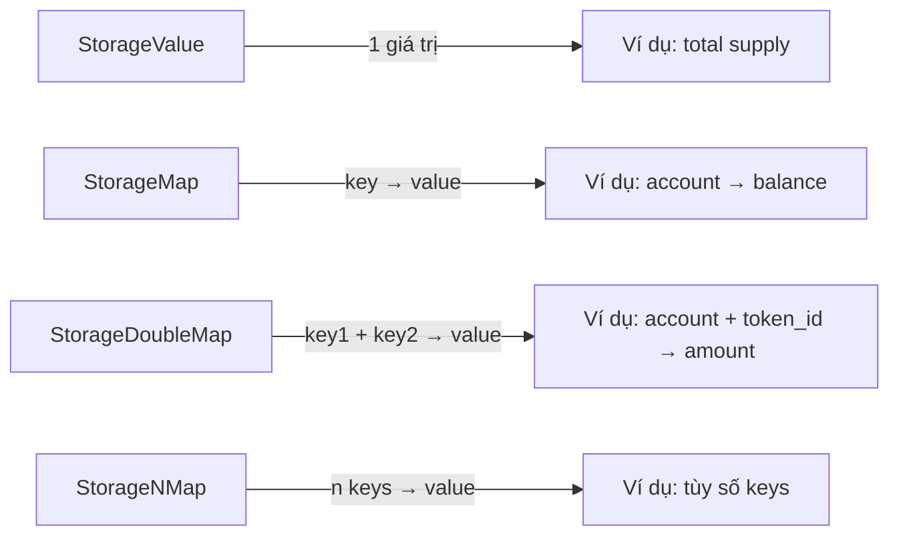

> **Prerequisites**: [[03-pallet-dau-tien-hello-pallet|Lesson 03 — Hello Pallet]]
> **Objectives**:
> - Nắm vững tất cả storage types: StorageValue, StorageMap, StorageDoubleMap, StorageNMap
> - Hiểu BoundedVec và tại sao quan trọng cho on-chain storage
> - Xây **Notepad pallet** — cho phép mỗi account lưu nhiều notes on-chain
> - Biết cách iterate storage và các pattern thường dùng

---

## Tại Sao Storage Là Phần Quan Trọng Nhất?

Nếu trong Solidity bạn viết `mapping(address => uint256) balances`, thì trong Substrate bạn dùng `StorageMap<_, Blake2_128Concat, T::AccountId, u32>`. Cả hai đều lưu key-value on-chain, nhưng Substrate cho bạn nhiều control hơn về: hasher, bounded size, iteration.



---

## 1. StorageValue — Recap

```rust
// Syntax đầy đủ
#[pallet::storage]
pub type MyValue<T> = StorageValue<
    _,           // prefix (tự generate từ tên pallet + tên storage)
    u32,         // value type
    ValueQuery,  // query mode: ValueQuery | OptionQuery
>;

// Dùng:
MyValue::<T>::get()          // đọc (trả về u32, hoặc 0 nếu ValueQuery)
MyValue::<T>::put(42u32)     // ghi
MyValue::<T>::kill()         // xóa
MyValue::<T>::try_mutate(|v| { *v += 1; Ok(()) })  // đọc + sửa atomic
```

**`OptionQuery` vs `ValueQuery`:**
- `OptionQuery`: `.get()` trả về `Option<T>` — phân biệt "chưa có" và "giá trị = 0/empty"
- `ValueQuery`: `.get()` trả về `T::default()` khi chưa có — tiện hơn khi default = 0

---

## 2. StorageMap

```rust
#[pallet::storage]
pub type Balances<T: Config> = StorageMap<
    _,
    Blake2_128Concat,  // hasher
    T::AccountId,      // key type
    u128,              // value type
    ValueQuery,
>;
```

### Các Hashers

| Hasher | Khi nào dùng |
|--------|-------------|
| `Blake2_128Concat` | Dùng cho hầu hết trường hợp. An toàn, hỗ trợ prefix iteration |
| `Twox64Concat` | Nhanh hơn, chỉ an toàn khi key là **trusted** (ví dụ pallet-managed id, không phải user input) |
| `Identity` | Không hash — chỉ khi key đã là hash (như `T::Hash`) |

> [!warning] Không dùng `Twox64Concat` cho user-supplied keys
> Key do user kiểm soát (AccountId, string input...) phải dùng `Blake2_128Concat`. Dùng Twox với user input có thể bị tấn công trie spam.

### Các phép toán StorageMap

```rust
// Đọc
Balances::<T>::get(&account_id)          // Option<u128> hay u128 (tùy QueryKind)
Balances::<T>::contains_key(&account_id) // bool

// Ghi
Balances::<T>::insert(&account_id, 1000u128)
Balances::<T>::remove(&account_id)
Balances::<T>::try_mutate(&account_id, |bal| -> Result<(), DispatchError> {
    *bal = bal.checked_add(amount).ok_or(Error::<T>::Overflow)?;
    Ok(())
})?;

// Iteration — chú ý gas cost!
for (key, value) in Balances::<T>::iter() {
    // ...
}
Balances::<T>::iter_keys()   // chỉ keys
Balances::<T>::iter_values() // chỉ values
```

---

## 3. StorageDoubleMap

Hữu ích khi cần query theo prefix (ví dụ: "tất cả items của account X"):

```rust
#[pallet::storage]
pub type Notes<T: Config> = StorageDoubleMap<
    _,
    Blake2_128Concat, T::AccountId,  // first key
    Blake2_128Concat, u32,           // second key (note_id)
    BoundedVec<u8, ConstU32<256>>,   // value: nội dung note, tối đa 256 bytes
    OptionQuery,
>;

// Dùng:
Notes::<T>::get(&account, note_id)
Notes::<T>::insert(&account, note_id, note_content)
Notes::<T>::remove(&account, note_id)

// Xóa tất cả notes của một account
Notes::<T>::remove_prefix(&account, None);

// Iteration theo prefix — tất cả notes của account
for (note_id, content) in Notes::<T>::iter_prefix(&account) {
    // ...
}
```

---

## 4. BoundedVec — Bắt Buộc Với On-Chain Storage

> [!warning] Tại sao không dùng `Vec<u8>` thường?
> `Vec` không giới hạn size → attacker có thể store data rất lớn → chain state phình to → denial of service. On-chain storage **phải** có upper bound.

`BoundedVec<T, MaxSize>` là Vec với compile-time + runtime size limit:

```rust
use frame_support::BoundedVec;
use sp_runtime::traits::ConstU32;

// Type alias tiện lợi
type NoteContent<T> = BoundedVec<u8, <T as Config>::MaxNoteLength>;

// Trong Config:
#[pallet::constant]
type MaxNoteLength: Get<u32>;

// Trong runtime config:
type MaxNoteLength = ConstU32<512>;  // tối đa 512 bytes/note

// Tạo BoundedVec từ Vec:
let content: Vec<u8> = b"Hello, chain!".to_vec();
let bounded: BoundedVec<u8, T::MaxNoteLength> =
    content.try_into().map_err(|_| Error::<T>::NoteTooLong)?;
```

---

## 5. Xây Notepad Pallet

Tạo pallet mới: `pallets/notepad/`. Đây là pallet thực tế hơn — mỗi account có thể lưu nhiều notes on-chain.

### Tạo Cargo.toml

```bash
mkdir -p pallets/notepad/src
```

`pallets/notepad/Cargo.toml` — giống `pallet-counter/Cargo.toml`, đổi name thành `pallet-notepad`.

### Viết lib.rs

```rust
#![cfg_attr(not(feature = "std"), no_std)]
pub use pallet::*;

#[frame_support::pallet]
pub mod pallet {
    use frame_support::{pallet_prelude::*, BoundedVec};
    use frame_system::pallet_prelude::*;

    // --- Config ---

    #[pallet::config]
    pub trait Config: frame_system::Config {
        type RuntimeEvent: From<Event<Self>> + IsType<<Self as frame_system::Config>::RuntimeEvent>;

        /// Số bytes tối đa của một note
        #[pallet::constant]
        type MaxNoteLength: Get<u32>;

        /// Số notes tối đa mỗi account có thể lưu
        #[pallet::constant]
        type MaxNotesPerAccount: Get<u32>;
    }

    // --- Pallet Struct ---

    #[pallet::pallet]
    pub struct Pallet<T>(_);

    // --- Storage ---

    /// Notes của mỗi account, indexed bởi note_id tự tăng
    #[pallet::storage]
    pub type UserNotes<T: Config> = StorageDoubleMap<
        _,
        Blake2_128Concat,
        T::AccountId,
        Twox64Concat,
        u32,
        BoundedVec<u8, T::MaxNoteLength>,
        OptionQuery,
    >;

    /// Số notes hiện tại của mỗi account (dùng làm auto-increment id)
    #[pallet::storage]
    pub type NoteCount<T: Config> = StorageMap<
        _,
        Blake2_128Concat,
        T::AccountId,
        u32,
        ValueQuery,
    >;

    // --- Events ---

    #[pallet::event]
    #[pallet::generate_deposit(pub(super) fn deposit_event)]
    pub enum Event<T: Config> {
        /// Note mới được tạo. [who, note_id]
        NoteCreated { who: T::AccountId, note_id: u32 },
        /// Note đã bị xóa. [who, note_id]
        NoteDeleted { who: T::AccountId, note_id: u32 },
        /// Note đã được cập nhật. [who, note_id]
        NoteUpdated { who: T::AccountId, note_id: u32 },
    }

    // --- Errors ---

    #[pallet::error]
    pub enum Error<T> {
        /// Note content vượt quá MaxNoteLength
        NoteTooLong,
        /// Account đã đạt giới hạn MaxNotesPerAccount
        TooManyNotes,
        /// Note không tồn tại
        NoteNotFound,
    }

    // --- Calls ---

    #[pallet::call]
    impl<T: Config> Pallet<T> {
        /// Tạo note mới
        #[pallet::call_index(0)]
        #[pallet::weight(Weight::from_parts(50_000_000, 0))]
        pub fn create_note(
            origin: OriginFor<T>,
            content: Vec<u8>,
        ) -> DispatchResult {
            let who = ensure_signed(origin)?;

            // Kiểm tra giới hạn số notes
            let count = NoteCount::<T>::get(&who);
            ensure!(count < T::MaxNotesPerAccount::get(), Error::<T>::TooManyNotes);

            // Convert Vec → BoundedVec (trả về error nếu quá dài)
            let bounded_content: BoundedVec<u8, T::MaxNoteLength> =
                content.try_into().map_err(|_| Error::<T>::NoteTooLong)?;

            // Dùng count làm note_id (auto-increment)
            let note_id = count;
            UserNotes::<T>::insert(&who, note_id, bounded_content);

            // Tăng counter
            NoteCount::<T>::insert(&who, count.saturating_add(1));

            Self::deposit_event(Event::NoteCreated { who, note_id });
            Ok(())
        }

        /// Cập nhật nội dung một note
        #[pallet::call_index(1)]
        #[pallet::weight(Weight::from_parts(50_000_000, 0))]
        pub fn update_note(
            origin: OriginFor<T>,
            note_id: u32,
            new_content: Vec<u8>,
        ) -> DispatchResult {
            let who = ensure_signed(origin)?;

            // Kiểm tra note tồn tại (chỉ owner mới update được)
            ensure!(UserNotes::<T>::contains_key(&who, note_id), Error::<T>::NoteNotFound);

            let bounded: BoundedVec<u8, T::MaxNoteLength> =
                new_content.try_into().map_err(|_| Error::<T>::NoteTooLong)?;

            UserNotes::<T>::insert(&who, note_id, bounded);
            Self::deposit_event(Event::NoteUpdated { who, note_id });
            Ok(())
        }

        /// Xóa một note
        #[pallet::call_index(2)]
        #[pallet::weight(Weight::from_parts(30_000_000, 0))]
        pub fn delete_note(
            origin: OriginFor<T>,
            note_id: u32,
        ) -> DispatchResult {
            let who = ensure_signed(origin)?;

            ensure!(UserNotes::<T>::contains_key(&who, note_id), Error::<T>::NoteNotFound);
            UserNotes::<T>::remove(&who, note_id);

            Self::deposit_event(Event::NoteDeleted { who, note_id });
            Ok(())
        }
    }

    // --- Helper impl ---

    impl<T: Config> Pallet<T> {
        /// Helper: lấy tất cả notes của một account (dùng từ RPC hay offchain)
        pub fn get_notes(who: &T::AccountId) -> Vec<(u32, Vec<u8>)> {
            UserNotes::<T>::iter_prefix(who)
                .map(|(id, content)| (id, content.into_inner()))
                .collect()
        }
    }
}
```

### Đăng Ký Vào Runtime

Thêm vào `Cargo.toml` workspace và `runtime/Cargo.toml` tương tự pallet-counter.

Trong `runtime/src/lib.rs`:

```rust
impl pallet_notepad::Config for Runtime {
    type RuntimeEvent = RuntimeEvent;
    type MaxNoteLength = ConstU32<512>;    // mỗi note tối đa 512 bytes
    type MaxNotesPerAccount = ConstU32<10>; // mỗi account tối đa 10 notes
}

// Trong runtime macro:
#[runtime::pallet_index(21)]
pub type Notepad = pallet_notepad;
```

---

## 6. Test Notepad

```bash
cargo build --release
./target/release/solochain-template-node --dev
```

Trên Polkadot.js Apps:

1. Developer → Extrinsics → **notepad** → **createNote**
2. Content: nhập hex string (ví dụ `0x48656c6c6f` = "Hello")
   - Hoặc dùng "Submit as hex" và nhập bytes
3. Submit → xem event **NoteCreated** trong Explorer

Query notes:
1. Developer → Chain State → **notepad** → **userNotes**
2. Nhập AccountId và note_id (0) → Execute

---

## Bài Tập Thực Hành

> [!example] Bài tập 4.1 — Thêm note title
> Sửa `UserNotes` storage để lưu một struct thay vì chỉ `BoundedVec`:
> ```rust
> #[derive(Encode, Decode, TypeInfo, MaxEncodedLen, Clone)]
> pub struct Note<MaxTitle: Get<u32>, MaxContent: Get<u32>> {
>     pub title: BoundedVec<u8, MaxTitle>,
>     pub content: BoundedVec<u8, MaxContent>,
> }
> ```

> [!example] Bài tập 4.2 — Đếm tổng notes on-chain
> Thêm `StorageValue<_, u64, ValueQuery>` tên `TotalNoteCount`. Tăng khi create, giảm khi delete.

> [!example] Bài tập 4.3 — Iterate storage từ RPC
> Trong Polkadot.js Apps → Developer → Chain State → chọn `notepad` → `userNotes` → không nhập gì, chọn "+" để query tất cả entries. Đây là cách client iterate toàn bộ map.

---

## Tóm Tắt

| Storage Type | Use case | Ví dụ |
|-------------|---------|-------|
| `StorageValue` | 1 giá trị global | total supply |
| `StorageMap` | 1 key → 1 value | account → balance |
| `StorageDoubleMap` | 2 keys → value; query theo prefix key1 | account + id → data |
| `StorageNMap` | n keys | ít dùng, khi cần nhiều hơn 2 keys |
| `BoundedVec` | Vec có giới hạn | notes, token list |

**Nguyên tắc vàng**: Mọi on-chain storage phải **có bounded size** — dùng `BoundedVec`, `ConstU32`, constants từ Config. Không bao giờ dùng `Vec` unbounded trong storage.

---

*[[03-pallet-dau-tien-hello-pallet|← Lesson 03]] | [[05-origins-va-quyen-han|Lesson 05 →]]*
