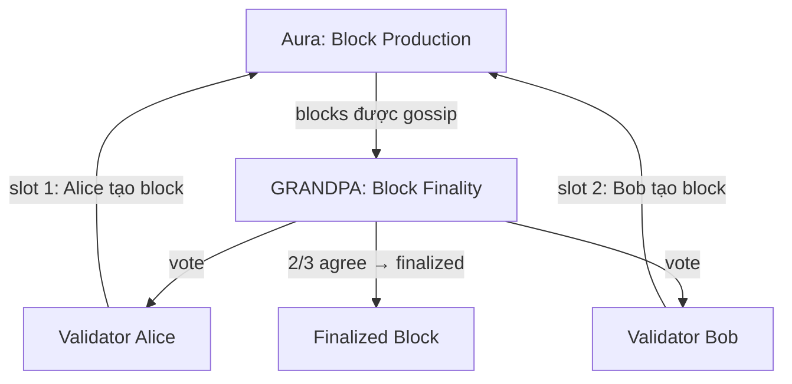

> **Prerequisites**: [[01-setup-va-chay-chain-dau-tien|Lesson 01]], [[08-chain-spec-va-genesis-config|Lesson 08]]
> **Objectives**:
> - Chạy 2 validator nodes trên cùng machine kết nối p2p
> - Hiểu Aura (block production) và GRANDPA (finality) hoạt động cùng nhau
> - Verify chain đạt finality sau khi có 2/3 validators đồng thuận
> - Có SimpleChain testnet thực sự chạy được — output cuối cùng của series

---

## Tại Sao Cần Multi-node?

`--dev` mode chạy 1 node với instant seal — không test được consensus thực sự. Multi-node testnet kiểm tra:

- Block production rotation giữa validators (Aura)
- Finality mechanism (GRANDPA) — block không thể rollback sau khi finalized
- P2P networking — nodes tìm thấy nhau và sync

---

## 1. Aura + GRANDPA — Consensus Của SimpleChain



> [!definition] Aura (Authority Round)
> Cơ chế block production slot-based. Mỗi validator được assign một slot time cố định (6 giây). Đến slot của mình, validator tạo block và broadcast. Nếu validator offline trong slot của mình, slot đó trống — không có block.

> [!definition] GRANDPA (GHOST-based Recursive ANcestor Deriving Prefix Agreement)
> Cơ chế finality. Validators vote trên chain (không phải từng block). Khi ≥ 2/3 validators đồng thuận, tất cả blocks trong chain đó được **finalize** — không thể revert nữa.

---

## 2. Chuẩn Bị Keys Cho Validators

Mỗi validator cần 2 loại keys: Aura key (SR25519) và GRANDPA key (ED25519).

```bash
# Generate keys cho Alice
./target/release/solochain-template-node key generate-node-key
# Output: peer id + node key

# Xem account keys mặc định (dev mode đã có Alice, Bob)
./target/release/solochain-template-node key inspect //Alice
./target/release/solochain-template-node key inspect //Bob
```

Với `--dev` và `--alice`/`--bob` flags, Substrate tự động inject key từ well-known seeds — tiện cho local testing.

---

## 3. Tạo Chain Spec Local

Dùng chain spec từ Lesson 08, hoặc dùng built-in:

```bash
# Export local chain spec (có 2 validators: Alice + Bob)
./target/release/solochain-template-node build-spec \
  --chain local \
  --disable-default-bootnode \
  > local-spec.json

# Convert sang raw
./target/release/solochain-template-node build-spec \
  --chain local-spec.json \
  --raw \
  --disable-default-bootnode \
  > local-spec-raw.json
```

---

## 4. Chạy Node Alice

Mở **terminal 1**:

```bash
./target/release/solochain-template-node \
  --base-path /tmp/alice \
  --chain local-spec-raw.json \
  --alice \
  --port 30333 \
  --rpc-port 9944 \
  --node-key 0000000000000000000000000000000000000000000000000000000000000001 \
  --validator
```

Giải thích flags:
- `--base-path /tmp/alice` — thư mục lưu chain state của Alice
- `--chain local-spec-raw.json` — dùng chain spec đã tạo
- `--alice` — inject well-known Alice keys (Aura + GRANDPA)
- `--port 30333` — P2P port
- `--rpc-port 9944` — WebSocket RPC port (Polkadot.js kết nối vào đây)
- `--node-key` — deterministic P2P identity key (để dùng làm bootnode)
- `--validator` — khai báo node này là validator

Khi Alice node khởi động, bạn sẽ thấy:

```
Local node identity is: 12D3KooWEyoppNCUx8Yx66oV9fJnriXwCZXwDq
Idle (0 peers)   ← chưa có peer
```

Node "idle" vì chỉ có 1 validator — chưa đủ để tạo block.

---

## 5. Chạy Node Bob

Mở **terminal 2**:

```bash
./target/release/solochain-template-node \
  --base-path /tmp/bob \
  --chain local-spec-raw.json \
  --bob \
  --port 30334 \
  --rpc-port 9945 \
  --validator \
  --bootnodes /ip4/127.0.0.1/tcp/30333/p2p/12D3KooWEyoppNCUx8Yx66oV9fJnriXwCZXwDq
```

> [!warning] Thay thế bootnode address
> Địa chỉ `12D3KooW...` phải là **node identity** thực từ output của Alice node. Copy giá trị "Local node identity is:" từ terminal Alice.

Sau khi Bob kết nối với Alice, cả 2 terminal sẽ log:

```
# Terminal Alice:
Discovered new external address for our node: /ip4/127.0.0.1/tcp/30333
Imported #1 (0x...)   ← blocks bắt đầu được tạo!
Imported #2 (0x...)
...
Finalized #1 (0x...)  ← blocks được finalize
```

```
# Terminal Bob:
1 peers   ← đã kết nối với Alice
Importing blocks #1, #2...
Finalized #1, #2...
```

---

## 6. Verify Network Trên Polkadot.js

**Kết nối đến Alice node** (ws://127.0.0.1:9944):

1. **Explorer** → Block hash tăng đều → chain đang chạy
2. **Network** → **Explorer**: thấy cả "best block" và "finalized block"
3. Khi finalized = best (hoặc lag 1-2 blocks): GRANDPA đang hoạt động tốt

**Kết nối đến Bob node** (ws://127.0.0.1:9945):

1. Thấy cùng block height với Alice → nodes đồng bộ
2. Gửi transaction từ Bob node → Alice node cũng nhận được ngay

---

## 7. Test Consensus — Tắt Một Node

Thử tắt Bob node (Ctrl+C trong terminal 2). Quan sát Alice:

```
# Sau khi Bob offline:
Idle (0 peers) — blocks vẫn được tạo nhưng...
# GRANDPA KHÔNG finalize nữa — cần ≥ 2/3 validators
# best block tiếp tục tăng nhưng finalized block đứng yên
```

Khởi động lại Bob → finality tiếp tục, blocks pending được finalize hàng loạt.

---

## 8. Interact Với Chain

Bây giờ bạn có testnet thực sự! Thử:

```bash
# Gửi transaction từ Polkadot.js (kết nối Alice node)
# 1. Developer → Extrinsics → counter → increment
# 2. Kiểm tra trên Bob node (kết nối ws://127.0.0.1:9945)
# 3. Counter phải bằng nhau trên cả hai nodes
```

---

## 9. Dừng Và Cleanup

```bash
# Ctrl+C cả 2 nodes

# Xóa chain state
rm -rf /tmp/alice /tmp/bob
```

---

## 🎉 SimpleChain Hoàn Chỉnh

Bạn đã xây dựng và deploy một blockchain thực tế với:

| Component | Trạng thái |
|-----------|-----------|
| `pallet-counter` | ✅ StorageValue, StorageMap, dispatchables, events |
| `pallet-notepad` | ✅ StorageDoubleMap, BoundedVec, payment deposit |
| Origins & Permissions | ✅ ensure_signed, ensure_root, custom origin |
| Token management | ✅ pallet_balances, reserve/unreserve pattern |
| Unit tests | ✅ Mock runtime, assert_ok!, assert_noop! |
| Chain Spec | ✅ Custom genesis, accounts, validators |
| Runtime Hooks | ✅ on_initialize, auto-expiry |
| Multi-node testnet | ✅ Alice + Bob, Aura + GRANDPA |

---

## Bài Tập Thực Hành

> [!example] Bài tập 10.1 — Thêm validator thứ 3
> Thêm Charlie vào genesis validators. Chạy 3 nodes (Alice, Bob, Charlie). GRANDPA cần 2/3 = 2 nodes. Thử tắt Charlie → finality có bị gián đoạn không? Tắt Alice?

> [!example] Bài tập 10.2 — Forkless Runtime Upgrade
> Đây là tính năng đặc biệt nhất của Substrate:
> 1. Sửa code (ví dụ thay đổi MaxNoteLength từ 512 → 1024)
> 2. `cargo build --release`
> 3. Vào Polkadot.js → Developer → Sudo → **system.setCode**
> 4. Upload file `target/release/wbuild/.../runtime.compact.compressed.wasm`
> 5. Submit → xem runtime upgrade không cần restart node!

---

## Bước Tiếp Theo Sau Series Này

Bạn đã nắm được nền tảng. Các hướng mở rộng:

- **Benchmarking weights**: `cargo test --features runtime-benchmarks` để tính weight chính xác
- **Parachain**: Thêm Cumulus và kết nối vào Polkadot/Kusama relay chain  
- **XCM**: Cross-chain messaging — giao tiếp với parachain khác
- **ink! smart contracts**: Cho phép user deploy contracts lên chain của bạn
- **OpenZeppelin Templates**: Security-focused templates cho production chains

---

*[[09-runtime-hooks|← Lesson 09]] | [[00-roadmap|Roadmap]] | [[a0-frame-macro-cheatsheet|Phụ lục A0 →]]*
