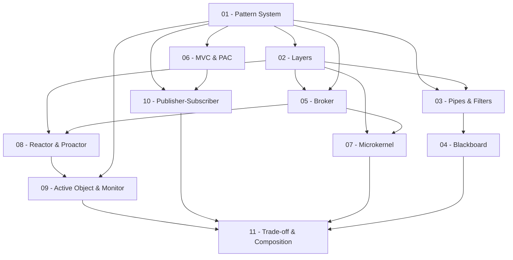

> **Topic**: Pattern-Oriented Software Architecture (PoSA)
> **Domain**: IT / Software Architecture
> **Level**: Advanced — phân tích trade-off, kết hợp pattern
> **Background**: OOP cơ bản (class, interface, inheritance)
> **Tools / Code**: Python 3.x
> **Sources**: POSA Vol.1 (Buschmann et al.), POSA Vol.2 (Schmidt et al.), POSA Vol.4 (Buschmann, Henney, Schmidt), ModernesCpp.com

---

## Lessons

| # | Title | Key Concepts | Prerequisites | Difficulty |
|---|-------|-------------|---------------|------------|
| 01 | Pattern System — Nền tảng tư duy | Pattern là gì, pattern language vs. pattern system, 3 cấp độ abstraction (architectural / design / idiom), anatomy của một pattern | — | ★★☆☆☆ |
| 02 | Layers — Phân tầng hệ thống | Layered architecture, strict vs. relaxed layers, trade-off isolation vs. performance, real-world: OS, TCP/IP stack, Flask | 01 | ★★★☆☆ |
| 03 | Pipes & Filters — Luồng dữ liệu | Filter, Pipe, Push vs. Pull pipeline, Active/Passive filter, trade-off với Blackboard, real-world: Unix shell, ETL | 01, 02 | ★★★☆☆ |
| 04 | Blackboard — Giải quyết vấn đề phi tất định | Knowledge Source, Blackboard, Control Component, so sánh với Pipes & Filters, real-world: AI planner, speech recognition | 01, 03 | ★★★★☆ |
| 05 | Broker — Hệ thống phân tán | Broker topology, Client/Server/Broker/Bridge, so sánh với Client-Dispatcher-Server, trade-off coupling vs. scalability | 01, 02 | ★★★★☆ |
| 06 | MVC & PAC — Giao diện tương tác | Model-View-Controller, Presentation-Abstraction-Control, MVC vs. PAC, variants (MVP, MVVM), trade-off | 01, 02 | ★★★☆☆ |
| 07 | Microkernel — Hệ thống co giãn | Minimal core, External Server, Adapter, Plug-in, so sánh với Layers, trade-off extensibility vs. complexity | 01, 02, 05 | ★★★★☆ |
| 08 | Reactor & Proactor — Event-Driven | Synchronous event demultiplexing, Reactor vs. Proactor, Event Handler, so sánh với Active Object | 01, 05 | ★★★★☆ |
| 09 | Active Object & Monitor Object — Concurrency | Method Request, Scheduler, Future/Result, Monitor Object, so sánh Half-Sync/Half-Async | 01, 08 | ★★★★★ |
| 10 | Publisher-Subscriber & Command Processor | Push vs. Pull notification, Event Channel, Command object, Undo/Redo, kết hợp với MVC | 01, 06 | ★★★☆☆ |
| 11 | Trade-off & Pattern Composition | Combining patterns, conflict resolution, pattern selection heuristics, case study: Warehouse Management System | 01–10 | ★★★★★ |

## Appendix Candidates

| ID | Content | Related Lessons | Notes |
|----|---------|-----------------|-------|
| A0 | Pattern Anatomy Cheatsheet | 01 | Template đầy đủ để viết/đọc một pattern: Name, Context, Problem, Forces, Solution, Consequences, Known Uses |
| A1 | Python Implementation Gallery | 02–10 | Tổng hợp snippet Python cho từng pattern — dùng làm reference nhanh |
| A2 | Pattern Selection Decision Tree | 11 | Flowchart chọn pattern theo bài toán: throughput / coupling / concurrency / extensibility |

---

## Dependency Graph

---

## Progress Tracker

- [ ] [[00-roadmap|00. Roadmap]]
- [ ] [[01-pattern-system|01. Pattern System — Nền tảng tư duy]]
- [ ] [[02-layers|02. Layers — Phân tầng hệ thống]]
- [ ] [[03-pipes-and-filters|03. Pipes & Filters — Luồng dữ liệu]]
- [ ] [[04-blackboard|04. Blackboard — Giải quyết vấn đề phi tất định]]
- [ ] [[05-broker|05. Broker — Hệ thống phân tán]]
- [ ] [[06-mvc-and-pac|06. MVC & PAC — Giao diện tương tác]]
- [ ] [[07-microkernel|07. Microkernel — Hệ thống co giãn]]
- [ ] [[08-reactor-and-proactor|08. Reactor & Proactor — Event-Driven]]
- [ ] [[09-active-object-and-monitor|09. Active Object & Monitor Object — Concurrency]]
- [ ] [[10-publisher-subscriber-command|10. Publisher-Subscriber & Command Processor]]
- [ ] [[11-tradeoff-and-composition|11. Trade-off & Pattern Composition]]
- [ ] [[a0-pattern-anatomy-cheatsheet|A0. Pattern Anatomy Cheatsheet]]
- [ ] [[a1-python-implementation-gallery|A1. Python Implementation Gallery]]
- [ ] [[a2-pattern-selection-tree|A2. Pattern Selection Decision Tree]]
