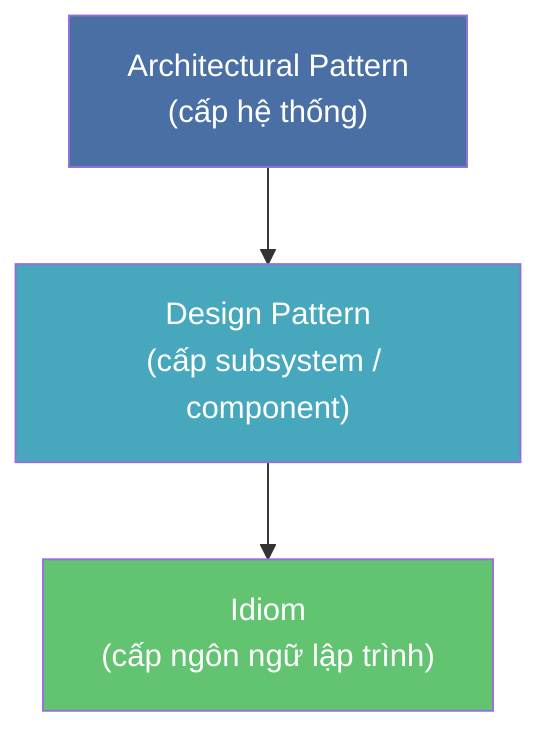
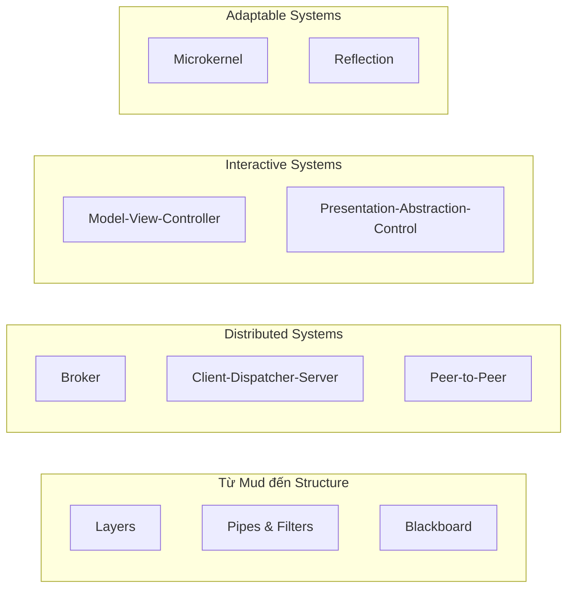

> **Prerequisites**: OOP cơ bản — class, interface, inheritance, composition
> **Objectives**:
> - Hiểu pattern là gì và tại sao nó cần tồn tại
> - Phân biệt Pattern Language và Pattern System
> - Nắm vững 3 cấp độ abstraction: Architectural Pattern, Design Pattern, Idiom
> - Đọc và phân tích cấu trúc giải phẫu (anatomy) đầy đủ của một pattern
> - Nhận biết Forces và Consequences — hai yếu tố then chốt khi lựa chọn pattern

---

## Motivation

### Vấn đề lặp đi lặp lại trong thiết kế phần mềm

Mỗi khi xây dựng một hệ thống mới, các kỹ sư phần mềm đối mặt với những câu hỏi quen thuộc: *Làm thế nào để tách biệt giao diện khỏi logic nghiệp vụ? Làm thế nào để nhiều thành phần độc lập giao tiếp mà không tạo ra sự phụ thuộc chặt chẽ? Làm thế nào để hệ thống có thể mở rộng mà không cần viết lại từ đầu?*

Những câu hỏi này không mới — chúng đã xuất hiện hàng chục năm và đã được các kỹ sư kinh nghiệm giải quyết, thất bại, cải tiến, rồi giải quyết lại. **Pattern** ra đời để đóng gói tri thức đó.

### Nguồn gốc — Christopher Alexander

Khái niệm pattern trong phần mềm được lấy cảm hứng từ kiến trúc sư người Áo Christopher Alexander, người đã viết *A Pattern Language* (1977) — mô tả 253 pattern trong thiết kế đô thị và công trình. Alexander định nghĩa:

> *"Each pattern describes a problem which occurs over and over again in our environment, and then describes the core of the solution to that problem, in such a way that you can use this solution a million times over, without ever doing it the same way twice."*

Năm 1987, Kent Beck và Ward Cunningham áp dụng ý tưởng này vào Smalltalk. Năm 1994, Gang of Four (Erich Gamma, Richard Helm, Ralph Johnson, John Vlissides) xuất bản *Design Patterns* — cuốn sách định hình ngành. Năm 1996, Frank Buschmann cùng nhóm tại Siemens xuất bản *Pattern-Oriented Software Architecture Vol. 1* — mở rộng phạm vi lên cấp độ kiến trúc toàn hệ thống.

### Tại sao cần Pattern System?

GoF tập trung vào Design Pattern — giải pháp ở cấp độ class và object. PoSA nhận ra rằng phần mềm phức tạp cần nhiều cấp độ tư duy hơn: từ quyết định kiến trúc tổng thể của cả hệ thống, xuống đến cách tổ chức các subsystem, cho đến các thủ thuật nhỏ phụ thuộc ngôn ngữ.

PoSA giới thiệu khái niệm **Pattern System** — một hệ thống các pattern có quan hệ với nhau, cùng nhau giải quyết một bài toán lớn theo nhiều lớp abstraction.

---

## Pattern là gì?

> [!definition] Definition 1.1 — Pattern
> Một **pattern (mẫu thiết kế)** là giải pháp đã được kiểm chứng (proven solution) cho một bài toán lặp lại (recurring problem) trong một ngữ cảnh cụ thể (context), cân bằng một tập hợp các ràng buộc cạnh tranh nhau (forces).
>
> Pattern không phải là code có thể copy-paste — nó là **khuôn tư duy** (template for thinking) giúp ta tự tạo ra giải pháp phù hợp với hoàn cảnh cụ thể của mình.

Điểm quan trọng: pattern **không phải sáng chế**. Nó là việc quan sát, nhận ra, và đặt tên cho những gì các kỹ sư giỏi đã làm tự nhiên. Tên gọi tạo ra **vocabulary chung** — thay vì giải thích dài dòng, ta chỉ cần nói "dùng Broker pattern ở đây" và cả team hiểu ngay.

---

## Ba cấp độ Abstraction

PoSA phân loại pattern theo 3 cấp độ, từ trừu tượng nhất đến cụ thể nhất:



### Cấp 1 — Architectural Pattern

> [!definition] Definition 1.2 — Architectural Pattern
> **Architectural Pattern (mẫu kiến trúc)** xác định cấu trúc tổ chức cơ bản của toàn bộ hệ thống phần mềm. Nó chỉ định cách phân chia hệ thống thành các subsystem, các trách nhiệm của mỗi phần, và các quy tắc tổ chức quan hệ giữa chúng.

Ví dụ: **Layers** (TCP/IP stack), **Pipes & Filters** (Unix shell pipeline), **Broker** (gRPC, CORBA), **MVC** (web framework), **Microkernel** (Eclipse IDE plugin system).

Quyết định ở cấp này ảnh hưởng đến toàn bộ codebase và rất khó thay đổi sau khi đã chọn — đây là những quyết định kiến trúc đắt giá nhất.

### Cấp 2 — Design Pattern

> [!definition] Definition 1.3 — Design Pattern
> **Design Pattern (mẫu thiết kế)** cung cấp giải pháp cho bài toán thiết kế ở cấp độ subsystem hoặc component. Nó mô tả cấu trúc class/object và cách chúng tương tác để đạt được mục tiêu thiết kế cụ thể.

Ví dụ: **Command** (undo/redo), **Observer** (event notification), **Proxy** (lazy loading, access control), **Strategy** (interchangeable algorithm), **Facade** (simplify complex API).

Đây là lãnh địa quen thuộc của GoF. Các pattern này áp dụng trong phạm vi hẹp hơn Architectural Pattern nhưng vẫn độc lập với ngôn ngữ lập trình.

### Cấp 3 — Idiom

> [!definition] Definition 1.4 — Idiom
> **Idiom** là pattern cấp thấp nhất, mô tả cách giải quyết một vấn đề thiết kế hoặc cài đặt nhỏ bằng các tính năng của một ngôn ngữ lập trình cụ thể. Idiom **không** có thể chuyển đổi 1-1 sang ngôn ngữ khác.

Ví dụ trong Python:
- **Context Manager** (`with` statement) — đảm bảo resource được giải phóng
- **Descriptor Protocol** (`__get__`, `__set__`) — tái sử dụng attribute validation
- **Generator-based Pipeline** — dùng `yield` để tạo lazy Pipes & Filters

So sánh nhanh:

| Cấp độ | Phạm vi | Ví dụ | Độ trừu tượng |
|--------|---------|-------|--------------|
| Architectural Pattern | Toàn hệ thống | Layers, Broker, MVC | Cao nhất |
| Design Pattern | Subsystem / Component | Command, Observer, Strategy | Trung bình |
| Idiom | Ngôn ngữ cụ thể | Python Context Manager, C++ RAII | Thấp nhất |

---

## Pattern Language vs. Pattern System

Hai khái niệm này hay bị nhầm lẫn:

> [!definition] Definition 1.5 — Pattern Language
> **Pattern Language** là tập hợp các pattern liên quan đến nhau, trong đó mỗi pattern **tham chiếu đến** các pattern khác như cách giải quyết vấn đề nảy sinh từ giải pháp của nó. Các pattern cùng nhau hướng dẫn quá trình thiết kế theo một trình tự có chủ đích.

> [!definition] Definition 1.6 — Pattern System
> **Pattern System** là tập hợp các pattern cung cấp **coverage** (độ bao phủ) — tức là cùng nhau giải quyết được toàn bộ bài toán trong một miền vấn đề, đồng thời chỉ rõ quan hệ, điểm tương đồng và khác biệt giữa các pattern.

Sự khác biệt then chốt: Pattern Language nhấn mạnh **trình tự áp dụng** (flow of design decisions). Pattern System nhấn mạnh **quan hệ** (relationship, trade-off, variants) giữa các pattern.

PoSA xây dựng một **Pattern System** cho kiến trúc phần mềm — không chỉ liệt kê các pattern mà còn chỉ rõ khi nào dùng cái này thay vì cái kia, và tại sao.

---

## Anatomy của một Pattern

Hiểu cách một pattern được viết là kỹ năng thiết yếu — vì toàn bộ khóa học này sẽ phân tích pattern theo cấu trúc này.

> [!definition] Definition 1.7 — Pattern Template (PoSA Format)
>
> | Phần | Nội dung |
> |------|----------|
> | **Name** | Tên ngắn gọn, gợi nhớ. Tên chính là vocabulary |
> | **Also Known As** | Các tên khác cùng chỉ pattern này |
> | **Example** | Ví dụ cụ thể từ thực tế, đặt vấn đề trước khi định nghĩa |
> | **Context** | Tình huống mà pattern áp dụng được |
> | **Problem** | Bài toán cần giải quyết — thường dạng câu hỏi |
> | **Forces** | Các ràng buộc, yêu cầu, áp lực cạnh tranh nhau |
> | **Solution** | Mô tả cấu trúc và cơ chế của giải pháp |
> | **Structure** | Diagram UML hoặc mô tả thành phần tham gia |
> | **Dynamics** | Sequence diagram, luồng tương tác runtime |
> | **Implementation** | Hướng dẫn cài đặt, các điểm cần chú ý |
> | **Example Resolved** | Ví dụ ban đầu được giải quyết bằng pattern |
> | **Variants** | Các biến thể của pattern |
> | **Known Uses** | Ít nhất 3 ví dụ thực tế đã áp dụng |
> | **Consequences** | Trade-off: lợi ích và chi phí khi áp dụng |
> | **See Also** | Các pattern liên quan |

### Forces — Trái tim của một Pattern

**Forces** là phần quan trọng nhất và hay bị bỏ qua nhất. Forces là các yêu cầu và ràng buộc **mâu thuẫn nhau** mà giải pháp phải cân bằng.

> [!example] Example 1.8 — Forces trong Layers Pattern
> **Problem**: Hệ thống cần hỗ trợ nhiều loại hardware.
>
> Các forces:
> - *Portability*: Code không được phụ thuộc trực tiếp vào hardware cụ thể
> - *Performance*: Thêm lớp trừu tượng sẽ tăng overhead
> - *Maintainability*: Thay đổi ở một lớp không được ảnh hưởng lớp khác
> - *Testability*: Cần test từng lớp độc lập
>
> Không có giải pháp nào thỏa mãn **tất cả** forces một cách hoàn hảo. Layers pattern **chấp nhận đánh đổi** performance để đạt portability và maintainability.

Khi đọc một pattern, hỏi ngay: *Forces nào pattern này ưu tiên? Forces nào nó hy sinh?* Đây là cách tư duy advanced.

### Consequences — Không có bữa ăn miễn phí

> [!warning] Nguyên tắc cơ bản
> Mọi pattern đều có **trade-off**. Consequences liệt kê cả **lợi ích** (benefits) lẫn **chi phí / hạn chế** (liabilities). Chọn pattern mà không hiểu consequences là cách chắc chắn để tạo ra kiến trúc tệ.

Ví dụ Consequences của Layers:

**Lợi ích:**
- Reuse các lớp ở các ứng dụng khác nhau
- Hỗ trợ chuẩn hóa (standardization) giữa các lớp
- Dễ dàng thay thế implementation của một lớp

**Hạn chế:**
- Cascading changes — thay đổi interface của một lớp có thể ảnh hưởng nhiều lớp
- Lower efficiency — dữ liệu phải đi qua nhiều lớp
- Difficulty of granularity — không dễ xác định ranh giới giữa các lớp

---

## Pattern System trong PoSA — Bức tranh tổng thể

PoSA Vol. 1 tổ chức các Architectural Pattern theo bài toán chúng giải quyết:



Các nhóm này không độc lập — trong một hệ thống thực, ta thường kết hợp nhiều pattern. Ví dụ: Eclipse IDE dùng **Microkernel** (plugin system) + **MVC** (editor views) + **Observer** (event bus).

---

## Worked Example — Đọc Pattern đầu tiên: Layers

Hãy thực hành đọc pattern theo template. Đây là phiên bản rút gọn của Layers pattern:

**Name**: Layers

**Context**: Hệ thống cần được phân rã thành các nhóm task có độ trừu tượng khác nhau.

**Problem**: Làm thế nào để cấu trúc hệ thống có thể được phát triển và thay đổi theo từng phần mà không ảnh hưởng đến toàn bộ?

**Forces**:
- Source code thay đổi liên tục, nhưng không phải tất cả các phần thay đổi cùng lúc
- Các phần khác nhau của hệ thống cần team khác nhau, tốc độ khác nhau
- Cần test từng phần độc lập

**Solution**: Chia hệ thống thành các lớp (layers). Mỗi layer cung cấp dịch vụ cho layer phía trên và sử dụng dịch vụ của layer phía dưới. Chỉ giao tiếp với layer kề cạnh (strict layering).

**Consequences**:
- ✅ Reusability cao — layer thấp có thể tái sử dụng
- ✅ Dễ thay thế implementation
- ❌ Performance overhead
- ❌ Không phải lúc nào cũng rõ ràng layer nào chứa functionality gì

**Known Uses**: TCP/IP (4 layers), OSI model (7 layers), Flask (Werkzeug → Flask → Application code).

Đây chỉ là *preview* — bài 02 sẽ phân tích Layers đầy đủ với implementation Python và trade-off analysis chi tiết.

---

## Idiom trong Python — Context Manager như một Pattern

Hãy xem một Idiom cụ thể để cảm nhận sự khác biệt với Architectural Pattern:

**Bài toán**: Đảm bảo resource (file, connection, lock) luôn được giải phóng sau khi dùng, kể cả khi có exception.

**Idiom trong Python — Context Manager Protocol**:

```python
class ManagedResource:
    def __init__(self, name: str):
        self.name = name

    def __enter__(self):
        print(f"[acquire] {self.name}")
        return self

    def __exit__(self, exc_type, exc_val, exc_tb):
        print(f"[release] {self.name}")
        return False

    def use(self):
        print(f"[use] {self.name}")


with ManagedResource("database connection") as res:
    res.use()
```

```text
[acquire] database connection
[use] database connection
[release] database connection
```

Idiom này giải quyết bài toán resource management ở cấp ngôn ngữ Python. Cùng bài toán đó trong C++ được giải quyết bằng **RAII** (Resource Acquisition Is Initialization) — một Idiom hoàn toàn khác vì C++ có destructor tất định.

Sự khác biệt quan trọng: Idiom **không thể dịch 1-1** giữa ngôn ngữ, nhưng Architectural Pattern như Layers thì **ngôn ngữ nào cũng áp dụng được**.

---

## Trade-off Analysis — Tư duy Advanced

Ở cấp độ Advanced, câu hỏi không phải là *"pattern này làm gì?"* mà là *"khi nào nên dùng pattern này thay vì pattern kia?"*.

Framework tư duy:

> [!definition] Definition 1.9 — Pattern Selection Framework
> Khi chọn pattern, phân tích theo 5 chiều:
>
> 1. **Coupling** — Các thành phần phụ thuộc nhau chặt hay lỏng?
> 2. **Cohesion** — Mỗi thành phần có trách nhiệm rõ ràng không?
> 3. **Changeability** — Khi yêu cầu thay đổi, bao nhiêu code phải sửa?
> 4. **Performance** — Pattern thêm bao nhiêu overhead?
> 5. **Complexity** — Pattern có làm code khó hiểu hơn không?

Không pattern nào tối ưu cả 5 chiều. Ví dụ:

| Pattern | Coupling | Performance | Changeability | Complexity |
|---------|----------|-------------|--------------|------------|
| Layers | Thấp | Trung bình | Cao | Thấp |
| Broker | Rất thấp | Thấp | Cao | Cao |
| Blackboard | Thấp | Thấp | Cao | Rất cao |

Bảng này sẽ được mở rộng dần theo từng bài học.

---

## Summary

- **Pattern** = giải pháp đã kiểm chứng cho bài toán lặp lại trong context cụ thể, cân bằng các forces mâu thuẫn.
- **3 cấp độ**: Architectural Pattern (hệ thống) → Design Pattern (subsystem) → Idiom (ngôn ngữ).
- **Pattern System** (PoSA) khác Pattern Language ở chỗ nhấn mạnh **quan hệ và trade-off** giữa các pattern.
- **Forces** là các ràng buộc cạnh tranh nhau mà giải pháp phải cân bằng — đây là lý do pattern tồn tại.
- **Consequences** luôn có hai mặt: lợi ích và hạn chế — không có pattern nào hoàn hảo.
- Tư duy Advanced = phân tích **trade-off** theo coupling, cohesion, changeability, performance, complexity.

---

## References

- Frank Buschmann et al. — *Pattern-Oriented Software Architecture Vol. 1: A System of Patterns* (Wiley, 1996), Chapter 1
- Christopher Alexander — *A Pattern Language* (Oxford University Press, 1977)
- Erich Gamma et al. — *Design Patterns: Elements of Reusable Object-Oriented Software* (Addison-Wesley, 1994), Introduction
- Martin Fowler — *Patterns of Enterprise Application Architecture* (2002), Chapter 1
