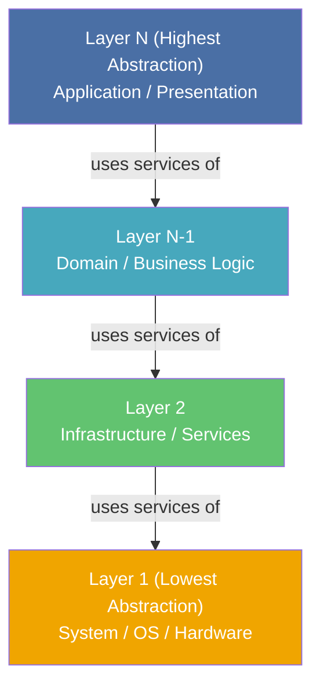
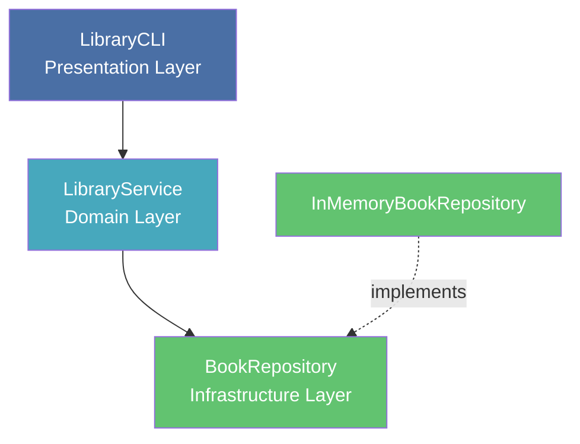

> **Prerequisites**: [[01-pattern-system|01. Pattern System — Nền tảng tư duy]]
> **Objectives**:
> - Hiểu đầy đủ anatomy của Layers pattern theo format PoSA
> - Phân biệt Strict Layering và Relaxed Layering — khi nào dùng cái nào
> - Phân tích Black-box / Gray-box / White-box interface giữa các layer
> - Nhận ra anti-pattern Lasagna Architecture
> - Implement một Layered Architecture hoàn chỉnh bằng Python
> - Phân tích trade-off theo 5 chiều: coupling, cohesion, changeability, performance, complexity

---

## Motivation

### Vấn đề: Code không thể thay đổi theo từng phần

Năm 1983, một nhóm kỹ sư tại Digital Equipment Corporation (DEC) đang xây dựng phần mềm điều khiển workstation VAX. Họ đối mặt với một vấn đề quen thuộc: code xử lý giao diện người dùng, logic nghiệp vụ, và điều khiển phần cứng đan xen vào nhau. Khi cần hỗ trợ loại màn hình mới, họ phải sửa đồng thời ở nhiều chỗ — và mỗi lần sửa là mỗi lần rủi ro.

Vấn đề cốt lõi: **hệ thống lớn không thể được thay đổi ở một nơi mà không ảnh hưởng đến tất cả các nơi khác**.

Layers pattern giải quyết điều này bằng cách tổ chức hệ thống thành các tầng (layers) nằm chồng lên nhau. Mỗi layer chỉ "nhìn thấy" layer ngay phía dưới mình và chỉ cung cấp dịch vụ cho layer ngay phía trên. Thay đổi trong một layer không lan sang các layer khác — miễn là interface giữa chúng không đổi.

---

## Pattern Anatomy — Layers

### Name

**Layers** (còn gọi là *Layered Architecture*, *N-Tier Architecture*)

### Context

Một hệ thống lớn cần được phân rã thành các nhóm chức năng (subtasks) theo các mức độ trừu tượng khác nhau. Hệ thống có các thành phần thay đổi với tần suất và lý do khác nhau.

### Problem

> Làm thế nào để cấu trúc một hệ thống sao cho các phần khác nhau có thể được phát triển, thay thế, và kiểm thử một cách độc lập — mà không cần hiểu toàn bộ hệ thống?

### Forces

Các ràng buộc cạnh tranh nhau phải cân bằng:

- **Portability**: Code cấp cao không được phụ thuộc trực tiếp vào detail cấp thấp (hardware, OS, DB engine)
- **Reusability**: Các service cấp thấp nên được tái sử dụng bởi nhiều thành phần cấp cao khác nhau
- **Changeability**: Thay đổi implementation của một phần không nên lan sang các phần khác
- **Testability**: Cần kiểm thử từng nhóm chức năng độc lập với nhau
- **Performance**: Thêm lớp trừu tượng tạo ra overhead — mỗi request phải đi qua nhiều layer
- **Understandability**: Ranh giới rõ ràng giúp developer mới nhanh chóng định hướng

Không có giải pháp nào thỏa mãn tất cả. Layers **hy sinh performance** để đạt portability, reusability, và changeability.

### Solution

> [!definition] Definition 2.1 — Layers Pattern
> Tổ chức hệ thống thành các **layer** xếp chồng theo chiều dọc. Mỗi layer:
> - Đóng gói một mức độ trừu tượng nhất định
> - Cung cấp **services** cho layer phía trên thông qua một interface được định nghĩa rõ ràng
> - Chỉ sử dụng services của layer phía dưới (không "nhảy cóc" qua nhiều lớp trong strict layering)
> - **Không biết** gì về layer phía trên mình

### Structure



**Các thành phần tham gia:**
- **Layer**: Một nhóm class/module ở cùng mức độ trừu tượng
- **Interface**: Tập hợp services mà layer cung cấp cho layer phía trên
- **Service Request**: Lời gọi từ layer trên xuống layer dưới

---

## Variants — Strict vs. Relaxed Layering

Đây là điểm trade-off quan trọng nhất của Layers pattern:

> [!definition] Definition 2.2 — Strict Layering (Closed Layers)
> Mỗi layer **chỉ** được phép gọi đến layer **ngay phía dưới** nó. Layer N không thể gọi trực tiếp Layer N-2.
>
> **Lợi ích**: Changeability cao nhất — thay một layer không ảnh hưởng gì ngoài hai layer kề cạnh.
> **Hạn chế**: Phải tạo các **proxy method** ở layer trung gian chỉ để chuyển tiếp lời gọi. Tệ hơn, có thể dẫn đến **Lasagna Architecture**.

> [!definition] Definition 2.3 — Relaxed Layering (Open Layers)
> Layer trên được phép gọi **bất kỳ layer nào phía dưới** nó, không nhất thiết phải là layer kề.
>
> **Lợi ích**: Loại bỏ proxy method vô nghĩa, performance tốt hơn.
> **Hạn chế**: Coupling tăng lên — nhiều layer biết về nhau hơn, khó thay thế hơn.

Kinh nghiệm thực tế (Martin Fowler, *PoEAA*): **Relaxed layering thường hoạt động tốt hơn trong thực tế**, vì nó tránh được sự phình to không cần thiết của các layer trung gian.

### Black-box / Gray-box / White-box Interface

Ba cách một layer "nhìn" vào layer phía dưới:

| Approach | Layer J+1 thấy gì của Layer J | Độ coupling | Khi nào dùng |
|----------|-------------------------------|-------------|-------------|
| **Black-box** | Chỉ thấy flat interface (thường dùng Facade) | Thấp nhất | Khi cần thay thế Layer J hoàn toàn |
| **Gray-box** | Biết Layer J có N component, gọi trực tiếp từng component | Trung bình | Khi cần kiểm soát routing |
| **White-box** | Thấy và extends internals của Layer J qua inheritance | Cao nhất | Tránh dùng — coupling quá mạnh |

---

## Anti-Pattern: Lasagna Architecture

> [!warning] Anti-Pattern 2.4 — Lasagna Architecture
> Xảy ra khi áp dụng strict layering một cách máy móc, dẫn đến:
> - Quá nhiều layer mỏng, mỗi layer chỉ là proxy cho layer dưới
> - Thêm một field vào database buộc phải sửa **tất cả** các layer từ trên xuống dưới
> - Overhead không đáng có, không lợi ích thực sự về changeability
>
> **Dấu hiệu nhận biết**: Bạn có các method như `getUser()` xuất hiện y chang ở 4–5 layer khác nhau, chỉ gọi `getUser()` của layer dưới.
>
> **Giải pháp**: Chuyển sang relaxed layering — chỉ tạo layer boundary thực sự khi có sự khác biệt về trách nhiệm (responsibility).

---

## Implementation — Layered Architecture bằng Python

Xây dựng một hệ thống quản lý thư viện đơn giản với 3 layer rõ ràng.

### Layer 1 — Infrastructure (Database Access)

```python
from abc import ABC, abstractmethod
from typing import Optional
import json


class BookRecord:
    def __init__(self, book_id: str, title: str, author: str, available: bool = True):
        self.book_id = book_id
        self.title = title
        self.author = author
        self.available = available

    def to_dict(self) -> dict:
        return {
            "book_id": self.book_id,
            "title": self.title,
            "author": self.author,
            "available": self.available,
        }


class BookRepository(ABC):
    @abstractmethod
    def find_by_id(self, book_id: str) -> Optional[BookRecord]:
        ...

    @abstractmethod
    def save(self, record: BookRecord) -> None:
        ...

    @abstractmethod
    def find_all(self) -> list[BookRecord]:
        ...


class InMemoryBookRepository(BookRepository):
    def __init__(self):
        self._store: dict[str, BookRecord] = {}

    def find_by_id(self, book_id: str) -> Optional[BookRecord]:
        return self._store.get(book_id)

    def save(self, record: BookRecord) -> None:
        self._store[record.book_id] = record

    def find_all(self) -> list[BookRecord]:
        return list(self._store.values())
```

### Layer 2 — Domain (Business Logic)

```python
from dataclasses import dataclass


@dataclass
class Book:
    book_id: str
    title: str
    author: str
    available: bool


class BookNotFoundError(Exception):
    pass


class BookNotAvailableError(Exception):
    pass


class LibraryService:
    def __init__(self, repository: BookRepository):
        self._repo = repository

    def add_book(self, book_id: str, title: str, author: str) -> Book:
        record = BookRecord(book_id, title, author, available=True)
        self._repo.save(record)
        return Book(book_id, title, author, available=True)

    def borrow_book(self, book_id: str) -> Book:
        record = self._repo.find_by_id(book_id)
        if record is None:
            raise BookNotFoundError(f"Book '{book_id}' not found")
        if not record.available:
            raise BookNotAvailableError(f"Book '{book_id}' is currently borrowed")
        record.available = False
        self._repo.save(record)
        return Book(record.book_id, record.title, record.author, available=False)

    def return_book(self, book_id: str) -> Book:
        record = self._repo.find_by_id(book_id)
        if record is None:
            raise BookNotFoundError(f"Book '{book_id}' not found")
        record.available = True
        self._repo.save(record)
        return Book(record.book_id, record.title, record.author, available=True)

    def list_available(self) -> list[Book]:
        return [
            Book(r.book_id, r.title, r.author, r.available)
            for r in self._repo.find_all()
            if r.available
        ]
```

### Layer 3 — Presentation (CLI Interface)

```python
class LibraryCLI:
    def __init__(self, service: LibraryService):
        self._service = service

    def run(self):
        while True:
            print("\n=== Library System ===")
            print("1. Add book  2. Borrow  3. Return  4. List available  5. Exit")
            choice = input("Choice: ").strip()

            if choice == "1":
                self._handle_add()
            elif choice == "2":
                self._handle_borrow()
            elif choice == "3":
                self._handle_return()
            elif choice == "4":
                self._handle_list()
            elif choice == "5":
                break

    def _handle_add(self):
        book_id = input("Book ID: ")
        title = input("Title: ")
        author = input("Author: ")
        book = self._service.add_book(book_id, title, author)
        print(f"Added: {book.title} by {book.author}")

    def _handle_borrow(self):
        book_id = input("Book ID to borrow: ")
        try:
            book = self._service.borrow_book(book_id)
            print(f"Borrowed: {book.title}")
        except (BookNotFoundError, BookNotAvailableError) as e:
            print(f"Error: {e}")

    def _handle_return(self):
        book_id = input("Book ID to return: ")
        try:
            book = self._service.return_book(book_id)
            print(f"Returned: {book.title}")
        except BookNotFoundError as e:
            print(f"Error: {e}")

    def _handle_list(self):
        books = self._service.list_available()
        if not books:
            print("No books available")
        for b in books:
            print(f"  [{b.book_id}] {b.title} — {b.author}")


if __name__ == "__main__":
    repo = InMemoryBookRepository()
    service = LibraryService(repo)
    cli = LibraryCLI(service)

    service.add_book("B001", "Clean Code", "Robert C. Martin")
    service.add_book("B002", "Design Patterns", "Gang of Four")

    cli.run()
```

**Cấu trúc dependency (chiều đi từ trên xuống):**



**Điểm then chốt trong implementation này:**
- `LibraryCLI` phụ thuộc vào `LibraryService` — không phụ thuộc vào `BookRepository` (strict layering cho Presentation → Domain)
- `LibraryService` nhận `BookRepository` qua constructor (Dependency Injection) — không biết đó là InMemory hay PostgreSQL
- `BookRecord` là infrastructure DTO, `Book` là domain object — layer boundary thể hiện qua hai loại object khác nhau

---

## Known Uses

**TCP/IP Stack (4 layers)**: Application → Transport (TCP/UDP) → Internet (IP) → Network Access. Đây là ví dụ kinh điển nhất — mỗi layer hoàn toàn độc lập với implementation của layer khác.

**Flask (Python web framework)**: Werkzeug (WSGI layer, HTTP protocol handling) → Flask core (routing, request/response objects) → Application code (business logic). Khi Werkzeug thay đổi, Flask core bọc lại thay đổi đó — application code không bị ảnh hưởng.

**Domain-Driven Design (DDD)**: Eric Evans đề xuất 4 layer — User Interface → Application → Domain → Infrastructure. Layer Domain chứa toàn bộ business logic, không biết gì về database hay giao diện.

**Android Architecture (Google recommendation)**: UI Layer (Activity/Fragment) → Domain Layer (Use Cases) → Data Layer (Repository + Data Sources). Google chính thức khuyến nghị architecture này từ 2022.

---

## Consequences

### Lợi ích

- **Reuse của layer thấp**: Infrastructure layer (repository, HTTP client, serializer) có thể được tái sử dụng bởi nhiều ứng dụng khác nhau
- **Thay thế dễ dàng**: Đổi từ InMemory sang PostgreSQL chỉ cần implement lại `BookRepository` — domain và presentation không đổi
- **Testability**: Test domain logic không cần database thật — inject `FakeBookRepository`
- **Team independence**: Team frontend và team backend có thể làm việc song song, miễn là đồng ý về interface

### Hạn chế

- **Overhead**: Mỗi request phải đi qua nhiều layer — cost của function call và object creation
- **Cascading changes**: Thay đổi interface của một layer (ví dụ thêm parameter) có thể lan sang nhiều layer liên quan
- **Over-engineering với hệ thống nhỏ**: Project nhỏ với 3 model không cần 3 layer rõ ràng — nó chỉ thêm boilerplate
- **Ranh giới không rõ ràng**: Không có quy tắc cứng về "layer nào chứa gì" — thực tế hay gây tranh cãi trong team

---

## Trade-off Analysis — Layers vs. Alternatives

| Tiêu chí | Layers | Pipes & Filters | Blackboard |
|----------|--------|----------------|------------|
| **Coupling** | Thấp (chỉ layer kề biết nhau) | Rất thấp (filter không biết nhau) | Thấp (qua shared state) |
| **Cohesion** | Cao (mỗi layer có trách nhiệm rõ) | Cao (mỗi filter làm một việc) | Trung bình |
| **Performance** | Trung bình (multi-layer call) | Thấp (copy data qua mỗi pipe) | Thấp (polling blackboard) |
| **Changeability** | Cao | Rất cao (thêm/bớt filter tự do) | Cao |
| **Phù hợp với** | Hệ thống business logic phân cấp | Data transformation pipeline | Bài toán phi tuyến, AI |

**Khi nào dùng Layers thay vì Pipes & Filters?**
- Dùng Layers khi hệ thống có các lớp trách nhiệm **khác nhau về bản chất** (UI vs. Domain vs. DB)
- Dùng Pipes & Filters khi luồng xử lý là **biến đổi dữ liệu tuần tự** (ETL, compiler pipeline)

---

## Summary

- **Layers pattern** chia hệ thống thành các tầng theo mức độ trừu tượng — mỗi tầng chỉ biết tầng ngay dưới nó (strict) hoặc bất kỳ tầng nào phía dưới (relaxed).
- **Strict layering** cho changeability tối đa nhưng dễ dẫn đến **Lasagna Architecture** nếu dùng quá máy móc.
- **Relaxed layering** thực tế hơn — tránh proxy method vô nghĩa.
- **Black-box interface** (qua Facade) cho coupling thấp nhất; **White-box** (qua inheritance) nguy hiểm nhất.
- Forces ưu tiên: **portability, changeability, reusability**. Forces hy sinh: **performance, simplicity (với small project)**.
- Trong Python: dùng ABC để định nghĩa interface layer, Dependency Injection để giữ layer boundary, dataclass riêng cho từng layer.

---

## References

- Frank Buschmann et al. — *POSA Vol. 1*, Chapter 2: Architectural Patterns — Layers
- Martin Fowler — *Patterns of Enterprise Application Architecture* (2002), Introduction: Layering
- Eric Evans — *Domain-Driven Design* (2003), Chapter 4: Isolating the Domain
- Herb Graca — *Layered Architecture* (herbertograca.com, 2017)
