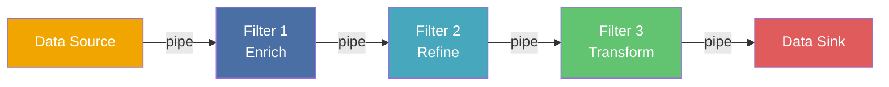
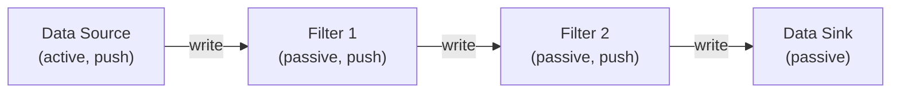
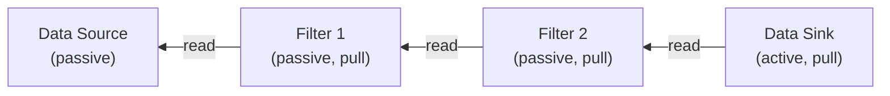
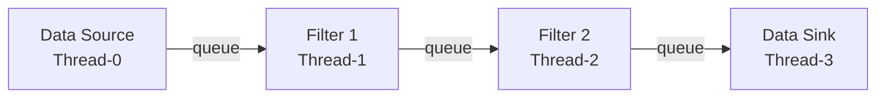
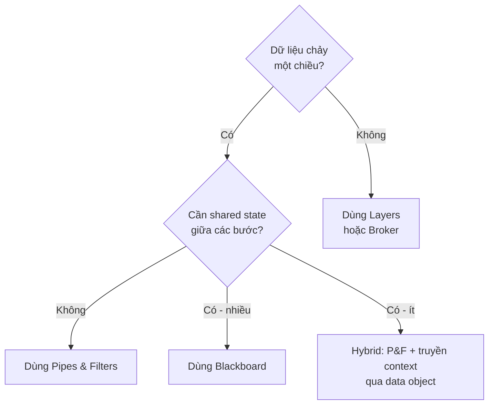

> **Prerequisites**: [[01-pattern-system|01. Pattern System — Nền tảng tư duy]], [[02-layers|02. Layers — Phân tầng hệ thống]]
> **Objectives**:
> - Hiểu đầy đủ anatomy của Pipes & Filters pattern theo format PoSA
> - Phân biệt 4 kiểu Filter: Active/Passive × Push/Pull — và 4 kịch bản luồng dữ liệu
> - Nhận ra khi nào dùng Pipes & Filters thay vì Layers hoặc Blackboard
> - Implement 3 biến thể pipeline bằng Python: sequential, lazy generator, concurrent
> - Phân tích trade-off: recomposability vs. shared state, throughput vs. latency

---

## Motivation

### Vấn đề: Xử lý dữ liệu tuần tự bị gắn chặt vào nhau

Năm 1973, Doug McIlroy tại Bell Labs đề xuất một ý tưởng đơn giản: các chương trình Unix nhỏ nên viết output ra stdout, và chương trình khác đọc từ stdin. Kết quả là shell pipeline nổi tiếng:

```bash
cat access.log | grep "ERROR" | awk '{print $4}' | sort | uniq -c | sort -rn | head -10
```

Mỗi lệnh làm **một việc duy nhất** và không biết gì về lệnh trước hay sau nó. Muốn thêm bước lọc? Chèn vào giữa. Muốn thay thế `sort`? Đổi lệnh. Muốn tái sử dụng `grep` trong pipeline khác? Hoàn toàn tự do.

Đây là triết lý cốt lõi của Pipes & Filters: **xử lý dữ liệu như một dòng chảy qua chuỗi các bộ lọc độc lập**. Mỗi bộ lọc chỉ biết dữ liệu đến và dữ liệu đi — không quan tâm đến context của cả hệ thống.

Đối lập với Layers, nơi ranh giới được vạch theo **mức độ trừu tượng**, Pipes & Filters vạch ranh giới theo **bước biến đổi dữ liệu**. Đây là sự khác biệt nền tảng về tư duy thiết kế.

---

## Pattern Anatomy — Pipes & Filters

### Name

**Pipes & Filters** (còn gọi là *Pipeline Architecture*, *Dataflow Architecture*)

### Context

Hệ thống cần xử lý một luồng dữ liệu (data stream) qua một chuỗi các bước biến đổi (transformation steps). Mỗi bước độc lập về mặt logic và dữ liệu chỉ đi theo một chiều từ nguồn đến đích.

### Problem

> Làm thế nào để cấu trúc một hệ thống xử lý dữ liệu sao cho các bước xử lý có thể được **tái sử dụng, tái sắp xếp, thêm/bớt** một cách tự do — mà không cần thay đổi logic của các bước còn lại?

### Forces

- **Reusability**: Các bước xử lý nên được tái sử dụng trong các pipeline khác nhau
- **Flexibility**: Thứ tự các bước hoặc bản thân các bước phải dễ dàng thay đổi
- **Concurrency**: Các bước độc lập nên chạy song song để tăng throughput
- **Simplicity per step**: Mỗi bước nên dễ hiểu, dễ test khi đứng độc lập
- **Shared state là kẻ thù**: Nếu các bước chia sẻ trạng thái, sẽ rất khó debug và thay thế
- **Performance overhead**: Truyền dữ liệu qua nhiều bước tạo ra overhead, đặc biệt nếu phải copy dữ liệu lớn

Pipes & Filters **ưu tiên** reusability, flexibility, và concurrency. **Hy sinh** khả năng xử lý bài toán có global state hoặc non-linear control flow.

### Solution

> [!definition] Definition 3.1 — Pipes & Filters Pattern
> Tổ chức hệ thống thành chuỗi các **Filter** được kết nối bởi các **Pipe**:
>
> - **Filter**: Đơn vị xử lý độc lập. Nhận dữ liệu đầu vào, biến đổi, và gửi ra đầu ra. **Không biết** filter nào đứng trước hoặc sau nó.
> - **Pipe**: Kênh truyền dữ liệu từ output của filter này đến input của filter tiếp theo. Có thể là buffer, queue, hay direct function call.
> - **Data Source**: Nguồn phát sinh dữ liệu ban đầu (file, database, sensor, network).
> - **Data Sink**: Điểm tiêu thụ dữ liệu cuối cùng (file, screen, database, network).

### Structure



**Ba loại Filter theo chức năng biến đổi:**

| Loại | Mô tả | Ví dụ |
|------|-------|-------|
| **Enrich** | Thêm thông tin vào dữ liệu | Parse raw text → add metadata |
| **Refine** | Lọc, chắt lọc — giảm lượng dữ liệu | Chỉ giữ record thoả điều kiện |
| **Transform** | Thay đổi hình dạng dữ liệu | JSON → XML, Celsius → Fahrenheit |

---

## Variants — 4 Kịch bản Luồng Dữ liệu

Đây là phần phức tạp nhất của pattern, thường bị giải thích sơ sài. Sự khác biệt nằm ở **ai chủ động khởi tạo luồng xử lý**.

> [!definition] Definition 3.2 — Active vs. Passive Filter
> - **Active Filter**: Chạy trong thread/process riêng. Tự chủ động kéo (pull) dữ liệu vào và đẩy (push) kết quả ra. Kiểm soát vòng lặp của chính mình.
> - **Passive Filter**: Không có vòng lặp riêng. Được kích hoạt bởi filter khác — hoặc bị gọi để đưa dữ liệu vào (push từ bên ngoài), hoặc bị gọi để lấy dữ liệu ra (pull từ bên ngoài).

### Kịch bản 1 — Push (Data Source chủ động)

Data Source đẩy dữ liệu vào filter đầu tiên. Mỗi filter xử lý xong thì tiếp tục đẩy sang filter tiếp theo.



Đặc điểm: mỗi Passive Push Filter định nghĩa method `write(data)`. Filter trước gọi `write()` của filter sau.

### Kịch bản 2 — Pull (Data Sink chủ động)

Data Sink kéo dữ liệu từ filter cuối. Filter cuối lại kéo từ filter trước, cứ thế ngược lên đến Data Source.



Đặc điểm: mỗi Passive Pull Filter định nghĩa method `read()`. Filter sau gọi `read()` của filter trước.

**Đây chính xác là cơ chế Python Generator (`yield`)** — Lazy evaluation theo chiều pull.

### Kịch bản 3 — Mixed: một Active Filter ở giữa

Chỉ một filter trung tâm là Active (Pull-Push). Nó kéo dữ liệu từ các filter trước (passive pull) và đẩy sang filter sau (passive push).

### Kịch bản 4 — Fully Active (Concurrent Pipeline)

Mọi filter đều Active, mỗi cái chạy trong thread riêng. Pipe trở thành **synchronized queue** (buffer) giữa các thread. Đây là mô hình cho throughput cao nhất.



---

## Implementation — Ba biến thể Python

### Biến thể 1 — Sequential Pipeline (Đơn giản nhất)

Phù hợp khi dữ liệu nhỏ, không cần lazy evaluation, không cần concurrency.

```python
from abc import ABC, abstractmethod
from typing import Any


class Filter(ABC):
    @abstractmethod
    def process(self, data: Any) -> Any:
        ...


class Pipeline:
    def __init__(self):
        self._filters: list[Filter] = []

    def add_filter(self, f: Filter) -> "Pipeline":
        self._filters.append(f)
        return self

    def run(self, data: Any) -> Any:
        result = data
        for f in self._filters:
            result = f.process(result)
        return result


class ParseCSVFilter(Filter):
    def process(self, raw: str) -> list[dict]:
        lines = raw.strip().splitlines()
        headers = lines[0].split(",")
        return [
            dict(zip(headers, line.split(",")))
            for line in lines[1:]
        ]


class FilterAgeFilter(Filter):
    def __init__(self, min_age: int):
        self._min = min_age

    def process(self, records: list[dict]) -> list[dict]:
        return [r for r in records if int(r["age"]) >= self._min]


class FormatOutputFilter(Filter):
    def process(self, records: list[dict]) -> list[str]:
        return [f"{r['name']} ({r['age']})" for r in records]


raw_data = """name,age,city
Alice,32,Hanoi
Bob,17,HCM
Charlie,25,Danang
Diana,15,Hue"""

result = (
    Pipeline()
    .add_filter(ParseCSVFilter())
    .add_filter(FilterAgeFilter(min_age=18))
    .add_filter(FormatOutputFilter())
    .run(raw_data)
)
print(result)
```

```text
['Alice (32)', 'Charlie (25)']
```

### Biến thể 2 — Lazy Generator Pipeline (Pull Model)

Phù hợp khi xử lý dữ liệu lớn (file hàng GB) — không load toàn bộ vào memory. Đây là ứng dụng trực tiếp của Python Idiom `yield` để hiện thực hóa Pull Strategy.

```python
from typing import Iterable, Iterator


def read_lines(filepath: str) -> Iterator[str]:
    with open(filepath) as f:
        for line in f:
            yield line.rstrip("\n")


def parse_csv(lines: Iterable[str]) -> Iterator[dict]:
    header = None
    for line in lines:
        if header is None:
            header = line.split(",")
            continue
        yield dict(zip(header, line.split(",")))


def filter_age(records: Iterable[dict], min_age: int) -> Iterator[dict]:
    for r in records:
        if int(r["age"]) >= min_age:
            yield r


def format_output(records: Iterable[dict]) -> Iterator[str]:
    for r in records:
        yield f"{r['name']} ({r['age']})"


def build_pipeline(filepath: str) -> Iterator[str]:
    lines = read_lines(filepath)
    records = parse_csv(lines)
    filtered = filter_age(records, min_age=18)
    return format_output(filtered)


for output_line in build_pipeline("people.csv"):
    print(output_line)
```

**Điểm then chốt**: Không có dữ liệu nào được tính cho đến khi `for output_line in build_pipeline(...)` kéo phần tử đầu tiên — đây chính xác là Pull Strategy của kịch bản 2. Generator lồng nhau tạo ra chuỗi lazy filter không tốn memory.

### Biến thể 3 — Concurrent Pipeline (Fully Active, Kịch bản 4)

Phù hợp khi mỗi bước có chi phí CPU cao và cần chạy song song (producer-consumer chain).

```python
import threading
import queue
from typing import Callable

_SENTINEL = object()


def pipeline_stage(
    in_queue: queue.Queue,
    out_queue: queue.Queue,
    transform: Callable,
) -> None:
    while True:
        item = in_queue.get()
        if item is _SENTINEL:
            out_queue.put(_SENTINEL)
            break
        out_queue.put(transform(item))


def run_concurrent_pipeline(
    items: list,
    stages: list[Callable],
) -> list:
    n = len(stages)
    queues = [queue.Queue(maxsize=4) for _ in range(n + 1)]

    threads = []
    for i, stage_fn in enumerate(stages):
        t = threading.Thread(
            target=pipeline_stage,
            args=(queues[i], queues[i + 1], stage_fn),
            daemon=True,
        )
        threads.append(t)
        t.start()

    for item in items:
        queues[0].put(item)
    queues[0].put(_SENTINEL)

    results = []
    while True:
        item = queues[-1].get()
        if item is _SENTINEL:
            break
        results.append(item)

    for t in threads:
        t.join()

    return results


import time

def slow_parse(line: str) -> dict:
    time.sleep(0.01)
    parts = line.split(",")
    return {"name": parts[0], "age": int(parts[1])}

def slow_enrich(record: dict) -> dict:
    time.sleep(0.01)
    record["adult"] = record["age"] >= 18
    return record

def slow_format(record: dict) -> str:
    time.sleep(0.01)
    flag = "✓" if record["adult"] else "✗"
    return f"{flag} {record['name']} ({record['age']})"


raw_lines = ["Alice,32", "Bob,17", "Charlie,25", "Diana,15"]

output = run_concurrent_pipeline(
    items=raw_lines,
    stages=[slow_parse, slow_enrich, slow_format],
)
print(output)
```

```text
['✓ Alice (32)', '✗ Bob (17)', '✓ Charlie (25)', '✗ Diana (15)']
```

Với 4 items × 3 stages × 10ms/stage, sequential mất ~120ms. Concurrent pipeline (3 stage chạy song song) chỉ mất ~40ms — throughput tăng ~3x vì các stage overlap nhau.

---

## Pipes & Filters và Layers — So sánh chiều sâu

Đây là cặp pattern hay bị nhầm lẫn nhất vì cả hai đều tổ chức hệ thống thành các "tầng". Sự khác biệt nằm ở **chiều của data flow** và **bản chất ranh giới**:

| Tiêu chí | Layers | Pipes & Filters |
|----------|--------|----------------|
| **Ranh giới** | Mức độ trừu tượng (abstraction level) | Bước biến đổi dữ liệu (transformation step) |
| **Hướng dữ liệu** | Request/Response (2 chiều) | Stream (1 chiều, từ source đến sink) |
| **Shared state** | Layer có thể có internal state | Filter lý tưởng là **stateless** |
| **Tái sắp xếp** | Không tự do — layer có hierarchy | Tự do — thêm/bớt/đổi chỗ filter |
| **Phù hợp với** | Business system (UI, Domain, DB) | Data transformation, ETL, compiler |

> [!warning] Khi nào KHÔNG dùng Pipes & Filters
> - Bài toán cần **chia sẻ trạng thái** giữa các bước (ví dụ: compiler cần symbol table dùng chung qua nhiều phase) — lúc này Blackboard phù hợp hơn.
> - Xử lý **error recovery phức tạp**: khi một filter lỗi, khó rollback dữ liệu đã qua các filter trước.
> - Bài toán cần **non-linear control flow** (vòng lặp, điều kiện phức tạp giữa các bước).

---

## Known Uses

**Unix Shell Pipeline**: Kiến trúc Pipes & Filters thuần khiết nhất — mỗi lệnh là một filter, `|` là pipe, stdin/stdout là giao thức chung. Thiết kế từ 1973, vẫn còn nguyên giá trị.

**Compiler Pipeline (GCC, Clang)**: Preprocessing → Lexical Analysis (tokenizer) → Parsing (AST) → Semantic Analysis → Optimization → Code Generation. Mỗi phase là một filter. Tuy nhiên, symbol table được chia sẻ — đây là điểm hybrid với Blackboard.

**ETL Pipeline (Apache Spark, dbt)**: Extract (đọc data source) → Transform (làm sạch, aggregate, join) → Load (ghi vào data warehouse). Mỗi Transform step là một filter. Apache Spark thêm khả năng chạy các filter song song trên cluster.

**HTTP Middleware (Django, Flask, Express.js)**: Request đi qua chuỗi middleware: authentication → rate limiting → logging → compression → routing. Mỗi middleware là một filter. Response đi ngược lại qua cùng chain.

**Image Processing Pipeline (PIL/Pillow, OpenCV)**: Resize → Crop → Grayscale → Blur → Edge Detection. Mỗi bước là một filter độc lập, có thể kết hợp theo bất kỳ thứ tự nào.

---

## Consequences

### Lợi ích

- **Reuse tối đa**: Filter không biết context — có thể dùng lại trong bất kỳ pipeline nào cần cùng phép biến đổi
- **Dễ test**: Mỗi filter nhận input, trả output — unit test cực kỳ đơn giản
- **Tái sắp xếp tự do**: Thêm, bớt, đổi chỗ filter không cần sửa logic filter khác
- **Concurrency tự nhiên**: Active filter chạy song song mà không cần lock — không có shared state

### Hạn chế

- **Overhead truyền dữ liệu**: Mỗi pipe là một lần copy (hoặc serialize) dữ liệu. Với dữ liệu lớn, cost này đáng kể
- **Error handling phức tạp**: Khi filter thứ 5 lỗi, dữ liệu đã qua 4 filter — rollback không đơn giản
- **Không phù hợp với shared state**: Nếu bài toán cần global context (symbol table, config chung), phải thêm cơ chế bên ngoài
- **Latency vs. Throughput**: Concurrent pipeline tăng throughput nhưng latency của một item đơn lẻ vẫn bằng tổng thời gian qua tất cả filter

---

## Trade-off Analysis — Khi nào chọn gì



**Hybrid pattern** — truyền context qua data object — là giải pháp thực tế khi cần một chút shared state mà không muốn dùng Blackboard:

```python
from dataclasses import dataclass, field


@dataclass
class PipelineContext:
    raw: str = ""
    records: list = field(default_factory=list)
    filtered: list = field(default_factory=list)
    errors: list = field(default_factory=list)
    metadata: dict = field(default_factory=dict)
```

Thay vì truyền dữ liệu thuần, mỗi filter nhận và trả về một `PipelineContext` — context object tích lũy cả data lẫn metadata qua từng bước.

---

## Summary

- **Pipes & Filters** tổ chức xử lý dữ liệu thành chuỗi filter độc lập kết nối bởi pipe — ranh giới theo **bước biến đổi**, không phải mức trừu tượng.
- **4 kịch bản** luồng: Push (source chủ động), Pull (sink chủ động), Mixed (một active filter), Fully Active (concurrent — throughput cao nhất).
- **Python Generator** là hiện thực tự nhiên nhất của Pull Strategy — lazy, memory-efficient.
- **Active Filter + Queue** cho concurrent pipeline — throughput tỉ lệ nghịch với số lượng stage chạy song song.
- So với Layers: Pipes & Filters cho **recomposability** cao hơn; Layers cho **abstraction boundary** rõ hơn.
- **Không dùng** khi bài toán cần shared state phức tạp, non-linear control flow, hoặc error rollback dễ dàng — lúc đó Blackboard hoặc Layers phù hợp hơn.

---

## References

- Frank Buschmann et al. — *POSA Vol. 1*, Chapter 2: Architectural Patterns — Pipes & Filters
- Doug McIlroy — *Unix Philosophy* (Bell Labs memo, 1978)
- Rainer Grimm — *Pipes-and-Filters* (ModernesCpp.com, 2023)
- Microsoft Azure Architecture Center — *Pipes and Filters pattern* (learn.microsoft.com)
- Martin Fowler — *Pipes and Filters* (martinfowler.com/articles/collection-pipeline)
