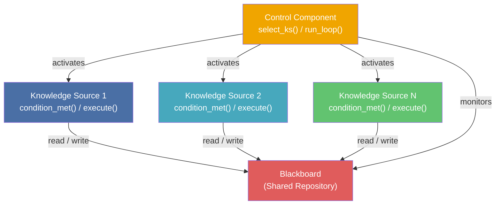

> **Prerequisites**: [[01-pattern-system|01. Pattern System — Nền tảng tư duy]], [[03-pipes-and-filters|03. Pipes & Filters — Luồng dữ liệu]]
> **Objectives**:
> - Hiểu tại sao Blackboard ra đời từ bài toán nhận dạng giọng nói phi tuyến
> - Phân tích đầy đủ 3 thành phần: Blackboard, Knowledge Source, Control Component
> - Phân biệt Condition-part vs. Action-part của Knowledge Source
> - Hiểu 3 chiến lược điều phối: Opportunistic, Forward-chaining, Backward-chaining
> - Implement một Blackboard system hoàn chỉnh bằng Python cho bài toán phân tích văn bản
> - So sánh trade-off chiều sâu: Blackboard vs. Pipes & Filters vs. Layers

---

## Motivation

### Bài toán: Hearsay-II và nhận dạng giọng nói (1970s)

Năm 1971, nhóm nghiên cứu tại Carnegie Mellon University nhận được thách thức từ DARPA: xây dựng hệ thống nhận dạng giọng nói tiếng Anh liên tục với từ vựng 1000 từ. Không ai biết thuật toán nào có thể làm điều này — bởi vì nhận dạng giọng nói không phải bài toán có một lời giải xác định.

**Vấn đề**: Một câu tiếng Anh nói ra là tín hiệu âm thanh thô. Để hiểu được, phải đồng thời giải quyết nhiều bài toán con độc lập: phân tích âm vị học (phonetics), nhận dạng từ (word recognition), phân tích ngữ pháp (syntax), phân tích ngữ nghĩa (semantics). Không bài toán con nào có thể giải trước hoàn toàn mà không cần thông tin từ các bài toán con khác — đây là bài toán **phi tuyến** (non-linear) và **phi tất định** (non-deterministic).

Ví dụ: từ "read" có thể đọc là /riːd/ hoặc /rɛd/ — lựa chọn đúng phụ thuộc vào ngữ cảnh câu. Nhưng để phân tích ngữ cảnh câu, cần biết từ trước đó là gì. Và để biết từ trước đó, cần biết cách đọc của nó. Vòng phụ thuộc này không thể giải bằng pipeline tuyến tính.

Giải pháp của Lee Erman và Victor Lesser: đặt một **tấm bảng đen chung** ở trung tâm. Mỗi chuyên gia (knowledge source) — âm vị học, từ vựng, ngữ pháp — đọc từ bảng, đóng góp giải pháp riêng của mình lên bảng, rồi chuyên gia khác đọc kết quả đó và tiếp tục. Không ai biết chuyên gia nào đóng góp tiếp theo — một **bộ điều phối** (control component) quyết định dựa trên trạng thái hiện tại của bảng.

Hệ thống **Hearsay-II** ra đời — và Blackboard pattern được đặt tên từ đây.

---

## Pattern Anatomy — Blackboard

### Name

**Blackboard** (còn gọi là *Repository* trong biến thể tổng quát hơn)

### Context

Bài toán không có giải thuật tất định khả thi, đòi hỏi kết hợp kiến thức từ nhiều lĩnh vực chuyên biệt, và các phần giải không thể tách biệt hoàn toàn — chúng phụ thuộc lẫn nhau theo cách không biết trước.

### Problem

> Làm thế nào để nhiều module chuyên biệt, không đồng nhất, có thể hợp tác xây dựng giải pháp cho một bài toán mà không có chiến lược giải quyết nào được biết trước?

### Forces

- **Không có thuật toán tất định**: Không có một quy trình bước-theo-bước nào chắc chắn tạo ra kết quả đúng
- **Nhiều lĩnh vực chuyên biệt**: Kiến thức đến từ nhiều module với cách biểu diễn khác nhau
- **Phụ thuộc phi tuyến**: Kết quả của module A phụ thuộc vào kết quả của module B, và ngược lại
- **Thứ tự xử lý không biết trước**: Không thể lập kế hoạch trước "bước nào chạy trước"
- **Cần thử nghiệm**: Hệ thống phải có khả năng thử nhiều hướng tiếp cận, giữ lại cái tốt nhất
- **Hiệu năng thấp hơn pipeline**: Lập lịch động (dynamic scheduling) tốn chi phí hơn pipeline tĩnh

### Solution

> [!definition] Definition 4.1 — Blackboard Pattern
> Xây dựng hệ thống xung quanh **ba thành phần chính**:
>
> - **Blackboard**: Kho dữ liệu trung tâm dùng chung (shared repository). Chứa dữ liệu đầu vào, các giải pháp trung gian (partial solutions), hypotheses, và kết quả cuối cùng. Là **giao thức giao tiếp duy nhất** giữa các Knowledge Source — chúng không nói chuyện trực tiếp với nhau.
> - **Knowledge Source (KS)**: Module chuyên biệt độc lập. Mỗi KS có **condition-part** (điều kiện khi nào KS này có thể chạy) và **action-part** (hành động thực hiện khi được chọn). KS đọc từ Blackboard, tính toán, rồi ghi partial solution trở lại Blackboard.
> - **Control Component**: Bộ điều phối. Quan sát trạng thái Blackboard, đánh giá KS nào đang "khả dụng" (condition thỏa mãn), chọn và kích hoạt KS theo chiến lược lập lịch. Quyết định khi nào dừng (termination criterion).

### Structure



**Quy tắc vàng của Blackboard:**
- KS **không** gọi KS khác trực tiếp
- KS **chỉ** đọc và ghi lên Blackboard
- Chỉ **Control Component** được kích hoạt KS
- Blackboard là **nguồn sự thật duy nhất** (single source of truth)

---

## Vòng lặp Điều khiển (Control Loop)

> [!definition] Definition 4.2 — Blackboard Control Cycle
> Vòng lặp trung tâm của mọi Blackboard system:
>
> 1. **Inspect**: Control Component đọc trạng thái hiện tại của Blackboard
> 2. **Evaluate**: Gọi `condition_met()` của từng KS để tìm KS nào khả dụng
> 3. **Select**: Chọn một KS theo chiến lược lập lịch (scheduling strategy)
> 4. **Activate**: Gọi `execute()` của KS được chọn — KS đọc, tính toán, ghi kết quả lên Blackboard
> 5. **Terminate?**: Kiểm tra điều kiện dừng — nếu chưa đủ, quay lại bước 1

Điểm mấu chốt: **vòng lặp này không xác định trước** KS nào chạy ở bước nào — nó **opportunistic** (cơ hội chủ nghĩa), chạy KS nào có ích nhất tại thời điểm đó.

### Ba chiến lược lập lịch

> [!definition] Definition 4.3 — Chiến lược lập lịch KS
>
> **Opportunistic (cơ hội chủ nghĩa)**: Chọn KS nào có khả năng đóng góp cao nhất vào giải pháp dựa trên trạng thái hiện tại. Thường dùng priority queue với điểm ưu tiên tính động. Phù hợp nhất với bài toán AI, nhận dạng.
>
> **Forward-chaining (suy luận tiến)**: Bắt đầu từ dữ liệu đầu vào, kích hoạt KS khi input của chúng có sẵn, tiếp tục cho đến khi đạt kết quả. Phù hợp khi biết hướng xử lý (từ input → output).
>
> **Backward-chaining (suy luận lùi)**: Bắt đầu từ mục tiêu, xác định KS nào tạo ra mục tiêu đó, rồi xác định KS nào cung cấp input cho KS đó, cứ thế ngược về. Phù hợp khi biết mục tiêu nhưng không biết data flow.

---

## Implementation — Text Analysis Blackboard

Bài toán: Phân tích một đoạn văn bản, đồng thời trích xuất: từ khóa, sentiment, ngôn ngữ, và tóm tắt ngắn. Mỗi bước phụ thuộc một phần vào kết quả của bước khác.

```python
from abc import ABC, abstractmethod
from dataclasses import dataclass, field
from typing import Optional
import re


@dataclass
class TextBlackboard:
    raw_text: str = ""
    tokens: list[str] = field(default_factory=list)
    language: Optional[str] = None
    keywords: list[str] = field(default_factory=list)
    word_freq: dict[str, int] = field(default_factory=dict)
    sentiment_score: Optional[float] = None
    sentiment_label: Optional[str] = None
    summary: Optional[str] = None
    solved: bool = False

    def is_complete(self) -> bool:
        return all([
            self.tokens,
            self.language,
            self.keywords,
            self.sentiment_label,
            self.summary,
        ])
```

```python
class KnowledgeSource(ABC):
    @abstractmethod
    def condition_met(self, bb: TextBlackboard) -> bool:
        """Trả về True khi KS này có thể đóng góp vào trạng thái hiện tại."""
        ...

    @abstractmethod
    def execute(self, bb: TextBlackboard) -> None:
        """Đọc từ bb, tính toán, ghi kết quả trở lại bb."""
        ...

    @property
    @abstractmethod
    def name(self) -> str:
        ...

    @property
    def priority(self) -> int:
        return 0


class TokenizerKS(KnowledgeSource):
    name = "Tokenizer"
    priority = 10

    def condition_met(self, bb: TextBlackboard) -> bool:
        return bool(bb.raw_text) and not bb.tokens

    def execute(self, bb: TextBlackboard) -> None:
        words = re.findall(r'\b[a-zA-ZÀ-ỹ]+\b', bb.raw_text.lower())
        bb.tokens = words
        freq: dict[str, int] = {}
        for w in words:
            freq[w] = freq.get(w, 0) + 1
        bb.word_freq = freq


class LanguageDetectorKS(KnowledgeSource):
    name = "LanguageDetector"
    priority = 8

    _VN_MARKERS = {"và", "của", "là", "có", "không", "trong", "cho", "với", "được", "này"}
    _EN_MARKERS = {"the", "and", "is", "in", "of", "to", "a", "that", "it", "for"}

    def condition_met(self, bb: TextBlackboard) -> bool:
        return bool(bb.tokens) and bb.language is None

    def execute(self, bb: TextBlackboard) -> None:
        token_set = set(bb.tokens)
        vn_hits = len(token_set & self._VN_MARKERS)
        en_hits = len(token_set & self._EN_MARKERS)
        bb.language = "vi" if vn_hits > en_hits else "en"


class KeywordExtractorKS(KnowledgeSource):
    name = "KeywordExtractor"
    priority = 6

    _STOPWORDS_EN = {"the", "and", "is", "in", "of", "to", "a", "that", "it", "for", "are", "was"}
    _STOPWORDS_VI = {"và", "của", "là", "có", "không", "trong", "cho", "với", "được", "này", "các"}

    def condition_met(self, bb: TextBlackboard) -> bool:
        return bool(bb.word_freq) and bb.language is not None and not bb.keywords

    def execute(self, bb: TextBlackboard) -> None:
        stopwords = self._STOPWORDS_VI if bb.language == "vi" else self._STOPWORDS_EN
        filtered = {w: c for w, c in bb.word_freq.items() if w not in stopwords and len(w) > 2}
        top = sorted(filtered, key=lambda w: filtered[w], reverse=True)[:5]
        bb.keywords = top


class SentimentKS(KnowledgeSource):
    name = "SentimentAnalyzer"
    priority = 5

    _POS = {"great", "good", "excellent", "happy", "love", "best", "amazing", "tốt", "hay", "tuyệt"}
    _NEG = {"bad", "terrible", "poor", "hate", "worst", "awful", "horrible", "tệ", "xấu", "dở"}

    def condition_met(self, bb: TextBlackboard) -> bool:
        return bool(bb.tokens) and bb.sentiment_label is None

    def execute(self, bb: TextBlackboard) -> None:
        token_set = set(bb.tokens)
        pos = len(token_set & self._POS)
        neg = len(token_set & self._NEG)
        score = (pos - neg) / max(len(bb.tokens), 1)
        bb.sentiment_score = round(score, 3)
        bb.sentiment_label = "positive" if score > 0 else ("negative" if score < 0 else "neutral")


class SummarizerKS(KnowledgeSource):
    name = "Summarizer"
    priority = 3

    def condition_met(self, bb: TextBlackboard) -> bool:
        return bool(bb.keywords) and bb.language is not None and bb.summary is None

    def execute(self, bb: TextBlackboard) -> None:
        lang_label = "Tiếng Việt" if bb.language == "vi" else "English"
        kw_str = ", ".join(bb.keywords)
        sentiment = bb.sentiment_label or "unknown"
        bb.summary = f"[{lang_label}] Keywords: {kw_str}. Sentiment: {sentiment}."
```

```python
class BlackboardController:
    def __init__(self, blackboard: TextBlackboard, knowledge_sources: list[KnowledgeSource]):
        self._bb = blackboard
        self._ks_list = sorted(knowledge_sources, key=lambda ks: -ks.priority)

    def _select_ks(self) -> Optional[KnowledgeSource]:
        for ks in self._ks_list:
            if ks.condition_met(self._bb):
                return ks
        return None

    def run(self, max_cycles: int = 20) -> TextBlackboard:
        for cycle in range(max_cycles):
            if self._bb.is_complete():
                self._bb.solved = True
                print(f"[Ctrl] Solved after {cycle} cycles.")
                break

            ks = self._select_ks()
            if ks is None:
                print(f"[Ctrl] No applicable KS — stopping at cycle {cycle}.")
                break

            print(f"[Ctrl] Cycle {cycle}: activating '{ks.name}'")
            ks.execute(self._bb)

        return self._bb


if __name__ == "__main__":
    bb = TextBlackboard(
        raw_text="Python is a great language. It has excellent libraries and amazing community support."
    )

    controller = BlackboardController(
        blackboard=bb,
        knowledge_sources=[
            TokenizerKS(),
            LanguageDetectorKS(),
            KeywordExtractorKS(),
            SentimentKS(),
            SummarizerKS(),
        ],
    )

    result = controller.run()
    print(f"\nLanguage   : {result.language}")
    print(f"Keywords   : {result.keywords}")
    print(f"Sentiment  : {result.sentiment_label} (score={result.sentiment_score})")
    print(f"Summary    : {result.summary}")
    print(f"Solved     : {result.solved}")
```

---

## Variants

### Repository (Biến thể tổng quát)

> [!definition] Definition 4.4 — Repository Pattern (Blackboard Variant)
> **Repository** là biến thể của Blackboard nơi kho dữ liệu trung tâm được truy cập **theo yêu cầu của người dùng hoặc chương trình bên ngoài** — không có Control Component chủ động lập lịch KS. Các module đọc/ghi Repository khi họ cần, theo thứ tự do họ tự quyết định.
>
> Ví dụ: Database quan hệ với nhiều ứng dụng. IDE với project AST dùng chung giữa editor, linter, debugger.

### Production System (Rules Engine)

> [!definition] Definition 4.5 — Production System
> KS được biểu diễn dưới dạng **condition-action rules** (if-then rules). Working memory (= Blackboard) chứa facts. Rule engine duyệt tất cả rules, tìm rule nào match, kích hoạt rule đó (forward-chaining). Ví dụ: Drools, CLIPS, Prolog.

---

## So sánh chiều sâu: Blackboard vs. Pipes & Filters

Đây là cặp hay bị nhầm nhất vì cả hai đều có nhiều module xử lý cùng một dữ liệu. Sự khác biệt là **fundamental**:

| Tiêu chí | Pipes & Filters | Blackboard |
|----------|----------------|------------|
| **Control flow** | Tuyến tính, tĩnh (filter 1 → 2 → 3) | Phi tuyến, động (KS nào phù hợp thì chạy) |
| **Shared state** | Không — filter nhận input, trả output | Có — tất cả KS đọc/ghi cùng một Blackboard |
| **Thứ tự xử lý** | Xác định trước khi deploy | Xác định tại runtime bởi Control Component |
| **Giải pháp trung gian** | Không lưu — dữ liệu chảy qua | Lưu tất cả partial solution trên Blackboard |
| **Khi không tìm được giải pháp** | Crash hoặc trả về lỗi | Có thể dừng gracefully, giữ best partial solution |
| **Phù hợp với** | ETL, compiler, image pipeline | AI, speech recognition, planning, multi-sensor fusion |

> [!warning] Sai lầm phổ biến
> Nhiều developer cố gắng dùng Pipes & Filters cho bài toán Blackboard bằng cách thêm "feedback loop" (output của bước sau quay lại bước trước). Kết quả là một pipeline phức tạp, khó debug, không phải P&F thuần cũng không phải Blackboard tốt. Nếu cần feedback và shared state — hãy chọn Blackboard ngay từ đầu.

---

## Known Uses

**Hearsay-II (CMU, 1971–1976)**: Hệ thống nhận dạng giọng nói đầu tiên dùng Blackboard. Knowledge sources gồm: signal analysis, phoneme recognition, syllable detection, word matching, phrase parsing. Control component dùng opportunistic scheduling với priority queue.

**HASP/SIAP (BBN, 1970s)**: Theo dõi tàu ngầm qua hydrophone data. Knowledge sources phân tích tín hiệu âm thanh từ nhiều sensor, hợp tác xây dựng bức tranh về vị trí và loại tàu ngầm. Ứng dụng quân sự đầu tiên của Blackboard.

**NASA RADARSAT-1 Mission Control**: Hệ thống lập lịch hoạt động vệ tinh quan sát Trái Đất. Planning component dùng Blackboard để kết hợp knowledge sources về quỹ đạo, năng lượng pin, yêu cầu chụp ảnh, và điều kiện thời tiết.

**Modern AI Agent Frameworks**: Nhiều LLM agent framework hiện đại (LangGraph, AutoGPT-style memory) dùng cấu trúc Blackboard cho "working memory" — nơi các agent tools đọc/ghi trạng thái và planner quyết định tool nào chạy tiếp.

---

## Consequences

### Lợi ích

- **Hỗ trợ thử nghiệm**: Dễ thay đổi chiến lược điều phối, thêm/bớt KS mà không ảnh hưởng kiến trúc
- **Changeability cao**: Ba thành phần (BB, KS, Control) tách biệt hoàn toàn — sửa một phần không lan sang phần khác
- **Fault tolerance**: KS thất bại không crash toàn bộ hệ thống — Control Component bỏ qua và thử KS khác
- **Tái sử dụng KS**: KS độc lập với nhau và với Control — có thể dùng lại trong bài toán Blackboard khác

### Hạn chế

- **Khó test**: Kết quả phụ thuộc vào thứ tự KS được kích hoạt — không xác định, khó reproduce
- **Không đảm bảo giải pháp tối ưu**: Chỉ đảm bảo "một giải pháp" — không phải "giải pháp tốt nhất"
- **Hiệu năng thấp**: Dynamic scheduling có overhead lớn so với static pipeline
- **Khó thiết kế Control Component**: Xây dựng heuristic tốt để lập lịch KS là công việc rất tốn thời gian
- **Development effort cao**: Hầu hết Blackboard system thực tế mất nhiều năm để tinh chỉnh

---

## Summary

- **Blackboard** giải quyết bài toán **phi tất định** — nơi không có thuật toán tuyến tính nào biết trước.
- Ba thành phần: **Blackboard** (shared repo), **Knowledge Source** (chuyên gia độc lập với condition + action), **Control Component** (lập lịch động).
- **Quy tắc vàng**: KS không giao tiếp trực tiếp — mọi thứ đi qua Blackboard.
- Ba chiến lược lập lịch: **Opportunistic** (chọn KS có ích nhất lúc này), **Forward-chaining** (từ input đến output), **Backward-chaining** (từ goal ngược về input).
- **Khác P&F cơ bản**: P&F là linear + stateless; Blackboard là non-linear + shared state.
- Dùng Blackboard khi: bài toán AI/nhận dạng, multi-sensor fusion, planning, bất kỳ thứ gì cần nhiều "chuyên gia" hợp tác mà không biết trước thứ tự.

---

## References

- Frank Buschmann et al. — *POSA Vol. 1*, Chapter 2: Architectural Patterns — Blackboard
- Lee D. Erman et al. — *The Hearsay-II Speech-Understanding System* (ACM Computing Surveys, 1980)
- H. Penny Nii — *Blackboard Systems* (AI Magazine, 1986)
- Ted Neward — *Blackboard Pattern* (blogs.newardassociates.com)
- Wikipedia — *Blackboard system* (en.wikipedia.org/wiki/Blackboard_system)
