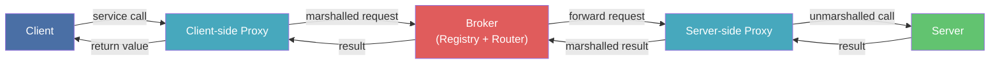
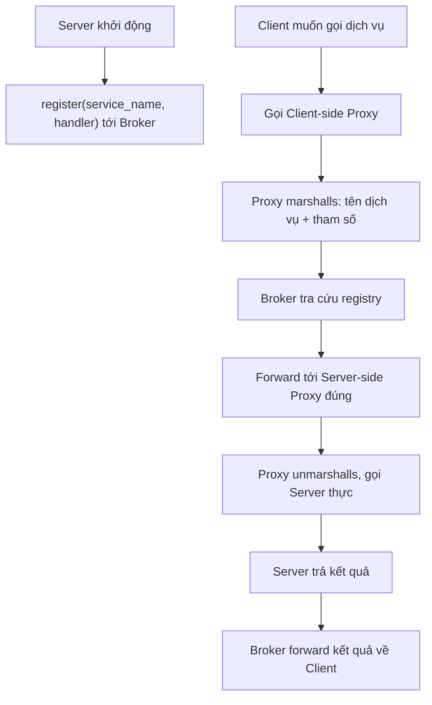
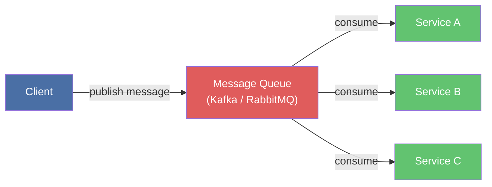
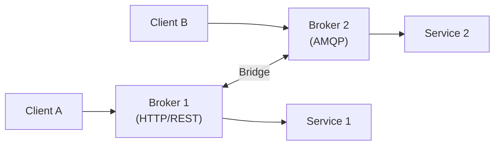
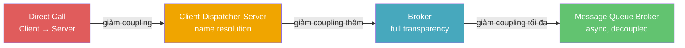

> **Prerequisites**: [[01-pattern-system|01. Pattern System — Nền tảng tư duy]], [[02-layers|02. Layers — Phân tầng hệ thống]]
> **Objectives**:
> - Hiểu tại sao Location Transparency là yêu cầu cốt lõi trong hệ thống phân tán
> - Phân tích đầy đủ 5 thành phần: Client, Server, Broker, Client-side Proxy, Server-side Proxy
> - Hiểu vai trò của Bridge trong hệ thống đa-broker
> - Implement một Broker system đầy đủ bằng Python với marshalling và service registry
> - Phân tích trade-off: location transparency vs. performance, coupling vs. fault tolerance
> - So sánh Broker với Client-Dispatcher-Server và Mediator (GoF)

---

## Motivation

### Bài toán: Client không nên biết server ở đâu

Năm 1991, Object Management Group (OMG) phát hành CORBA (Common Object Request Broker Architecture) — một trong những nỗ lực đầu tiên xây dựng middleware cho hệ thống phân tán hướng đối tượng. Vấn đề họ giải quyết rất cụ thể:

Một ứng dụng client cần gọi dịch vụ từ một server. Trong kiến trúc đơn giản nhất, client biết địa chỉ IP, port, và protocol của server — và gọi trực tiếp. Điều này hoạt động tốt cho đến khi server chuyển sang máy mới, đổi port, hoặc được thay bằng implementation khác. Client phải sửa code, recompile, redeploy.

Nhưng vấn đề sâu hơn: trong hệ thống lớn, một client có thể gọi hàng chục server khác nhau. Nếu mỗi lần gọi đều hard-code địa chỉ, hệ thống trở nên **giòn** (brittle) — bất kỳ thay đổi infrastructure nào cũng kéo theo hàng loạt thay đổi code.

Giải pháp: đặt một **Broker** ở giữa. Client chỉ biết tên dịch vụ (service name), không biết server ở đâu. Broker biết server ở đâu và làm cầu nối. Đây gọi là **Location Transparency** — client không cần biết location của service, chỉ cần biết giao diện của nó.

---

## Pattern Anatomy — Broker

### Name

**Broker** (còn gọi là *Service Broker*, *Message Broker*, *Object Request Broker*)

### Context

Hệ thống phân tán với nhiều client và server chạy trên các process, máy chủ, hoặc mạng khác nhau. Client cần gọi các dịch vụ mà không cần biết vị trí, protocol, hay ngôn ngữ lập trình của server.

### Problem

> Làm thế nào để xây dựng một hệ thống phân tán sao cho client và server có thể giao tiếp mà không phụ thuộc vào nhau về vị trí, ngôn ngữ lập trình, hay protocol — đồng thời cho phép thay đổi, thêm, bớt server mà không ảnh hưởng đến client?

### Forces

- **Location transparency**: Client không nên cần biết server đang chạy ở đâu
- **Protocol transparency**: Client và server có thể dùng ngôn ngữ/protocol khác nhau
- **Changeability**: Thay thế server cụ thể (đổi địa chỉ, đổi implementation) không nên yêu cầu sửa client
- **Reusability**: Server service nên được tái sử dụng bởi nhiều client khác nhau
- **Performance**: Thêm lớp trung gian (broker, proxy) làm tăng latency — đây là trade-off không tránh khỏi
- **Fault tolerance**: Broker là **single point of failure** — nếu broker down, toàn bộ giao tiếp ngừng lại

### Solution

> [!definition] Definition 5.1 — Broker Pattern
> Giới thiệu một **Broker** làm trung gian giữa client và server:
>
> - **Client**: Gửi request đến Broker (không biết server ở đâu). Không gọi Server trực tiếp.
> - **Server**: Đăng ký (register) dịch vụ của mình với Broker khi khởi động. Cung cấp service thực sự.
> - **Broker**: Nhận request từ Client, tìm Server phù hợp trong registry, forward request, nhận kết quả, trả về Client. Là **single point of coordination**.
> - **Client-side Proxy**: Đối tượng local ở phía client, giả vờ là Server. Client gọi proxy như gọi object local — proxy lo việc marshalling và giao tiếp với Broker.
> - **Server-side Proxy**: Đối tượng local ở phía server, nhận request từ Broker, unmarshall, gọi Server thực sự, marshall kết quả trả về.
> - **Bridge** *(tùy chọn)*: Dịch protocol khi cần giao tiếp giữa hai Broker khác nhau (ví dụ: HTTP Broker ↔ AMQP Broker).

### Structure



**Luồng xử lý cơ bản:**



---

## Proxy và Marshalling — Cơ chế ẩn complexity

Proxy là yếu tố then chốt làm cho Broker "transparent" với code của client và server.

> [!definition] Definition 5.2 — Marshalling / Unmarshalling
> **Marshalling (đóng gói)**: Chuyển đổi tham số của lời gọi hàm (tên method, giá trị tham số, kiểu dữ liệu) thành một định dạng có thể truyền qua network — thường là bytes, JSON, hoặc binary protocol như Protocol Buffers.
>
> **Unmarshalling (mở gói)**: Phục hồi tham số từ định dạng truyền về cấu trúc dữ liệu gốc để gọi hàm thực sự.

Client-side Proxy giấu hoàn toàn công việc này. Từ góc nhìn của Client, gọi proxy y hệt gọi object local:

```python
result = math_service.add(3, 4)
```

Bên dưới, proxy thực hiện: serialize `{method: "add", args: [3, 4]}` → gửi qua network → nhận `{result: 7}` → trả về `7`. Client không biết gì về network.

---

## Implementation — Broker system bằng Python

Xây dựng một Broker system in-process đầy đủ: service registry, proxy pattern, marshalling qua dict, và routing.

### Core types và Broker

```python
from abc import ABC, abstractmethod
from typing import Any, Callable
import json


class ServiceNotFoundError(Exception):
    pass


class RemoteCallError(Exception):
    pass


class Broker:
    """Registry trung tâm và router."""

    def __init__(self):
        self._registry: dict[str, "ServerSideProxy"] = {}

    def register(self, service_name: str, proxy: "ServerSideProxy") -> None:
        self._registry[service_name] = proxy
        print(f"[Broker] Registered service: '{service_name}'")

    def forward(self, service_name: str, method: str, args: list, kwargs: dict) -> Any:
        if service_name not in self._registry:
            raise ServiceNotFoundError(f"Service '{service_name}' not found in registry")
        proxy = self._registry[service_name]
        return proxy.invoke(method, args, kwargs)

    def get_client_proxy(self, service_name: str) -> "ClientSideProxy":
        if service_name not in self._registry:
            raise ServiceNotFoundError(f"Service '{service_name}' not found")
        return ClientSideProxy(service_name, self)
```

### Server, ServerSideProxy, ClientSideProxy

```python
class ServerSideProxy:
    """Nhận request đã marshall từ Broker, unmarshall, gọi Server thực."""

    def __init__(self, server: object):
        self._server = server

    def invoke(self, method: str, args: list, kwargs: dict) -> Any:
        handler = getattr(self._server, method, None)
        if handler is None:
            raise RemoteCallError(f"Method '{method}' not found on server")
        raw = handler(*args, **kwargs)
        return self._marshal_result(raw)

    def _marshal_result(self, result: Any) -> Any:
        return json.loads(json.dumps(result))


class ClientSideProxy:
    """Đứng phía client, giả vờ là server. Ẩn toàn bộ giao tiếp với Broker."""

    def __init__(self, service_name: str, broker: Broker):
        self._service_name = service_name
        self._broker = broker

    def __getattr__(self, method: str):
        def remote_call(*args, **kwargs):
            marshalled_args = json.loads(json.dumps(list(args)))
            marshalled_kwargs = json.loads(json.dumps(kwargs))
            return self._broker.forward(
                self._service_name, method, marshalled_args, marshalled_kwargs
            )
        return remote_call
```

### Hai Server độc lập

```python
class MathServer:
    """Service tính toán số học."""

    def add(self, a: float, b: float) -> float:
        return a + b

    def multiply(self, a: float, b: float) -> float:
        return a * b

    def factorial(self, n: int) -> int:
        result = 1
        for i in range(2, n + 1):
            result *= i
        return result


class TextServer:
    """Service xử lý văn bản."""

    def upper(self, text: str) -> str:
        return text.upper()

    def word_count(self, text: str) -> dict:
        words = text.split()
        return {"total": len(words), "unique": len(set(words))}

    def reverse(self, text: str) -> str:
        return text[::-1]
```

### Wiring và demo

```python
if __name__ == "__main__":
    broker = Broker()

    broker.register("math", ServerSideProxy(MathServer()))
    broker.register("text", ServerSideProxy(TextServer()))

    math = broker.get_client_proxy("math")
    text = broker.get_client_proxy("text")

    print(f"\nmath.add(10, 32)         = {math.add(10, 32)}")
    print(f"math.multiply(6, 7)      = {math.multiply(6, 7)}")
    print(f"math.factorial(10)       = {math.factorial(10)}")

    sample = "the quick brown fox jumps over the lazy dog"
    print(f"\ntext.upper(...)          = {text.upper(sample)}")
    print(f"text.word_count(...)     = {text.word_count(sample)}")
    print(f"text.reverse('hello')   = {text.reverse('hello')}")

    try:
        broker.get_client_proxy("nonexistent")
    except ServiceNotFoundError as e:
        print(f"\nExpected error: {e}")
```

---

## Variants

### Direct Broker (không có Proxy)

Biến thể đơn giản nhất — không tạo Proxy riêng, client gọi trực tiếp Broker API. Ít transparent hơn nhưng ít overhead hơn. Phù hợp cho service mesh nội bộ.

### Indirect Broker (qua Message Queue)

Client gửi message vào queue, Server poll queue và xử lý async. Broker là message broker (Kafka, RabbitMQ). Đây là kiến trúc microservice phổ biến nhất hiện nay.



### Federated Brokers (đa Broker với Bridge)

Khi hệ thống quá lớn cho một Broker duy nhất — hoặc khi có nhiều protocol khác nhau — các Broker liên kết nhau qua **Bridge**.



---

## So sánh: Broker vs. Client-Dispatcher-Server vs. Mediator

Ba pattern này đều có một "trung gian" nhưng có mục đích khác nhau:

| Tiêu chí | Broker | Client-Dispatcher-Server | Mediator (GoF) |
|----------|--------|--------------------------|----------------|
| **Phạm vi** | Distributed system (cross-process/network) | Same-network, name resolution | In-process object collaboration |
| **Proxy** | Có — client và server đều có proxy | Không — client gọi trực tiếp sau khi biết địa chỉ | Không |
| **Location transparency** | Hoàn toàn — client không biết gì | Một phần — client nhận địa chỉ rồi gọi trực tiếp | Không áp dụng |
| **Marshalling** | Có — data phải serialize/deserialize | Không | Không |
| **Khi nào dùng** | Microservice, RPC, distributed objects | Service discovery trong local network | Giảm coupling giữa objects trong cùng process |

> [!definition] Definition 5.3 — Client-Dispatcher-Server vs. Broker
> **Client-Dispatcher-Server**: Client hỏi Dispatcher "Server X ở đâu?", nhận địa chỉ, rồi **gọi trực tiếp** Server đó. Dispatcher chỉ làm name resolution — không forward request.
>
> **Broker**: Client không bao giờ biết Server ở đâu. **Mọi request đều đi qua Broker**. Broker forward và trả kết quả. Transparent hoàn toàn.

---

## Known Uses

**CORBA (Common Object Request Broker Architecture, 1991)**: Triển khai Broker pattern thuần túy nhất — Object Request Broker (ORB) làm Broker, IDL (Interface Definition Language) định nghĩa contract, stub/skeleton là Client/Server-side Proxy. Client gọi remote object như gọi local object.

**Java RMI (Remote Method Invocation)**: Client gọi method trên remote object qua stub (Client-side Proxy). RMI Registry là Broker (name service). Skeleton (Server-side Proxy) nhận call, invoke method thực.

**gRPC (Google, 2015)**: Protocol Buffers là IDL. gRPC stub là Client-side Proxy. gRPC server handler là Server-side Proxy. Load balancer hoặc service mesh (Envoy) đóng vai Broker.

**Apache Kafka / RabbitMQ**: Indirect Broker variant. Kafka là message broker — producer (Client) gửi message, consumer (Server) poll. Broker đảm bảo delivery, ordering, persistence.

**Kubernetes Service Mesh (Istio, Linkerd)**: Sidecar proxy (Envoy) đóng vai Client-side và Server-side Proxy. Control plane đóng vai Broker (service registry, routing rules). Pod không biết gì về network topology.

---

## Consequences

### Lợi ích

- **Location transparency**: Client viết code y hệt khi gọi service local hay remote — thay đổi địa chỉ server chỉ cần cập nhật registry
- **Changeability**: Thêm server mới, thay thế implementation — client không cần biết
- **Interoperability**: Broker có thể bridge giữa các ngôn ngữ và protocol (CORBA cho phép Java client gọi C++ server)
- **Reusability**: Service đã đăng ký với Broker có thể được tái sử dụng bởi bất kỳ client nào

### Hạn chế

- **Performance**: Thêm ít nhất 2 hop (Client → Proxy → Broker → Proxy → Server) so với direct call. Marshalling/unmarshalling có cost đáng kể
- **Single point of failure**: Broker down = toàn bộ communication ngừng lại. Phải thêm HA/failover
- **Khó debug**: Request đi qua nhiều component — khi lỗi xảy ra, rất khó xác định ở đâu
- **Complexity**: Thêm nhiều moving part (registry, proxy generation, protocol) — không nên dùng cho hệ thống nhỏ

---

## Trade-off Analysis

Broker là pattern đánh đổi **coupling** để lấy **location transparency**:



Trục trái-phải: coupling giảm → transparency tăng → overhead tăng → fault isolation tăng.

**Khi nào KHÔNG dùng Broker:**
- Hệ thống nhỏ, tất cả service chạy trên cùng một process — dùng Mediator (GoF) đủ rồi
- Latency là yêu cầu cứng (hard real-time) — mỗi hop thêm latency không thể chấp nhận
- Chỉ có 2–3 service, địa chỉ không bao giờ thay đổi — over-engineering

---

## Summary

- **Broker** giải quyết bài toán **location transparency** trong distributed systems — client không biết server ở đâu.
- Năm thành phần cốt lõi: **Client**, **Server**, **Broker** (registry + router), **Client-side Proxy** (marshalling), **Server-side Proxy** (unmarshalling).
- **Bridge** dùng khi có nhiều Broker với protocol khác nhau cần liên thông.
- Proxy ẩn hoàn toàn network complexity — client gọi proxy như gọi local object.
- **Broker vs. Client-Dispatcher-Server**: Broker forward toàn bộ request; CDS chỉ cung cấp địa chỉ rồi client gọi trực tiếp.
- Forces ưu tiên: **location transparency, changeability, interoperability**. Forces hy sinh: **performance, simplicity, fault tolerance**.
- Hiện đại: Kafka/RabbitMQ (async message broker), gRPC (sync RPC broker), Kubernetes Service Mesh (sidecar proxy broker).

---

## References

- Frank Buschmann et al. — *POSA Vol. 1*, Chapter 2: Architectural Patterns — Broker
- Rainer Grimm — *Broker Pattern* (ModernesCpp/LinkedIn, 2023)
- OMG — *CORBA Specification* (omg.org)
- Google — *gRPC Documentation* (grpc.io)
- Grokipedia — *Broker Pattern* (grokipedia.com)
