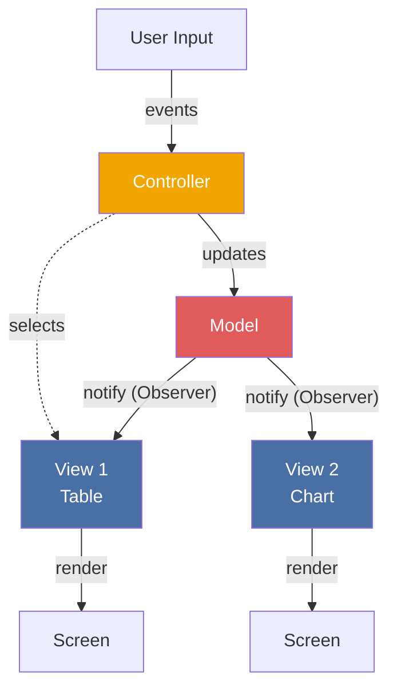
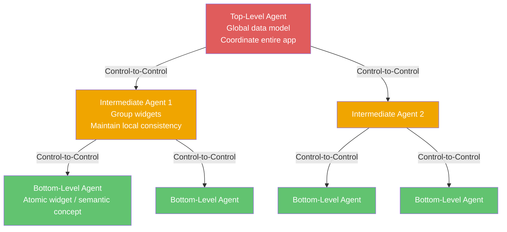

> **Prerequisites**: [[01-pattern-system|01. Pattern System — Nền tảng tư duy]], [[02-layers|02. Layers — Phân tầng hệ thống]]
> **Objectives**:
> - Hiểu MVC anatomy đầy đủ — đặc biệt vai trò Observer trong Model-View sync
> - Phân biệt push (Observer) vs. pull (polling) notification trong MVC
> - Nắm vững PAC hierarchy: top-level / intermediate / bottom-level agent
> - Hiểu sự khác biệt căn bản: MVC là flat triad, PAC là hierarchical agents
> - Implement MVC thuần Python với Observer notification
> - Implement PAC với hai agent giao tiếp qua Control
> - Phân tích khi nào dùng MVC, PAC, MVP, MVVM

---

## Motivation

### Bài toán: Giao diện và dữ liệu đan xen nhau

Năm 1979, Trygve Reenskaug tại Xerox PARC đang làm việc trên Smalltalk-80 — ngôn ngữ OOP đầu tiên có GUI. Ông nhận ra một vấn đề phổ biến: khi code xử lý hiển thị và code quản lý dữ liệu trộn lẫn nhau, mỗi lần thêm một cách hiển thị mới — bảng, biểu đồ, báo cáo in — đòi hỏi phải sửa code logic. Và ngược lại: thay đổi cách lưu trữ dữ liệu phá vỡ tất cả code hiển thị.

Reenskaug đề xuất tách hệ thống tương tác thành ba phần: **Model** (dữ liệu và logic), **View** (hiển thị), **Controller** (điều phối input). Đây là Model-View-Controller (MVC), ra đời 1979 và vẫn là architecture pattern thống trị cho interactive system cho đến ngày nay.

Nhưng MVC có một giới hạn: nó là một **flat triad** — một Model, một (hay vài) View, một Controller. Khi ứng dụng lớn hơn, có hàng chục widget độc lập, mỗi cái có dữ liệu riêng và cách tương tác riêng, MVC trở nên khó quản lý. Năm 1987, Joëlle Coutaz tại IMAG (Pháp) đề xuất **PAC (Presentation-Abstraction-Control)** — mở rộng tư duy thành một **hệ thống phân cấp các agent**, mỗi agent là một MVC mini có khả năng giao tiếp với agent khác qua Control component.

---

## Pattern 1 — MVC (Model-View-Controller)

### Anatomy

**Name**: Model-View-Controller

**Context**: Ứng dụng tương tác với giao diện người dùng, nơi cùng một dữ liệu cần hiển thị theo nhiều cách khác nhau đồng thời, và người dùng có thể thay đổi dữ liệu qua giao diện.

**Problem**: Làm thế nào để tách biệt dữ liệu ứng dụng, hiển thị của dữ liệu đó, và điều phối input của người dùng — sao cho mỗi phần có thể thay đổi độc lập?

**Forces**:
- Cùng một dữ liệu cần nhiều loại hiển thị (bảng, biểu đồ, text)
- Người dùng có thể thay đổi dữ liệu — mọi View phải cập nhật đồng bộ
- Logic nghiệp vụ không nên bị ảnh hưởng khi đổi giao diện
- View không nên chứa logic xử lý — chỉ hiển thị

### Solution

> [!definition] Definition 6.1 — MVC
> Ba thành phần:
>
> - **Model**: Dữ liệu ứng dụng và logic nghiệp vụ. Không biết View hay Controller tồn tại. Notify các View đã đăng ký khi dữ liệu thay đổi (Observer pattern).
> - **View**: Hiển thị một biểu diễn cụ thể của Model. Đăng ký (subscribe) với Model để nhận thông báo khi dữ liệu thay đổi. Không chứa logic xử lý.
> - **Controller**: Nhận input từ người dùng, diễn giải sự kiện, gọi Model để thay đổi dữ liệu hoặc chọn View phù hợp. Là cầu nối giữa input và Model.

### Structure



**Điểm then chốt**: Model-View sync dùng **Observer pattern**. Model không gọi `view.update()` trực tiếp — nó gọi `notify_all()` và tất cả View đã subscribe sẽ tự kéo (pull) dữ liệu mới. Model không biết View nào đang lắng nghe.

### Push vs. Pull Notification

> [!definition] Definition 6.2 — Push vs. Pull trong MVC
>
> **Push**: Model đẩy dữ liệu đã thay đổi vào payload của thông báo. View nhận thông báo kèm dữ liệu mới.
> - Ưu điểm: View không cần biết cấu trúc Model
> - Nhược điểm: Model phải đoán View cần dữ liệu gì
>
> **Pull**: Model chỉ thông báo "tao vừa thay đổi". View tự query Model lấy dữ liệu cần thiết.
> - Ưu điểm: View chủ động lấy đúng phần nó cần, Model không cần biết View cần gì
> - Nhược điểm: View phụ thuộc vào interface của Model
>
> Smalltalk-80 gốc dùng **Pull**. Hầu hết framework hiện đại dùng **Push** hoặc hybrid.

---

## Implementation — MVC với Observer (Python)

```python
from abc import ABC, abstractmethod
from typing import Any


class Observer(ABC):
    @abstractmethod
    def update(self, event: str, data: Any) -> None:
        ...


class Model:
    """Model: dữ liệu + logic + Observer notification."""

    def __init__(self):
        self._observers: list[Observer] = []
        self._items: list[str] = []

    def subscribe(self, observer: Observer) -> None:
        self._observers.append(observer)

    def _notify(self, event: str, data: Any = None) -> None:
        for obs in self._observers:
            obs.update(event, data)

    def add_item(self, item: str) -> None:
        self._items.append(item)
        self._notify("item_added", item)

    def remove_item(self, item: str) -> None:
        if item in self._items:
            self._items.remove(item)
            self._notify("item_removed", item)

    def get_items(self) -> list[str]:
        return list(self._items)


class ListView(Observer):
    """View 1: hiển thị danh sách dạng text."""

    def __init__(self, model: Model):
        self._model = model
        model.subscribe(self)

    def update(self, event: str, data: Any) -> None:
        self.render()

    def render(self) -> None:
        items = self._model.get_items()
        print(f"[ListView] {len(items)} items: {items}")


class CountView(Observer):
    """View 2: chỉ hiển thị số lượng."""

    def __init__(self, model: Model):
        self._model = model
        model.subscribe(self)

    def update(self, event: str, data: Any) -> None:
        count = len(self._model.get_items())
        print(f"[CountView] Total: {count}")


class Controller:
    """Controller: nhận input, điều phối Model."""

    def __init__(self, model: Model):
        self._model = model

    def handle_add(self, item: str) -> None:
        item = item.strip()
        if not item:
            print("[Controller] Empty item ignored")
            return
        self._model.add_item(item)

    def handle_remove(self, item: str) -> None:
        self._model.remove_item(item)


if __name__ == "__main__":
    model = Model()
    list_view = ListView(model)
    count_view = CountView(model)
    controller = Controller(model)

    print("--- Add items ---")
    controller.handle_add("Python")
    controller.handle_add("Go")
    controller.handle_add("Rust")

    print("\n--- Remove item ---")
    controller.handle_remove("Go")
```

Output:
```text
--- Add items ---
[ListView] 1 items: ['Python']
[CountView] Total: 1
[ListView] 2 items: ['Python', 'Go']
[CountView] Total: 2
[ListView] 3 items: ['Python', 'Go', 'Rust']
[CountView] Total: 3

--- Remove item ---
[ListView] 2 items: ['Python', 'Rust']
[CountView] Total: 2
```

Cả `ListView` và `CountView` cập nhật tự động khi Model thay đổi — Controller không biết View nào đang lắng nghe.

---

## MVC Variants — MVP và MVVM

MVC sinh ra nhiều biến thể khi áp dụng vào các nền tảng khác nhau:

| Variant | View | Presenter/ViewModel | Khi nào dùng |
|---------|------|---------------------|-------------|
| **MVC** (gốc) | Biết Model, subscribe trực tiếp | Controller nhận input | Desktop app, Smalltalk-style |
| **MVP** (Model-View-Presenter) | Không biết Model — chỉ biết Presenter | Presenter cập nhật View | Android (cũ), WinForms |
| **MVVM** (Model-View-ViewModel) | Bind data trực tiếp vào ViewModel | ViewModel expose observable properties | WPF, Angular, Vue, Swift UI |
| **Passive View** | Hoàn toàn "câm" — Presenter điều khiển mọi thứ | Presenter gọi `view.setName("...")` | Unit testing-first approach |

---

## Pattern 2 — PAC (Presentation-Abstraction-Control)

### Tại sao MVC không đủ cho hệ thống phức tạp

MVC là một **flat triad** — một Model toàn cục. Khi ứng dụng có nhiều widget độc lập (ví dụ: air traffic control với 50 radar blip mỗi blip là một đối tượng riêng), cách tiếp cận một Model toàn cục dẫn đến:
- Model phình to, chứa dữ liệu của tất cả component
- View phụ thuộc nhau vì cùng subscribe một Model
- Không có cơ chế rõ ràng để widget giao tiếp với nhau

PAC giải quyết bằng cách mô hình hóa ứng dụng như một **cây các agent độc lập**. Mỗi agent là một "PAC mini" với triad riêng. Agent giao tiếp với agent khác **chỉ qua Control component**.

### Anatomy

> [!definition] Definition 6.3 — PAC Agent
> Mỗi **PAC Agent** gồm ba thành phần:
>
> - **Presentation**: Giao diện người dùng của agent này — hiển thị dữ liệu và nhận input. **Không** giao tiếp trực tiếp với Abstraction.
> - **Abstraction**: Dữ liệu và logic riêng của agent này. **Không** biết Presentation tồn tại.
> - **Control**: Trung gian bên trong agent — kết nối Presentation và Abstraction. **Ngoài ra**, nó là điểm giao tiếp duy nhất với agent khác trong cây.
>
> **Quy tắc vàng PAC**: Presentation và Abstraction **không bao giờ** nói chuyện trực tiếp với nhau — tất cả đi qua Control.

### Hierarchy — 3 cấp Agent



**Top-Level Agent**: Chứa global data model. Điều phối toàn bộ hierarchy. Xử lý global UI (menu bar, toolbar).

**Intermediate Agent**: Nhóm các bottom-level agent có liên quan. Duy trì consistency giữa chúng. Ví dụ: một panel gồm nhiều widget con.

**Bottom-Level Agent**: Đơn vị atomic — một widget, một radar blip, một ô trong spreadsheet. Có dữ liệu riêng, giao diện riêng, không phụ thuộc agent khác.

---

## Implementation — PAC với hai Agent

```python
from abc import ABC, abstractmethod
from typing import Optional


class PACComponent(ABC):
    """Base cho Presentation, Abstraction, Control."""
    pass


class TemperatureAbstraction:
    """Dữ liệu nhiệt độ — không biết UI tồn tại."""

    def __init__(self):
        self._celsius: float = 0.0

    def set_celsius(self, value: float) -> None:
        self._celsius = value

    def get_celsius(self) -> float:
        return self._celsius

    def get_fahrenheit(self) -> float:
        return self._celsius * 9 / 5 + 32


class TemperaturePresentation:
    """Hiển thị nhiệt độ — không biết Abstraction tồn tại."""

    def display_celsius(self, value: float) -> None:
        print(f"[TempView] {value:.1f} °C")

    def display_fahrenheit(self, value: float) -> None:
        print(f"[TempView] {value:.1f} °F")

    def get_user_input(self) -> float:
        return 25.0


class TemperatureControl:
    """Control: mediates Presentation ↔ Abstraction, handles inter-agent comms."""

    def __init__(self):
        self._abstraction = TemperatureAbstraction()
        self._presentation = TemperaturePresentation()
        self._parent: Optional["AppControl"] = None

    def set_parent(self, parent: "AppControl") -> None:
        self._parent = parent

    def user_sets_temperature(self, celsius: float) -> None:
        self._abstraction.set_celsius(celsius)
        self._presentation.display_celsius(celsius)
        self._presentation.display_fahrenheit(self._abstraction.get_fahrenheit())
        if self._parent:
            self._parent.child_temperature_changed(celsius)


class AlertAbstraction:
    """Logic cảnh báo — không biết UI."""

    _THRESHOLD = 38.0

    def evaluate(self, celsius: float) -> Optional[str]:
        if celsius >= self._THRESHOLD:
            return f"ALERT: Temperature {celsius:.1f}°C exceeds threshold {self._THRESHOLD}°C"
        return None


class AlertPresentation:
    """Hiển thị cảnh báo."""

    def show_alert(self, message: str) -> None:
        print(f"[AlertView] *** {message} ***")

    def clear_alert(self) -> None:
        print("[AlertView] All clear.")


class AlertControl:
    """Control của Alert Agent."""

    def __init__(self):
        self._abstraction = AlertAbstraction()
        self._presentation = AlertPresentation()

    def receive_temperature(self, celsius: float) -> None:
        msg = self._abstraction.evaluate(celsius)
        if msg:
            self._presentation.show_alert(msg)
        else:
            self._presentation.clear_alert()


class AppControl:
    """Top-Level Agent Control — điều phối toàn bộ hierarchy."""

    def __init__(self):
        self._temp_agent = TemperatureControl()
        self._alert_agent = AlertControl()
        self._temp_agent.set_parent(self)

    def child_temperature_changed(self, celsius: float) -> None:
        self._alert_agent.receive_temperature(celsius)

    def simulate_user_input(self, celsius: float) -> None:
        print(f"\n--- User sets {celsius}°C ---")
        self._temp_agent.user_sets_temperature(celsius)


if __name__ == "__main__":
    app = AppControl()
    app.simulate_user_input(36.5)
    app.simulate_user_input(39.2)
    app.simulate_user_input(37.0)
```

Output:
```text
--- User sets 36.5°C ---
[TempView] 36.5 °C
[TempView] 97.7 °F
[AlertView] All clear.

--- User sets 39.2°C ---
[TempView] 39.2 °C
[TempView] 102.6 °F
[AlertView] *** ALERT: Temperature 39.2°C exceeds threshold 38.0°C ***

--- User sets 37.0°C ---
[TempView] 37.0 °C
[TempView] 98.6 °F
[AlertView] All clear.
```

`TemperaturePresentation` và `AlertPresentation` không bao giờ giao tiếp trực tiếp — toàn bộ coordination chạy qua Control components.

---

## MVC vs. PAC — So sánh chiều sâu

| Tiêu chí | MVC | PAC |
|----------|-----|-----|
| **Cấu trúc** | Flat triad (1 Model, N Views, 1 Controller) | Cây agent phân cấp |
| **Giao tiếp P-A** | View biết Model và subscribe trực tiếp | Presentation và Abstraction **không** nói chuyện trực tiếp |
| **Giao tiếp inter-agent** | Không có cơ chế rõ ràng — dẫn đến coupling | Qua Control-to-Control |
| **State** | Model là global state | Mỗi agent có local state riêng |
| **Khi nào phù hợp** | App đơn giản, 1 data model, nhiều view | App phức tạp, nhiều widget độc lập |
| **Concurrency** | Khó — View phải lock khi Model update | Dễ hơn — agent độc lập, có thể chạy song song |
| **Ví dụ thực tế** | Django (MTV), Rails, Spring MVC | Air traffic control, IDE with multiple panels, WengoPhone |

> [!warning] MVC trên Web không phải MVC gốc
> Django/Rails gọi kiến trúc của mình là MVC (hay MTV trong Django) nhưng thiếu Observer notification: Model không notify View vì HTTP là stateless. Mỗi request tạo ra một View mới từ đầu. Đây là **Request-Response MVC** — một biến thể rất khác với MVC gốc của Reenskaug dành cho long-running desktop apps.

---

## Known Uses

**MVC**: Smalltalk-80 (gốc), Apple AppKit (Cocoa MVC), Spring MVC, Ruby on Rails (MTV), Django (MTV — Model-Template-View). Angular, Vue, React đều là biến thể MVVM/MVP.

**PAC**: Air Traffic Control systems (kinh điển), WengoPhone VoIP application (open-source PAC implementation), Eclipse IDE (tương tự PAC — mỗi editor panel là agent độc lập), Drupal CMS (menu system đóng vai Control layer).

---

## Consequences

### MVC — Lợi ích
- Separation of concerns rõ ràng — team UI và team logic làm việc độc lập
- Nhiều View trên cùng Model — dễ thêm biểu đồ, báo cáo, mobile view
- Observer notification đảm bảo View luôn sync với Model

### MVC — Hạn chế
- Khi N Views quan sát M Models, dependency graph có thể rất phức tạp
- Không có cơ chế rõ ràng cho multi-panel coordination
- Controller dễ trở thành God Object khi app phức tạp

### PAC — Lợi ích
- Mỗi agent hoàn toàn độc lập — thêm, bớt, sửa agent không ảnh hưởng agent khác
- Tự nhiên hỗ trợ concurrency — agent chạy độc lập
- Phân cấp phản ánh cấu trúc domain thực

### PAC — Hạn chế
- Overhead lớn: mọi P-A communication đều phải qua Control
- Khó implement cho app nhỏ — overengineering
- Synchronization dữ liệu giữa agent-local state và top-level global state cần thiết kế cẩn thận

---

## Summary

- **MVC** tách interactive system thành Model (data+logic), View (display), Controller (input). Model notify View qua Observer — View không polling.
- **Push notification**: Model đẩy data kèm event. **Pull notification**: View tự query Model sau khi nhận "changed" signal.
- **PAC** mở rộng MVC thành cây agent phân cấp. Mỗi agent có triad riêng. **Presentation và Abstraction không bao giờ giao tiếp trực tiếp** — mọi thứ đi qua Control.
- MVC cho hệ thống **flat** (1 data model, nhiều view). PAC cho hệ thống **hierarchical** (nhiều widget độc lập với data riêng).
- Web MVC (Django/Rails) là **Request-Response variant** — không có Observer notification thực sự.
- MVP và MVVM là biến thể của MVC: MVP tách Controller ra khỏi View hoàn toàn; MVVM dùng data binding.

---

## References

- Frank Buschmann et al. — *POSA Vol. 1*, Chapter 2: MVC & PAC
- Trygve Reenskaug — *Models-Views-Controllers* (Xerox PARC memo, 1979)
- Joëlle Coutaz — *PAC: an Implementation Model for Dialog Design* (INTERACT 1987)
- Martin Fowler — *GUI Architectures* (martinfowler.com, 2006)
- Larry Garfield — *MVC vs. PAC* (garfieldtech.com)
