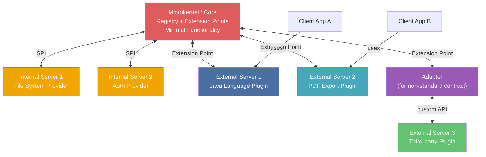

> **Prerequisites**: [[01-pattern-system|01. Pattern System — Nền tảng tư duy]], [[02-layers|02. Layers — Phân tầng hệ thống]], [[05-broker|05. Broker — Hệ thống phân tán]]
> **Objectives**:
> - Hiểu 5 thành phần Microkernel theo PoSA: Microkernel, Internal Server, External Server, Adapter, Client
> - Phân biệt Internal Server vs. External Server — hai loại extension khác nhau
> - Hiểu vai trò Plugin Registry và contract versioning
> - Implement một Plugin System đầy đủ bằng Python với registry, adapter, và dynamic loading
> - Phân tích trade-off: extensibility vs. performance, stability vs. complexity
> - So sánh Microkernel với Layers và Broker

---

## Motivation

### Bài toán: Sản phẩm phải tiến hóa mà không vỡ

Năm 1988, Andy Tanenbaum tại Vrije Universiteit Amsterdam hoàn thiện MINIX — một OS giáo dục với microkernel thực sự: kernel chỉ làm tối thiểu (IPC, basic memory management), còn file system, device driver, network stack đều chạy ở user space như các server độc lập. Triết lý: **kernel càng nhỏ càng ổn định** — nếu file system crash, nó không kéo theo kernel.

Cùng thời điểm đó, trong thế giới phần mềm ứng dụng, Eclipse Foundation đối mặt với bài toán khác nhưng tương tự: làm sao để Eclipse IDE có thể hỗ trợ Java, C++, Python, Kotlin, và hàng trăm ngôn ngữ khác mà không ai trong core team cần viết? Câu trả lời: **Plugin Architecture** — một dạng Microkernel pattern cho ứng dụng.

Core của Eclipse chỉ là text editor. Mọi thứ khác — syntax highlighting, debugger, refactoring tools, build integration — là plugin. Ai cũng có thể viết plugin theo đúng interface (extension point). Core không biết plugin nào tồn tại và không quan tâm — nó chỉ biết cách nói chuyện với bất kỳ plugin nào implement đúng contract.

Đây là Microkernel pattern: **minimal core cung cấp cơ sở hạ tầng, extensions cung cấp tính năng cụ thể**.

---

## Pattern Anatomy — Microkernel

### Name

**Microkernel** (còn gọi là *Plug-in Architecture*, *Extension Architecture*)

### Context

Một hệ thống lõi ổn định cần được mở rộng bởi nhiều tính năng tùy chọn, thường là từ các vendor hoặc developer khác nhau, và các tính năng này thay đổi thường xuyên hơn core.

### Problem

> Làm thế nào để thiết kế hệ thống sao cho các tính năng tùy chọn và tùy biến có thể được thêm vào, thay thế, hoặc gỡ bỏ mà không cần thay đổi core — và không cần biết trước danh sách tính năng sẽ tồn tại?

### Forces

- **Extensibility**: Khách hàng hay đối tác muốn thêm tính năng riêng của họ
- **Stability**: Core không được bị ảnh hưởng khi một extension crash hay lỗi
- **Isolation**: Extensions không nên biết về nhau — thêm extension A không nên ảnh hưởng extension B
- **Changeability**: Extension phải có thể update, swap, unload mà không restart toàn bộ hệ thống
- **Performance**: Microkernel overhead so với monolithic system — mỗi call qua kernel tốn thêm một IPC hop
- **Contract stability**: Interface giữa core và extension phải ổn định — breaking change là thảm họa

### Solution

> [!definition] Definition 7.1 — Microkernel Pattern (PoSA 5 thành phần)
>
> - **Microkernel (Core)**: Chứa tối thiểu chức năng để hệ thống vận hành. Quản lý registry các extension. Cung cấp **Extension Point Interface** — contract mà mọi extension phải tuân thủ. Điều phối communication giữa Internal và External Servers.
> - **Internal Server**: Extension cung cấp **mandatory services** — cần thiết nhưng có thể thay thế. Ví dụ: file system implementation, default authentication provider. Chạy trong cùng process với Microkernel.
> - **External Server**: Extension tùy chọn, cung cấp **domain-specific functionality** cho ứng dụng cụ thể. Ví dụ: Java language support plugin, PDF export plugin. Thường chạy trong process riêng.
> - **Adapter**: Cầu nối khi External Server dùng interface không chuẩn (third-party plugin). Core không cần biết interface cụ thể của third-party — Adapter dịch.
> - **Client**: Sử dụng hệ thống thông qua External Server (không giao tiếp trực tiếp với Core trong nhiều trường hợp).

### Structure



**Khác biệt then chốt Internal vs. External Server:**

| | Internal Server | External Server |
|--|---|--|
| **Loại service** | Mandatory (hệ thống cần) | Optional / domain-specific |
| **Process** | Cùng process với Core | Process riêng (hoặc cùng, tùy implementation) |
| **Interface** | SPI (Service Provider Interface) | Extension Point Interface |
| **Ai viết** | Core team | Third-party / customer / community |
| **Ví dụ** | Default logger, Base scheduler | Java plugin, Python plugin, Auth plugin |

---

## Plugin Registry và Contract Versioning

> [!definition] Definition 7.2 — Plugin Registry
> Microkernel duy trì một **Registry** — bảng tra cứu ánh xạ từ extension ID đến extension implementation. Registry chứa: tên plugin, phiên bản, interface version nó implement, entry point, metadata.
>
> Khi plugin load: `registry.register(plugin_id, metadata, factory)`
> Khi core cần dùng: `registry.lookup(plugin_id)` → lấy factory → tạo instance

> [!warning] Contract Versioning — bẫy nguy hiểm nhất
> Interface giữa Core và Extension là **contract cứng**. Nếu Core thay đổi interface (thêm method bắt buộc, đổi signature), **tất cả extension cũ sẽ broken**. Giải pháp:
>
> - **Additive only**: Chỉ thêm method mới vào interface, không xóa/đổi method cũ
> - **Interface versioning**: `ExtensionV1`, `ExtensionV2` — Core hỗ trợ nhiều phiên bản song song
> - **Default implementation**: Method mới có default implementation (Python `ABC` với `pass` body) — extension cũ không cần implement ngay

---

## Implementation — Plugin System bằng Python

Xây dựng một text processing engine với plugin system: core xử lý pipeline, plugins cung cấp các bước xử lý cụ thể.

### Core — Extension Point Interface và Registry

```python
from abc import ABC, abstractmethod
from typing import Any
import importlib


class TextProcessorPlugin(ABC):
    """Extension Point Interface — contract mọi plugin phải implement."""

    @property
    @abstractmethod
    def plugin_id(self) -> str:
        ...

    @property
    @abstractmethod
    def version(self) -> str:
        ...

    @abstractmethod
    def process(self, text: str, context: dict) -> str:
        ...

    def on_load(self) -> None:
        """Hook tùy chọn — gọi khi plugin được load."""
        pass

    def on_unload(self) -> None:
        """Hook tùy chọn — gọi khi plugin bị unload."""
        pass


class PluginRegistry:
    """Registry quản lý vòng đời plugin."""

    def __init__(self):
        self._plugins: dict[str, TextProcessorPlugin] = {}

    def register(self, plugin: TextProcessorPlugin) -> None:
        self._plugins[plugin.plugin_id] = plugin
        plugin.on_load()
        print(f"[Registry] Loaded plugin '{plugin.plugin_id}' v{plugin.version}")

    def unregister(self, plugin_id: str) -> None:
        if plugin_id in self._plugins:
            self._plugins[plugin_id].on_unload()
            del self._plugins[plugin_id]
            print(f"[Registry] Unloaded plugin '{plugin_id}'")

    def get(self, plugin_id: str) -> TextProcessorPlugin:
        if plugin_id not in self._plugins:
            raise KeyError(f"Plugin '{plugin_id}' not registered")
        return self._plugins[plugin_id]

    def list_plugins(self) -> list[str]:
        return list(self._plugins.keys())
```

### Microkernel — Core Engine

```python
class TextProcessingCore:
    """Microkernel: minimal core + extension point management."""

    def __init__(self):
        self._registry = PluginRegistry()
        self._pipeline: list[str] = []

    def register_plugin(self, plugin: TextProcessorPlugin) -> None:
        self._registry.register(plugin)

    def configure_pipeline(self, plugin_ids: list[str]) -> None:
        for pid in plugin_ids:
            self._registry.get(pid)
        self._pipeline = plugin_ids
        print(f"[Core] Pipeline: {' → '.join(plugin_ids)}")

    def execute(self, text: str, context: dict | None = None) -> str:
        ctx = context if context is not None else {}
        result = text
        for plugin_id in self._pipeline:
            plugin = self._registry.get(plugin_id)
            result = plugin.process(result, ctx)
        return result

    def list_available(self) -> list[str]:
        return self._registry.list_plugins()
```

### Internal Servers — Mandatory Base Plugins

```python
import re


class NormalizerPlugin(TextProcessorPlugin):
    """Internal Server: normalize whitespace — mandatory pre-processing."""

    plugin_id = "normalizer"
    version = "1.0"

    def process(self, text: str, context: dict) -> str:
        return re.sub(r'\s+', ' ', text).strip()


class SanitizerPlugin(TextProcessorPlugin):
    """Internal Server: remove control characters."""

    plugin_id = "sanitizer"
    version = "1.0"

    def process(self, text: str, context: dict) -> str:
        return re.sub(r'[\x00-\x08\x0b-\x1f\x7f]', '', text)
```

### External Servers — Domain-Specific Plugins

```python
class UpperCasePlugin(TextProcessorPlugin):
    plugin_id = "uppercase"
    version = "2.1"
    def process(self, text: str, context: dict) -> str:
        return text.upper()


class WordCountPlugin(TextProcessorPlugin):
    plugin_id = "word_count"
    version = "1.3"
    def process(self, text: str, context: dict) -> str:
        count = len(text.split())
        context["word_count"] = count
        return text

    def on_load(self) -> None:
        print(f"  [WordCount] Initialized counter")


class RedactPlugin(TextProcessorPlugin):
    """External Server: redact sensitive patterns."""
    plugin_id = "redact"
    version = "3.0"

    _PATTERNS = [
        (re.compile(r'\b\d{4}[- ]?\d{4}[- ]?\d{4}[- ]?\d{4}\b'), "[CARD]"),
        (re.compile(r'\b[A-Za-z0-9._%+-]+@[A-Za-z0-9.-]+\.[A-Z|a-z]{2,}\b'), "[EMAIL]"),
    ]

    def process(self, text: str, context: dict) -> str:
        for pattern, replacement in self._PATTERNS:
            text = pattern.sub(replacement, text)
        return text
```

### Adapter — cho Third-party Plugin với API khác

```python
class ThirdPartyTruncator:
    """Giả lập third-party library với API không chuẩn."""
    def truncate_text(self, input_text: str, max_chars: int = 100) -> str:
        if len(input_text) <= max_chars:
            return input_text
        return input_text[:max_chars] + "..."


class TruncatorAdapter(TextProcessorPlugin):
    """Adapter: dịch ThirdPartyTruncator thành TextProcessorPlugin interface."""

    plugin_id = "truncator"
    version = "1.0-adapted"

    def __init__(self, max_chars: int = 80):
        self._third_party = ThirdPartyTruncator()
        self._max_chars = max_chars

    def process(self, text: str, context: dict) -> str:
        return self._third_party.truncate_text(text, self._max_chars)
```

### Wiring và demo

```python
if __name__ == "__main__":
    core = TextProcessingCore()

    core.register_plugin(NormalizerPlugin())
    core.register_plugin(SanitizerPlugin())
    core.register_plugin(RedactPlugin())
    core.register_plugin(WordCountPlugin())
    core.register_plugin(TruncatorAdapter(max_chars=80))

    print(f"\nAvailable: {core.list_available()}")

    core.configure_pipeline(["sanitizer", "normalizer", "redact", "word_count", "truncator"])

    raw = "  Contact   john@example.com  or  pay 4111-1111-1111-1111  for the invoice.  "
    ctx = {}
    result = core.execute(raw, ctx)

    print(f"\nInput  : {raw!r}")
    print(f"Output : {result!r}")
    print(f"Context: {ctx}")

    print("\n--- Hot-swap pipeline (no truncation) ---")
    core.configure_pipeline(["sanitizer", "normalizer", "redact"])
    result2 = core.execute(raw)
    print(f"Output : {result2!r}")
```

---

## Known Uses

**Eclipse IDE (2001–nay)**: Core chỉ là text editor. Extension Points định nghĩa rõ ràng (`org.eclipse.ui.editors`, `org.eclipse.core.builders`...). Hàng nghìn plugin từ cộng đồng. Manifest file (`plugin.xml`) là registry entry.

**VS Code (2015–nay)**: Extension API tương tự Eclipse nhưng đơn giản hơn. Mỗi extension là Node.js module implement `activate(context)`. Marketplace là distributed plugin registry.

**Jenkins CI (2011–nay)**: Core chỉ là job scheduler. Mọi integration (Git, Maven, AWS, Slack) là plugin. Plugin registry là Jenkins Update Center.

**QNX Real-Time OS**: Microkernel OS thuần túy — kernel chỉ làm IPC và scheduling. File system, network stack, device drivers đều là process riêng (Internal Servers). Fault isolation tối đa — driver crash không ảnh hưởng kernel.

**WordPress / Drupal**: Core là CMS minimal. Mọi tính năng ngoài: WooCommerce, SEO, form builder — là plugin implement WordPress Plugin API (`register_activation_hook`, filter/action hooks).

---

## Consequences

### Lợi ích

- **Extensibility tối đa**: Thêm tính năng = thêm plugin. Không sửa core.
- **Fault isolation**: Plugin lỗi không crash core (đặc biệt nếu plugin chạy process riêng)
- **Deployment độc lập**: Update plugin mà không cần deploy lại core
- **Customization per customer**: Mỗi khách hàng dùng bộ plugin riêng trên cùng core

### Hạn chế

- **Performance**: Mỗi call qua extension point có overhead (lookup, dispatch, IPC nếu cross-process)
- **Contract complexity**: Quản lý interface versioning cho hàng trăm plugin là công việc tốn thời gian
- **Debugging khó**: Khi lỗi xảy ra trong plugin, stack trace thường khó đọc
- **Plugin hell**: Quá nhiều plugin không tương thích với nhau — dependency conflict (classloader hell trong Java/OSGi)

---

## So sánh Microkernel vs. Layers

| Tiêu chí | Microkernel | Layers |
|----------|-------------|--------|
| **Mục đích chính** | Extensibility — thêm tính năng không thay đổi core | Changeability — thay thế implementation từng layer |
| **Extension** | Plugin đăng ký vào core | Implement lại interface của một layer |
| **Ai biết ai** | Core biết Extension Point; Extension không biết core internals | Layer biết interface của layer phía dưới |
| **Số lượng extension** | Không giới hạn — registry có thể chứa hàng trăm plugin | Số layer cố định — thêm layer mới là architectural decision |
| **Hot-swap** | Thường hỗ trợ — plugin load/unload runtime | Không — thay layer thường cần restart |
| **Phù hợp với** | Product-based app cần customization | Business app cần separation of concerns |

---

## Summary

- **Microkernel** tách **minimal stable core** ra khỏi **optional extensible parts** — core không bao giờ cần sửa khi thêm tính năng mới.
- Năm thành phần PoSA: **Microkernel** (core + registry), **Internal Server** (mandatory service, same process), **External Server** (optional feature, separate process), **Adapter** (bridge for non-standard API), **Client** (dùng External Server).
- **Plugin Registry** quản lý vòng đời extension. **Contract versioning** là rủi ro lớn nhất — breaking interface = break tất cả plugin.
- **Adapter pattern** là đồng hành tự nhiên khi tích hợp third-party plugin có API không chuẩn.
- So với Layers: Microkernel cho extensibility (thêm tính năng); Layers cho changeability (thay thế implementation).

---

## References

- Frank Buschmann et al. — *POSA Vol. 1*, Chapter 2: Architectural Patterns — Microkernel
- Mark Richards — *Software Architecture Patterns* (O'Reilly, 2nd Ed. 2022), Chapter 4
- Andrew Tanenbaum — *MINIX* (cs.vu.nl/ast/reliable-os)
- Eclipse Foundation — *Plugin Development Guide* (help.eclipse.org)
- Aykhan Nazimzada — *MicroKernel Architectural Pattern* (Medium, 2020)
