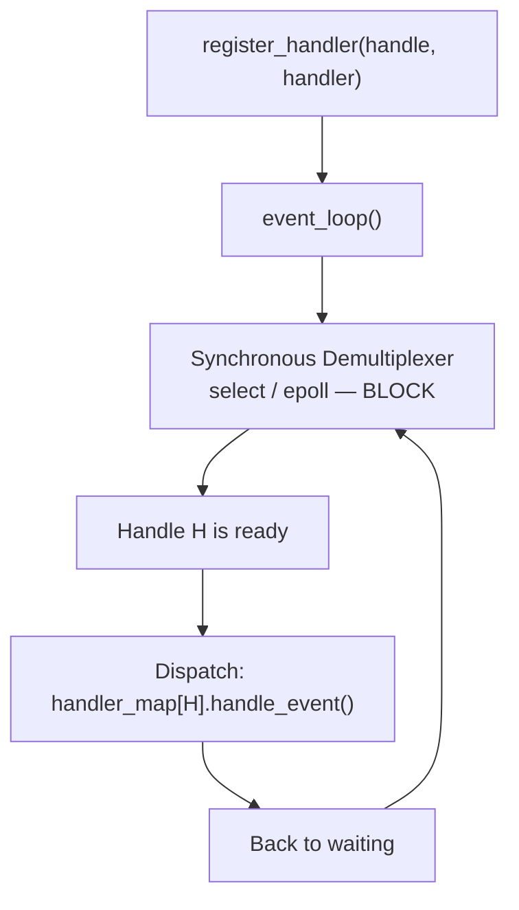
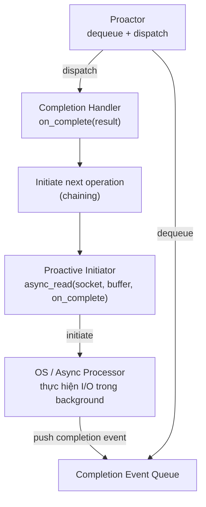
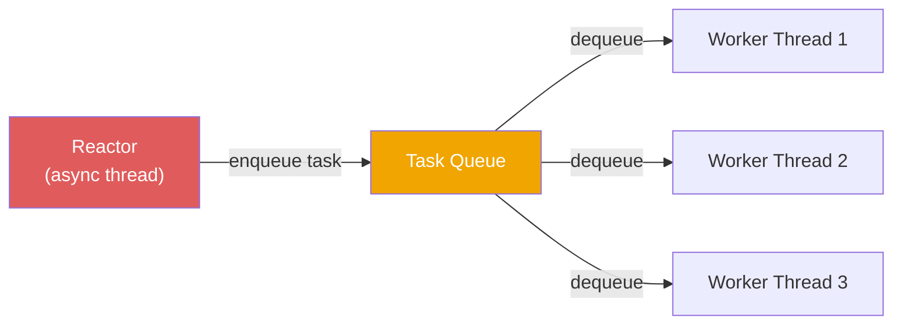

> **Prerequisites**: [[01-pattern-system|01. Pattern System — Nền tảng tư duy]], [[05-broker|05. Broker — Hệ thống phân tán]]
> **Objectives**:
> - Hiểu tại sao blocking I/O không scale và event-driven là giải pháp
> - Phân tích đầy đủ Reactor: Handle, Event Handler, Initiation Dispatcher, Synchronous Event Demultiplexer
> - Phân tích đầy đủ Proactor: Asynchronous Operation Processor, Completion Event Queue, Proactor, Completion Handler
> - Nắm vững sự khác biệt cốt lõi: Reactor = "notify when ready to operate", Proactor = "notify when operation complete"
> - Implement Reactor bằng Python `selectors`, Proactor bằng Python `asyncio`
> - Phân tích trade-off: throughput, latency, complexity, debugging difficulty

---

## Motivation

### Bài toán: Server phải phục vụ 10,000 client đồng thời

Năm 1999, Dan Kegel công bố bài viết nổi tiếng **"The C10K Problem"** — thách thức kỹ thuật của việc xây dựng server có thể xử lý 10,000 kết nối đồng thời trên một máy tính.

Cách tiếp cận đơn giản nhất: **one thread per connection**. Mỗi client được phục vụ bởi một thread riêng. Thread block chờ dữ liệu từ client, OS đổi sang thread khác. Nhưng với 10,000 client, cần 10,000 thread — mỗi thread chiếm 1–8MB stack, context switch tốn thời gian, memory footprint là hàng chục GB. Không khả thi.

Giải pháp: thay vì chờ blocking, hỏi OS **"socket nào đang sẵn sàng đọc/ghi?"** và chỉ xử lý socket đó. Tất cả socket dùng chung một thread. Đây là **Synchronous Event Demultiplexing** — cơ sở của Reactor pattern.

Reactor pattern giải quyết vấn đề này cho **synchronous I/O**: OS thông báo "socket X đã sẵn sàng, bạn có thể đọc mà không bị block". Proactor pattern đi xa hơn một bước: "tôi đã đọc xong socket X cho bạn, kết quả đây" — **asynchronous I/O** thực sự, OS thực hiện I/O trong background.

---

## Pattern 1 — Reactor

### Anatomy

**Name**: Reactor (còn gọi là *Dispatcher*, *Notifier*)

**Context**: Ứng dụng server cần xử lý nhiều client đồng thời với I/O-bound workload, không muốn dùng multi-threading vì overhead hoặc complexity.

**Problem**: Làm thế nào để server phục vụ nhiều client đồng thời trong một thread — mà không block chờ I/O từng client?

**Forces**:
- Blocking I/O không scale — thread block = thread lãng phí
- Multi-threading quá phức tạp và tốn overhead với số lượng connection lớn
- Event handler phải tách biệt khỏi cơ chế demultiplexing để tái sử dụng
- Cần thêm/bớt event handler tại runtime

### Solution

> [!definition] Definition 8.1 — Reactor Pattern
> Năm thành phần:
>
> - **Handle**: Định danh của một I/O resource (socket, file descriptor, pipe). OS dùng Handle để report khi resource "ready".
> - **Event Handler (abstract)**: Interface định nghĩa callback methods cho từng loại event (`handle_read`, `handle_write`, `handle_error`).
> - **Concrete Event Handler**: Implementation cụ thể — logic xử lý khi event xảy ra.
> - **Synchronous Event Demultiplexer**: OS-provided mechanism đợi trên tập Handles và trả về Handle nào "ready" (POSIX `select`/`epoll`, Windows IOCP readiness). Block cho đến khi ít nhất một Handle ready.
> - **Initiation Dispatcher (Reactor core)**: Quản lý registry Handle → Handler. Gọi Demultiplexer để chờ event. Khi event xảy ra, dispatch đến Handler tương ứng.

### Reactor Event Loop



**Điểm then chốt**: Reactor chỉ có **một thread** cho toàn bộ event loop. Event handler phải **không blocking** — nếu handler mất thời gian dài, toàn bộ reactor bị block. Đây là giới hạn lớn nhất của Reactor thuần.

---

## Implementation — Reactor bằng Python `selectors`

Python `selectors` module là wrapper trên `epoll`/`kqueue`/`select` tùy platform — đây chính là Synchronous Event Demultiplexer.

```python
import selectors
import socket
import types
from abc import ABC, abstractmethod


class EventHandler(ABC):
    """Abstract Event Handler — callback interface."""

    @abstractmethod
    def handle_read(self, key: selectors.SelectorKey) -> None:
        ...

    def get_handle(self) -> socket.socket:
        return self._sock


class AcceptHandler(EventHandler):
    """Concrete Handler: xử lý kết nối mới đến."""

    def __init__(self, host: str, port: int, reactor: "Reactor"):
        self._sock = socket.socket(socket.AF_INET, socket.SOCK_STREAM)
        self._sock.setsockopt(socket.SOL_SOCKET, socket.SO_REUSEADDR, 1)
        self._sock.bind((host, port))
        self._sock.listen(10)
        self._sock.setblocking(False)
        self._reactor = reactor
        print(f"[AcceptHandler] Listening on {host}:{port}")

    def handle_read(self, key: selectors.SelectorKey) -> None:
        conn, addr = self._sock.accept()
        conn.setblocking(False)
        print(f"[AcceptHandler] New connection from {addr}")
        echo_handler = EchoHandler(conn)
        self._reactor.register(conn, selectors.EVENT_READ, echo_handler)


class EchoHandler(EventHandler):
    """Concrete Handler: echo data trở lại client."""

    def __init__(self, conn: socket.socket):
        self._sock = conn

    def handle_read(self, key: selectors.SelectorKey) -> None:
        data = self._sock.recv(1024)
        if data:
            print(f"[EchoHandler] Received: {data.decode().strip()!r}")
            self._sock.send(b"ECHO: " + data)
        else:
            print("[EchoHandler] Connection closed")
            key.data._reactor_ref.unregister(self._sock)
            self._sock.close()


class Reactor:
    """Initiation Dispatcher — core của Reactor pattern."""

    def __init__(self):
        self._sel = selectors.DefaultSelector()
        self._handlers: dict[int, EventHandler] = {}

    def register(self, sock: socket.socket, events: int, handler: EventHandler) -> None:
        handler._reactor_ref = self
        self._sel.register(sock, events, data=handler)
        self._handlers[sock.fileno()] = handler

    def unregister(self, sock: socket.socket) -> None:
        self._sel.unregister(sock)
        self._handlers.pop(sock.fileno(), None)

    def run(self, timeout: float = 1.0) -> None:
        print("[Reactor] Event loop started")
        try:
            while True:
                events = self._sel.select(timeout=timeout)
                for key, mask in events:
                    handler: EventHandler = key.data
                    handler.handle_read(key)
        except KeyboardInterrupt:
            print("[Reactor] Shutting down")
        finally:
            self._sel.close()
```

Dùng Reactor:

```python
reactor = Reactor()
accept_handler = AcceptHandler("127.0.0.1", 9000, reactor)
reactor.register(accept_handler.get_handle(), selectors.EVENT_READ, accept_handler)
reactor.run()
```

Toàn bộ server chỉ có **một thread**. `selectors.select()` là Synchronous Event Demultiplexer — nó block cho đến khi có socket ready, rồi Reactor dispatch đến đúng Handler.

---

## Pattern 2 — Proactor

### Tại sao Reactor không đủ

Reactor vẫn dùng **synchronous I/O** — khi `handle_read` được gọi, handler vẫn phải tự gọi `recv()`. Gọi `recv()` thì không block vì OS đã báo "ready", nhưng handler vẫn chiếm CPU trong khi đọc.

Với **asynchronous I/O** (Windows IOCP, Linux io_uring), OS **tự thực hiện I/O** trong background kernel thread — handler chỉ nhận callback khi đọc xong hoàn toàn. Handler không cần biết gì về việc đọc — chỉ xử lý kết quả.

### Anatomy

**Name**: Proactor

**Context**: Ứng dụng cần throughput cao trên platform hỗ trợ true asynchronous I/O — hoặc cần xử lý nhiều concurrent long-duration operation.

**Problem**: Làm thế nào để xử lý nhiều operation đồng thời mà không cần thread per operation — và tận dụng async I/O của OS?

### Solution

> [!definition] Definition 8.2 — Proactor Pattern
> Sáu thành phần:
>
> - **Proactive Initiator**: Khởi tạo (initiate) một async operation và chỉ định Completion Handler. Sau khi initiate, tự do làm việc khác — không chờ.
> - **Asynchronous Operation**: Operaton I/O thực sự (đọc file, ghi socket). Được thực hiện bởi OS trong background.
> - **Asynchronous Operation Processor**: OS hoặc runtime thực hiện async operation (Windows IOCP, Linux io_uring, Python event loop).
> - **Completion Event Queue**: Hàng đợi nơi OS đặt kết quả khi async operation hoàn thành.
> - **Proactor**: Dequeue event từ Completion Queue, dispatch đến đúng Completion Handler.
> - **Completion Handler**: Xử lý kết quả của operation đã hoàn thành. Thường initiate operation mới (chaining).

### Proactor Flow



**Điểm then chốt**: Proactor = "notify when **complete**". Reactor = "notify when **ready**". Initiator không biết khi nào operation xong — nó chỉ biết khi Completion Handler được gọi.

---

## Implementation — Proactor bằng Python `asyncio`

Python `asyncio` là hiện thực Proactor pattern thuần túy: event loop chính là Proactor, `async/await` là Completion Handler syntax, coroutine chaining là operation chaining.

```python
import asyncio


async def handle_client(reader: asyncio.StreamReader, writer: asyncio.StreamWriter) -> None:
    """Completion Handler: được gọi khi kết nối được thiết lập hoàn toàn."""
    addr = writer.get_extra_info("peername")
    print(f"[Proactor] Connected: {addr}")

    try:
        while True:
            data = await reader.read(1024)
            if not data:
                break
            message = data.decode().strip()
            print(f"[Proactor] Received from {addr}: {message!r}")
            response = f"ECHO: {message}\n"
            writer.write(response.encode())
            await writer.drain()
    except asyncio.IncompleteReadError:
        pass
    finally:
        print(f"[Proactor] Disconnected: {addr}")
        writer.close()
        await writer.wait_closed()


async def main() -> None:
    server = await asyncio.start_server(handle_client, "127.0.0.1", 9001)
    addr = server.sockets[0].getsockname()
    print(f"[Proactor] Serving on {addr}")
    async with server:
        await server.serve_forever()


if __name__ == "__main__":
    asyncio.run(main())
```

**Giải phẫu Proactor trong asyncio:**
- `asyncio.start_server(handle_client, ...)` — Proactive Initiator, đăng ký async accept operation
- `asyncio.run(main())` — khởi động Proactor (event loop)
- `await reader.read(1024)` — initiate async read, **không block thread** — event loop chạy task khác
- Khi OS hoàn thành read, event loop dispatch trở lại sau `await` — đây là Completion Handler được gọi
- `writer.write(...)` + `await writer.drain()` — initiate async write, chaining ngay trong handler

---

## Reactor vs. Proactor — So sánh cốt lõi

| Tiêu chí | Reactor | Proactor |
|----------|---------|----------|
| **Trigger** | "Socket ready — bạn có thể đọc" | "Đọc xong rồi — đây là kết quả" |
| **I/O model** | Synchronous non-blocking | Asynchronous (OS thực hiện I/O) |
| **Handler biết gì** | Phải tự gọi `recv()`, `send()` | Chỉ nhận kết quả đã hoàn thành |
| **Memory buffer** | Allocate khi ready (tiết kiệm) | Phải allocate trước khi initiate (tốn hơn) |
| **Portability** | Cao — `select`/`epoll` có ở mọi nơi | Thấp hơn — IOCP (Windows), io_uring (Linux 5.1+) |
| **Debug** | Dễ hơn — control flow tuyến tính | Khó hơn — inverted control flow, thời gian-không gian tách biệt |
| **Python mapping** | `selectors` module | `asyncio` event loop |
| **Known uses** | nginx (Linux), Node.js (lõi), libevent | Windows IOCP servers, Boost.Asio, Python asyncio |

> [!definition] Definition 8.3 — Reactor là "synchronous variant" của Proactor
> Douglas Schmidt (tác giả POSA Vol. 2) mô tả: "Reactor là biến thể synchronous của Proactor". Cả hai đều demultiplex nhiều event vào các handler. Khác biệt duy nhất: Reactor trigger khi I/O **có thể** thực hiện; Proactor trigger khi I/O **đã** thực hiện.

---

## Single-Thread vs. Multi-Thread Reactor

Reactor thuần có một giới hạn lớn: **handler không được blocking**. Nếu handler cần tính toán CPU-heavy, toàn bộ event loop ngừng lại.

Giải pháp thực tế — **Half-Sync/Half-Async** (bài 09 sẽ phân tích chi tiết):



Đây là kiến trúc của Node.js (Reactor thread + libuv thread pool), Nginx (event loop + worker processes), và Python asyncio + ThreadPoolExecutor.

---

## Known Uses

**Reactor**: nginx (epoll-based event loop, single thread per worker process), Node.js (libuv Reactor + JS event loop), libevent/libev (portable Reactor library), Redis (single-threaded event loop xử lý 1M+ ops/sec).

**Proactor**: Python `asyncio` (event loop là Proactor, `await` là completion chaining), Boost.Asio (C++, IOCP trên Windows, epoll-as-Proactor trên Linux), Java NIO2 / `AsynchronousChannelGroup`.

---

## Consequences

### Reactor — Lợi ích
- **Đơn giản**: Single thread, không cần synchronization giữa handlers
- **Portable**: `select`/`epoll`/`kqueue` có ở mọi OS
- **Dễ debug**: Control flow rõ ràng, không có completion callbacks xa xôi

### Reactor — Hạn chế
- **CPU-bound không scale**: Handler nặng block toàn event loop
- **Latency**: Operations serialized — handler chậm delay tất cả handler khác

### Proactor — Lợi ích
- **True concurrency**: OS thực hiện I/O song song với application code
- **Throughput cao hơn**: Không cần chờ I/O readiness — operation bắt đầu ngay
- **Sync-like code**: `async/await` viết giống synchronous, dễ đọc

### Proactor — Hạn chế
- **Platform dependency**: True async I/O (IOCP, io_uring) không portable
- **Buffer management**: Phải pre-allocate buffer trước khi initiate — memory tốn hơn Reactor
- **Inverted control flow**: Khó debug khi exception xảy ra trong completion chain

---

## Summary

- **Reactor** = synchronous event demultiplexing: "notify when **ready**". Một thread, event loop, handler tự thực hiện I/O.
- **Proactor** = asynchronous event demultiplexing: "notify when **complete**". OS thực hiện I/O, handler nhận kết quả.
- Reactor dùng `select`/`epoll` (Synchronous Demultiplexer). Proactor dùng IOCP/io_uring (Async Operation Processor + Completion Queue).
- Python `selectors` → Reactor. Python `asyncio` → Proactor.
- Cả hai đều single-thread cho event handling — CPU-bound handler phải offload sang thread pool (Half-Sync/Half-Async — bài 09).
- Trade-off: Reactor đơn giản, portable, dễ debug. Proactor throughput cao hơn, phức tạp hơn.

---

## References

- Douglas C. Schmidt et al. — *POSA Vol. 2: Patterns for Concurrent and Networked Objects* (Wiley, 2000), Chapter 3
- Douglas C. Schmidt — *Reactor: An Object Behavioral Pattern* (Siemens, 1994)
- Douglas C. Schmidt — *Proactor: An Object Behavioral Pattern for Demultiplexing and Dispatching Handlers for Asynchronous Events* (1998)
- Dan Kegel — *The C10K Problem* (kegel.com/c10k.html, 1999)
- Boost.Asio documentation — *The Proactor Design Pattern: Concurrency Without Threads* (think-async.com)
- Python docs — `asyncio` event loop internals (docs.python.org)
