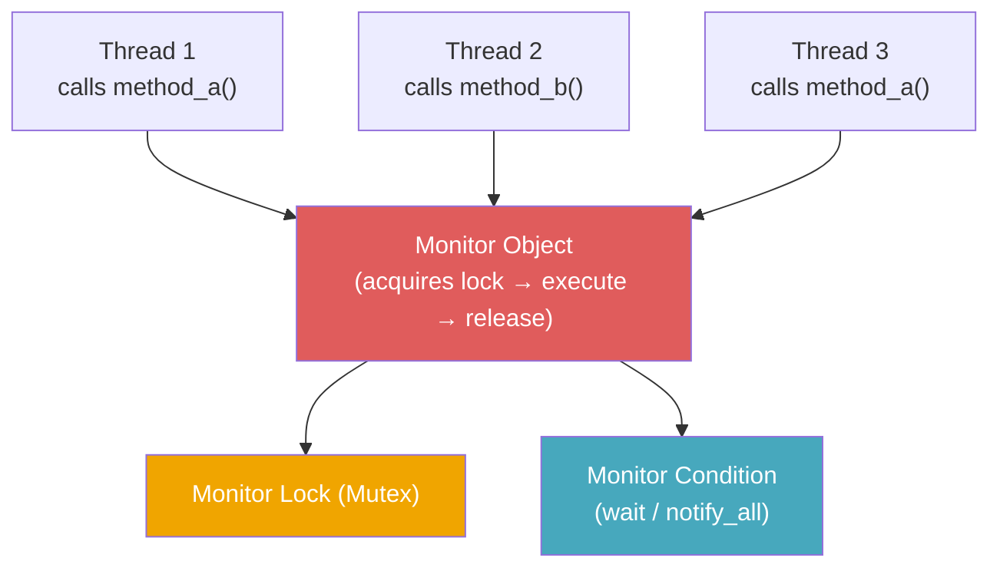
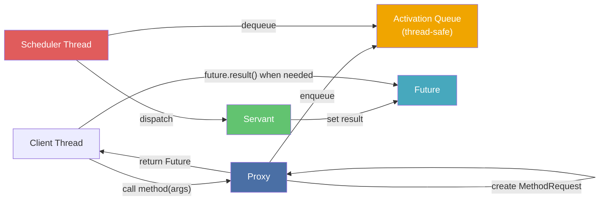
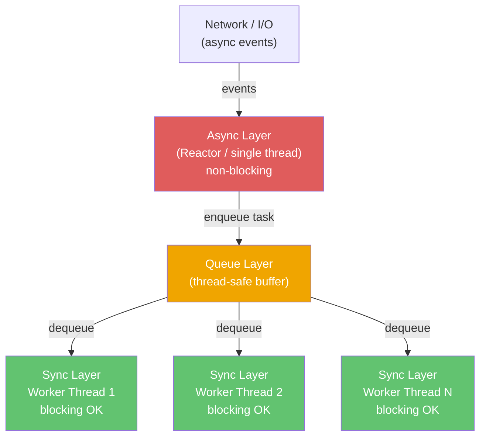

> **Prerequisites**: [[01-pattern-system|01. Pattern System — Nền tảng tư duy]], [[08-reactor-and-proactor|08. Reactor & Proactor — Event-Driven]]
> **Objectives**:
> - Hiểu tại sao cần tách biệt method invocation khỏi method execution
> - Phân tích đầy đủ 6 thành phần Active Object: Proxy, Method Request, Activation Queue, Scheduler, Servant, Future
> - Phân tích Monitor Object: Monitor Lock, Condition Variable, Synchronized Method, Monitor Condition
> - Nắm vững sự khác biệt cốt lõi: Active Object chạy thread riêng, Monitor Object mượn thread của client
> - Implement Active Object hoàn chỉnh bằng Python `threading` + `queue` + `concurrent.futures`
> - Implement Monitor Object dùng `threading.Condition`
> - Hiểu Half-Sync/Half-Async — cách kết hợp Reactor + Active Object

---

## Motivation

### Bài toán: Thread-safe access và non-blocking invocation

Hãy tưởng tượng một gateway xử lý dữ liệu thị trường chứng khoán: 100 producer thread liên tục đẩy giá mới, 50 consumer thread đọc dữ liệu để hiển thị. Nếu không có cơ chế đồng bộ, data race xảy ra — giá trị đọc được có thể là nửa chừng giữa hai lần ghi.

Giải pháp ngây thơ: cho mỗi method vào `Lock`. Nhưng lock làm thread bị block — khi 100 producer chờ nhau, throughput giảm thảm. Và nếu một method cần gọi method khác trong khi đang giữ lock, deadlock có thể xảy ra.

POSA Vol. 2 (Schmidt et al.) đưa ra hai pattern bổ sung cho nhau:

**Monitor Object**: đơn giản hóa concurrent access bằng cách đảm bảo chỉ một method chạy trong object tại một thời điểm — mượn thread của caller, chỉ thêm synchronization.

**Active Object**: đi xa hơn — tách **lời gọi method** (invocation) khỏi **thực thi method** (execution) hoàn toàn. Client gọi method, nhận Future ngay lập tức, method chạy trong thread riêng của object. Client không bị block.

---

## Pattern 1 — Monitor Object

### Anatomy

**Name**: Monitor Object (còn gọi là *Thread-Safe Passive Object*, *Synchronized Object*)

**Context**: Nhiều thread cần truy cập và sửa đổi dữ liệu của cùng một object. Các method cần serialized — không được chạy đồng thời.

**Problem**: Làm thế nào để nhiều thread truy cập an toàn các method của một object mà không cần caller tự quản lý locking — và cho phép các method phối hợp với nhau qua condition?

**Forces**:
- Concurrent method invocation phải được serialized — không được có data race
- Client không nên cần tự quản lý lock — dễ quên, dễ sai
- Methods cần khả năng chờ (wait) điều kiện và báo cho nhau (notify)
- Object phải usable như một thread-safe unit

### Solution

> [!definition] Definition 9.1 — Monitor Object
> Bốn thành phần:
>
> - **Synchronized Method**: Method của object, tự động acquire Monitor Lock khi được gọi và release khi return. Mỗi lúc chỉ một Synchronized Method được chạy.
> - **Monitor Lock (Mutex)**: Lock nội bộ của object — ẩn hoàn toàn khỏi caller. Client không cần biết lock tồn tại.
> - **Monitor Condition (Condition Variable)**: Cho phép Synchronized Method suspend (wait) khi điều kiện chưa thỏa mãn, và wake up khi method khác signal. Ví dụ: `pop()` chờ cho đến khi queue có phần tử.
> - **Monitor Object**: Object chứa tất cả synchronized methods, monitor lock, và monitor conditions. Là đơn vị concurrency.

### Structure



---

## Implementation — Monitor Object: Bounded Buffer

```python
import threading
from typing import TypeVar, Generic

T = TypeVar("T")


class BoundedBuffer(Generic[T]):
    """Monitor Object: thread-safe bounded buffer.

    Synchronized methods: put() và get().
    Monitor Lock: self._lock (ẩn khỏi caller).
    Monitor Conditions: _not_full, _not_empty.
    """

    def __init__(self, capacity: int):
        self._capacity = capacity
        self._buffer: list[T] = []
        self._lock = threading.Lock()
        self._not_full = threading.Condition(self._lock)
        self._not_empty = threading.Condition(self._lock)

    def put(self, item: T, timeout: float | None = None) -> bool:
        """Synchronized method: block nếu full, rồi thêm item."""
        with self._not_full:
            if not self._not_full.wait_for(
                lambda: len(self._buffer) < self._capacity,
                timeout=timeout,
            ):
                return False
            self._buffer.append(item)
            self._not_empty.notify_all()
            return True

    def get(self, timeout: float | None = None) -> T | None:
        """Synchronized method: block nếu empty, rồi lấy item."""
        with self._not_empty:
            if not self._not_empty.wait_for(
                lambda: len(self._buffer) > 0,
                timeout=timeout,
            ):
                return None
            item = self._buffer.pop(0)
            self._not_full.notify_all()
            return item

    def size(self) -> int:
        with self._lock:
            return len(self._buffer)
```

Thử nghiệm với producer-consumer:

```python
import time

buffer: BoundedBuffer[int] = BoundedBuffer(capacity=3)

def producer(name: str, count: int) -> None:
    for i in range(count):
        ok = buffer.put(i, timeout=2.0)
        print(f"[{name}] put {i} → {'ok' if ok else 'timeout'}")
        time.sleep(0.05)

def consumer(name: str, count: int) -> None:
    for _ in range(count):
        item = buffer.get(timeout=2.0)
        print(f"[{name}] got {item}")
        time.sleep(0.12)

threads = [
    threading.Thread(target=producer, args=("P1", 5)),
    threading.Thread(target=producer, args=("P2", 5)),
    threading.Thread(target=consumer, args=("C1", 10)),
]
for t in threads:
    t.start()
for t in threads:
    t.join()
```

**Điểm then chốt**: Caller gọi `buffer.put(42)` — không biết gì về lock. Nếu buffer full, thread block tại `wait_for` và được đặt vào waiting list của Condition. Khi `get()` lấy một item ra, nó gọi `notify_all()` — tất cả thread đang wait `_not_full` được đánh thức.

---

## Pattern 2 — Active Object

### Anatomy

**Name**: Active Object (còn gọi là *Concurrent Object*)

**Context**: Client cần gọi method tốn thời gian trên một object mà không bị block. Object xử lý nhiều request đồng thời theo thứ tự có thể lập lịch.

**Problem**: Làm thế nào để tách rời việc gọi method (invocation) khỏi việc thực thi nó (execution) — cho phép client tiếp tục chạy trong khi method được thực thi bất đồng bộ trong thread riêng?

**Forces**:
- Client không được block chờ method kết thúc
- Method phải được thực thi theo thứ tự có thể kiểm soát (không phải random thread race)
- Client cần cách để lấy kết quả khi cần
- Object phải thread-safe mà không cần caller quản lý lock

### Solution

> [!definition] Definition 9.2 — Active Object
> Sáu thành phần:
>
> - **Proxy**: Interface công khai của Active Object. Client gọi method trên Proxy — Proxy **không thực thi** method mà tạo Method Request và enqueue.
> - **Method Request**: Object đóng gói một lời gọi method (Command pattern). Chứa tên method, tham số, và reference đến Future.
> - **Activation Queue (Activation List)**: Hàng đợi thread-safe chứa Method Requests đang chờ thực thi. Là buffer giữa Proxy thread và Servant thread.
> - **Scheduler**: Chạy trong thread riêng (thread của Active Object). Lấy Method Request từ queue, kiểm tra guard condition, dispatch lên Servant.
> - **Servant**: Object thực sự thực thi method. Chạy trong thread của Scheduler. Là implementation thực của business logic.
> - **Future**: Placeholder cho kết quả chưa có. Proxy trả Future về cho client ngay lập tức. Client poll hoặc block trên Future khi cần kết quả.

### Structure



---

## Implementation — Active Object bằng Python

```python
import threading
import queue
from concurrent.futures import Future
from abc import ABC, abstractmethod
from typing import Any, Callable
import time


class MethodRequest:
    """Đóng gói một lời gọi method — Command pattern."""

    def __init__(self, func: Callable, args: tuple, kwargs: dict, future: Future):
        self._func = func
        self._args = args
        self._kwargs = kwargs
        self._future = future

    def execute(self) -> None:
        if self._future.cancelled():
            return
        try:
            result = self._func(*self._args, **self._kwargs)
            self._future.set_result(result)
        except Exception as exc:
            self._future.set_exception(exc)


class Scheduler(threading.Thread):
    """Chạy trong thread riêng, dequeue và dispatch MethodRequest."""

    def __init__(self):
        super().__init__(daemon=True)
        self._queue: queue.Queue[MethodRequest | None] = queue.Queue()
        self._running = True

    def enqueue(self, request: MethodRequest) -> None:
        self._queue.put(request)

    def shutdown(self) -> None:
        self._running = False
        self._queue.put(None)

    def run(self) -> None:
        while self._running:
            request = self._queue.get()
            if request is None:
                break
            request.execute()


class DataProcessorServant:
    """Servant: implementation thực — chạy trong Scheduler thread."""

    def process(self, data: list[int]) -> dict:
        time.sleep(0.1)
        return {
            "sum": sum(data),
            "avg": sum(data) / len(data) if data else 0,
            "max": max(data) if data else None,
            "count": len(data),
        }

    def filter_evens(self, data: list[int]) -> list[int]:
        time.sleep(0.05)
        return [x for x in data if x % 2 == 0]


class DataProcessorProxy:
    """Proxy: interface công khai. Client chỉ thấy Proxy."""

    def __init__(self):
        self._servant = DataProcessorServant()
        self._scheduler = Scheduler()
        self._scheduler.start()

    def process(self, data: list[int]) -> Future:
        future: Future = Future()
        request = MethodRequest(self._servant.process, (data,), {}, future)
        self._scheduler.enqueue(request)
        return future

    def filter_evens(self, data: list[int]) -> Future:
        future: Future = Future()
        request = MethodRequest(self._servant.filter_evens, (data,), {}, future)
        self._scheduler.enqueue(request)
        return future

    def shutdown(self) -> None:
        self._scheduler.shutdown()
        self._scheduler.join()


if __name__ == "__main__":
    processor = DataProcessorProxy()

    data1 = list(range(1, 21))
    data2 = list(range(100, 120))

    print("Enqueuing requests (non-blocking)...")
    f1 = processor.process(data1)
    f2 = processor.filter_evens(data2)
    f3 = processor.process(data2)
    print("All requests enqueued — client continues immediately")

    print(f"\nResult 1 (process data1): {f1.result(timeout=5)}")
    print(f"Result 2 (filter_evens data2): {f2.result(timeout=5)}")
    print(f"Result 3 (process data2): {f3.result(timeout=5)}")

    processor.shutdown()
```

---

## Active Object vs. Monitor Object — So sánh cốt lõi

| Tiêu chí | Monitor Object | Active Object |
|----------|----------------|---------------|
| **Thread của method** | Mượn thread của **caller** | Thread riêng của **object** |
| **Caller có bị block** | Có — cho đến khi method xong | Không — nhận Future ngay lập tức |
| **Scheduling** | Đơn giản: FIFO lock queue | Phong phú: có thể ưu tiên, reorder, cancel |
| **Overhead** | Thấp — chỉ là lock + condition | Cao — thread riêng, queue, Future |
| **Khi nào dùng** | Protect shared data, simple sync | Long-duration op, non-blocking API, priority scheduling |
| **Python idiom** | `threading.Lock` + `Condition` | `concurrent.futures.Future` + `queue.Queue` |

---

## Half-Sync/Half-Async — Kết hợp Reactor + Active Object

Đây là pattern kết hợp quan trọng nhất, được dùng rộng rãi trong hệ thống thực (Node.js, Nginx, Python WSGI).

> [!definition] Definition 9.3 — Half-Sync/Half-Async
> Tách hệ thống thành hai layer giao tiếp qua Queue:
>
> - **Async Layer (Half-Async)**: Xử lý I/O event bất đồng bộ — thường là Reactor/Proactor. **Không blocking**. Khi nhận được request, enqueue lên Queue và tiếp tục.
> - **Sync Layer (Half-Sync)**: Pool các thread đồng bộ xử lý request từ Queue. Mỗi thread có thể **blocking** — gọi database, đọc file, tính toán nặng.
> - **Queue Layer**: Buffer giữa hai layer. Tách rời tốc độ xử lý của async và sync.



```python
import asyncio
import threading
import queue as stdlib_queue
from concurrent.futures import ThreadPoolExecutor


task_queue: stdlib_queue.Queue = stdlib_queue.Queue()


def sync_worker(worker_id: int) -> None:
    """Sync Layer: xử lý blocking tasks từ queue."""
    while True:
        task = task_queue.get()
        if task is None:
            break
        data, result_future = task
        time.sleep(0.1)
        result = {"worker": worker_id, "result": sum(data), "count": len(data)}
        loop = result_future[1]
        loop.call_soon_threadsafe(result_future[0].set_result, result)
        task_queue.task_done()


async def async_handler(data: list[int]) -> dict:
    """Async Layer: nhận request, enqueue lên sync layer, await kết quả."""
    loop = asyncio.get_event_loop()
    future = loop.create_future()
    task_queue.put((data, (future, loop)))
    return await future


async def main() -> None:
    worker_threads = []
    for i in range(3):
        t = threading.Thread(target=sync_worker, args=(i,), daemon=True)
        t.start()
        worker_threads.append(t)

    results = await asyncio.gather(
        async_handler(list(range(10))),
        async_handler(list(range(100, 110))),
        async_handler(list(range(50, 60))),
    )
    for r in results:
        print(f"Worker {r['worker']}: sum={r['result']}, count={r['count']}")

    for _ in worker_threads:
        task_queue.put(None)
```

---

## Known Uses

**Monitor Object**: Java `synchronized` keyword (mọi object là Monitor Object tiềm năng), Python `threading.Lock` + `Condition`, C++ `std::mutex` + `std::condition_variable`, POSIX Pthreads mutex.

**Active Object**: Java `ExecutorService` + `Future` (cơ bản là Active Object), Python `concurrent.futures.ThreadPoolExecutor`, Android `AsyncTask` (deprecated), Actor Model (Erlang, Akka) — Actor là Active Object không có Proxy tường minh.

**Half-Sync/Half-Async**: Node.js (libuv event loop là Async Layer + C++ thread pool cho file I/O là Sync Layer), Nginx (event loop + worker processes), Python `asyncio` + `run_in_executor` (chạy blocking code trong thread pool từ async context), Tomcat (async acceptor + sync servlet thread pool).

---

## Consequences

### Monitor Object
- ✅ Đơn giản — caller không cần biết gì về locking
- ✅ Overhead thấp — chỉ là lock acquisition
- ❌ Caller vẫn block trong thời gian method chạy
- ❌ Deadlock nếu synchronized method gọi synchronized method khác của cùng object

### Active Object
- ✅ Caller không block — nhận Future ngay lập tức
- ✅ Scheduler có thể reorder, priority-queue, cancel request
- ❌ Overhead cao — thread, queue, Future creation
- ❌ Debugging khó — execution xảy ra ở thread khác, stack trace không liên tục
- ❌ Latency thêm do queue waiting time

---

## Summary

- **Monitor Object**: serialized method execution trong thread của caller, dùng Lock + Condition. Đơn giản, overhead thấp. Dùng khi cần protect shared data.
- **Active Object**: tách invocation khỏi execution — client nhận Future, Servant chạy trong thread riêng. Dùng khi cần non-blocking API hoặc priority scheduling.
- **Phân biệt cốt lõi**: Monitor Object mượn thread caller; Active Object có thread riêng.
- **Half-Sync/Half-Async**: Async Layer (Reactor) + Queue + Sync Layer (thread pool) — pattern của Node.js, Nginx, Python asyncio + executor.
- Python: Monitor Object = `threading.Lock` + `Condition`; Active Object = `Future` + `queue.Queue` + `Thread`.

---

## References

- Douglas C. Schmidt et al. — *POSA Vol. 2*, Chapter 5: Active Object, Monitor Object, Half-Sync/Half-Async
- Douglas C. Schmidt — *Active Object: An Object Behavioral Pattern for Concurrent Programming* (1998)
- Rainer Grimm — *Active Object* (ModernesCpp.com, 2023)
- Python docs — `threading.Condition`, `concurrent.futures` (docs.python.org)
- TopCoder — *Concurrency Patterns: Active Object and Monitor Object* (topcoder.com)
