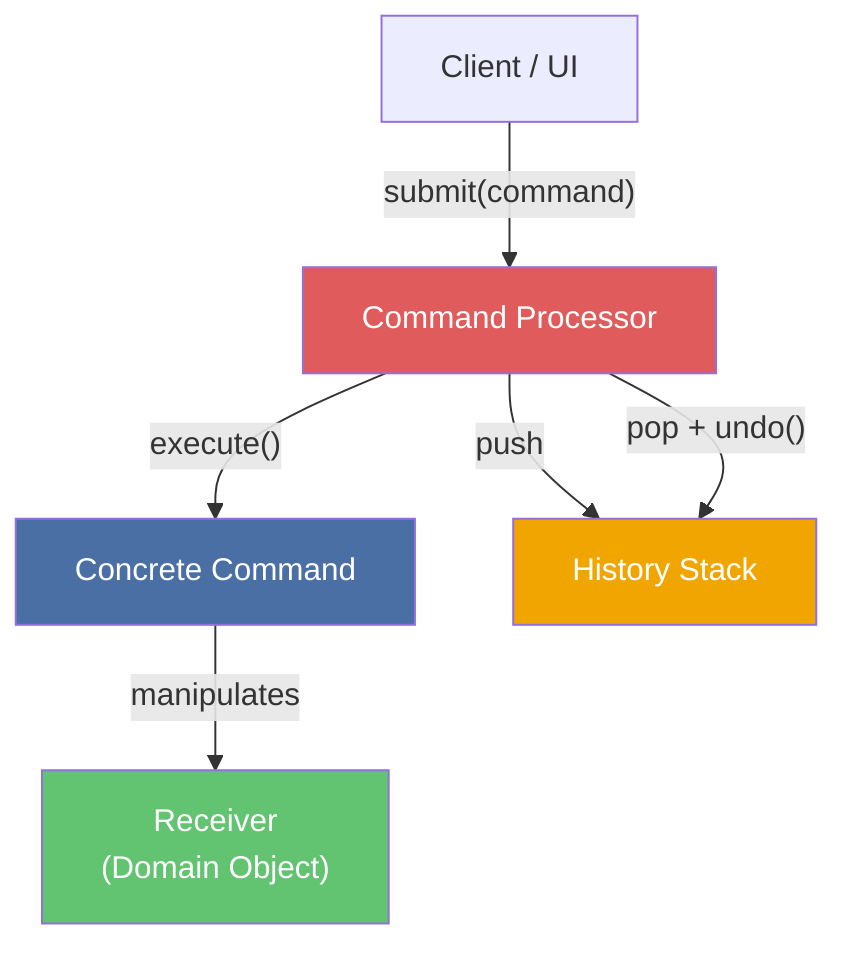
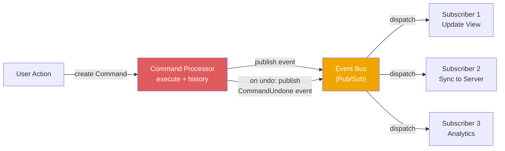

> **Prerequisites**: [[01-pattern-system|01. Pattern System — Nền tảng tư duy]], [[06-mvc-and-pac|06. MVC & PAC — Giao diện tương tác]]
> **Objectives**:
> - Phân biệt Publisher-Subscriber (PoSA) với Observer (GoF) — hai pattern hay bị nhầm
> - Hiểu Push vs. Pull notification, Event Channel, Topic-based vs. Content-based filtering
> - Phân tích Command Processor: Command object, Processor, History List, Undo/Redo
> - Hiểu sự kết hợp tự nhiên giữa Publisher-Subscriber và Command Processor trong ứng dụng thực
> - Implement Event Bus (Pub/Sub) và Command Processor có Undo/Redo bằng Python
> - So sánh Publisher-Subscriber với Observer và MVC

---

## Motivation

### Bài toán 1: Loose coupling trong event-driven system

Trong hệ thống thương mại điện tử, khi một đơn hàng được tạo, nhiều thứ phải xảy ra: gửi email xác nhận, cập nhật kho hàng, tính hoa hồng cho affiliate, ghi log analytics. Nếu `OrderService.create_order()` gọi trực tiếp `EmailService`, `InventoryService`, `AffiliateService`, `AnalyticsService` — mỗi khi thêm một phản ứng mới, phải sửa `OrderService`.

Giải pháp: `OrderService` publish event `OrderCreated`. Bất kỳ service nào muốn phản ứng thì subscribe. `OrderService` không biết ai lắng nghe, bao nhiêu người lắng nghe, hay họ làm gì.

### Bài toán 2: Undo/Redo trong ứng dụng

Người dùng thực hiện một chuỗi hành động — gõ text, định dạng, xóa, chèn ảnh. Làm thế nào để Ctrl+Z quay lại đúng trạng thái trước? Cách thô sơ: snapshot toàn bộ state sau mỗi action — tốn memory. Giải pháp tốt hơn: mỗi action được đóng gói thành **Command object** có cả `execute()` và `undo()`. History list lưu Command objects — Ctrl+Z gọi `undo()` của command cuối cùng.

---

## Pattern 1 — Publisher-Subscriber

### Anatomy

**Name**: Publisher-Subscriber (còn gọi là *Event Bus*, *Message Bus*, *Pub/Sub*)

**Context**: Nhiều component cần phản ứng với sự kiện từ component khác, nhưng không muốn phụ thuộc trực tiếp vào nhau.

**Problem**: Làm thế nào để nhiều component có thể giao tiếp qua sự kiện mà không cần biết về sự tồn tại của nhau — cho phép thêm, bớt subscriber mà không sửa publisher?

**Forces**:
- Publisher không nên biết subscriber nào đang lắng nghe
- Subscriber không nên biết publisher cụ thể là ai
- Cả hai nên có thể thay đổi, thêm vào, hoặc gỡ bỏ độc lập
- Event delivery có thể đồng bộ (sync) hoặc bất đồng bộ (async)

### Solution

> [!definition] Definition 10.1 — Publisher-Subscriber
> Ba thành phần:
>
> - **Publisher**: Tạo và publish sự kiện vào **Event Channel**. Không biết gì về Subscriber.
> - **Event Channel (Event Bus / Message Broker)**: Trung gian. Duy trì registry topic → [subscribers]. Nhận event từ Publisher, dispatch đến tất cả Subscriber đã register cho topic đó.
> - **Subscriber**: Đăng ký (subscribe) cho một hoặc nhiều topic. Định nghĩa callback xử lý khi event đến. Không biết gì về Publisher.

### Publisher-Subscriber vs. Observer (GoF)

> [!definition] Definition 10.2 — Pub/Sub vs. Observer
>
> | Tiêu chí | Observer (GoF) | Publisher-Subscriber (PoSA) |
> |----------|----------------|----------------------------|
> | **Coupling** | Subject biết Observer — `subject.attach(observer)` | Publisher không biết Subscriber — cả hai chỉ biết Event Channel |
> | **Trung gian** | Không có — Subject trực tiếp notify Observer | Có — Event Channel/Bus đứng giữa |
> | **Filtering** | Không — tất cả Observer nhận tất cả event | Có — subscribe theo topic/content |
> | **Phạm vi** | In-process, cùng codebase | Cross-process, cross-service, distributed |
> | **Ví dụ** | MVC Model→View notification | Kafka, RabbitMQ, Redis Pub/Sub |
>
> **Quy tắc nhận dạng**: Nếu Publisher và Subscriber ở cùng process và biết nhau qua interface → Observer. Nếu chỉ biết nhau qua event type và Channel đứng giữa → Publisher-Subscriber.

### Push vs. Pull Delivery

> [!definition] Definition 10.3 — Push vs. Pull trong Pub/Sub
>
> **Push**: Event Channel đẩy event vào callback của Subscriber ngay khi Publisher publish. Subscriber phải xử lý ngay hoặc buffer nội bộ.
> - Ưu điểm: Low latency, Subscriber không cần polling
> - Nhược điểm: Subscriber có thể bị overwhelmed nếu event rate cao
>
> **Pull**: Subscriber chủ động poll Event Channel khi sẵn sàng xử lý.
> - Ưu điểm: Subscriber kiểm soát tốc độ tiêu thụ (backpressure)
> - Nhược điểm: Thêm latency, cần polling loop

---

## Implementation — Event Bus (Pub/Sub)

```python
from collections import defaultdict
from typing import Callable, Any
from dataclasses import dataclass, field
import threading


@dataclass
class Event:
    topic: str
    payload: Any
    source: str = ""


Subscriber = Callable[[Event], None]


class EventBus:
    """Event Channel — trung gian giữa Publisher và Subscriber."""

    def __init__(self, async_dispatch: bool = False):
        self._subscribers: dict[str, list[Subscriber]] = defaultdict(list)
        self._lock = threading.Lock()
        self._async = async_dispatch

    def subscribe(self, topic: str, callback: Subscriber) -> None:
        with self._lock:
            self._subscribers[topic].append(callback)

    def unsubscribe(self, topic: str, callback: Subscriber) -> None:
        with self._lock:
            self._subscribers[topic] = [
                cb for cb in self._subscribers[topic] if cb != callback
            ]

    def publish(self, event: Event) -> None:
        with self._lock:
            callbacks = list(self._subscribers.get(event.topic, []))
        for cb in callbacks:
            if self._async:
                threading.Thread(target=cb, args=(event,), daemon=True).start()
            else:
                cb(event)


class OrderService:
    """Publisher: tạo đơn hàng, publish event — không biết ai lắng nghe."""

    def __init__(self, bus: EventBus):
        self._bus = bus
        self._order_counter = 0

    def create_order(self, product: str, qty: int) -> str:
        self._order_counter += 1
        order_id = f"ORD-{self._order_counter:04d}"
        print(f"[OrderService] Created order {order_id}: {qty}x {product}")
        self._bus.publish(Event(
            topic="order.created",
            payload={"order_id": order_id, "product": product, "qty": qty},
            source="OrderService",
        ))
        return order_id


class EmailService:
    """Subscriber: gửi email xác nhận."""

    def on_order_created(self, event: Event) -> None:
        payload = event.payload
        print(f"[EmailService] Sending confirmation for {payload['order_id']}")


class InventoryService:
    """Subscriber: cập nhật kho."""

    def on_order_created(self, event: Event) -> None:
        payload = event.payload
        print(f"[InventoryService] Reserving {payload['qty']}x {payload['product']}")


class AnalyticsService:
    """Subscriber: ghi log analytics."""

    def on_order_created(self, event: Event) -> None:
        print(f"[AnalyticsService] Tracking order {event.payload['order_id']}")


if __name__ == "__main__":
    bus = EventBus()

    email = EmailService()
    inventory = InventoryService()
    analytics = AnalyticsService()

    bus.subscribe("order.created", email.on_order_created)
    bus.subscribe("order.created", inventory.on_order_created)
    bus.subscribe("order.created", analytics.on_order_created)

    order_svc = OrderService(bus)
    order_svc.create_order("MacBook Pro", 1)
    order_svc.create_order("AirPods", 2)

    print("\n--- Removing analytics (A/B test) ---")
    bus.unsubscribe("order.created", analytics.on_order_created)
    order_svc.create_order("iPhone", 1)
```

`OrderService` không import `EmailService` hay `InventoryService` — zero coupling giữa Publisher và Subscriber.

---

## Pattern 2 — Command Processor

### Anatomy

**Name**: Command Processor (còn gọi là *Command History*, *Macro Command*)

**Context**: Ứng dụng cần hỗ trợ Undo/Redo, transaction log, hoặc macro recording — nơi mỗi hành động người dùng cần được đóng gói và có thể hoàn tác.

**Problem**: Làm thế nào để đóng gói các hành động của người dùng dưới dạng object — cho phép undo, redo, log, và replay mà không cần biết chi tiết của từng hành động?

**Forces**:
- Cần Undo/Redo nhiều bước
- Muốn log hành động cho auditing hoặc replay
- Cần tách caller (UI) khỏi implementation của hành động (business logic)
- Hỗ trợ Macro — ghi lại và replay chuỗi hành động

### Solution

> [!definition] Definition 10.4 — Command Processor
> Bốn thành phần:
>
> - **Command (abstract)**: Interface với `execute()` và `undo()`. Đóng gói một hành động cùng với tất cả thông tin cần thiết để thực thi và hoàn tác.
> - **Concrete Command**: Implementation cụ thể. Biết cách thực thi hành động và cách đảo ngược nó.
> - **Command Processor**: Nhận Command từ Client, gọi `execute()`, lưu Command vào History List. Khi Undo được yêu cầu, lấy Command cuối từ history và gọi `undo()`.
> - **History List (Command Stack)**: Stack lưu các Command đã thực thi — cơ sở của undo/redo.

### Structure



---

## Implementation — Command Processor với Undo/Redo

```python
from abc import ABC, abstractmethod
from typing import Optional
from dataclasses import dataclass, field


class Command(ABC):
    @abstractmethod
    def execute(self) -> str:
        ...

    @abstractmethod
    def undo(self) -> str:
        ...

    @property
    @abstractmethod
    def description(self) -> str:
        ...


class TextDocument:
    """Receiver — domain object bị manipulate bởi Command."""

    def __init__(self):
        self._content: list[str] = []

    def append(self, text: str) -> None:
        self._content.append(text)

    def delete_last(self) -> Optional[str]:
        return self._content.pop() if self._content else None

    def insert_at(self, index: int, text: str) -> None:
        self._content.insert(index, text)

    def delete_at(self, index: int) -> Optional[str]:
        if 0 <= index < len(self._content):
            return self._content.pop(index)
        return None

    def get_content(self) -> str:
        return " | ".join(self._content) if self._content else "(empty)"


class AppendCommand(Command):
    """Thêm text vào cuối document."""

    def __init__(self, doc: TextDocument, text: str):
        self._doc = doc
        self._text = text

    @property
    def description(self) -> str:
        return f"Append({self._text!r})"

    def execute(self) -> str:
        self._doc.append(self._text)
        return f"Appended {self._text!r}"

    def undo(self) -> str:
        removed = self._doc.delete_last()
        return f"Undo append: removed {removed!r}"


class InsertCommand(Command):
    """Chèn text vào vị trí cụ thể."""

    def __init__(self, doc: TextDocument, index: int, text: str):
        self._doc = doc
        self._index = index
        self._text = text

    @property
    def description(self) -> str:
        return f"Insert({self._index}, {self._text!r})"

    def execute(self) -> str:
        self._doc.insert_at(self._index, self._text)
        return f"Inserted {self._text!r} at position {self._index}"

    def undo(self) -> str:
        removed = self._doc.delete_at(self._index)
        return f"Undo insert: removed {removed!r} from position {self._index}"


class CommandProcessor:
    """Quản lý execute, undo, redo — và history."""

    def __init__(self):
        self._history: list[Command] = []
        self._redo_stack: list[Command] = []

    def execute(self, command: Command) -> str:
        result = command.execute()
        self._history.append(command)
        self._redo_stack.clear()
        return result

    def undo(self) -> Optional[str]:
        if not self._history:
            return None
        command = self._history.pop()
        result = command.undo()
        self._redo_stack.append(command)
        return result

    def redo(self) -> Optional[str]:
        if not self._redo_stack:
            return None
        command = self._redo_stack.pop()
        result = command.execute()
        self._history.append(command)
        return result

    def history_summary(self) -> list[str]:
        return [cmd.description for cmd in self._history]


if __name__ == "__main__":
    doc = TextDocument()
    processor = CommandProcessor()

    print("--- Execute commands ---")
    print(processor.execute(AppendCommand(doc, "Hello")))
    print(processor.execute(AppendCommand(doc, "World")))
    print(processor.execute(InsertCommand(doc, 1, "Beautiful")))
    print(f"Content: {doc.get_content()}")
    print(f"History: {processor.history_summary()}")

    print("\n--- Undo twice ---")
    print(processor.undo())
    print(processor.undo())
    print(f"Content: {doc.get_content()}")

    print("\n--- Redo once ---")
    print(processor.redo())
    print(f"Content: {doc.get_content()}")
    print(f"History: {processor.history_summary()}")
```

---

## Kết hợp: Publisher-Subscriber + Command Processor

Hai pattern này kết hợp tự nhiên trong event-sourced architecture:



Mỗi `execute()` publish event `CommandExecuted`. Mỗi `undo()` publish event `CommandUndone`. Subscriber nhận event để update UI, sync state, log analytics — mà không cần Command Processor biết gì về chúng.

---

## Known Uses

**Publisher-Subscriber**: Apache Kafka (distributed Pub/Sub, topic-based), RabbitMQ (AMQP message broker, topic/fanout exchange), Redis Pub/Sub, AWS SNS/SQS, Django Signals (in-process Pub/Sub), Python `blinker` library.

**Command Processor**: Microsoft Word Undo/Redo (classic use case), Git (mỗi commit là Command, `git revert` là Undo, `git cherry-pick` là Redo), Database transaction log (WAL — Write-Ahead Log, mỗi operation là Command), Qt QUndoStack, Eclipse Edit → Undo.

---

## Consequences

### Publisher-Subscriber

**Lợi ích**:
- Zero coupling giữa Publisher và Subscriber — thêm subscriber không sửa publisher
- Runtime extensibility — subscribe/unsubscribe lúc runtime
- Natural cho microservices — mỗi service publish events, service khác react

**Hạn chế**:
- Khó debug — khi event được published, không rõ subscriber nào sẽ phản ứng và theo thứ tự nào
- Potential memory leak — subscriber không unsubscribe khi bị destroy
- Event ordering không đảm bảo trong async mode

### Command Processor

**Lợi ích**:
- Undo/Redo elegant — không cần snapshot toàn bộ state
- Auditing tự nhiên — history list là log đầy đủ của hành động
- Macro recording — lưu và replay chuỗi Command

**Hạn chế**:
- Mỗi Command phải implement `undo()` chính xác — phức tạp với side-effecting commands
- Memory — history list có thể lớn nếu không giới hạn
- Inverse operation khó — một số operation không reversible dễ dàng (gửi email, charge thẻ tín dụng)

---

## Summary

- **Publisher-Subscriber** là Observer với Event Channel đứng giữa — Publisher và Subscriber **không biết nhau**, chỉ biết topic.
- Phân biệt: Observer = Publisher biết Subscriber (attach/detach); Pub/Sub = cả hai chỉ biết Channel.
- **Push**: Channel đẩy event vào callback — low latency nhưng subscriber dễ bị overwhelmed. **Pull**: Subscriber poll — kiểm soát được tốc độ tiêu thụ.
- **Command Processor** đóng gói hành động thành object có `execute()` + `undo()`. History Stack = cơ sở Undo/Redo.
- Kết hợp: Command Processor publish event sau mỗi `execute()`/`undo()` → Subscribers update state phân tán.

---

## References

- Frank Buschmann et al. — *POSA Vol. 1*, Chapter 3 (Command Processor), Appendix B (Publisher-Subscriber)
- Erich Gamma et al. — *Design Patterns* (GoF): Observer, Command
- Enterprise Integration Patterns — Gregor Hohpe & Bobby Woolf: *Publish-Subscribe Channel* (enterpriseintegrationpatterns.com)
- Martin Fowler — *Event Sourcing* (martinfowler.com/eaaDev/EventSourcing.html)
