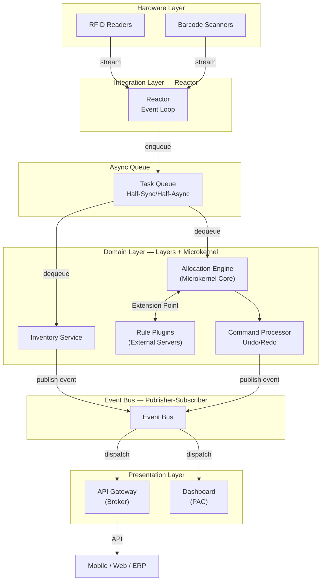
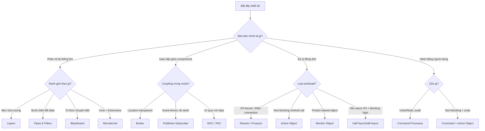

> **Prerequisites**: [[01-pattern-system|01. Pattern System — Nền tảng tư duy]] — [[10-publisher-subscriber-command|10. Publisher-Subscriber & Command Processor]] (tất cả bài trước)
> **Objectives**:
> - Tổng hợp trade-off của tất cả pattern đã học vào một framework so sánh thống nhất
> - Nắm vững Pattern Selection Heuristics — quy tắc chọn pattern theo đặc điểm bài toán
> - Phân tích 3 dạng conflict khi kết hợp pattern: structural, behavioral, performance
> - Thiết kế kiến trúc đầy đủ cho Warehouse Management System (WMS) bằng cách kết hợp nhiều pattern
> - Hiểu cách các pattern trong PoSA liên kết với nhau thành một Pattern Language thực tế

---

## Tổng hợp Trade-off — Master Table

Bảng dưới đây là công cụ tư duy cốt lõi cho cấp độ Advanced: không hỏi "pattern này làm gì" mà hỏi "pattern này đánh đổi gì để lấy gì".

Thang điểm: ★★★★★ = tốt nhất, ★☆☆☆☆ = kém nhất.

| Pattern | Coupling | Cohesion | Changeability | Performance | Complexity | Extensibility |
|---------|----------|----------|---------------|-------------|------------|---------------|
| **Layers** | ★★★★☆ | ★★★★★ | ★★★★☆ | ★★★☆☆ | ★★☆☆☆ | ★★☆☆☆ |
| **Pipes & Filters** | ★★★★★ | ★★★★★ | ★★★★★ | ★★☆☆☆ | ★★★☆☆ | ★★★★★ |
| **Blackboard** | ★★★★☆ | ★★★☆☆ | ★★★★☆ | ★★☆☆☆ | ★★★★★ | ★★★★☆ |
| **Broker** | ★★★★★ | ★★★★☆ | ★★★★★ | ★★☆☆☆ | ★★★★☆ | ★★★★☆ |
| **MVC** | ★★★★☆ | ★★★★☆ | ★★★★☆ | ★★★★☆ | ★★★☆☆ | ★★★☆☆ |
| **PAC** | ★★★★★ | ★★★★★ | ★★★★★ | ★★★☆☆ | ★★★★★ | ★★★★★ |
| **Microkernel** | ★★★★★ | ★★★★☆ | ★★★★★ | ★★★☆☆ | ★★★★☆ | ★★★★★ |
| **Reactor** | ★★★★☆ | ★★★☆☆ | ★★★☆☆ | ★★★★☆ | ★★★☆☆ | ★★★☆☆ |
| **Proactor** | ★★★★☆ | ★★★☆☆ | ★★★☆☆ | ★★★★★ | ★★★★☆ | ★★★☆☆ |
| **Active Object** | ★★★★☆ | ★★★★☆ | ★★★★☆ | ★★★☆☆ | ★★★★☆ | ★★★☆☆ |
| **Monitor Object** | ★★★★☆ | ★★★★☆ | ★★★☆☆ | ★★★★☆ | ★★☆☆☆ | ★★☆☆☆ |
| **Publisher-Sub** | ★★★★★ | ★★★☆☆ | ★★★★★ | ★★★☆☆ | ★★★☆☆ | ★★★★★ |
| **Command Proc.** | ★★★★☆ | ★★★★★ | ★★★★☆ | ★★★★☆ | ★★★☆☆ | ★★★☆☆ |

---

## Pattern Selection Heuristics

### Heuristic 1 — Bài toán phân rã hệ thống

> [!definition] Definition 11.1 — Structural Decomposition Heuristics
> Câu hỏi đầu tiên khi thiết kế: **"Hệ thống được phân rã theo nguyên tắc gì?"**
>
> - **Theo mức độ trừu tượng** (low-level → high-level, concrete → abstract) → **Layers**
> - **Theo bước biến đổi dữ liệu** (stream flows through transformations) → **Pipes & Filters**
> - **Theo không gian tri thức** (nhiều chuyên gia cùng giải bài toán không tuyến tính) → **Blackboard**
> - **Theo tính năng tùy chọn** (core stable + extensions biến đổi) → **Microkernel**

### Heuristic 2 — Giao tiếp giữa các thành phần

> [!definition] Definition 11.2 — Communication Heuristics
> Câu hỏi thứ hai: **"Các thành phần cần giao tiếp như thế nào?"**
>
> - **Gọi service từ xa, không biết location** → **Broker**
> - **Nhiều thành phần phản ứng với event, không biết nhau** → **Publisher-Subscriber**
> - **Nhiều View cần sync với một Model** → **MVC**
> - **Nhiều widget độc lập cần giao tiếp** → **PAC**

### Heuristic 3 — Bài toán concurrency

> [!definition] Definition 11.3 — Concurrency Heuristics
> Câu hỏi thứ ba: **"Hệ thống cần xử lý đồng thời như thế nào?"**
>
> - **Nhiều I/O connections, không muốn multi-thread** → **Reactor**
> - **Muốn async I/O, throughput tối đa** → **Proactor**
> - **Method gọi không blocking, kết quả qua Future** → **Active Object**
> - **Chỉ cần protect shared object đơn giản** → **Monitor Object**
> - **Mix async I/O + blocking business logic** → **Half-Sync/Half-Async**

### Heuristic 4 — Câu hỏi về actions

> [!definition] Definition 11.4 — Action Heuristics
> Câu hỏi thứ tư: **"Hành động của người dùng cần được xử lý thế nào?"**
>
> - **Cần Undo/Redo, auditing, macro** → **Command Processor**
> - **Cần tác vụ nặng không blocking UI** → **Command Processor + Active Object**

---

## Conflicts khi kết hợp Pattern

Kết hợp pattern là kỹ năng cốt lõi ở Advanced level. Nhưng không phải mọi kết hợp đều hài hòa — có ba loại conflict cần nhận biết:

### Conflict 1 — Structural Conflict

**Ví dụ**: Blackboard + Pipes & Filters.

Blackboard yêu cầu shared state — tất cả KS đọc/ghi cùng một Blackboard. Pipes & Filters yêu cầu stateless filter — mỗi filter chỉ nhận input, trả output, không có side effect.

**Giải pháp**: Chỉ dùng một pattern làm "kiến trúc chủ", pattern kia làm "tactic cục bộ". Ví dụ: Blackboard làm kiến trúc chủ, nhưng một KS cụ thể bên trong có thể dùng Pipes & Filters nội bộ để xử lý dữ liệu của nó.

### Conflict 2 — Behavioral Conflict

**Ví dụ**: Microkernel + Active Object.

Microkernel yêu cầu plugin giao tiếp qua well-defined synchronous interface. Active Object trả Future bất đồng bộ. Nếu plugin trả Future, Core không biết khi nào kết quả có để tiếp tục.

**Giải pháp**: Định nghĩa rõ trong Extension Point Interface: plugin phải implement synchronous interface. Active Object được dùng **bên trong** plugin để không block thread của Core — nhưng interface hướng ra ngoài là synchronous.

### Conflict 3 — Performance Conflict

**Ví dụ**: Broker + Layers.

Broker thêm 2 hop (Client-side Proxy → Broker → Server-side Proxy). Layers thêm N function call overhead. Kết hợp cả hai có thể tạo latency không chấp nhận được cho real-time system.

**Giải pháp**: Áp dụng Layers cho **cấu trúc nội bộ của service** (high changeability trong service), dùng Broker chỉ cho **giao tiếp giữa service** (cross-service location transparency). Không dùng cả hai cho cùng một call path.

---

## Case Study — Warehouse Management System (WMS)

Đây là bài tập tổng hợp: thiết kế kiến trúc cho hệ thống quản lý kho hàng thực tế.

### Yêu cầu

- **Nhận hàng**: Scan barcode, cập nhật inventory, phân bổ vị trí lưu trữ
- **Xuất hàng**: Lấy hàng theo order, cập nhật inventory, tạo packing list
- **Real-time tracking**: Vị trí hàng hóa trong kho cập nhật real-time qua RFID
- **Multi-channel**: API cho mobile app (nhân viên kho), web dashboard (quản lý), ERP integration
- **Extensible**: Hỗ trợ thêm loại scanner mới, thêm warehouse rule mới
- **Undo**: Quản lý có thể hoàn tác phân bổ hàng

### Phân tích và Chọn Pattern

**Bước 1 — Phân rã hệ thống tổng thể**: Hệ thống có các lớp trừu tượng rõ ràng: thiết bị phần cứng (RFID, barcode scanner) → xử lý dữ liệu → business logic (inventory, allocation) → API/UI.

→ **Layers** làm kiến trúc nền: Hardware Layer → Integration Layer → Domain Layer → Presentation Layer.

**Bước 2 — Giao tiếp với hệ thống ngoài**: Mobile app, web dashboard, ERP không biết và không quan tâm server WMS ở đâu, chạy bằng gì.

→ **Broker** cho API gateway: Client (mobile/web/ERP) → Broker (API Gateway) → WMS Services.

**Bước 3 — Phản ứng với sự kiện RFID**: Khi RFID đọc được tag mới, hàng chục subsystem cần phản ứng: cập nhật location map, check alert rule, ghi audit log, notify dashboard.

→ **Publisher-Subscriber**: RFID Handler publish `ItemLocationChanged` event, các subscriber react độc lập.

**Bước 4 — Xử lý I/O từ nhiều thiết bị**: Hàng trăm RFID reader gửi data liên tục. Không thể có một thread per reader.

→ **Reactor** cho RFID stream: một event loop xử lý tất cả reader connections không blocking.

**Bước 5 — Business logic nặng**: Allocation algorithm (tìm vị trí tối ưu cho pallet) cần CPU time đáng kể. Không được block Reactor thread.

→ **Half-Sync/Half-Async**: Reactor enqueue allocation task lên queue, worker thread pool xử lý.

**Bước 6 — Warehouse rules extensible**: Khách hàng muốn thêm rule riêng: "hàng dễ vỡ không được xếp dưới hàng nặng", "hàng cần nhiệt độ lạnh chỉ ở zone A".

→ **Microkernel**: Core xử lý allocation cơ bản, Rules là External Server (plugin). Khách hàng thêm rule plugin mà không sửa core.

**Bước 7 — Undo allocation**: Quản lý có thể hoàn tác một lần phân bổ sai.

→ **Command Processor**: Mỗi allocation là Command object có `execute()` + `undo()`.

**Bước 8 — Multi-panel dashboard**: Dashboard có nhiều widget độc lập: inventory heatmap, alert list, order queue, worker performance.

→ **PAC** cho dashboard UI: mỗi widget là PAC Agent với state và display riêng, Top-level Agent điều phối.

### Architecture Diagram

### Phân tích Conflict trong WMS

**Reactor + Microkernel**: Reactor event loop cần non-blocking handler. Rule plugins (Microkernel External Server) có thể blocking nếu rule phức tạp. **Giải pháp**: Plugins được gọi trong worker thread (Sync Layer của Half-Sync/Half-Async), không bao giờ trong Reactor thread.

**Publisher-Subscriber + Command Processor**: Khi Command bị undo, Pub/Sub cần deliver `CommandUndone` event đến tất cả subscriber đã nhận `CommandExecuted` trước đó. **Giải pháp**: Event Bus duy trì idempotency key — subscriber xử lý `CommandUndone` chỉ nếu trước đó đã nhận `CommandExecuted` tương ứng.

**PAC + Broker**: Dashboard dùng PAC (agent hierarchy), nhưng data đến qua Broker (API Gateway). **Giải pháp**: Top-Level PAC Agent là Broker Client — nó nhận data từ Broker và phân phối xuống agent con trong hierarchy.

---

## Pattern Language — Luồng chọn pattern tổng thể

---

## Nguyên tắc Composition — 5 quy tắc thực hành

> [!definition] Definition 11.5 — 5 Quy tắc Kết hợp Pattern
>
> 1. **Một kiến trúc chủ, nhiều tactic phụ**: Chọn một pattern làm cấu trúc tổng thể (Layers, Broker). Các pattern khác là "tactic" cục bộ giải quyết vấn đề con. Đừng cố nhét hai Architectural Pattern ngang hàng vào cùng cấp độ.
>
> 2. **Tránh conflict performance trên cùng call path**: Nếu một request phải đi qua Broker (2 hop) + Layers (N hop) + Active Object (queue wait), latency cộng dồn. Đặt boundary rõ ràng: Broker cho cross-service, Layers cho intra-service.
>
> 3. **Pattern boundary = module boundary**: Ranh giới giữa pattern phải trùng với ranh giới module trong code. Nếu một class thuộc hai pattern khác nhau, đó là dấu hiệu thiết kế sai.
>
> 4. **Document tại sao, không chỉ là gì**: Ghi lại không chỉ pattern được dùng mà còn forces nào dẫn đến lựa chọn đó và alternatives đã xem xét. Người đọc sau cần hiểu trade-off đã được cân nhắc.
>
> 5. **Anti-pattern: Pattern Shopping**: Đừng thêm pattern vì nó "nghe hay". Mỗi pattern thêm vào là thêm complexity. Hỏi: "Pattern này giải quyết force nào đang thực sự gây đau?" Nếu không có câu trả lời rõ ràng, không dùng.

---

## Retrospective — Nhìn lại toàn bộ khóa học

### Các cặp pattern hay bị nhầm nhau

| Cặp | Sự khác biệt then chốt |
|-----|----------------------|
| **Layers vs. Pipes & Filters** | Layers: ranh giới theo abstraction level, 2 chiều (request/response). P&F: ranh giới theo bước biến đổi, 1 chiều (stream) |
| **Broker vs. Mediator (GoF)** | Broker: cross-process, location transparency, proxy+marshalling. Mediator: in-process, chỉ giảm coupling giữa objects |
| **Observer (GoF) vs. Publisher-Subscriber** | Observer: Subject biết Observer. Pub/Sub: cả hai không biết nhau, chỉ biết Event Channel |
| **Reactor vs. Proactor** | Reactor: "ready to operate" (sync I/O). Proactor: "operation complete" (async I/O) |
| **Active Object vs. Monitor Object** | Active Object: thread riêng, caller không block. Monitor Object: mượn thread caller, caller block |
| **MVC vs. PAC** | MVC: flat triad, Model biết Observer. PAC: hierarchy of agents, P-A không trực tiếp giao tiếp |
| **Microkernel vs. Layers** | Microkernel: extensibility (thêm tính năng). Layers: changeability (thay implementation) |

### Forces hay gặp nhất và pattern giải quyết

| Force | Pattern giải quyết tốt nhất |
|-------|-----------------------------|
| Location transparency | Broker |
| Recomposability of processing steps | Pipes & Filters |
| Multiple views on same data | MVC |
| Non-deterministic problem solving | Blackboard |
| Plugin extensibility | Microkernel |
| Non-blocking I/O | Reactor, Proactor |
| Non-blocking method invocation | Active Object |
| Shared state thread safety | Monitor Object |
| Anonymous event communication | Publisher-Subscriber |
| Undo/Redo history | Command Processor |

---

## Summary

- **Trade-off table** là công cụ nhanh nhất để so sánh pattern theo 6 chiều: coupling, cohesion, changeability, performance, complexity, extensibility.
- **Pattern selection**: luôn bắt đầu từ force, không từ pattern tên nghe hay. Hỏi "force nào đang gây đau?" trước khi chọn.
- **Kết hợp pattern**: một kiến trúc chủ + nhiều tactic cục bộ. Tránh conflict trên cùng call path.
- **WMS case study**: Layers (cơ sở) + Broker (API gateway) + Pub/Sub (events) + Reactor + Half-Sync/Half-Async (I/O) + Microkernel (rules) + Command Processor (undo) + PAC (dashboard).
- **Anti-pattern shopping**: pattern không phải mục tiêu — giải quyết force là mục tiêu. Đừng thêm pattern không cần thiết.

---

## References

- Frank Buschmann et al. — *POSA Vol. 1: A System of Patterns* (Wiley, 1996) — toàn bộ
- Douglas C. Schmidt et al. — *POSA Vol. 2: Patterns for Concurrent and Networked Objects* (Wiley, 2000)
- Frank Buschmann, Kevlin Henney, Douglas C. Schmidt — *POSA Vol. 4: A Pattern Language for Distributed Computing* (Wiley, 2007)
- Mark Richards, Neal Ford — *Fundamentals of Software Architecture* (O'Reilly, 2020), Ch. 3
- Gregor Hohpe, Bobby Woolf — *Enterprise Integration Patterns* (Addison-Wesley, 2003)
- Martin Fowler — *Patterns of Enterprise Application Architecture* (2002)
