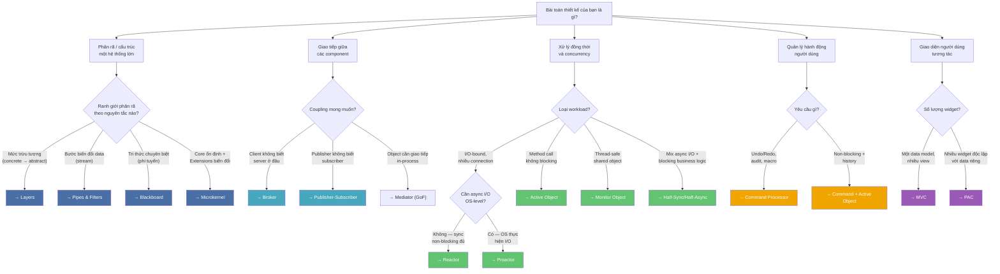
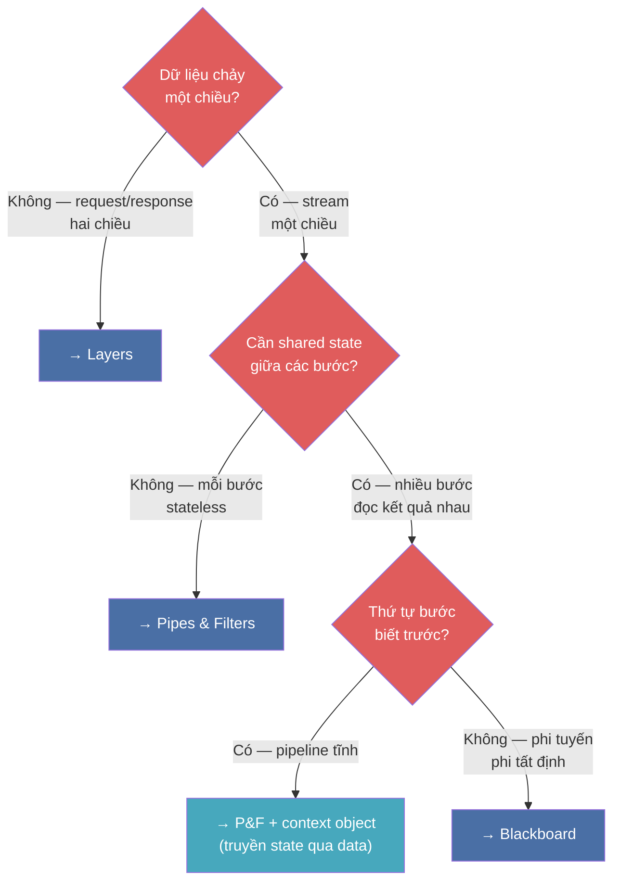
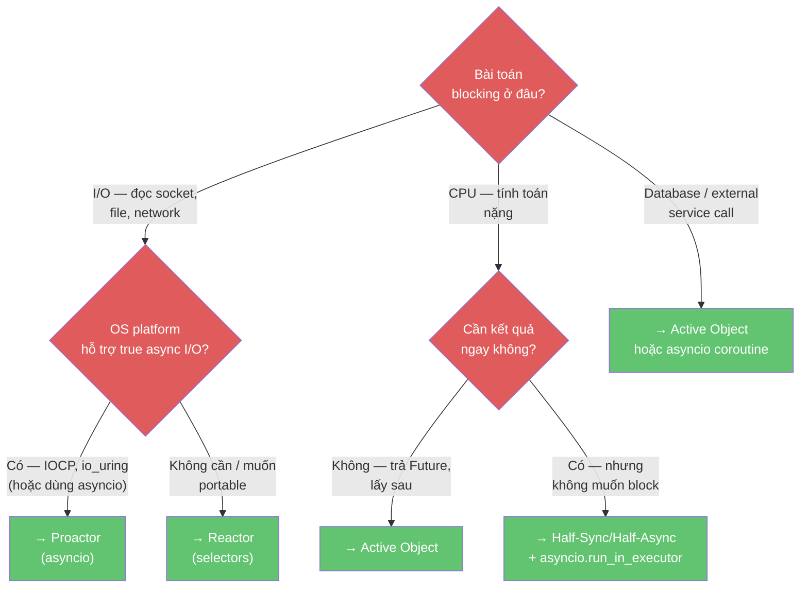
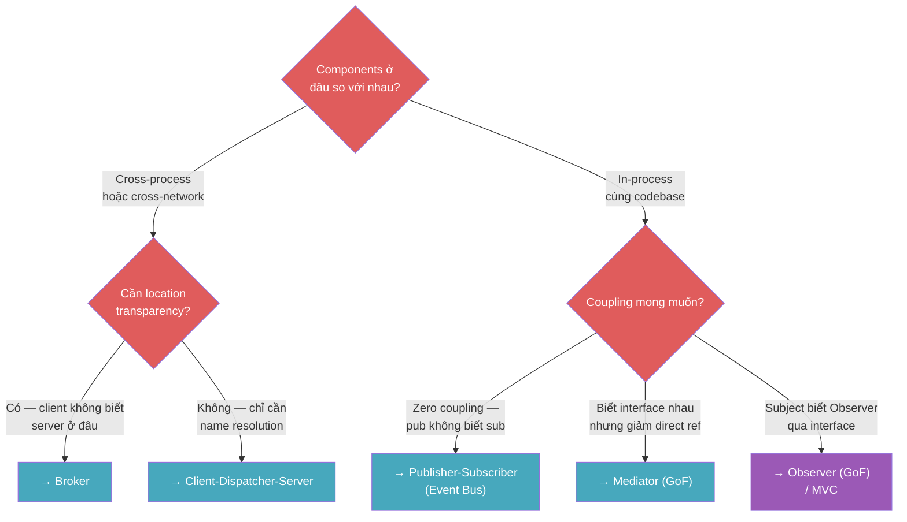
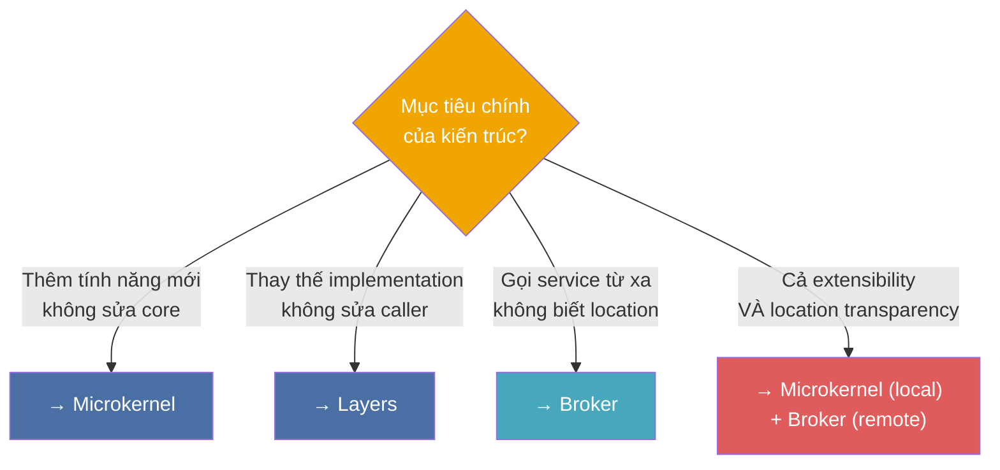

> **Mục đích**: Công cụ chọn pattern nhanh khi đứng trước bài toán mới. Đi theo cây quyết định từ trên xuống — dừng tại node lá để có recommendation.
>
> **Lưu ý quan trọng**: Cây này là *điểm bắt đầu*, không phải câu trả lời cuối cùng. Sau khi có recommendation, đọc đầy đủ Consequences của pattern đó và kiểm tra xem Forces có thực sự khớp không.

---

## Cây Quyết định Chính



---

## Cây Phụ 1 — Chọn giữa Layers, P&F, Blackboard

Ba pattern này cùng nhóm *Structural Decomposition* nhưng giải quyết bài toán rất khác nhau:



---

## Cây Phụ 2 — Chọn giữa Reactor, Proactor, Active Object

Ba pattern concurrency này hay bị nhầm vì cùng giải quyết "không muốn blocking":



---

## Cây Phụ 3 — Chọn giữa Broker, Mediator, Publisher-Subscriber

Cả ba đều là "trung gian" nhưng ở level rất khác nhau:



---

## Cây Phụ 4 — Microkernel vs. Layers vs. Broker



---

## Scoring Matrix — Khi cần so sánh định lượng

Khi đã rút ngắn xuống 2–3 pattern ứng viên, dùng scoring matrix để chọn:

**Bước 1**: Liệt kê Forces quan trọng với hệ thống của bạn.
**Bước 2**: Đánh trọng số cho từng force (1–5).
**Bước 3**: Với mỗi pattern ứng viên, đánh điểm khả năng thỏa mãn force đó (1–5).
**Bước 4**: Tổng điểm có trọng số = `sum(weight × score)`.

Ví dụ so sánh Layers vs. Microkernel cho một product IDE:

| Force | Trọng số | Layers | Microkernel |
|-------|---------|--------|-------------|
| Changeability (sửa layer) | 4 | 5 × 4 = 20 | 3 × 4 = 12 |
| Extensibility (thêm plugin) | 5 | 2 × 5 = 10 | 5 × 5 = 25 |
| Performance | 3 | 4 × 3 = 12 | 3 × 3 = 9 |
| Simplicity | 2 | 4 × 2 = 8 | 2 × 2 = 4 |
| **Total** | | **50** | **50** |

Điểm bằng nhau → không có winner rõ ràng → cân nhắc **kết hợp**: Layers cho cấu trúc nội bộ của IDE core, Microkernel cho plugin system.

---

## Red Flags — Khi bạn đang chọn sai pattern

| Red flag | Nguyên nhân có thể | Hành động |
|----------|-------------------|----------|
| Thêm feedback loop vào Pipes & Filters | Bài toán cần shared state | Chuyển sang Blackboard hoặc dùng context object |
| Broker nhưng tất cả service cùng process | Overkill — unnecessary overhead | Dùng Mediator (GoF) hoặc EventBus |
| Layers nhưng method `getX()` lặp lại qua 5 layer | Lasagna Architecture | Chuyển sang Relaxed Layering |
| Active Object nhưng method chạy dưới 1ms | Over-engineering | Dùng Monitor Object hoặc simple Lock |
| Command Processor nhưng action không reversible | Command.undo() không implement được | Dùng event log + compensating transaction thay vì undo |
| PAC nhưng app chỉ có 2–3 widget | Over-engineering | Dùng MVC đủ rồi |
| Pub/Sub nhưng cần guaranteed ordering | Async dispatch phá vỡ ordering | Dùng synchronous Observer hoặc event queue với serial dispatch |

---

## Pattern Combination Recipes

### Recipe 1 — Web API Server (I/O-heavy)
```text
Proactor (asyncio event loop)
  + Layers (Domain / Infrastructure / Presentation)
  + Publisher-Subscriber (domain events)
```

### Recipe 2 — IDE / Plugin-based Tool
```text
Microkernel (plugin registry)
  + MVC (editor panel per file)
  + Publisher-Subscriber (cross-plugin events)
  + Command Processor (Undo/Redo)
```

### Recipe 3 — Distributed Microservices
```text
Broker (service discovery + API gateway)
  + Layers (per-service internal architecture)
  + Publisher-Subscriber (cross-service events via Kafka/RabbitMQ)
  + Monitor Object (per-service shared cache)
```

### Recipe 4 — Real-time Data Pipeline
```text
Reactor (ingest stream dari sensors)
  + Pipes & Filters (transform pipeline)
  + Blackboard (anomaly detection — phi tuyến)
  + Active Object (heavy ML inference không block ingest)
```

### Recipe 5 — Desktop GUI App
```text
MVC (main data model + views)
  + Command Processor (Undo/Redo)
  + Publisher-Subscriber (cross-component events)
  + Active Object (long operations — save file, network call)
```

---

## Tóm tắt nhanh — 1 câu mỗi pattern

| Pattern | Chọn khi... |
|---------|------------|
| **Layers** | Hệ thống có nhiều mức trừu tượng, cần thay thế từng mức độc lập |
| **Pipes & Filters** | Xử lý data theo chuỗi bước stateless có thể tái dùng và tái sắp xếp |
| **Blackboard** | Bài toán phi tuyến cần nhiều "chuyên gia" hợp tác mà không biết trước thứ tự |
| **Broker** | Client cần gọi service từ xa mà không biết và không cần biết location |
| **MVC** | Cùng data cần hiển thị nhiều cách, View phải sync tự động khi data thay đổi |
| **PAC** | Nhiều widget có data riêng cần giao tiếp qua hierarchy agent |
| **Microkernel** | Core ổn định cần mở rộng bởi plugin từ bên thứ ba mà không sửa core |
| **Reactor** | Xử lý hàng nghìn I/O connection đồng thời với một thread |
| **Proactor** | Tận dụng async I/O của OS, throughput tối đa với asyncio |
| **Active Object** | Method tốn thời gian cần chạy non-blocking, kết quả qua Future |
| **Monitor Object** | Nhiều thread truy cập shared object, cần serialize đơn giản |
| **Publisher-Subscriber** | Publisher và subscriber hoàn toàn không biết nhau, routing theo topic |
| **Command Processor** | Mỗi hành động người dùng cần Undo/Redo, audit log, hoặc macro |

---

## References

- [[11-tradeoff-and-composition|11. Trade-off & Pattern Composition]] — Master trade-off table và Pattern Language
- [[a0-pattern-anatomy-cheatsheet|A0. Pattern Anatomy Cheatsheet]] — Template đầy đủ đọc/viết pattern
- [[a1-python-implementation-gallery|A1. Python Implementation Gallery]] — Snippet tối giản cho từng pattern
- Frank Buschmann et al. — *POSA Vol. 1*, Chapter 1: Introduction — Pattern Selection
