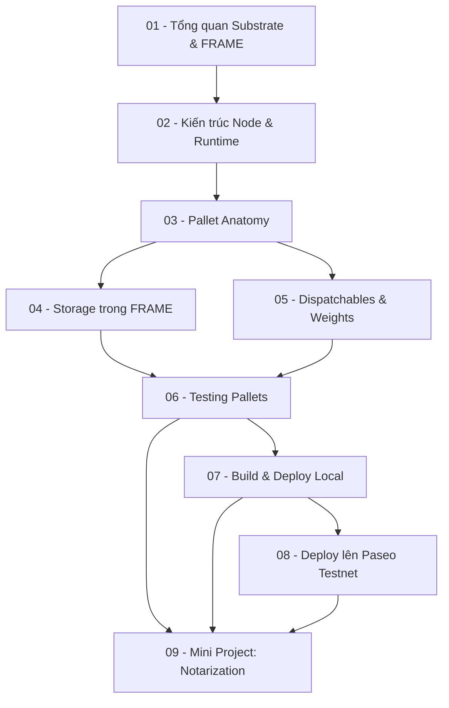

> **Topic**: Substrate FRAME — Blockchain Runtime Development  
> **Domain**: IT / Blockchain Framework  
> **Level**: Intermediate  
> **Background**: Thoải mái với Rust (ownership, traits, generics, macros), biết Solidity/Ethereum cơ bản  
> **Tools / Code**: Rust, Polkadot SDK, `polkadot-omni-node`, Polkadot.js Apps  
> **Sources**: docs.polkadot.com, Polkadot SDK GitHub, Substrate Stack Exchange

---

## Lessons

| # | Title | Nội dung chính | Prerequisites | Difficulty |
|---|-------|----------------|---------------|------------|
| 01 | Tổng quan Substrate & FRAME | Polkadot ecosystem, runtime vs smart contract, so sánh Ethereum/EVM, Polkadot SDK components | — | ★☆☆☆☆ |
| 02 | Kiến trúc Node & Runtime | Host vs Runtime, Wasm execution, `frame_system`, `frame_support`, `frame_executive`, state transition function | 01 | ★★☆☆☆ |
| 03 | Pallet Anatomy | Cấu trúc pallet đầy đủ: `#[pallet::*]` macros, `Config` trait, Storage, Dispatchables, Events, Errors | 02 | ★★★☆☆ |
| 04 | Storage trong FRAME | `StorageValue`, `StorageMap`, `StorageDoubleMap`, SCALE encoding, truy vấn on-chain state | 03 | ★★★☆☆ |
| 05 | Dispatchables, Extrinsics & Weights | Signed/unsigned/inherent extrinsic, `DispatchResult`, Origin, phí giao dịch, weight cơ bản | 03 | ★★★★☆ |
| 06 | Testing Pallets | Mock runtime, unit test, `assert_ok!`, `assert_noop!`, integration test | 03, 04, 05 | ★★★☆☆ |
| 07 | Build & Deploy Local | `solochain-template`, biên dịch, `--dev` mode, chain spec, tương tác Polkadot.js Apps | 01–06 | ★★★☆☆ |
| 08 | Deploy lên Paseo Testnet | Parachain vs solochain, register paraID, Paseo faucet, coretime, runtime upgrade forkless | 07 | ★★★★☆ |
| 09 | Mini Project: Pallet Notarization | Xây pallet hoàn chỉnh từ đầu: lưu hash tài liệu on-chain, claim ownership, revoke, test đầy đủ | 03–08 | ★★★★☆ |

## Appendix Candidates

| ID | Nội dung | Lesson liên quan | Ghi chú |
|----|---------|-----------------|---------|
| A0 | FRAME Macros Cheatsheet | 03, 04, 05 | Tổng hợp tất cả `#[pallet::*]` attributes, syntax nhanh |
| A1 | Polkadot.js Interaction Guide | 07, 08 | Gọi extrinsic, đọc storage, subscribe events qua JS |

---

## Dependency Graph

---

## Progress Tracker

- [x] [[00-roadmap|00. Roadmap]]
- [ ] [[01-substrate-frame-overview|01. Tổng quan Substrate & FRAME]]
- [ ] [[02-node-and-runtime-architecture|02. Kiến trúc Node & Runtime]]
- [ ] [[03-pallet-anatomy|03. Pallet Anatomy]]
- [ ] [[04-storage-in-frame|04. Storage trong FRAME]]
- [ ] [[05-dispatchables-extrinsics-weights|05. Dispatchables, Extrinsics & Weights]]
- [ ] [[06-testing-pallets|06. Testing Pallets]]
- [ ] [[07-build-and-deploy-local|07. Build & Deploy Local]]
- [ ] [[08-deploy-to-paseo-testnet|08. Deploy lên Paseo Testnet]]
- [ ] [[09-mini-project-notarization|09. Mini Project: Pallet Notarization]]
- [ ] [[a0-frame-macros-cheatsheet|A0. FRAME Macros Cheatsheet]]
- [ ] [[a1-polkadotjs-interaction-guide|A1. Polkadot.js Interaction Guide]]
