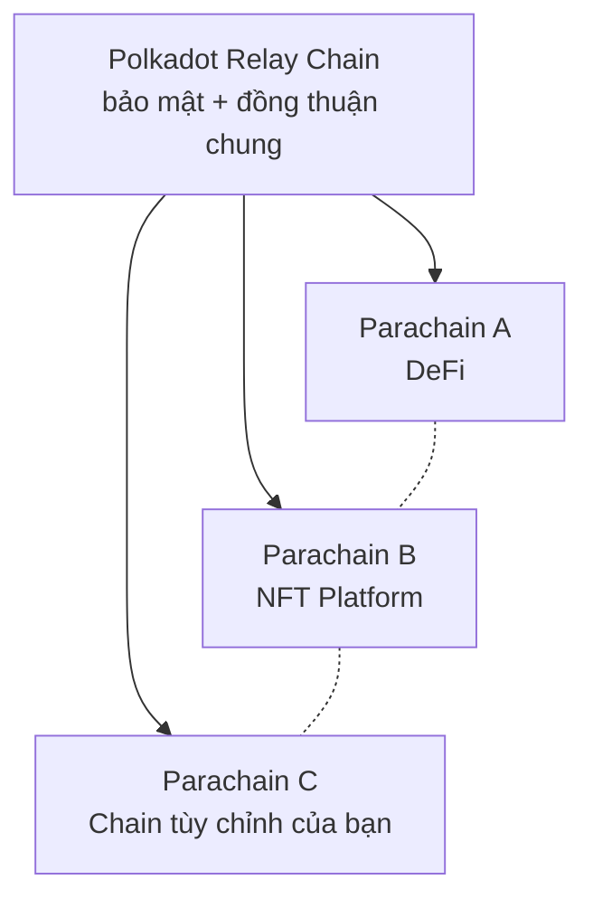
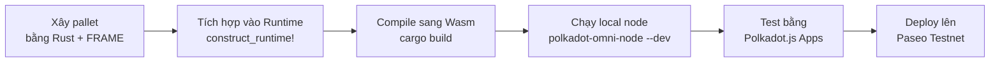

> **Prerequisites**: Hiểu cơ bản về blockchain (block, transaction, consensus), biết Ethereum/Solidity ở mức cơ bản
> **Objectives**:
> - Hiểu Polkadot ecosystem và vị trí của Substrate trong đó
> - Phân biệt rõ "xây runtime" vs "deploy smart contract"
> - Nắm được Polkadot SDK gồm những gì (Substrate, FRAME, Cumulus, XCM)
> - Biết khi nào nên dùng Substrate thay vì Solidity

---

## Bức tranh lớn: Polkadot Ecosystem

Để hiểu Substrate, ta cần hiểu nó sinh ra để giải quyết vấn đề gì.

Ethereum chứng minh rằng blockchain có thể là một máy tính phân tán (decentralized computer). Nhưng Ethereum có giới hạn căn bản: **mọi ứng dụng đều phải tranh nhau tài nguyên của cùng một chain**, và logic của ứng dụng bị ràng buộc vào môi trường EVM.

Polkadot ra đời với triết lý khác: thay vì một chain làm tất cả, hãy để **nhiều chain chuyên biệt chạy song song** và liên thông với nhau thông qua một relay chain trung tâm. Mỗi chain con (gọi là parachain) có thể có logic riêng, consensus riêng, token riêng — nhưng vẫn được bảo đảm bởi bảo mật chung của Polkadot.



**Substrate** là framework để xây những chain đó. **FRAME** là bộ công cụ bên trong Substrate giúp bạn lắp ghép logic của chain từ các module tái sử dụng được gọi là **pallet**.

---

## Polkadot SDK — Ba tầng cần biết

Khi bắt đầu với Substrate, bạn sẽ thấy nhiều tên gọi. Đây là cách phân chia chính xác:

> [!definition] Definition 1.1 — Polkadot SDK Components
>
> **Substrate** — Tầng nền: cung cấp toàn bộ cơ sở hạ tầng blockchain thô: networking (libp2p), database (RocksDB/ParityDB), consensus primitives, RPC server, execution environment (Wasm). Bạn không cần tự viết những thứ này.
>
> **FRAME** (Framework for Runtime Aggregation of Modularized Entities) — Tầng logic: framework để xây *runtime* của chain bằng cách ghép các *pallet* lại với nhau. Đây là thứ bạn sẽ làm việc hàng ngày.
>
> **Cumulus** — Tầng parachain: thư viện giúp chain của bạn *kết nối vào Polkadot relay chain* và hoạt động như một parachain. Nếu bạn chỉ muốn chạy solochain (không kết nối Polkadot), không cần Cumulus.

Trong khóa học này, **trọng tâm là FRAME** — vì đây là nơi bạn viết logic thực sự của chain.

---

## Runtime là gì? — So sánh với Ethereum

Đây là sự khác biệt quan trọng nhất bạn cần nắm.

### Ethereum: Smart Contract trên EVM

Trong Ethereum, bạn viết một smart contract bằng Solidity, deploy lên chain, và contract đó chạy bên trong môi trường EVM. Chain Ethereum đã được cố định — bạn chỉ *thêm code* vào trên đó.

```
Ethereum Chain (cố định)
  └─ EVM (môi trường thực thi)
       └─ Smart Contract của bạn (Solidity bytecode)
```

### Substrate: Bạn tự định nghĩa Runtime

Trong Substrate, không có "EVM cố định". Thay vào đó, **runtime chính là logic của chain**. Bạn compile runtime thành WebAssembly (Wasm) và nó được nhúng thẳng vào chain. Chain của bạn làm được những gì là do runtime bạn xây quyết định.

```
Substrate Node (infrastructure)
  └─ Runtime (Wasm binary — do bạn xây bằng FRAME)
       ├─ pallet_balances  (chuyển token)
       ├─ pallet_timestamp (đồng hồ)
       ├─ pallet_sudo      (admin)
       └─ pallet_your_app  (logic của bạn)
```

> [!definition] Definition 1.2 — Runtime
> Runtime (hay còn gọi là *state transition function*) là toàn bộ logic quyết định:
> - Block hợp lệ trông như thế nào
> - Giao dịch nào được chấp nhận
> - State của chain thay đổi như thế nào sau mỗi transaction
>
> Runtime được compile thành **Wasm bytecode** và có thể được **nâng cấp on-chain mà không cần hard fork** — đây là điểm mạnh đặc trưng của Substrate.

### Bảng so sánh

| Khía cạnh | Ethereum (Solidity) | Substrate (FRAME) |
|-----------|--------------------|--------------------|
| Viết gì? | Smart Contract | Runtime Pallet |
| Chạy ở đâu? | EVM (cố định) | Wasm runtime (tùy chỉnh) |
| Ngôn ngữ | Solidity | Rust |
| Deploy | Lên chain Ethereum có sẵn | Bạn chạy chain của mình |
| Nâng cấp | Deploy contract mới | Runtime upgrade on-chain |
| Phí gas | Dùng ETH | Tự định nghĩa |
| Consensus | Proof of Stake (Ethereum) | Tự chọn (Aura, BABE, ...) |
| Phù hợp | App trên nền tảng có sẵn | Blockchain tùy biến cao |

---

## Pallet — "Smart Contract" của thế giới FRAME

Nếu Ethereum có smart contract thì Substrate có **pallet**.

> [!definition] Definition 1.3 — Pallet
> Pallet là một module Rust đóng gói một tính năng cụ thể của blockchain. Mỗi pallet thường có:
> - **Storage**: dữ liệu on-chain mà pallet quản lý
> - **Dispatchable calls**: các hàm người dùng có thể gọi (tương đương function trong smart contract)
> - **Events**: thông báo khi state thay đổi
> - **Errors**: các lỗi có thể xảy ra
> - **Config trait**: cấu hình để tích hợp vào runtime

FRAME đi kèm sẵn rất nhiều pallet đã được xây và kiểm tra kỹ:

| Pallet | Chức năng |
|--------|-----------|
| `pallet_balances` | Quản lý token native, chuyển khoản |
| `pallet_timestamp` | Đồng hồ on-chain |
| `pallet_sudo` | Tài khoản super-admin |
| `pallet_assets` | Multi-asset (như ERC-20) |
| `pallet_nfts` | NFT (như ERC-721) |
| `pallet_democracy` | Governance, voting |
| `pallet_staking` | Nominator/Validator staking |

Bạn ghép những pallet này vào runtime, thêm pallet tùy chỉnh của mình → chain của bạn hoàn chỉnh.

---

## Khi nào dùng Substrate thay vì Solidity?

> [!warning] Lưu ý quan trọng
> Substrate **không phải thứ thay thế smart contract**. Đây là hai công cụ cho hai mục đích khác nhau.

**Dùng Solidity/EVM khi**:
- Bạn muốn deploy app nhanh trên Ethereum, Polygon, hoặc EVM-chain có sẵn
- Ứng dụng của bạn cần tương tác với DeFi ecosystem hiện có (Uniswap, Aave...)
- Bạn không muốn tự vận hành một chain

**Dùng Substrate/FRAME khi**:
- Bạn cần một blockchain với logic tùy biến cao (ví dụ: chain cho game, chain cho supply chain với logic phức tạp)
- Bạn cần kiểm soát consensus, fee model, governance
- Bạn muốn kết nối vào Polkadot ecosystem (cross-chain messaging, shared security)
- EVM quá giới hạn cho use case của bạn (ví dụ: cần xử lý off-chain workers, cần custom cryptography)

---

## Vòng đời phát triển với Substrate

Dưới đây là luồng tổng quát mà bạn sẽ đi qua trong khóa học này:



---

## Summary / Key Takeaways

- **Polkadot** = relay chain cung cấp bảo mật + kết nối cho nhiều chain con (parachain)
- **Substrate** = framework xây blockchain, lo sẵn networking, database, consensus
- **FRAME** = bộ công cụ trong Substrate để xây runtime từ các pallet
- **Runtime** = toàn bộ logic của chain, compile sang Wasm, có thể upgrade on-chain
- **Pallet** = module đóng gói một tính năng, là đơn vị xây dựng chính trong FRAME
- Substrate **khác Ethereum** ở chỗ: bạn không deploy contract lên chain có sẵn — bạn **tự là chain**

---

## References

- Polkadot Developer Docs — https://docs.polkadot.com
- Introduction to Polkadot SDK — https://docs.polkadot.com/develop/parachains/intro-polkadot-sdk/
- FRAME Overview — https://docs.polkadot.com/develop/parachains/customize-parachain/overview/
- Polkadot SDK GitHub — https://github.com/paritytech/polkadot-sdk
- Solochain Template — https://github.com/paritytech/polkadot-sdk-solochain-template
