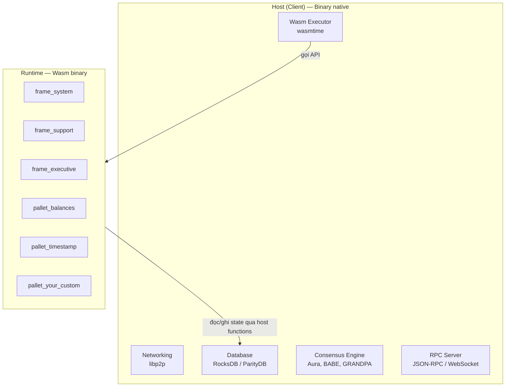
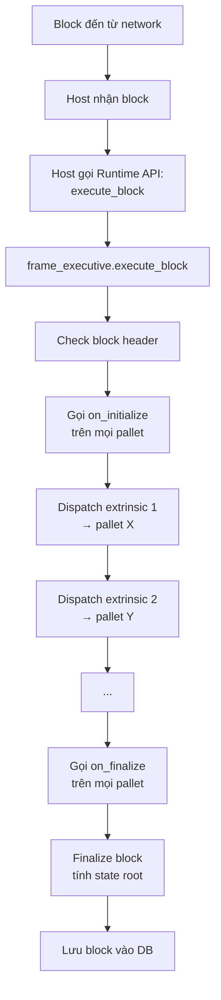

> **Prerequisites**: [[01-substrate-frame-overview|01. Tổng quan Substrate & FRAME]]
> **Objectives**:
> - Phân biệt rõ hai thành phần: Host (client) và Runtime
> - Hiểu tại sao Runtime được compile sang Wasm và cơ chế thực thi
> - Nắm được vai trò của `frame_system`, `frame_support`, `frame_executive`
> - Hiểu state transition function và cách Substrate xử lý một block

---

## Hai thế giới trong một Substrate Node

Một Substrate node không phải là một khối đơn nguyên. Bên trong có **hai phần tách biệt hoàn toàn**:



> [!definition] Definition 2.1 — Host (Client)
> Host là phần binary native chạy trực tiếp trên hệ điều hành. Nó xử lý:
> - **Networking**: kết nối peer, gossip giao dịch
> - **Database**: lưu trữ block và state trie
> - **Consensus**: bầu chọn block author, finality
> - **RPC**: nhận giao dịch từ user, trả về kết quả
> - **Wasm Executor**: thực thi runtime Wasm

> [!definition] Definition 2.2 — Runtime
> Runtime là Wasm binary chứa toàn bộ logic của chain. Nó được host gọi để:
> - Validate và execute block
> - Validate transaction trước khi đưa vào pool
> - Phản hồi các RPC query về state
>
> Runtime **không có I/O trực tiếp** — mọi đọc/ghi database đều qua "host functions" mà host cung cấp.

### Tại sao lại tách biệt như vậy?

Sự tách biệt này là điểm thiết kế then chốt:

1. **Forkless upgrade**: Runtime là Wasm, được lưu on-chain như một storage item. Khi cần nâng cấp logic, bạn đẩy Wasm mới lên chain — mọi node tự động dùng runtime mới mà không cần restart hay hard fork. Tương tự Ethereum không có điều này.

2. **Determinism**: Wasm đảm bảo kết quả thực thi giống nhau trên mọi node (bất kể OS, CPU). Đây là yêu cầu bắt buộc với blockchain.

3. **Sandboxing**: Runtime không thể truy cập hệ thống file, network... của host. Mọi I/O đều đi qua host functions được kiểm soát.

---

## Bộ ba cốt lõi: `frame_system`, `frame_support`, `frame_executive`

Đây là ba thư viện nền tảng mà **mọi** Substrate runtime đều phải có.

### `frame_system` — Xương sống của Runtime

> [!definition] Definition 2.3 — `frame_system`
> `frame_system` là pallet bắt buộc trong mọi runtime. Nó cung cấp:
> - **Block metadata**: số block, block hash, parent hash
> - **Account management**: account nonce, reference counting
> - **Event system**: cơ chế emit và lưu event
> - **Origin types**: `RawOrigin::Signed(who)`, `RawOrigin::Root`, `RawOrigin::None`
> - **Storage root**: tính Merkle root của state trie sau mỗi block

Mọi pallet khác đều phụ thuộc vào `frame_system` qua `Config` trait:

```rust
#[pallet::config]
pub trait Config: frame_system::Config {
    type RuntimeEvent: From<Event<Self>> + IsType<<Self as frame_system::Config>::RuntimeEvent>;
}
```

Dòng `Config: frame_system::Config` nghĩa là: "pallet này cần runtime phải có `frame_system` cấu hình". Đây là Rust trait bound, không phải kế thừa class.

### `frame_support` — Hộp công cụ Macro

> [!definition] Definition 2.4 — `frame_support`
> `frame_support` là thư viện cung cấp tất cả macros, types, và traits mà bạn dùng khi viết pallet:
> - `#[pallet::storage]` — khai báo storage item
> - `#[pallet::call]` — khai báo dispatchable function
> - `#[pallet::event]` — khai báo event
> - `#[pallet::error]` — khai báo error
> - Các storage types: `StorageValue`, `StorageMap`, `StorageDoubleMap`
> - Các helper traits: `Currency`, `ReservableCurrency`, `Get`, `Contains`...

Nếu `frame_system` là OS kernel thì `frame_support` là standard library.

### `frame_executive` — Điều phối Traffic

> [!definition] Definition 2.5 — `frame_executive`
> `frame_executive` là pallet điều phối toàn bộ việc xử lý block và transaction. Khi một block đến, `frame_executive`:
> 1. Gọi `on_initialize` của tất cả pallets
> 2. Dispatch từng extrinsic đến pallet phù hợp
> 3. Gọi `on_finalize` của tất cả pallets
> 4. Tính block weight tổng

Bạn thường không cần chỉnh `frame_executive` — chỉ cần khai báo nó trong runtime.

---

## State Transition Function — Trái tim của Runtime

Substrate mô tả logic của chain bằng khái niệm **state transition function (STF)**:

$$
\text{STF}(\text{state}_{\text{trước}}, \text{block}) = \text{state}_{\text{sau}}
$$

Nghĩa là: cho trước một trạng thái hiện tại và một block mới, runtime tính ra trạng thái tiếp theo.

State được lưu trong một **Merkle Patricia Trie** (tương tự Ethereum). Mỗi storage item trong pallet là một key-value trong trie này. Hash của trie root được ghi vào block header, đảm bảo mọi node đồng thuận về state.

### Một Block được xử lý như thế nào?



---

## Runtime API — Giao tiếp Host ↔ Runtime

Host không "hiểu" Rust code trong runtime. Nó chỉ gọi vào Wasm binary thông qua các **Runtime API** được định nghĩa sẵn:

| Runtime API | Khi nào host gọi |
|-------------|-----------------|
| `Core::execute_block` | Khi import một block mới |
| `BlockBuilder::apply_extrinsic` | Khi xây block mới (authoring) |
| `TaggedTransactionQueue::validate_transaction` | Khi nhận transaction vào pool |
| `Metadata::metadata` | Khi Polkadot.js hỏi "chain này có những gì?" |

Đây là lý do tại sao Polkadot.js Apps có thể tự động hiển thị UI cho mọi Substrate chain — nó gọi `Metadata` API để biết chain có những storage, call, event gì.

---

## SCALE Codec — Ngôn ngữ chung

Mọi dữ liệu trao đổi giữa host và runtime, và mọi dữ liệu lưu on-chain, đều được encode bằng **SCALE** (Simple Concatenated Aggregate Little-Endian).

> [!definition] Definition 2.6 — SCALE Codec
> SCALE là binary encoding format được thiết kế để:
> - **Nhỏ gọn**: không có field names, không có type tags (khác JSON/CBOR)
> - **Deterministic**: cùng data → cùng bytes, trên mọi platform
> - **Hiệu quả**: decode không cần biết schema trước (nếu biết type)
>
> Trong Rust, derive `#[derive(Encode, Decode)]` từ crate `parity-scale-codec` để tự động implement.

```rust
use parity_scale_codec::{Encode, Decode};

#[derive(Encode, Decode, Debug, PartialEq)]
struct MyStruct {
    value: u32,
    name: Vec<u8>,
}

let original = MyStruct { value: 42, name: b"hello".to_vec() };
let encoded: Vec<u8> = original.encode();
let decoded = MyStruct::decode(&mut &encoded[..]).unwrap();
assert_eq!(original, decoded);
```

Bạn sẽ thấy `Encode, Decode` trên mọi struct trong pallet — đây là yêu cầu bắt buộc để lưu data on-chain.

---

## Cấu trúc thư mục một Substrate Project điển hình

```
my-chain/
├── node/           ← Host binary: main.rs, service.rs, chain_spec.rs
├── runtime/        ← Runtime: lib.rs (construct_runtime! macro)
│   └── src/
│       └── lib.rs
├── pallets/        ← Custom pallets của bạn
│   └── my-pallet/
│       └── src/
│           └── lib.rs
└── Cargo.toml      ← Workspace
```

- `node/` chứa host: networking, RPC, consensus config
- `runtime/` ghép tất cả pallets lại thành một runtime Wasm
- `pallets/` là nơi bạn viết logic tùy chỉnh

---

## Summary / Key Takeaways

- Substrate node gồm hai phần: **Host** (native binary, xử lý infra) và **Runtime** (Wasm binary, chứa logic chain)
- Runtime compile sang Wasm cho phép **forkless upgrade**: push Wasm mới lên chain, không cần hard fork
- **`frame_system`**: pallet bắt buộc, cung cấp block info, account, events, origins
- **`frame_support`**: thư viện macros và types để viết pallet
- **`frame_executive`**: điều phối xử lý block, gọi `on_initialize` → dispatch extrinsics → `on_finalize`
- **SCALE codec**: binary format cho mọi data on-chain — deterministic, nhỏ gọn
- Host gọi runtime qua **Runtime API** (giao diện Wasm), Polkadot.js dùng `Metadata` API để tự động sinh UI

---

## References

- Polkadot SDK — Introduction to Polkadot SDK — https://docs.polkadot.com/develop/parachains/intro-polkadot-sdk/
- `frame_system` docs — https://docs.rs/frame-system/latest/frame_system/
- `frame_support` docs — https://docs.rs/frame-support/latest/frame_support/
- `frame_executive` docs — https://docs.rs/frame-executive/latest/frame_executive/
- SCALE Codec — https://docs.substrate.io/reference/scale-codec/
- parity-scale-codec — https://github.com/paritytech/parity-scale-codec
