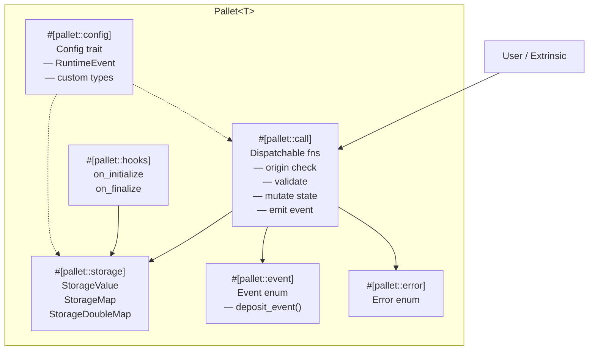

> **Prerequisites**: [[02-node-and-runtime-architecture|02. Kiến trúc Node & Runtime]]
> **Objectives**:
> - Đọc và hiểu toàn bộ cấu trúc file `lib.rs` của một pallet
> - Nắm vai trò của từng `#[pallet::*]` attribute macro
> - Hiểu `Config` trait và cách nó kết nối pallet với runtime
> - Xây được bộ xương (skeleton) pallet đầu tiên từ đầu

---

## Pallet là một Module Rust đặc biệt

Một pallet về bản chất là một Rust module (`mod pallet { ... }`) được bọc bởi macro `#[frame_support::pallet]`. Macro này đọc toàn bộ nội dung bên trong và sinh ra boilerplate code cần thiết để tích hợp vào runtime.

> [!definition] Definition 3.1 — Cấu trúc tổng thể một pallet
> Một file `lib.rs` pallet điển hình có dạng:
>
> ```
> crate attributes (#![cfg_attr], no_std)
> pub use pallet::*;
>
> #[frame_support::pallet]
> pub mod pallet {
>     use frame_support::pallet_prelude::*;
>     use frame_system::pallet_prelude::*;
>
>     #[pallet::pallet]          ← bắt buộc
>     #[pallet::config]          ← bắt buộc
>     #[pallet::storage]         ← tùy chọn, nhiều lần
>     #[pallet::event]           ← tùy chọn
>     #[pallet::error]           ← tùy chọn
>     #[pallet::hooks]           ← tùy chọn
>     #[pallet::call]            ← tùy chọn, nhưng gần như luôn có
> }
> ```

Khai báo `#![cfg_attr(not(feature = "std"), no_std)]` ở đầu file bắt buộc phải có vì runtime Wasm không dùng standard library của Rust.

---

## Skeleton đầy đủ — Bản đồ tổng quan

Dưới đây là skeleton đầy đủ với tất cả các phần đã có comment giải thích. Đây là file bạn sẽ bắt đầu khi tạo pallet mới:

```rust
#![cfg_attr(not(feature = "std"), no_std)]

pub use pallet::*;

#[frame_support::pallet]
pub mod pallet {
    use frame_support::pallet_prelude::*;
    use frame_system::pallet_prelude::*;

    // 1. Pallet struct — placeholder bắt buộc
    #[pallet::pallet]
    pub struct Pallet<T>(_);

    // 2. Config trait — kết nối với runtime
    #[pallet::config]
    pub trait Config: frame_system::Config {
        type RuntimeEvent: From<Event<Self>>
            + IsType<<Self as frame_system::Config>::RuntimeEvent>;
    }

    // 3. Storage — dữ liệu on-chain
    #[pallet::storage]
    pub type MyValue<T> = StorageValue<_, u32, ValueQuery>;

    // 4. Events — thông báo state thay đổi
    #[pallet::event]
    #[pallet::generate_deposit(pub(super) fn deposit_event)]
    pub enum Event<T: Config> {
        ValueSet { who: T::AccountId, value: u32 },
    }

    // 5. Errors — lỗi có thể xảy ra
    #[pallet::error]
    pub enum Error<T> {
        ValueTooLarge,
    }

    // 6. Hooks — logic chạy theo block lifecycle
    #[pallet::hooks]
    impl<T: Config> Hooks<BlockNumberFor<T>> for Pallet<T> {}

    // 7. Dispatchable calls — hàm người dùng gọi được
    #[pallet::call]
    impl<T: Config> Pallet<T> {
        #[pallet::call_index(0)]
        #[pallet::weight(10_000)]
        pub fn set_value(origin: OriginFor<T>, value: u32) -> DispatchResult {
            let who = ensure_signed(origin)?;
            ensure!(value < 1_000_000, Error::<T>::ValueTooLarge);
            MyValue::<T>::put(value);
            Self::deposit_event(Event::ValueSet { who, value });
            Ok(())
        }
    }
}
```

Hãy phân tích từng phần.

---

## `#[pallet::pallet]` — Placeholder struct

```rust
#[pallet::pallet]
pub struct Pallet<T>(_);
```

Đây là "hộp đựng" để macro gắn các implementation vào. Dấu `_` là viết tắt của `PhantomData<T>` — cần thiết vì Rust yêu cầu generic parameter phải được sử dụng, nhưng struct này không thực sự chứa data nào. Bạn **không cần** và **không nên** thêm fields vào struct này.

---

## `#[pallet::config]` — Trái tim kết nối pallet với Runtime

Đây là phần quan trọng nhất và thường gây bối rối nhất.

> [!definition] Definition 3.2 — Config Trait
> `Config` là một Rust trait định nghĩa những gì pallet cần từ runtime. Mỗi khi tích hợp pallet vào runtime, bạn phải `impl YourPallet::Config for Runtime { ... }` để cung cấp các associated types cụ thể.

```rust
#[pallet::config]
pub trait Config: frame_system::Config {
    // Loại event của toàn runtime — pallet cần biết để emit event
    type RuntimeEvent: From<Event<Self>>
        + IsType<<Self as frame_system::Config>::RuntimeEvent>;

    // Một ví dụ associated type tùy chỉnh: giới hạn tối đa
    #[pallet::constant]
    type MaxValue: Get<u32>;
}
```

Bảng ý nghĩa các associated type phổ biến:

| Associated Type | Ý nghĩa | Ví dụ impl trong runtime |
|----------------|---------|--------------------------|
| `RuntimeEvent` | Enum event chung của toàn runtime | `type RuntimeEvent = RuntimeEvent;` |
| `RuntimeOrigin` | Enum origin chung của toàn runtime | `type RuntimeOrigin = RuntimeOrigin;` |
| `Currency` | Loại tiền để tính phí, lock... | `type Currency = Balances;` |
| `MaxValue: Get<u32>` | Hằng số được inject từ runtime | `type MaxValue = ConstU32<100>;` |
| `WeightInfo` | Struct chứa weight benchmarking | `type WeightInfo = weights::SubstrateWeight<Runtime>;` |

**So sánh với Solidity**: `Config` trait giống như constructor arguments của smart contract, nhưng mạnh hơn — bạn có thể inject cả toàn bộ implementation của một interface khác (ví dụ: inject `pallet_balances` vào pallet của mình thông qua `Currency` type).

### `#[pallet::constant]` — Hằng số on-chain

Attribute `#[pallet::constant]` đánh dấu associated type sẽ được expose vào metadata của chain. Polkadot.js sẽ hiển thị giá trị này cho người dùng.

```rust
#[pallet::config]
pub trait Config: frame_system::Config {
    #[pallet::constant]
    type MaxLength: Get<u32>;
}
```

Trong runtime, implement bằng:
```rust
impl my_pallet::Config for Runtime {
    type MaxLength = ConstU32<128>;
}
```

---

## `#[pallet::storage]` — Dữ liệu on-chain

```rust
#[pallet::storage]
pub type Counter<T> = StorageValue<_, u32, ValueQuery>;
```

Chi tiết về tất cả storage types sẽ được đào sâu ở [[04-storage-in-frame|04. Storage trong FRAME]]. Ở đây chỉ cần biết: mỗi `#[pallet::storage]` khai báo một storage item, và FRAME macro tự lo việc ánh xạ sang key-value trong state trie.

---

## `#[pallet::event]` — Thông báo khi state thay đổi

Event là cách pallet "nói chuyện ra ngoài" sau khi một dispatchable thực thi thành công.

> [!definition] Definition 3.3 — Event
> Event là enum được emit bởi pallet khi state thay đổi. Chúng được ghi vào block, không lưu trường xuyên trong state trie, và có thể được subscribe bởi off-chain applications.

```rust
#[pallet::event]
#[pallet::generate_deposit(pub(super) fn deposit_event)]
pub enum Event<T: Config> {
    // Named fields — được khuyến khích từ Polkadot SDK v1.0+
    ClaimCreated { owner: T::AccountId, claim: BoundedVec<u8, T::MaxClaimSize> },
    ClaimRevoked { owner: T::AccountId, claim: BoundedVec<u8, T::MaxClaimSize> },
}
```

`#[pallet::generate_deposit(...)]` yêu cầu macro tự sinh hàm `deposit_event()` trên `Pallet<T>`. Bạn gọi `Self::deposit_event(Event::ClaimCreated { ... })` bên trong dispatchable để emit event.

**So sánh với Solidity**: Event trong Solidity cũng tương tự — emit từ function, client subscribe để theo dõi. Điểm khác: event trong FRAME không có `indexed` parameter như Solidity, nhưng có thể filter qua Polkadot.js.

---

## `#[pallet::error]` — Lỗi có thể xảy ra

```rust
#[pallet::error]
pub enum Error<T> {
    /// Claim đã tồn tại trên chain.
    ClaimAlreadyExists,
    /// Claim không tồn tại.
    ClaimNotFound,
    /// Người gọi không phải chủ sở hữu claim.
    NotClaimOwner,
}
```

Đây là enum các lỗi mà pallet của bạn có thể trả về. Trong dispatchable, bạn return chúng như sau:

```rust
ensure!(!Proofs::<T>::contains_key(&claim), Error::<T>::ClaimAlreadyExists);
```

`ensure!` macro tương đương `if !condition { return Err(Error::<T>::ClaimAlreadyExists.into()) }`.

---

## `#[pallet::hooks]` — Lifecycle Hooks

```rust
#[pallet::hooks]
impl<T: Config> Hooks<BlockNumberFor<T>> for Pallet<T> {
    // Chạy ở đầu mỗi block — trước khi xử lý extrinsics
    fn on_initialize(n: BlockNumberFor<T>) -> Weight {
        Weight::zero()
    }

    // Chạy ở cuối mỗi block — sau khi xử lý extrinsics
    fn on_finalize(n: BlockNumberFor<T>) {
    }

    // Chạy khi pallet được khởi động lần đầu (genesis)
    fn on_genesis() {
    }
}
```

Nếu không cần hook nào, dùng implementation rỗng — FRAME tự sinh default:

```rust
#[pallet::hooks]
impl<T: Config> Hooks<BlockNumberFor<T>> for Pallet<T> {}
```

---

## `#[pallet::call]` — Dispatchable Functions

Đây là trọng tâm logic của pallet. Mỗi public function trong `impl<T: Config> Pallet<T>` được đánh dấu bởi `#[pallet::call]` là một **dispatchable** — người dùng có thể gọi từ bên ngoài.

```rust
#[pallet::call]
impl<T: Config> Pallet<T> {
    #[pallet::call_index(0)]          // index trong metadata
    #[pallet::weight(T::WeightInfo::create_claim())]
    pub fn create_claim(
        origin: OriginFor<T>,          // luôn là tham số đầu tiên
        claim: BoundedVec<u8, T::MaxClaimSize>,
    ) -> DispatchResult {
        // 1. Xác thực origin
        let sender = ensure_signed(origin)?;

        // 2. Validate
        ensure!(!Proofs::<T>::contains_key(&claim), Error::<T>::ClaimAlreadyExists);

        // 3. Cập nhật state
        let current_block = frame_system::Pallet::<T>::block_number();
        Proofs::<T>::insert(&claim, (sender.clone(), current_block));

        // 4. Emit event
        Self::deposit_event(Event::ClaimCreated { owner: sender, claim });

        Ok(())
    }
}
```

Quy tắc cứng của mọi dispatchable:
- Tham số đầu tiên luôn là `origin: OriginFor<T>`
- Return type luôn là `DispatchResult`
- Phải có `#[pallet::call_index(n)]` với `n` duy nhất
- Phải có `#[pallet::weight(...)]`

### Origin — "Ai đang gọi?"

> [!definition] Definition 3.4 — Origin
> Origin mô tả "danh tính" của người gọi một dispatchable. Các loại origin phổ biến:
>
> | Helper macro | Ý nghĩa | Dùng khi nào |
> |---|---|---|
> | `ensure_signed(origin)?` | Tài khoản ký giao dịch | Hầu hết calls thông thường |
> | `ensure_root(origin)?` | Sudo/governance root | Admin operations |
> | `ensure_none(origin)?` | Không có signer | Inherent extrinsics |

**So sánh với Solidity**: `ensure_signed(origin)?` → `msg.sender` trong Solidity. `ensure_root(origin)?` → `onlyOwner` modifier, nhưng "owner" ở đây là toàn bộ governance của chain.

---

## Tích hợp pallet vào Runtime — `construct_runtime!`

Sau khi viết xong pallet, bạn đăng ký nó vào runtime trong file `runtime/src/lib.rs`:

```rust
#[runtime::runtime]
#[runtime::derive(
    RuntimeCall, RuntimeEvent, RuntimeError,
    RuntimeOrigin, RuntimeTask,
)]
pub struct Runtime;

#[runtime::pallet_index(0)]
pub type System = frame_system;

#[runtime::pallet_index(1)]
pub type Timestamp = pallet_timestamp;

#[runtime::pallet_index(2)]
pub type Balances = pallet_balances;

// Pallet tùy chỉnh của bạn
#[runtime::pallet_index(10)]
pub type MyPallet = my_pallet;
```

Sau đó implement `Config` cho runtime:

```rust
impl my_pallet::Config for Runtime {
    type RuntimeEvent = RuntimeEvent;
    type MaxClaimSize = ConstU32<256>;
    type WeightInfo = my_pallet::weights::SubstrateWeight<Runtime>;
}
```

---

## Sơ đồ toàn bộ Pallet



---

## Worked Example — Pallet Counter hoàn chỉnh

Đây là pallet nhỏ nhất có đủ ý nghĩa: đếm số lần mỗi tài khoản gọi `increment`.

```rust
#![cfg_attr(not(feature = "std"), no_std)]

pub use pallet::*;

#[frame_support::pallet]
pub mod pallet {
    use frame_support::pallet_prelude::*;
    use frame_system::pallet_prelude::*;

    #[pallet::pallet]
    pub struct Pallet<T>(_);

    #[pallet::config]
    pub trait Config: frame_system::Config {
        type RuntimeEvent: From<Event<Self>>
            + IsType<<Self as frame_system::Config>::RuntimeEvent>;
    }

    #[pallet::storage]
    pub type CounterFor<T: Config> =
        StorageMap<_, Blake2_128Concat, T::AccountId, u32, ValueQuery>;

    #[pallet::event]
    #[pallet::generate_deposit(pub(super) fn deposit_event)]
    pub enum Event<T: Config> {
        Incremented { who: T::AccountId, new_count: u32 },
    }

    #[pallet::error]
    pub enum Error<T> {
        CounterOverflow,
    }

    #[pallet::call]
    impl<T: Config> Pallet<T> {
        #[pallet::call_index(0)]
        #[pallet::weight(10_000)]
        pub fn increment(origin: OriginFor<T>) -> DispatchResult {
            let who = ensure_signed(origin)?;
            let current = CounterFor::<T>::get(&who);
            let new_count = current.checked_add(1).ok_or(Error::<T>::CounterOverflow)?;
            CounterFor::<T>::insert(&who, new_count);
            Self::deposit_event(Event::Incremented { who, new_count });
            Ok(())
        }
    }
}
```

---

## Summary / Key Takeaways

- `#[frame_support::pallet]` là macro bao ngoài bọc toàn bộ pallet module
- `#[pallet::pallet]` → struct placeholder bắt buộc
- `#[pallet::config]` → khai báo những gì pallet cần từ runtime (associated types)
- `#[pallet::storage]` → storage items on-chain (đào sâu ở Lesson 04)
- `#[pallet::event]` → enum emit khi state thay đổi, client subscribe được
- `#[pallet::error]` → enum lỗi, return từ dispatchable
- `#[pallet::hooks]` → `on_initialize` / `on_finalize` chạy theo lifecycle block
- `#[pallet::call]` → dispatchable functions: tham số đầu là `origin`, return `DispatchResult`
- Tích hợp vào runtime qua `#[runtime::pallet_index(n)]` + `impl MyPallet::Config for Runtime`

---

## References

- Make a Custom Pallet — https://docs.polkadot.com/develop/parachains/customize-parachain/make-custom-pallet/
- `frame_support::pallet` macro docs — https://docs.rs/frame-support/latest/frame_support/attr.pallet.html
- FRAME Macros — Substrate Collectables Workshop — https://www.shawntabrizi.com/substrate-collectables-workshop/
- Proof of Existence Tutorial — https://docs.substrate.io/tutorials/build-application-logic/
