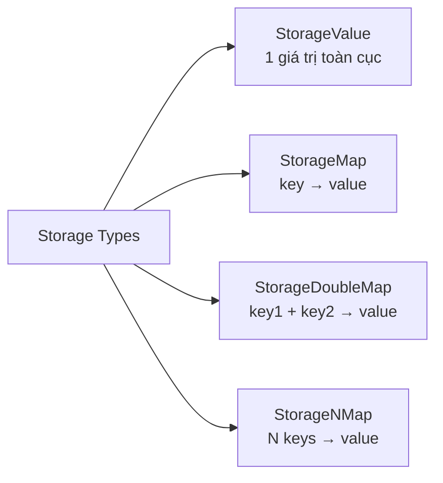

> **Prerequisites**: [[03-pallet-anatomy|03. Pallet Anatomy]]
> **Objectives**:
> - Phân biệt và sử dụng đúng `StorageValue`, `StorageMap`, `StorageDoubleMap`
> - Hiểu `QueryKind`: `OptionQuery` vs `ValueQuery`
> - Chọn đúng hasher cho từng use case
> - Biết cách dùng `BoundedVec` để giới hạn kích thước storage an toàn
> - Nắm các API thao tác storage: `get`, `set`, `insert`, `mutate`, `take`, `remove`

---

## Storage On-chain là gì?

Trong Substrate, state của blockchain được lưu trong một **Merkle Patricia Trie** (cấu trúc tương tự Ethereum). Mỗi storage item trong pallet là một cặp key-value trong trie đó.

Khác với biến trong memory của Solidity smart contract, storage on-chain trong Substrate:
- Tồn tại vĩnh viễn qua các block
- Được đọc/ghi qua host functions (không phải trực tiếp từ Rust)
- Được SCALE-encoded trước khi lưu
- Tạo ra storage proof (PoV) cho parachain validation

> [!definition] Definition 4.1 — Storage Key Structure
> Mỗi storage item có key dạng:
>
> ```
> twox128("PalletName") ++ twox128("StorageName") [++ hash(key) ...]
> ```
>
> Ví dụ: `StorageMap` tên `Balances` trong pallet `Balances` với key là `AccountId` sẽ có storage key:
> ```
> twox128("Balances") ++ twox128("Balances") ++ blake2_128_concat(account_id)
> ```
>
> Điều này đảm bảo không có xung đột giữa các storage items của các pallet khác nhau, dù cùng tên.

---

## Bốn loại Storage chính



---

## `StorageValue` — Một giá trị toàn cục

Dùng để lưu một giá trị duy nhất cho toàn bộ pallet (không phụ thuộc vào account hay key nào).

```rust
#[pallet::storage]
pub type TotalSupply<T> = StorageValue<_, u128, ValueQuery>;

#[pallet::storage]
pub type Admin<T: Config> = StorageValue<_, T::AccountId, OptionQuery>;
```

**Cú pháp positional**: `StorageValue<_, ValueType, QueryKind>`

Dấu `_` ở vị trí đầu là placeholder bắt buộc cho `Prefix` — macro sẽ tự sinh.

### API của `StorageValue`

```rust
// Đọc
let supply = TotalSupply::<T>::get();

// Ghi (overwrite)
TotalSupply::<T>::put(1_000_000u128);

// Ghi và lấy giá trị cũ
let old = TotalSupply::<T>::mutate(|v| { *v += 100; });

// Xóa (set về None / Default)
TotalSupply::<T>::kill();

// Lấy và xóa cùng lúc
let taken = TotalSupply::<T>::take();
```

**Ví dụ thực tế** — Dùng `StorageValue` cho config toàn pallet:

```rust
#[pallet::storage]
pub type PalletVersion<T> = StorageValue<_, u32, ValueQuery>;

#[pallet::storage]
pub type Paused<T> = StorageValue<_, bool, ValueQuery>;
```

---

## `StorageMap` — Mapping key → value

Dùng khi mỗi key (thường là `AccountId`, hash, hay ID) ánh xạ sang một value riêng.

```rust
#[pallet::storage]
pub type Balances<T: Config> =
    StorageMap<_, Blake2_128Concat, T::AccountId, u128, ValueQuery>;

#[pallet::storage]
pub type Claims<T: Config> =
    StorageMap<_, Blake2_128Concat, BoundedVec<u8, T::MaxClaimSize>, T::AccountId>;
```

**Cú pháp positional**: `StorageMap<_, Hasher, KeyType, ValueType, QueryKind>`

### API của `StorageMap`

```rust
// Kiểm tra key có tồn tại không
let exists = Balances::<T>::contains_key(&account);

// Đọc
let balance = Balances::<T>::get(&account);

// Ghi
Balances::<T>::insert(&account, 500u128);

// Mutate (đọc-sửa-ghi atomic)
Balances::<T>::mutate(&account, |b| { *b += amount; });

// Xóa một entry
Balances::<T>::remove(&account);

// Lấy và xóa
let old_balance = Balances::<T>::take(&account);

// Iterate (cẩn thận — tốn weight)
for (account, balance) in Balances::<T>::iter() {
    // ...
}
```

---

## `StorageDoubleMap` — Hai key → value

Dùng khi data có cấu trúc 2 chiều — ví dụ: `(owner, item_id) → item_data`.

```rust
#[pallet::storage]
pub type ItemsOf<T: Config> = StorageDoubleMap<
    _,
    Blake2_128Concat, T::AccountId,   // key1 + hasher1
    Blake2_128Concat, u32,            // key2 + hasher2
    ItemData<T>,                       // value
    OptionQuery,
>;
```

**Cú pháp positional**:
`StorageDoubleMap<_, Hasher1, Key1, Hasher2, Key2, Value, QueryKind>`

Ưu điểm lớn của `StorageDoubleMap`: có thể **xóa toàn bộ entries theo key1** trong O(1) thao tác storage prefix — rất hiệu quả khi xóa tất cả items của một account:

```rust
// Xóa tất cả items của `owner` — thực hiện qua prefix deletion
ItemsOf::<T>::remove_prefix(&owner, None);
```

---

## `QueryKind` — Giá trị trả về khi key không tồn tại

Đây là generic parameter quyết định hành vi khi `get()` trên key chưa được set.

> [!definition] Definition 4.2 — QueryKind
>
> | QueryKind | Return type của `get()` | Khi key không tồn tại |
> |-----------|------------------------|----------------------|
> | `OptionQuery` | `Option<V>` | `None` |
> | `ValueQuery` | `V` | `V::default()` |
> | `ResultQuery` | `Result<V, PalletError>` | `Err(Error::<T>::NotFound)` |
>
> Mặc định là `OptionQuery` khi không khai báo.

```rust
// OptionQuery — phải xử lý None
#[pallet::storage]
pub type MaybeValue<T> = StorageValue<_, u32>;

let v: Option<u32> = MaybeValue::<T>::get(); // None nếu chưa set

// ValueQuery — trả về Default::default() nếu chưa set
#[pallet::storage]
pub type Counter<T> = StorageValue<_, u32, ValueQuery>;

let c: u32 = Counter::<T>::get(); // 0 nếu chưa set
```

**Khi nào dùng loại nào?**
- `OptionQuery`: khi "chưa có value" và "có value = 0" là hai trạng thái khác nhau
- `ValueQuery`: khi bạn muốn default sensible (u32 = 0, bool = false) và không cần phân biệt
- `ResultQuery`: khi muốn trả lỗi cụ thể thay vì None

---

## Storage Hashers — Chọn đúng hasher

Với `StorageMap` và `StorageDoubleMap`, bạn phải chọn một **hasher** để hash key trước khi dùng làm storage key.

> [!definition] Definition 4.3 — Storage Hashers
>
> | Hasher | Tính chất | Dùng khi nào |
> |--------|-----------|-------------|
> | `Blake2_128Concat` | Cryptographic + concatenate key vào hash | **Default choice** — dùng cho user-controlled keys (AccountId, arbitrary bytes) |
> | `Twox64Concat` | Non-cryptographic + concatenate key | Chỉ dùng cho trusted/runtime-controlled keys (index, enum) — nhanh hơn nhưng không an toàn với user input |
> | `Identity` | Không hash, dùng key nguyên bản | Khi key đã là hash 32 bytes (`T::Hash`) |
> | `Blake2_256` | Cryptographic, không concat | Hiếm dùng — không cho phép prefix iteration |
> | `Twox128` | Non-cryptographic, không concat | Hiếm dùng |

**Nguyên tắc đơn giản**:
- Key do user cung cấp → dùng `Blake2_128Concat`
- Key là runtime-internal index → có thể dùng `Twox64Concat`
- Key là `T::Hash` (đã là 32-byte hash) → dùng `Identity`

**Lý do `Concat` quan trọng**: Các hasher `*Concat` append key gốc vào sau hash, cho phép **prefix iteration** — bạn có thể dùng `iter_prefix()` trên `StorageDoubleMap`.

---

## `BoundedVec` — Giới hạn kích thước bắt buộc

> [!warning] Quy tắc bắt buộc trong Production
> Mọi `Vec<T>` trong storage phải được thay bằng `BoundedVec<T, MaxSize>`. Lý do: `Vec` không giới hạn → có thể vượt quá giới hạn bộ nhớ Wasm (64MB) hoặc PoV block size (5MB cho parachain).

```rust
// SAI — Vec không bounded
#[pallet::storage]
pub type Claims<T: Config> = StorageMap<_, Blake2_128Concat, Vec<u8>, T::AccountId>;

// ĐÚNG — BoundedVec với giới hạn từ Config
#[pallet::storage]
pub type Claims<T: Config> = StorageMap<
    _,
    Blake2_128Concat,
    BoundedVec<u8, T::MaxClaimSize>,
    T::AccountId,
>;
```

Khai báo `MaxClaimSize` trong Config:

```rust
#[pallet::config]
pub trait Config: frame_system::Config {
    #[pallet::constant]
    type MaxClaimSize: Get<u32>;
}
```

Implement trong runtime:

```rust
impl my_pallet::Config for Runtime {
    type MaxClaimSize = ConstU32<256>;
}
```

Sử dụng `BoundedVec` trong dispatchable:

```rust
pub fn create_claim(
    origin: OriginFor<T>,
    claim: BoundedVec<u8, T::MaxClaimSize>,
) -> DispatchResult {
    // claim đã được bounded — không cần check thêm
    Claims::<T>::insert(&claim, sender);
    Ok(())
}
```

---

## Trait bounds cho Value types

Mọi type dùng làm value trong storage phải implement các trait sau:

| Trait | Lý do |
|-------|-------|
| `Encode` + `Decode` | SCALE encoding để lưu/đọc |
| `MaxEncodedLen` | Giới hạn kích thước encode — bắt buộc từ Polkadot SDK v1 |
| `TypeInfo` | Metadata generation — để Polkadot.js hiểu type |
| `Default` | Bắt buộc khi dùng `ValueQuery` |

Trong thực tế, derive macro lo hết:

```rust
#[derive(Clone, Encode, Decode, Eq, PartialEq, RuntimeDebug, MaxEncodedLen, TypeInfo)]
pub struct ItemData {
    pub price: u128,
    pub quantity: u32,
}
```

---

## Pattern: `mutate` vs `insert` — Khi nào dùng gì?

```rust
// Dùng insert khi ghi mới hoàn toàn
Balances::<T>::insert(&account, new_balance);

// Dùng mutate khi cập nhật dựa trên giá trị cũ — đảm bảo atomic
Balances::<T>::mutate(&account, |b| {
    *b = b.saturating_add(amount);
});

// Dùng try_mutate khi cần propagate lỗi ra
Balances::<T>::try_mutate(&account, |b| -> Result<(), DispatchError> {
    *b = b.checked_add(amount).ok_or(ArithmeticError::Overflow)?;
    Ok(())
})?;
```

`try_mutate` là pattern chuẩn khi cập nhật state có thể fail — nếu closure trả về `Err`, storage không bị thay đổi (rollback).

---

## Worked Example — Storage cho Pallet Notarization

Đây là preview storage design cho mini project ở Lesson 09:

```rust
// Lưu thông tin một claim: (owner, block_number)
#[pallet::storage]
pub type Proofs<T: Config> = StorageMap<
    _,
    Blake2_128Concat,
    BoundedVec<u8, T::MaxHashSize>,   // key: hash của tài liệu
    (T::AccountId, BlockNumberFor<T>), // value: (owner, khi nào tạo)
    OptionQuery,
>;

// Đếm tổng số claims trên chain
#[pallet::storage]
pub type TotalProofs<T> = StorageValue<_, u64, ValueQuery>;
```

Thao tác trong dispatchable:

```rust
// Thêm proof mới
Proofs::<T>::insert(&claim_hash, (sender.clone(), current_block));
TotalProofs::<T>::mutate(|n| *n = n.saturating_add(1));

// Kiểm tra tồn tại
ensure!(!Proofs::<T>::contains_key(&claim_hash), Error::<T>::ClaimAlreadyExists);

// Lấy thông tin proof
let (owner, block) = Proofs::<T>::get(&claim_hash).ok_or(Error::<T>::ClaimNotFound)?;

// Xóa proof
Proofs::<T>::remove(&claim_hash);
TotalProofs::<T>::mutate(|n| *n = n.saturating_sub(1));
```

---

## Summary / Key Takeaways

- **`StorageValue`**: một giá trị toàn pallet — API: `get/put/mutate/kill/take`
- **`StorageMap`**: mapping key → value — API: `get/insert/mutate/remove/contains_key/iter`
- **`StorageDoubleMap`**: hai key → value — có `remove_prefix` hiệu quả theo key1
- **`QueryKind`**: `OptionQuery` (trả `Option<V>`) vs `ValueQuery` (trả `V::default()`)
- **Hasher**: `Blake2_128Concat` cho user-controlled keys, `Twox64Concat` cho trusted/internal keys
- **`BoundedVec`** bắt buộc thay thế `Vec` trong storage để giới hạn kích thước
- Value type phải derive `Encode + Decode + MaxEncodedLen + TypeInfo`
- Dùng `try_mutate` khi cập nhật có thể fail — đảm bảo atomicity

---

## References

- `#[pallet::storage]` docs — https://paritytech.github.io/polkadot-sdk/master/frame_support/pallet_macros/attr.storage.html
- `StorageMap` docs — https://paritytech.github.io/polkadot-sdk/master/frame_support/storage/trait.StorageMap.html
- `StorageDoubleMap` docs — https://paritytech.github.io/polkadot-sdk/master/frame_support/storage/trait.StorageDoubleMap.html
- Frame Storage Derives — https://paritytech.github.io/polkadot-sdk/master/polkadot_sdk_docs/reference_docs/frame_storage_derives/index.html
- `BoundedVec` — https://docs.rs/frame-support/latest/frame_support/types/struct.BoundedVec.html
