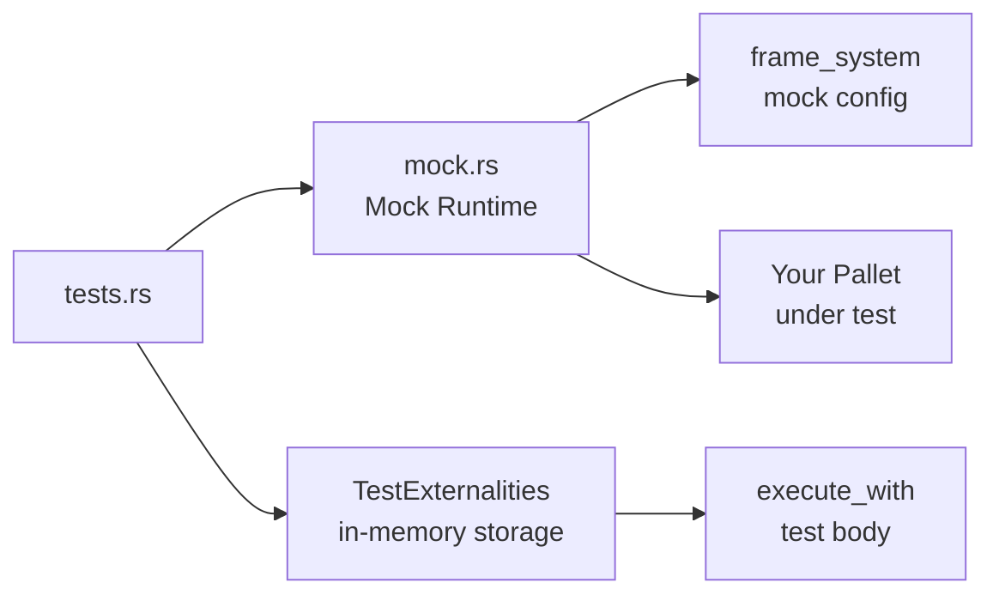

> **Prerequisites**: [[03-pallet-anatomy|03. Pallet Anatomy]], [[04-storage-in-frame|04. Storage trong FRAME]], [[05-dispatchables-extrinsics-weights|05. Dispatchables, Extrinsics & Weights]]
> **Objectives**:
> - Xây dựng mock runtime đầy đủ trong `mock.rs`
> - Viết unit test với `assert_ok!`, `assert_noop!`, `assert_err!`
> - Test storage state, events, và lỗi
> - Mô phỏng nhiều block và nhiều accounts
> - Áp dụng pattern NOE-Rule cho test toàn diện

---

## Tổng quan: Kiến trúc Testing FRAME

Pallet FRAME không thể test đơn lẻ như Rust library thông thường — nó cần runtime context: storage backend, account system, event system. Vì vậy, test pallet yêu cầu xây một **mock runtime** tối giản.



Cấu trúc file:

```
pallets/my-pallet/src/
├── lib.rs       ← pallet code
├── mock.rs      ← mock runtime
└── tests.rs     ← test cases
```

---

## Phần 1: Xây Mock Runtime (`mock.rs`)

```rust
use crate as my_pallet;
use frame_support::{derive_impl, traits::ConstU32};
use sp_runtime::BuildStorage;

type Block = frame_system::mocking::MockBlock<Test>;

// Khai báo mock runtime — liệt kê pallets cần dùng
frame_support::construct_runtime!(
    pub enum Test {
        System: frame_system,
        MyPallet: my_pallet,
    }
);

// Cấu hình frame_system tối giản
#[derive_impl(frame_system::config_preludes::TestDefaultConfig)]
impl frame_system::Config for Test {
    type Block = Block;
}

// Cấu hình pallet đang test
impl my_pallet::Config for Test {
    type RuntimeEvent = RuntimeEvent;
    type MaxClaimSize = ConstU32<256>;
}

// Helper: tạo storage sạch cho mỗi test
pub fn new_test_ext() -> sp_io::TestExternalities {
    let t = frame_system::GenesisConfig::<Test>::default()
        .build_storage()
        .unwrap();
    let mut ext = sp_io::TestExternalities::new(t);
    ext.execute_with(|| System::set_block_number(1));
    ext
}
```

`#[derive_impl(frame_system::config_preludes::TestDefaultConfig)]` là shortcut từ Polkadot SDK — tự điền hầu hết associated types của `frame_system::Config` với giá trị test-friendly. Quan trọng nhất: `AccountId = u64`.

**Tại sao `AccountId = u64` trong test?** Vì vậy bạn có thể viết `RuntimeOrigin::signed(1)`, `RuntimeOrigin::signed(2)` thay vì phải tạo keypair thực. Đơn giản và dễ đọc.

---

## Phần 2: `TestExternalities` — Môi trường test

> [!definition] Definition 6.1 — TestExternalities
> `TestExternalities` là implementation in-memory của storage backend — một hashmap thay thế RocksDB. Mọi read/write storage trong test đều thực sự xảy ra nhưng trong memory.
>
> Mỗi test **phải** chạy bên trong `new_test_ext().execute_with(|| { ... })` để có storage context riêng biệt.

```rust
#[test]
fn my_test() {
    new_test_ext().execute_with(|| {
        // "vũ trụ" riêng biệt của test này
        // Storage bắt đầu sạch (genesis state)
        // Mỗi test độc lập — không ảnh hưởng nhau
    });
}
```

---

## Phần 3: Test Macros

> [!definition] Definition 6.2 — Test Macros
>
> | Macro | Mục đích |
> |-------|---------|
> | `assert_ok!(expr)` | Assert `expr` trả `Ok(...)` |
> | `assert_noop!(expr, err)` | Assert `expr` trả `Err(err)` **và storage không thay đổi** |
> | `assert_err!(expr, err)` | Assert `expr` trả `Err(err)` (không check storage rollback) |
> | `System::assert_last_event!(e)` | Assert event cuối cùng là `e` |
> | `System::assert_has_event!(e)` | Assert `e` đã được emit (bất kỳ vị trí) |

`assert_noop!` là macro quan trọng nhất — không chỉ check lỗi mà còn **verify storage không thay đổi**. Điều này đảm bảo dispatchable của bạn không có side effect khi fail.

---

## Phần 4: Pattern NOE-Rule

NOE = **N**oop → **O**k → **E**quals. Đây là pattern chuẩn để test một dispatchable hoàn chỉnh:

```rust
#[test]
fn create_claim_full_test() {
    new_test_ext().execute_with(|| {
        let claim = BoundedVec::try_from(b"doc_hash".to_vec()).unwrap();
        let alice = 1u64;
        let bob = 2u64;

        // --- N: Noop — test tất cả trường hợp thất bại TRƯỚC ---

        // Claim chưa tồn tại → revoke phải fail
        assert_noop!(
            MyPallet::revoke_claim(RuntimeOrigin::signed(alice), claim.clone()),
            Error::<Test>::ClaimNotFound
        );

        // --- O: Ok — test trường hợp thành công ---

        assert_ok!(MyPallet::create_claim(RuntimeOrigin::signed(alice), claim.clone()));

        // Claim đã tồn tại → tạo lại phải fail
        assert_noop!(
            MyPallet::create_claim(RuntimeOrigin::signed(bob), claim.clone()),
            Error::<Test>::ClaimAlreadyExists
        );

        // Bob không phải owner → không revoke được
        assert_noop!(
            MyPallet::revoke_claim(RuntimeOrigin::signed(bob), claim.clone()),
            Error::<Test>::NotClaimOwner
        );

        // --- E: Equals — verify storage state ---

        let block = System::block_number();
        assert_eq!(Proofs::<Test>::get(&claim), Some((alice, block)));
    });
}
```

---

## Phần 5: Test Events

```rust
#[test]
fn create_claim_emits_event() {
    new_test_ext().execute_with(|| {
        let claim = BoundedVec::try_from(b"hash".to_vec()).unwrap();

        assert_ok!(MyPallet::create_claim(RuntimeOrigin::signed(1), claim.clone()));

        System::assert_last_event(
            Event::ClaimCreated { owner: 1u64, claim }.into()
        );
    });
}

#[test]
fn revoke_emits_correct_event() {
    new_test_ext().execute_with(|| {
        let claim = BoundedVec::try_from(b"hash".to_vec()).unwrap();
        assert_ok!(MyPallet::create_claim(RuntimeOrigin::signed(1), claim.clone()));
        assert_ok!(MyPallet::revoke_claim(RuntimeOrigin::signed(1), claim.clone()));

        // Verify cả hai events đã được emit
        System::assert_has_event(Event::ClaimCreated { owner: 1u64, claim: claim.clone() }.into());
        System::assert_last_event(Event::ClaimRevoked { owner: 1u64, claim }.into());
    });
}
```

---

## Phần 6: Simulate nhiều Block

Để test logic phụ thuộc block number (expiry, countdown):

```rust
pub fn run_to_block(n: u64) {
    while System::block_number() < n {
        System::on_finalize(System::block_number());
        System::set_block_number(System::block_number() + 1);
        System::on_initialize(System::block_number());
    }
}

#[test]
fn claim_expires_after_100_blocks() {
    new_test_ext().execute_with(|| {
        let claim = BoundedVec::try_from(b"hash".to_vec()).unwrap();
        assert_ok!(MyPallet::create_claim(RuntimeOrigin::signed(1), claim.clone()));

        // Advance 100 blocks
        run_to_block(101);

        // Claim đã expire → không thể dùng nữa
        assert_noop!(
            MyPallet::use_claim(RuntimeOrigin::signed(1), claim),
            Error::<Test>::ClaimExpired
        );
    });
}
```

---

## Phần 7: Test Root Origin

```rust
#[test]
fn only_root_can_pause() {
    new_test_ext().execute_with(|| {
        // User thường → fail
        assert_noop!(
            MyPallet::pause(RuntimeOrigin::signed(1)),
            DispatchError::BadOrigin
        );

        // Root → thành công
        assert_ok!(MyPallet::pause(RuntimeOrigin::root()));
        assert!(Paused::<Test>::get());
    });
}
```

---

## Ví dụ hoàn chỉnh — Test Counter Pallet

```rust
#[cfg(test)]
mod tests {
    use super::*;
    use crate::mock::*;
    use frame_support::{assert_noop, assert_ok};

    #[test]
    fn increment_works() {
        new_test_ext().execute_with(|| {
            assert_eq!(CounterFor::<Test>::get(&1u64), 0u32);
            assert_ok!(MyPallet::increment(RuntimeOrigin::signed(1)));
            assert_eq!(CounterFor::<Test>::get(&1u64), 1u32);
            assert_ok!(MyPallet::increment(RuntimeOrigin::signed(1)));
            assert_eq!(CounterFor::<Test>::get(&1u64), 2u32);
        });
    }

    #[test]
    fn accounts_have_separate_counters() {
        new_test_ext().execute_with(|| {
            assert_ok!(MyPallet::increment(RuntimeOrigin::signed(1)));
            assert_ok!(MyPallet::increment(RuntimeOrigin::signed(2)));
            assert_ok!(MyPallet::increment(RuntimeOrigin::signed(2)));

            assert_eq!(CounterFor::<Test>::get(&1u64), 1u32);
            assert_eq!(CounterFor::<Test>::get(&2u64), 2u32);
        });
    }

    #[test]
    fn increment_emits_event() {
        new_test_ext().execute_with(|| {
            assert_ok!(MyPallet::increment(RuntimeOrigin::signed(1)));
            System::assert_last_event(
                Event::Incremented { who: 1u64, new_count: 1u32 }.into()
            );
        });
    }

    #[test]
    fn unsigned_origin_fails() {
        new_test_ext().execute_with(|| {
            assert_noop!(
                MyPallet::increment(RuntimeOrigin::none()),
                DispatchError::BadOrigin
            );
        });
    }
}
```

---

## Chạy Tests

```bash
cargo test -p my-pallet

cargo test -p my-pallet -- --nocapture

cargo test -p my-pallet increment_works
```

---

## Summary / Key Takeaways

- `mock.rs` xây **mock runtime tối giản**: `construct_runtime!` + impl Config với `AccountId = u64`
- `new_test_ext()` tạo `TestExternalities` — in-memory storage, isolated cho từng test
- Chạy trong `new_test_ext().execute_with(|| { ... })` — mỗi test là vũ trụ riêng
- **NOE-Rule**: Noop (test lỗi) → Ok (test thành công) → Equals (verify state)
- `assert_ok!` → verify success; `assert_noop!` → verify lỗi + **storage không đổi**
- `System::assert_last_event(...)` → verify event cuối đúng
- `run_to_block(n)` → simulate block advancement
- Ba origin trong test: `RuntimeOrigin::signed(id)`, `RuntimeOrigin::root()`, `RuntimeOrigin::none()`

---

## References

- Pallet Testing — https://docs.polkadot.com/develop/parachains/testing/unit-testing/
- Running Unit Tests on Substrate Pallet — https://polkadot.study/tutorials/substrate-in-bits/docs/Running-unit-test-on-substrate-pallet
- `assert_ok!` docs — https://docs.rs/frame-support/latest/frame_support/macro.assert_ok.html
- `assert_noop!` docs — https://docs.rs/frame-support/latest/frame_support/macro.assert_noop.html
- Substrate Testing Guide — https://develop--substrate-docs.netlify.app/v3/runtime/testing/
