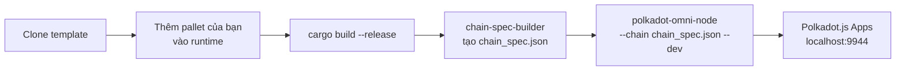

> **Prerequisites**: [[01-substrate-frame-overview|01. Tổng quan Substrate & FRAME]] đến [[06-testing-pallets|06. Testing Pallets]]
> **Objectives**:
> - Cài đặt đầy đủ toolchain: Rust wasm32, `polkadot-omni-node`, `chain-spec-builder`
> - Clone và hiểu cấu trúc `polkadot-sdk-parachain-template`
> - Biên dịch runtime Wasm
> - Tạo chain spec và chạy node local ở `--dev` mode
> - Tương tác với chain qua Polkadot.js Apps: gọi extrinsic, đọc storage, xem events

---

## Tổng quan luồng Deploy Local



---

## Bước 1: Cài đặt Toolchain

### Rust và Wasm target

```bash
# Cài Rust (nếu chưa có)
curl --proto '=https' --tlsv1.2 -sSf https://sh.rustup.rs | sh
source ~/.cargo/env

# Thêm target compile Wasm (bắt buộc cho runtime)
rustup target add wasm32-unknown-unknown

# Nên dùng nightly cho một số features của Substrate
rustup update nightly
rustup target add wasm32-unknown-unknown --toolchain nightly
```

### Cài `polkadot-omni-node` và `chain-spec-builder`

Hai cách: tải binary pre-built (nhanh hơn) hoặc build từ source.

**Cách 1 — Tải binary (khuyến nghị):**

```bash
# Lấy tag release mới nhất tại: github.com/paritytech/polkadot-sdk/releases
# Ví dụ với stable2512-1 trên Linux x86_64:
wget https://github.com/paritytech/polkadot-sdk/releases/download/polkadot-stable2512-1/polkadot-omni-node
wget https://github.com/paritytech/polkadot-sdk/releases/download/polkadot-stable2512-1/chain-spec-builder

chmod +x polkadot-omni-node chain-spec-builder
sudo mv polkadot-omni-node chain-spec-builder /usr/local/bin/
```

**Cách 2 — Build từ source (chậm ~15-30 phút):**

```bash
cargo install --locked polkadot-omni-node
cargo install --locked staging-chain-spec-builder
```

> [!warning] Lưu ý tên package
> Package trên crates.io tên là `staging-chain-spec-builder` (do conflict tên), nhưng binary sau khi cài tên là `chain-spec-builder`.

### Dependencies hệ thống (Linux/WSL)

```bash
# Ubuntu / Debian / WSL
sudo apt update && sudo apt install -y \
    build-essential clang curl git libssl-dev llvm \
    libudev-dev make pkg-config protobuf-compiler
```

---

## Bước 2: Clone Template

Polkadot SDK cung cấp 3 template:

| Template | Dùng khi |
|---------|---------|
| `polkadot-sdk-minimal-template` | Học, tối giản nhất |
| `polkadot-sdk-solochain-template` | Chain độc lập, không kết nối Polkadot |
| `polkadot-sdk-parachain-template` | Parachain kết nối Polkadot relay chain |

Cho mục tiêu của series này (deploy lên Paseo ở Lesson 08), dùng **parachain template**:

```bash
git clone https://github.com/paritytech/polkadot-sdk-parachain-template.git my-chain
cd my-chain
```

### Cấu trúc project

```
my-chain/
├── pallets/
│   └── template/        ← pallet mẫu — thay bằng pallet của bạn
│       └── src/lib.rs
├── runtime/
│   └── src/
│       ├── lib.rs        ← construct_runtime!, impl Config
│       └── configs/
│           └── mod.rs    ← cấu hình từng pallet
└── Cargo.toml            ← workspace
```

---

## Bước 3: Thêm Pallet tùy chỉnh vào Runtime

### 3a. Tạo pallet mới

```bash
# Tạo thư mục pallet
mkdir -p pallets/my-pallet/src
```

Copy code pallet từ các bài trước vào `pallets/my-pallet/src/lib.rs`.

Tạo `pallets/my-pallet/Cargo.toml`:

```toml
[package]
name = "pallet-my-pallet"
version = "0.1.0"
edition = "2021"

[dependencies]
codec = { package = "parity-scale-codec", version = "3", default-features = false, features = ["derive"] }
scale-info = { version = "2", default-features = false, features = ["derive"] }
frame-support = { version = "*", default-features = false }
frame-system = { version = "*", default-features = false }

[features]
default = ["std"]
std = [
    "codec/std",
    "scale-info/std",
    "frame-support/std",
    "frame-system/std",
]
```

### 3b. Đăng ký pallet vào workspace

Trong `Cargo.toml` gốc (workspace):

```toml
[workspace]
members = [
    "node",
    "pallets/template",
    "pallets/my-pallet",    # ← thêm dòng này
    "runtime",
]
```

### 3c. Thêm dependency vào runtime

Trong `runtime/Cargo.toml`:

```toml
[dependencies]
pallet-my-pallet = { path = "../pallets/my-pallet", default-features = false }

[features]
std = [
    # ... existing entries ...
    "pallet-my-pallet/std",
]
```

### 3d. Đăng ký trong `runtime/src/lib.rs`

```rust
#[runtime::pallet_index(10)]    // chọn index chưa dùng
pub type MyPallet = pallet_my_pallet;
```

### 3e. Implement Config trong `runtime/src/configs/mod.rs`

```rust
impl pallet_my_pallet::Config for Runtime {
    type RuntimeEvent = RuntimeEvent;
    type MaxClaimSize = ConstU32<256>;
}
```

---

## Bước 4: Biên dịch Runtime

```bash
# Build release (tối ưu, lâu hơn — ~10-20 phút lần đầu)
cargo build --release

# Kết quả: Wasm runtime ở đây:
ls target/release/wbuild/parachain-template-runtime/
# parachain_template_runtime.compact.compressed.wasm  ← file quan trọng
```

> [!definition] Definition 7.1 — Wasm Build Output
> Sau khi build, có hai file Wasm:
> - `.wasm` — full bytecode
> - `.compact.wasm` — loại bỏ section thừa
> - `.compact.compressed.wasm` — nén thêm zstd, **đây là file dùng cho production**

---

## Bước 5: Tạo Chain Spec

Chain spec là file JSON mô tả genesis state của chain — tương đương "cấu hình khởi động".

```bash
# Tạo chain spec dạng "development" (có Alice, Bob pre-funded)
chain-spec-builder create \
    -t development \
    --relay-chain paseo \
    --para-id 1000 \
    --runtime ./target/release/wbuild/parachain-template-runtime/parachain_template_runtime.compact.compressed.wasm \
    named-preset development

# Output: chain_spec.json
```

Mở `chain_spec.json`, bạn sẽ thấy:
- `name`, `id`, `chainType` — metadata chain
- `relay_chain`: `"paseo"` — relay chain sẽ kết nối
- `para_id`: `1000` — parachain ID
- `genesis.runtimeGenesis` — initial state, bao gồm balances cho Alice/Bob

---

## Bước 6: Chạy Node Local (`--dev` mode)

```bash
polkadot-omni-node --chain ./chain_spec.json --dev
```

Flag `--dev` kích hoạt:
- **Manual seal**: tạo block mỗi khi có transaction (không cần consensus thực)
- **Alice** là sudo key, pre-funded với nhiều token
- State bị xóa khi restart (ephemeral)

Output terminal trông như sau:

```
2026-03-16 10:00:00 Substrate Node
2026-03-16 10:00:00 ✌️  version 0.1.0-...
2026-03-16 10:00:00 ❤️  by Parity Technologies
2026-03-16 10:00:00 📋 Chain specification: Development
2026-03-16 10:00:00 🏷  Node name: Alice
2026-03-16 10:00:00 👤 Role: AUTHORITY
2026-03-16 10:00:00 💾 Database: RocksDb at /tmp/...
2026-03-16 10:00:00 🔨 Initializing Genesis block/state
2026-03-16 10:00:00 🏆 Loaded block weight restrictions from on-chain
2026-03-16 10:00:00 🚀 Starting consensus session on top of parent...
2026-03-16 10:00:02 ✨ Imported #1 (0x1234...)
```

Node đang lắng nghe tại `ws://127.0.0.1:9944`.

### Giữ state qua các lần restart

```bash
mkdir my-chain-state
polkadot-omni-node --chain ./chain_spec.json --dev --base-path ./my-chain-state
```

---

## Bước 7: Tương tác qua Polkadot.js Apps

Mở trình duyệt và truy cập: **https://polkadot.js.org/apps**

Kết nối đến local node:
1. Click logo Polkadot ở góc trên trái
2. Chọn **Development** → **Local Node**
3. Địa chỉ: `ws://127.0.0.1:9944`
4. Click **Switch**

### 7a. Gọi một Extrinsic

`Developer` → `Extrinsics`:
1. Chọn account: **Alice**
2. Chọn pallet: **myPallet** (tên tự động sinh từ pallet của bạn)
3. Chọn function: **createClaim** (hoặc tên dispatchable của bạn)
4. Nhập params
5. Click **Submit Transaction** → **Sign and Submit**

Sau khi submit, terminal node sẽ hiện:

```
✨ Imported #2 (0xabcd...)
```

### 7b. Đọc Storage

`Developer` → `Chain state`:
1. Chọn pallet: **myPallet**
2. Chọn storage item: **proofs**
3. Nhập key (nếu là Map)
4. Click `+` để query

### 7c. Xem Events

`Network` → `Explorer`: Events của block mới nhất hiện ở bảng bên phải.

Sau khi gọi `createClaim`, bạn sẽ thấy event `myPallet.ClaimCreated` xuất hiện.

---

## Bước 8: Development Accounts

Trong `--dev` mode, Substrate pre-generates các development accounts:

| Account | SS58 Address | Mnemonic |
|---------|-------------|---------|
| Alice | `5GrwvaEF...` | `//Alice` |
| Bob | `5FHneW46...` | `//Bob` |
| Charlie | `5FLSigC9...` | `//Charlie` |
| Dave | `5DAAnrj7...` | `//Dave` |

Tất cả đều được pre-funded với 1,000,000 token. Alice thường là sudo key.

Tạo keypair bằng `subkey` (nếu cần):

```bash
subkey generate --scheme sr25519
# Output:
# Secret phrase: word1 word2 ... word12
# Public key (SS58): 5Xxx...
```

---

## Troubleshooting Phổ biến

| Lỗi | Nguyên nhân | Giải pháp |
|-----|------------|----------|
| `error[E0425]: cannot find function wasm_binary_...` | Thiếu wasm-builder | Chạy `cargo build` trước |
| Port 9944 đã bị dùng | Node cũ đang chạy | `pkill polkadot-omni-node` hoặc dùng `--rpc-port 9945` |
| `Invalid transaction: BadProof` | Nonce mismatch | Reload Polkadot.js Apps hoặc dùng account mới |
| Wasm quá cũ sau khi sửa code | Chưa rebuild | `cargo build --release` lại |
| `Unable to find preimage` | Chain spec sai | Tạo lại chain spec từ Wasm mới nhất |

---

## Summary / Key Takeaways

- Toolchain cần: Rust + `wasm32-unknown-unknown` target + `polkadot-omni-node` + `chain-spec-builder`
- Template khuyến nghị: `polkadot-sdk-parachain-template` (dùng được cho cả local và Paseo)
- Build Wasm: `cargo build --release` → `*.compact.compressed.wasm`
- Chain spec: `chain-spec-builder create -t development ...` → `chain_spec.json`
- Chạy local: `polkadot-omni-node --chain chain_spec.json --dev`
- `--dev` = manual seal + Alice pre-funded + ephemeral state
- Tương tác qua Polkadot.js Apps tại `https://polkadot.js.org/apps` → Local Node `ws://127.0.0.1:9944`
- Development accounts: Alice, Bob, Charlie... đều pre-funded trong dev mode

---

## References

- Set Up the Parachain Template — https://docs.polkadot.com/tutorials/polkadot-sdk/parachains/zero-to-hero/set-up-a-template/
- Polkadot SDK Solochain Template — https://github.com/paritytech/polkadot-sdk-solochain-template
- Polkadot SDK Parachain Template — https://github.com/paritytech/polkadot-sdk-parachain-template
- `polkadot-omni-node` reference — https://paritytech.github.io/polkadot-sdk/master/polkadot_sdk_docs/reference_docs/omni_node/index.html
- Polkadot.js Apps — https://polkadot.js.org/apps
